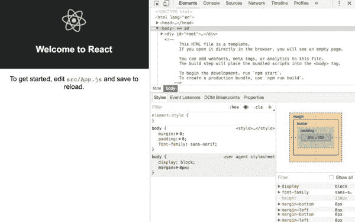
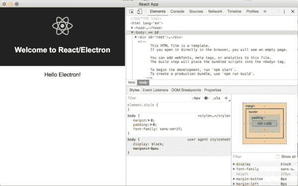

# 用 create-react-app 构建电子应用程序

> 原文：<https://www.freecodecamp.org/news/building-an-electron-application-with-create-react-app-97945861647c/>

### 无需网络包配置或“弹出”。

我最近使用[创建-反应-应用](https://github.com/facebookincubator/create-react-app) *构建了一个[电子](http://electron.atom.io/)应用。*我也不需要摆弄 Webpack，或者“退出”我的应用程序。我将向你介绍我是如何做到这一点的。

我被使用 [create-react-app](https://github.com/facebookincubator/create-react-app) 的想法所吸引，因为它隐藏了 webpack 的配置细节。但是我搜索了现有的使用电子和创建-反应-应用程序的指南，没有任何结果，所以我就一头扎进去，自己解决了。

如果你感到不耐烦，你可以直接进去看看我的代码。这是我的应用程序的 GitHub repo。

在我们开始之前，让我告诉你关于电子和反应，以及为什么创建-反应-应用程序是这样一个伟大的工具。

### 电子和反应

React 是脸书的 JavaScript 视图框架。

[***一个用于构建用户界面的 JavaScript 库* - React**](https://facebook.github.io/react/)
[一个用于构建用户界面的 JavaScript 库 facebook.github.io](https://facebook.github.io/react/)

而 Electron 是 GitHub 用 JavaScript 构建跨平台桌面应用的框架。

[**电子**](http://electron.atom.io/)
[*用 JavaScript、HTML、CSS 构建跨平台桌面应用。*电子.原子. io](http://electron.atom.io/)

大多数人使用 [webpack](https://webpack.github.io/) 进行 React 开发所需的配置。webpack 是一个配置和构建工具，大多数 React 社区都采用了它，而不是像 [Gulp](http://gulpjs.com/) 和 [Grunt](http://gruntjs.com) 这样的替代工具。

配置开销各不相同(后面会详细介绍)，有许多样板文件和应用生成器可用，但在 2016 年 7 月[脸书孵化器](https://github.com/facebookincubator)发布了一个工具，*[create-react-app](https://github.com/facebookincubator/create-react-app)*。*它隐藏了大部分配置，让开发者使用简单的命令，比如`npm start`和`npm run build`来运行和构建他们的应用。*

#### *什么是弹射，为什么要避免弹射？*

*create-react-app 对典型的 react 设置做了一些假设。如果这些假设不适合你，还有一个选项是 [**弹出**](https://github.com/facebookincubator/create-react-app#converting-to-a-custom-setup) 一个应用(`npm run eject`)。弹出一个应用程序会将 create-react-app 的所有封装配置复制到您的项目中，提供一个样板配置，您可以根据需要进行更改。*

*但这是一次单程旅行。您不能撤消弹出并返回。create-react-app 已经发布了 49 个版本，每个版本都有所改进。但是对于一个被驱逐的应用程序，您必须要么放弃这些改进，要么想出如何应用它们。*

*弹出的配置超过 550 行，跨越 7 个文件(截至本文发布时)。我不完全理解(其实是大部分)，也不想理解。*

#### *目标*

*我的目标很简单:*

*   *避免弹出 React 应用程序*
*   *尽量减少胶水反应和电子一起工作*
*   *保留默认、假设和由 Electron 和 create-react-app/React 制定的约定。(这使得使用其他假设/要求这种约定的工具变得更加容易。)*

#### *基本配方*

1.  *运行 `create-react-app`生成一个基本的 React 应用程序*
2.  *运行`npm install --save-dev electron`*
3.  *从`[electron-quick-start](https://github.com/electron/electron-quick-start)`中添加`main.js`(为了清晰起见，我们将其重命名为`electron-starter.js`)*
4.  *修改对`mainWindow.loadURL`(在`electron-starter.js`中)的调用，以使用`localhost:3000` (webpack-dev-server)*
5.  *为`electron-starter.js`添加一个主条目到`package.json`*
6.  *将启动电子的运行目标添加到`package.json`*
7.  *`npm start`后接`npm run electron`*

*步骤 1 和 2 非常简单。下面是第 3 步和第 4 步的代码:*

```
*`const electron = require('electron');
// Module to control application life.
const app = electron.app;
// Module to create native browser window.
const BrowserWindow = electron.BrowserWindow;

const path = require('path');
const url = require('url');

// Keep a global reference of the window object, if you don't, the window will
// be closed automatically when the JavaScript object is garbage collected.
let mainWindow;

function createWindow() {
    // Create the browser window.
    mainWindow = new BrowserWindow({width: 800, height: 600});

    // and load the index.html of the app.
    mainWindow.loadURL('http://localhost:3000');

    // Open the DevTools.
    mainWindow.webContents.openDevTools();

    // Emitted when the window is closed.
    mainWindow.on('closed', function () {
        // Dereference the window object, usually you would store windows
        // in an array if your app supports multi windows, this is the time
        // when you should delete the corresponding element.
        mainWindow = null
    })
}

// This method will be called when Electron has finished
// initialization and is ready to create browser windows.
// Some APIs can only be used after this event occurs.
app.on('ready', createWindow);

// Quit when all windows are closed.
app.on('window-all-closed', function () {
    // On OS X it is common for applications and their menu bar
    // to stay active until the user quits explicitly with Cmd + Q
    if (process.platform !== 'darwin') {
        app.quit()
    }
});

app.on('activate', function () {
    // On OS X it's common to re-create a window in the app when the
    // dock icon is clicked and there are no other windows open.
    if (mainWindow === null) {
        createWindow()
    }
});

// In this file you can include the rest of your app's specific main process
// code. You can also put them in separate files and require them here.`*
```

*([要旨](https://gist.github.com/csepulv/d4a97eaf9438cb4f7f102a1b2d075b93#file-electron-starter-js)*

*对于步骤 5 和 6:*

```
*`{
  "name": "electron-with-create-react-app",
  "version": "0.1.0",
  "private": true,
  "devDependencies": {
    "electron": "^1.4.14",
    "react-scripts": "0.8.5"
  },
  "dependencies": {
    "react": "^15.4.2",
    "react-dom": "^15.4.2"
  },
  "main": "src/electron-starter.js",
  "scripts": {
    "start": "react-scripts start",
    "build": "react-scripts build",
    "test": "react-scripts test --env=jsdom",
    "eject": "react-scripts eject",
    "electron": "electron ."
  }
}`*
```

*([要旨](https://gist.github.com/csepulv/d4a97eaf9438cb4f7f102a1b2d075b93#file-package-json)*

*当您在步骤 7 中运行 npm 命令时，您应该会看到以下内容:*

**

*您可以对 React 代码进行实时更改，您应该会看到它们反映在运行的电子应用程序中。*

**

*这对于开发来说没问题，但是有两个缺点:*

*   *生产不会用`webpack-dev-server`。它需要使用构建 React 项目中的静态文件*
*   *(小)运行两个 npm 命令的麻烦*

#### *在生产和开发中指定 loadURL*

*在开发中，环境变量可以为`mainWindow.loadURL`(在`electron-starter.js`中)指定 url。如果 env 变量存在，我们将使用它；否则，我们将使用生产静态 HTML 文件。*

*我们将添加一个 npm 运行目标(到`package.json`)，如下所示:*

```
*`"electron-dev": "ELECTRON_START_URL=http://localhost:3000 electron ."`*
```

*更新:Windows 用户将需要做以下事情:(感谢 [@bfarmilo](http://twitter.com/bfarmilo) )*

```
*`”electron-dev”: "set ELECTRON_START_URL=http://localhost:3000 && electron .”`*
```

*在`electron-starter.js`中，我们将如下修改`mainWindow.loadURL`调用:*

```
*`const startUrl = process.env.ELECTRON_START_URL || url.format({
            pathname: path.join(__dirname, '/../build/index.html'),
            protocol: 'file:',
            slashes: true
        });
    mainWindow.loadURL(startUrl);`*
```

*([要旨](https://gist.github.com/csepulv/d4a97eaf9438cb4f7f102a1b2d075b93#file-electron-starter-use-env-var-js)*

*这有一个问题:`create-react-app`(默认)构建一个使用绝对路径的`index.html`。这将失败时，加载它在电子。谢天谢地，有一个配置选项可以改变这一点:在`package.json`中设置一个`homepage`属性。(该物业的脸书文件在此处为。)*

*所以我们可以将这个属性设置为当前目录，`npm run build`将使用它作为相对路径。*

```
*`"homepage": "./",`*
```

#### *使用 Foreman 管理反应和电子流程*

*为了方便起见，我宁愿不要*

1.  *启动/管理 React dev 服务器和电子流程(我宁愿只处理一个)*
2.  *等待 React dev 服务器启动，然后启动 Electron*

*[工头](https://github.com/strongloop/node-foreman)是一个很好的流程管理工具。我们可以添加它，*

```
*`npm install --save-dev foreman`*
```

*并添加以下`Procfile`*

```
*`react: npm startelectron: npm run electron`*
```

*([要旨](https://gist.github.com/csepulv/d4a97eaf9438cb4f7f102a1b2d075b93#file-procfile-initial-js)*

*这涉及到①。对于(2)，我们可以添加一个简单的节点脚本(`electron-wait-react.js`)来等待 React dev 服务器启动，然后启动 electronic。*

```
*`const net = require('net');
const port = process.env.PORT ? (process.env.PORT - 100) : 3000;

process.env.ELECTRON_START_URL = `http://localhost:${port}`;

const client = new net.Socket();

let startedElectron = false;
const tryConnection = () => client.connect({port: port}, () => {
        client.end();
        if(!startedElectron) {
            console.log('starting electron');
            startedElectron = true;
            const exec = require('child_process').exec;
            exec('npm run electron');
        }
    }
);

tryConnection();

client.on('error', (error) => {
    setTimeout(tryConnection, 1000);
});`*
```

*([要旨](https://gist.github.com/csepulv/d4a97eaf9438cb4f7f102a1b2d075b93#file-electron-wait-react-js)*

> *注意:对于不同类型的流程，Foreman 会将端口号偏移 100。(此处见[。)所以，`electron-wait-react.js`减去 100 来正确设置 React dev 服务器的端口号。](https://github.com/strongloop/node-foreman#advanced-usage)*

*现在修改`Procfile`*

```
*`react: npm startelectron: node src/electron-wait-react`*
```

*([要旨](https://gist.github.com/csepulv/d4a97eaf9438cb4f7f102a1b2d075b93#file-profile-final-js)*

*最后，我们将更改`package.json`中的运行目标，将`electron-dev`替换为:*

```
*`"dev" : "nf start"`*
```

*现在，我们可以执行:*

```
*`npm run dev`*
```

> *更新(2017 年 1 月 25 日) :为了回应一些用户的评论，我增加了下面的部分(这里的和这里的)。他们需要从 react 应用程序中访问电子邮件，一个简单的 require 或 import 会引发错误。我注意到下面的一个解决方案。*

#### *从 React 应用程序访问电子*

*一个电子应用程序有两个主要过程:电子主机/包装器和你的应用程序。在某些情况下，您希望从您的应用程序中访问电子。例如，您可能想要访问本地文件系统或使用 Electron 的`[ipcRenderer](http://electron.atom.io/docs/api/ipc-renderer/)`。但是如果你做了下面的事情，你会得到一个错误*

```
*`const electron = require('electron')
//or
import electron from 'electron';`*
```

*在各种 GitHub 和堆栈溢出问题中都有一些关于这个错误的讨论，比如这个 [one](https://github.com/electron/electron/issues/7300) 。大多数解决方案建议更改 webpack 配置，但这需要退出应用程序。*

*然而，有一个简单的解决方法。*

```
*`const electron = window.require('electron');`*
```

```
*`const electron = window.require('electron');
const fs = electron.remote.require('fs');
const ipcRenderer  = electron.ipcRenderer;`*
```

#### *包扎*

*为了方便起见，这里有一个 [GitHub repo](https://github.com/csepulv/electron-with-create-react-app) 包含了上面所有的更改，每个步骤都有标签。但是，引导一个使用 create-react-app 的电子应用程序并不需要太多的工作。(这篇文章比代码要长得多，你需要修改来整合这两者。)*

*如果你正在使用 create-react-app，你可能想看看我的帖子，[在 WebStorm 和 create-react-app](https://medium.com/justideas-io/debugging-tests-in-webstorm-and-create-react-app-b38f389ae7c8#.4qb90t1f1) 中调试测试。*

*感谢阅读。你可以在 [justideas.io](https://justideas.io) 查看我的更多帖子*

> *更新(2017 年 2 月 2 日)。读者[卡尔·维图洛](https://github.com/vcarl)建议使用`npm start`而不是`npm run dev`，并在 GitHub 上提交了一个修改后的拉取请求。这些调整在这个[分支](https://github.com/csepulv/electron-with-create-react-app/tree/npm-start)中可用。*