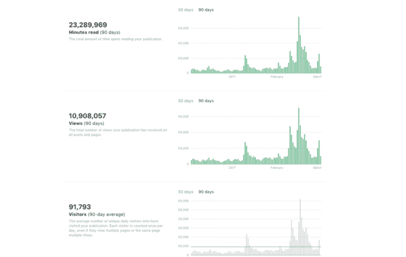
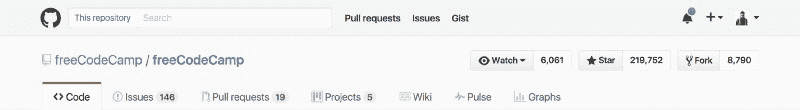
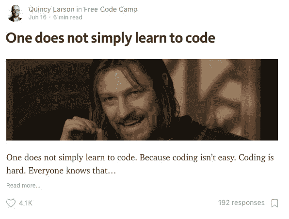
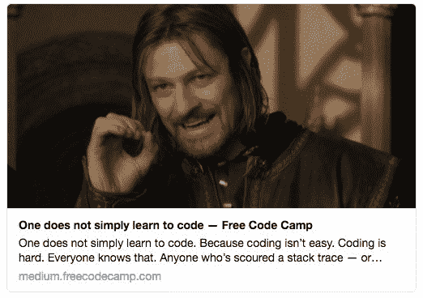
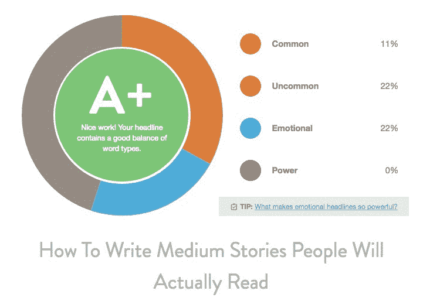
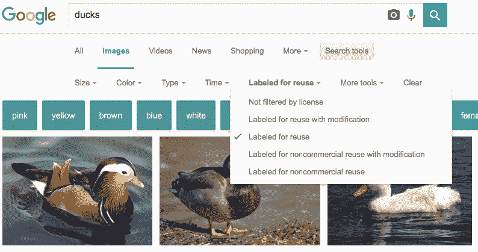
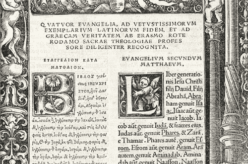
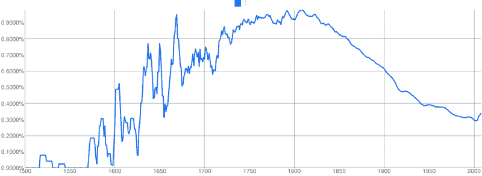

# 如何在 freeCodeCamp 媒体出版物中发表

> 原文：<https://www.freecodecamp.org/news/how-to-get-published-in-the-freecodecamp-medium-publication-9b342a22400e/>

更新:我们现在运行自己的自托管开源工具，向更多的读者发布文章，而不是在媒体上发布。

你可以在这个论坛上阅读更多关于我们的举动，其中包括如何申请成为作者的说明，[阅读这个风格指南](https://www.freecodecamp.org/news/developer-news-style-guide/)。

如果你好奇的话，以下是出于历史目的。

我们的开源社区运营着 Medium 最大的技术出版物。如果你写关于开发、设计或数据科学的文章，并且正在寻找读者，这是一个发表文章的好地方。



Our stats from the past 90 days. They’re high enough to break the CSS on the Y axis of Medium’s charts.

freeCodeCamp 是一个开源社区，有成千上万的贡献者、导师、教师和活动组织者。

每月有超过 100 万人使用 freeCodeCamp 学习编码，我们中的数千人已经完成了 1200 小时的课程，并获得了他们的第一份开发工作。



我们是非营利组织。您可以通过[成为支持者](https://www.freecodecamp.com/donate)来帮助我们支付服务器和其他费用。

作为一名作家，这一切对你意味着什么:

*   我们不会给你的故事贴上广告，或者把它放在付费墙后面(或者“电子邮件墙”或任何东西——没有奇怪的把戏)。
*   你可以包含你自己的博客或服务的链接，甚至是附属链接，只要做得有品位和透明。
*   你的故事是你的。我们对他们没有任何要求。你可以把它们交叉贴在任何你想贴的地方。其他报纸和网站甚至可能会找你合作或翻译它们。我们没问题。我们只是要求——因为我们在编辑和推广您的故事上投入了大量时间——一旦我们发布了它们，您不要将它们从我们的媒体出版物中删除。

我们的编辑有办报和编辑技术出版物的经验。我们将阅读您的提交，如果我们认为它很有前途，我们会就您如何改进它给你坦率的反馈。然后，我们将对您的故事进行最终编辑，发布它，然后帮助您宣传它。

自 18 个月前我们推出这份媒体出版物以来:

*   我们已经发表了大约 1000 个故事
*   平均浏览量为 23000 次
*   平均浏览量为 6500 次(也就是说，这些报道中有一半至少被浏览了 6500 次)

因此，如果你写的是技术，我们可以帮助你接触到更多的读者。

#### 目录

*   [我们如何评估、编辑和发布故事](https://medium.com/p/9b342a22400e#9ad7)
*   [在介质上书写良好的快速入门](https://medium.com/p/9b342a22400e#0152)
*   一个好的标题会让一切变得不同
*   [用图像逮捕](https://medium.com/p/9b342a22400e#590c)
*   [以强劲的领先优势建立势头](https://medium.com/p/9b342a22400e#d568)
*   [建立信誉](https://medium.com/p/9b342a22400e#ce51)
*   [写智能](https://medium.com/p/9b342a22400e#2e3b)
*   [说明你的来源](https://medium.com/p/9b342a22400e#1694)
*   [展示你的代码](https://medium.com/p/9b342a22400e#1d6c)
*   [让链接看起来自然](https://medium.com/p/9b342a22400e#24ab)
*   [嵌入媒体](https://medium.com/p/9b342a22400e#143e)
*   [解释缩写](https://medium.com/p/9b342a22400e#a8d9)
*   [外观和风格](https://medium.com/p/9b342a22400e#0c0f)
*   [添加 5 个标签](https://medium.com/p/9b342a22400e#b966)
*   [在社交媒体上宣传你的故事](https://medium.com/p/9b342a22400e#5952)
*   [最终建议](https://medium.com/p/9b342a22400e#4742)

### 我们如何评估、编辑和发布故事

注意:我在下面的文本中隐藏了提交说明、密语和电子邮件地址，这样你就可以看到所有这些内容了。？

我们每周收到 100 多份投稿，并且保护我们读者的时间。我们寻求仅发布以下内容的故事:

*   写得不错
*   关于人们还没有写太多的有趣话题
*   与我们的观众相关的有**开发者**、**设计师**和**数据科学家**。

如果我们认为你的故事很合适，我们会将你作为作者添加到 freeCodeCamp 出版物中，并向你发送一封包含进一步说明的接受函。

然后，我们会将您的故事放入队列，等待编辑和发布。(如果你对这个过程感兴趣，这是我们的编辑手册。这个过程可能需要一段时间，所以我们提前感谢您的耐心。您将能够在 Medium 的修订历史中查看编辑内容。如果你需要更新，你仍然可以完全控制你的文章。

如果我们认为你的故事不适合发表在 freeCodeCamp 上，我们会给你发一封电子邮件告诉你。别担心。这不会对你在这里发表后续故事的能力产生负面影响。

请注意，我们所有的编辑在开源社区中都有其他职责，所以我们可能需要几天时间才能回复您。但是只要你按照下面隐藏的提交说明，我们就会回复你。

### 在介质上写得好的快速入门


作为一个作家，你在和冷漠作战。你必须让人们足够关注你的故事。你必须说服他们给你一个机会。

面对铺天盖地的新闻提要，你只有两种武器:标题和图片。

以下是一个故事在 Medium 的新闻源中的样子:



这是它在脸书的样子:


这是它在推特上的样子:



你的标题和开头形象是人们评判你的故事的唯一依据。在他们阅读你故事的第一段之前，他们必须回答一个问题。这是我们每天都在问自己的同一个问题:**这值得我花时间吗？**

作为一名作家，你的首要任务是选择一个能让人们回答“是”的标题和图片

### 一个好的标题非常重要

你的标题是你故事中最重要的部分。花时间完善它。

不要使用点击诱饵:“你不会相信这是一个可笑的有效的标题暗模式”

不要使用列表条:“11 个令人发指的标题，将迫使人们阅读你的媒体故事”

一定要说实话:“关于一个有趣话题的巧妙而实事求是的标题”

你的标题应该有多长？HubSpot [分析了](http://blog.hubspot.com/marketing/seo-social-media-study#sm.00000z83pnwr7kdwxvrrsinzxyr7l)6000 篇博文，发现标题为 8 到 14 个字的故事获得了更多的社交媒体份额。


也就是说，**确保你的标题不超过 80 个字符**。否则，当人们在脸书和推特上分享你的文章时，标题会在新闻提要中被截断。

另一个需要考虑的是标题的情绪化程度。标题越情绪化(积极或消极)，人们就越有可能点击它。

这里有一个[工具](http://coschedule.com/headline-analyzer)可以帮助你平衡标题的长度和情绪。



A screenshot of the tool’s analysis of one of my headlines. Your mileage may vary.

标题传统上是用“标题格”写的美联社说“除了冠词、并列连词和三个或更少字母的介词，每个单词的第一个字母都要大写。”

在 Medium 上，我经常把标题格扔出窗外，就像普通句子一样写标题。必要时，我甚至包括标点符号。这种格式更具对话性，也更容易阅读。

不要把故事分成几个部分。像“第 1 部分”这样的标签会把人吓跑，因为谁知道你什么时候会开始写第 2 部分。如果人们遇到“第二部分”而他们没有读过第一部分，很有可能他们也不会费心去读。所以最好[只发表一个有深度的故事](https://medium.freecodecamp.com/understanding-flexbox-everything-you-need-to-know-b4013d4dc9af)。

### 用图像逮捕

你的故事的第二个最重要的方面是它的特色形象。

Medium 会自动将文章中的第一张图片作为特色图片。这意味着你文章的 og-image 元属性将是这个图像。这张图片将在任何地方充当你的故事的大使:社交媒体新闻源、Reddit、谷歌新闻——甚至是 RSS 阅读器。

您可以手动强制 Medium 将特定图像视为文章的特色图像。在编辑模式下，单击图像，然后:

*   Mac: ⌘ + Opt + 8
*   PC: Ctrl + Alt + 8

在写作过程的早期就开始考虑图像。永远不要在没有至少一张图片的情况下发布。否则你的故事将会在新闻报道中消失。

你应该用图像来分解长篇故事。套用玛丽·波平斯的话，一勺图像有助于文字往下走。

Medium 提供四种不同的图像宽度。请注意，这些在手机上看起来都是一样的。

大多数情况下，您会希望坚持使用列宽:


如果您的图表太小很难阅读，请放大:


如果你真的对一张图片感到自豪，或者它充满了有趣的数据，那就全力以赴吧:


…然后还有侧跨。根本不要用这个尺寸，因为它会让文字读起来不太舒服。

当你谈完照片后，你的文字仍然被推到一边，这也很尴尬。

是啊。我还是被困在这里。

在你的标题下，总是在故事的顶部放一张高分辨率的图片。这有以下好处:

1.  当人们在脸书和 Twitter 上分享你的故事时，它会在新闻提要中更加突出，使人们更有可能点击它。
2.  在 Medium 自己的新闻源中会更好看。
3.  人类是视觉生物，点开图像。

### 以强大的领先优势建立势头

一旦你的读者点击进入你的故事，审判就开始了。他们在找任何借口跳回他们的新闻源。阅读比浏览猫的照片需要更多的努力。

不要把时间浪费在介绍或更新上，比如“这篇文章发表在我的博客上，网址是[博客 URL]”或“更新:这篇文章发表在黑客新闻上。”你可以把这些东西放在你故事的底部。

相反，开始提出观点并立即讲述你的故事。

### 建立信誉

想办法在前几段建立你的可信度。如果你是你所在领域的顶尖专家，就这么说。不要假设人们会花时间用谷歌搜索你。

> "你的声音太大了，我听不见你在说什么。"——拉尔夫·瓦尔多·爱默生

任何让人们更加重视你的成就或区别都会给你的读者留下“这个人知道他们在说什么”的印象

在整个故事中强化你的可信度。用数据支持你的论点。使用内联链接到(非付费的)研究。

这不是新英格兰医学杂志。这是中号的。所以不要用脚注。

### 写得聪明

好的文笔很难。像任何技能一样，它需要练习。成为一名优秀的作家没有捷径可走。

帮自己一个忙:**写出你所知道的**。

你听说过“作家群”这个词吗？当你对一个话题了解不多，无法写下来时，就会出现文思枯竭。

如果你在一个话题上连至少 5 分钟的内容都想不出来——或者如果你的故事变成了一系列要点——那你对这个话题了解得还不够。

解药是研究。学习。到野外去。

不要发表任何你不引以为豪的东西。媒体不是数字游戏。这是一种社会契约。人们追随你。反过来，你也尊重他们宝贵的时间。

好的媒介故事不是自然产生的。对于每一分钟的故事长度，至少要花一个小时来写、重写和编辑你的故事。

### 说明你的来源

最简单的方法是在图片下面写上“图片来源”,并把这些文字链接到它的原始来源。

如果你在寻找未经许可就可以安全使用的图片，请查看 [Pexels](https://www.pexels.com/) 、 [Unsplash](https://unsplash.com/) ，或者在谷歌上搜索标记为可重复使用的图片。



A Google image search query with the “Labeled for reuse” option selected.

剽窃——将他人的作品误认为是自己的——在大学里是一种严重的犯罪，在 Medium 上也同样严重。总是把引用归功于最初说它们的人。如果是多行引用，应该使用 Medium 的拉式引用:

> "当你有自己的智慧时，相信别人的智慧是一种乐趣。"克里斯·伊斯兰大教堂

你应该只使用 Medium 的引用语作为突出实际引用的方式，而不是设计你自己的文本。

### 展示您的代码

在可能的情况下，代码应该是文本形式，而不是图像形式。这使得代码更容易被屏幕阅读器访问，也更容易被复制和粘贴。

“中”有一个隐藏的快捷方式，可以将文本转换为纯文本，如下所示:

if (developer === true) {

follow(this . medium publication)；

}

…转换成格式化的代码块:

```
if (developer === true) {
```

```
 follow(this.mediumPublication);
```

```
}
```

为此，选择文本，然后按:

*   **Windows** : Control + Alt + 6
*   **Mac** : Command + Option + 6
*   **Linux** : Control + Alt + 6

也可以用三个反勾号开始一个代码块。如果您在新的一行中键入三个反勾号(```)，Medium 将切换到代码输入模式。

要突出显示内联代码，请选择它，然后按下反勾键。这样，您可以在句子中间将文本格式化为代码`freeCodeCamp()`。

你甚至可以将可运行的应用嵌入到媒体中。以防这些不能在 Medium 的移动应用程序中正确呈现，我建议在每个嵌入的下面包含链接作为后备。

将 CodePen.io URL 粘贴到介质中，然后按 enter:

*查看我的密码[这里](http://codepen.io/FreeCodeCamp/pen/NNvBQW)。*

您也可以使用 JSFiddle.net 来完成这项工作:

*查看我的 JSFiddle [这里](https://jsfiddle.net/avegt5e5/3/)。*

有时，如果是终端命令，人们会以`$`开始代码行。不要这样。它会让初学者感到困惑，并使复制和粘贴命令变得更加困难。相反，只需说类似“在您的终端中输入以下命令”

### 让链接看起来自然

想办法把一个链接变成一个句子。我不建议做的一件事是把一个链接放在它自己的行上，然后按回车键。这将创建一个好看的预览卡，就像这样:

[**如何站在巨人的肩膀上**](https://medium.freecodecamp.com/how-to-stand-on-shoulders-16e8cfbc127b)
[*征服这里没有发明的综合症，然后做点新的。*medium.freecodecamp.com](https://medium.freecodecamp.com/how-to-stand-on-shoulders-16e8cfbc127b)

…但读者通常认为这些是广告，甚至不看它们。

如果你想链接到进一步的阅读，我推荐你在故事的结尾使用这个。

给文本加下划线会使其更难阅读，所以只需超链接几个单词。

不要直接粘贴网址，像这样:https://www.freecodecamp.com[❌](https://www.example.com)❌

相反，链接到像 [freeCodeCamp](https://www.freecodecamp.com) mid sentence 这样的网站，就像我刚才在这里做的那样。

### 嵌入媒体

您可以嵌入推文、YouTube 视频和其他媒体，方法是将它们的 URL 粘贴到 media 中的新行上，然后按 enter 键。

请谨慎使用，因为它们可能会分散读者的注意力，让他们无法完成你的故事。

### 解释缩写

不要使用缩写，除非这个缩写比它所代表的含义更容易理解。例如，HTTP 比超文本传输协议更广为人知。

如果一个缩写还没有被广泛理解，并且你要多次引用它，你可以这样定义它:

"让我们将代码分解成一个抽象语法树 (AST). "

为了方便读者，这里我还链接了维基百科的文章。但是，不要认为人们会阅读这些外部链接。你仍然需要定义概念或者通过例子来说明它们。

避免在你的开头段落中定义缩写，因为这会减慢你的读者的阅读速度，使他们不太可能继续阅读。

这里有一个很短的技术缩写列表，你不需要定义:API，AJAX，BIOS，CPU，CSS，HTML，HTTPS，JSON，LAN，RAM，REST，USB，WWW，XML。对于其他的事情，你应该把它拼写出来。

总是拼写出像 JavaScript 和前端这样的短的多部分单词。不要缩短它们。简洁不值得可能的混乱。

### 外观和风格

如果你想强调什么，就用粗体字，但要谨慎使用**。** *斜体字比较难读。不要加粗超链接——它们下面的线条已经提供了足够的强调。*

不要使用首字下沉。它们在旧书里看起来很优雅，但在网络上却很傻。



Some old-school-cool print dropcaps

一次只使用一个感叹号，通常是在感叹词之后，如:天哪！热狗！

将逗号和句号放在引号内，除非它可能会使读者困惑(如变量名或书名)。

在世界的某些地方，人们在冒号或问号前加空格，就像这样:example。不要这样。

使用英语而不是拉丁语:

*   用“例如”代替“例如”
*   用“那是”而不是“即”
*   用“注意”代替“注意”
*   而不是以“等等”来结束列表从“喜欢”开始:“猫王吃面包、花生酱和香蕉等食物。”

根据谷歌图书，分号已经慢慢消亡。让我们结束他们的痛苦。只要用句号代替，把从句分成独立的句子。



尽可能使用牛津逗号。它使事情更容易，更清晰，更漂亮地阅读。

使用[海明威 App](http://www.hemingwayapp.com/) 。这个简单的工具没有什么神奇的，但是它会自动检测广泛认同的风格问题:

*   被动式
*   不必要的副词
*   有更多相同词的单词

海明威应用程序将为你的写作指定一个“等级”。甚至技术故事也能达到 6 分。他们应该渴望。

大多数人的母语不是英语，那些母语是英语的人通常不会整天坐着读乔叟。他们希望他们的信息是可访问的和中肯的。

宁可把长句子和段落分成短的。

不管你在英语作文课上学到了什么，比起“文字墙”，人们更喜欢短段落

单句段落没什么不好。

宁可创造新的段落。

使用缩写。它们会让你的文章看起来更有对话性。这总是有利的。

始终保持你的时态一致。如果你在谈论过去发生的事情，用过去式。

此外，**前端**发展(形容词形式带破折号)是当你在做**前端**(名词形式不带破折号)。后端、全栈和许多其他复合术语也是如此。

### 添加 5 个标签

Medium 允许您为您的故事添加最多五个标签。使用它们。

人们在媒体上关注特定的话题。最受欢迎的是#科技、#生活课程、#旅行、#设计和#创业。

关注您使用的标签的人可以在他们的新闻订阅源中看到您的故事。标签也让人们更容易在搜索结果中偶然发现你的故事。

既然你已经读到这里，下面是如何向 freeCodeCamp 出版物提交你的故事:发送电子邮件到 freecodecamp org 提交。包括你在 Medium 上的故事的 URL(最好是未发表的草稿)和单词“香蕉”,这样我们就知道你已经阅读了所有这些内容。每封邮件只发送一个故事网址。没有必要在你的邮件里再添加什么了——我们只是阅读这些故事，并根据它们自身的优点对它们进行评判。

### 在社交媒体上宣传你的故事

你可以在推特、脸书群组和相关子栏目上分享你的故事。如果你有一个邮件列表，你也可以把它发给你的订户。

你可以实时查看你的故事的[状态](https://medium.com/me/stats)。向你的朋友和追随者寻求反馈。将这些反馈融入你的故事中。

不要做任何粗略的事情来宣传你的故事。你很有可能会被抓。像黑客新闻和 Reddit 这样的网站非常善于发现异常的投票行为。这不仅会影响到你，也会影响到整个 freeCodeCamp 社区。

### 最后的建议

请记住，当你在媒体上发表文章时，你是在要求成千上万的人给你他们生活中的几分钟。不要认为你的读者是理所当然的。

在你发表一个故事之前，我建议你睡觉，醒来，然后再校对一遍。

如果你的母语不是英语，并且正在用英语写作，在把你的故事提交给出版物之前，请一位母语为英语的人校对一下。

我们期待着阅读您的意见。我希望我们能帮助你进一步完善你的故事，并接触到更多的观众。