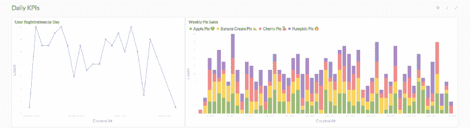
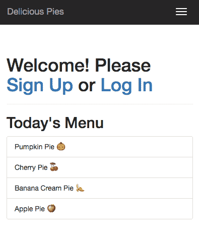

# 如何在 1 小时内启动您的分析

> 原文：<https://www.freecodecamp.org/news/how-to-bootstrap-your-analytics-in-1-hour-cb3a549b4780/>

蒂姆·亚伯拉罕

# 如何在 1 小时内启动您的分析

尽管大多数初创公司明白数据对他们的成功有多么重要，但他们往往会回避分析——尤其是在早期。

这部分源于一个神话，即如果你想有好的分析，你应该拿出大约 25%的工程资源来资助它。对于一个有愿景的创始人来说，25%的精力分散在执行愿景上——以换取对他们如何做的更好的了解——是不值得的。

但是为你的产品建立一些基本的分析远没有你想象的那么困难。当然远远达不到工程预算的 25%。虽然对于拥有许多复杂数据管道的成熟公司来说，这个数字可能是真实的，但小公司可以用最小的成本轻松地完成一些事情。

为了证明这一点，我将向您展示如何花 1 个小时建立一个足以满足公司未来 6 个月需求的系统。

首先，让我们谈谈我所说的“拥有分析”是什么意思我认为最低要求是:

*   公司中的每个人都可以轻松访问您的关键指标
*   发给你的团队的夜间统计电子邮件或时差信息
*   几个托管仪表板放在办公室的显示器上
*   您公司中的任何人都可以探索数据的地方(不考虑技术敏锐度)

换句话说，你需要**度量**和**一种在你的组织中传播它们的方式**。让我们从指标部分开始。

### 您的指标已经在您的数据库中

因为馅饼比小玩意好吃多了，让我们想象你刚刚开始[一家馅饼配送公司](https://github.com/timabe/pies)。您决定——至少——您企业的成功将取决于:

1.  你吸引潜在馅饼消费者的能力
2.  你向这些消费者销售馅饼的能力

Mmmm, pies

如果你能可靠地增长 1 和 2，你就不会有太多其他的担心。你据此决定跟踪:

1.  新用户注册
2.  馅饼销售
3.  重复使用

您知道，您可以根据用户注册和馅饼销售数据得出一些更有趣的指标，但现在您对这三大高层次指标并不感冒。现在你实际上是怎么做这些的？

在这一点上，很多人会选择 Google Analytics、Mixpanel 或其他第三方事件分析提供商。虽然我喜欢这些产品，我喜欢事件分析，但我也认为这是早期创业公司投资分析的部分原因。以正确的方式设置这些意味着将工程时间花在与开发核心产品正交的事情上。

因此，在你让工程团队花费一个周期来检测用户注册和 pie 销售之前，考虑一下这个:**这些指标可能已经在你的应用数据库中了。**换句话说，如果您正在构建一个向用户交付馅饼的产品，而您没有一个数据库表或集合来存储您的用户或他们订购的馅饼。。。那么缺乏分析并不是你最大的担忧。

记住，一个软件基本上是由数据和对数据进行操作的逻辑组成的。许多人没有意识到应用程序中的数据实际上也可以用于分析。因此，请随意将您的事件分析工具放在待办事项中，让我们看看仅用您的应用程序数据库就能完成多少工作。

现在，你如何得到这些指标呢？

They’re “in” the database?

### 元数据库:一个与你的数据库一起工作的分析工具

从数据库获取信息有很多方法，但是只有一种最简单的方法，这篇文章就是关于简单的方法。

我推荐给任何一家公司的最喜欢的工具是 [Metabase](http://www.metabase.com/) 。元数据库是在公司内部共享数据和分析的最快、最简单的方法。它的安装或部署非常简单，几乎适用于所有数据库，最棒的是它是开源的并且 100%免费——所以在使用一些付费选项之前，你绝对应该先测试一下。

*完全披露:我在 [expa](http://expa.com/) 工作，Metabase 就是在那里成立的，我是该公司的顾问。在过去的一年里，我还为 8 家不同的数据和分析技术初创公司提供了建议，并在每一个案例中为它们推荐了 Metabase。他们都在继续使用它。*

### 安装/部署

如果你只是处于评估模式，我会推荐下载 Metabase 的 [mac app](http://www.metabase.com/start/mac.html) 。遵循他们的[设置指南](http://www.metabase.com/docs/v0.20.3/setting-up-metabase.html)，你就可以创建一些指标了。然而，强烈推荐在 [Heroku](http://www.metabase.com/docs/v0.20.3/operations-guide/running-metabase-on-heroku.html) 或[AWS Elastic Beanstalk](http://www.metabase.com/docs/v0.20.3/operations-guide/running-metabase-on-elastic-beanstalk.html)(best)上部署元数据库，因为你将获得一个托管在云中的持久应用程序，你的整个团队都可以使用它。

关于部署过程的完整指南，请查看我的视频教程。元数据库的[文档](http://www.metabase.com/docs/v0.20.3/operations-guide/start.html#installing-and-running-metabase)也相当全面。如果你是一个非技术人员，你可能需要一个工程师，特别是如果你的应用程序数据库在 AWS 的 VPC 中。

关于这一点，创建应用程序数据库的读取副本并将其插入元数据库也是一个好主意。这样，您可以确保任何繁重或悬而未决的查询不会影响您的用户。

一旦您部署了元数据库，注册并添加您的数据库凭证。接下来，邀请你的团队成员，这样他们就可以享受乐趣了。

### 创建您的指标

信不信由你，剩下的很简单。你要做的第一件事是建立你的指标。用元数据库的说法，这些是“问题”如果你是做馅饼生意的，并且你有一个合理组织的模式，你应该只需要点击几下鼠标就能得到你的关键指标。不需要 SQL，但是如果你喜欢 SQL，这个选项是可用的。

因此，建立你的顶级指标，看看是否有其他有趣的指标出现在你的脑海中。虽然你可以找到数百个聪明人告诉你永远不要做饼状图，但我不会因为你根据馅饼的受欢迎程度做饼状图而讨厌你。如果 metabase 是元数据库，那么让您的饼图成为元数据库是正确的。

### 收尾

接下来，您需要设置一封每日统计电子邮件。我不知道他们是怎么回事，但每个人都喜欢每日统计电子邮件。Metabase 将这些称为“脉冲”，如果你对电子邮件不感冒，它甚至允许你使用 Slack。添加你想发出的问题，选择一个时间和节奏(不一定是每天，但这往往是最有帮助的)和一个接收者或空闲频道的列表，你就完成了。

最后，每个人都喜欢在办公室的显示器上看到漂亮的仪表盘。不要吊他们的胃口。制作仪表板也很简单。挑选一些问题，在你的设计敏感度允许的情况下，尽可能组织好它们。把它加载到你办公室里的外接显示器上，然后全屏显示。

### 概述

你只需大约一个小时就可以为你的初创公司建立起一个相当稳固的分析基础设施。现在，您的整个团队可以探索您的应用程序数据库，接收夜间电子邮件，并查看公司范围内的仪表板。更好的是，这种设置应该会持续你相当长的时间——至少 6 个月，除非你开始经历疯狂的增长(在这种情况下，没有抱怨)。

准备好尝试了吗？怀疑我的 1 小时保证？查看我的 YouTube 教程，[第一部分](https://www.youtube.com/watch?v=wmJ02K8LIFk)和[第二部分](https://www.youtube.com/watch?v=Abza9SKoWPs)，我会带你了解你需要知道的一切。