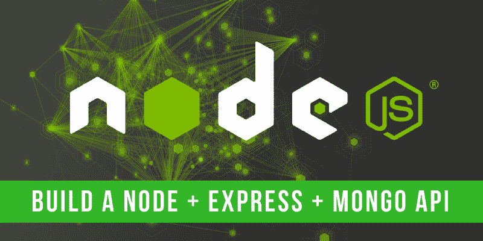
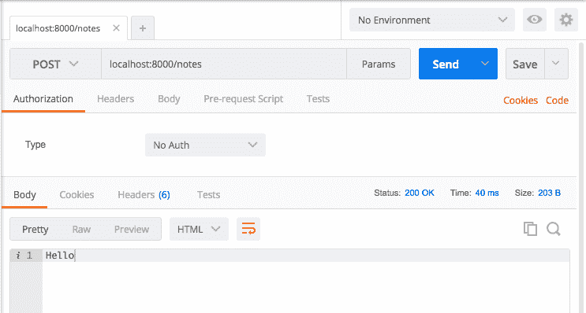
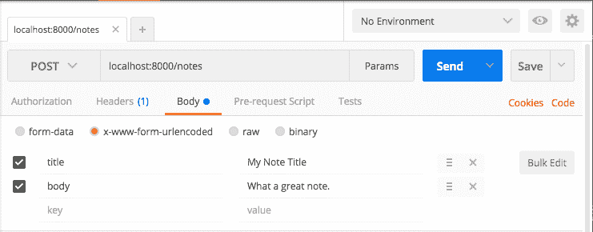
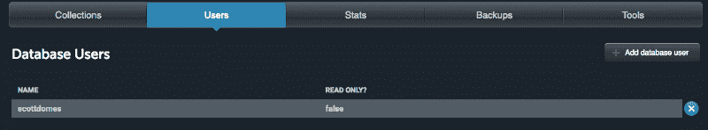
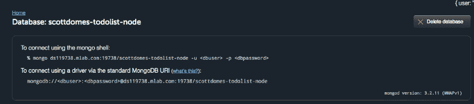
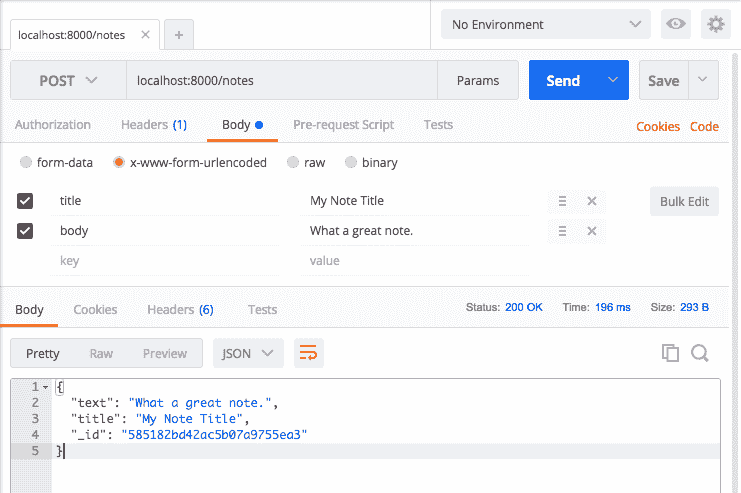
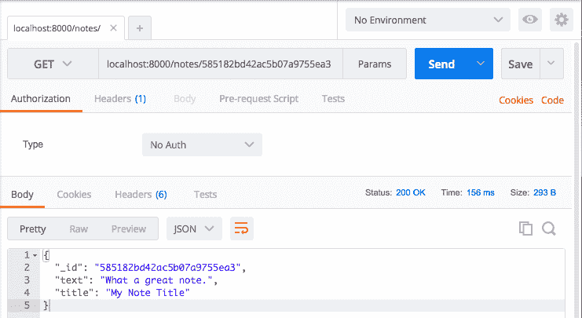
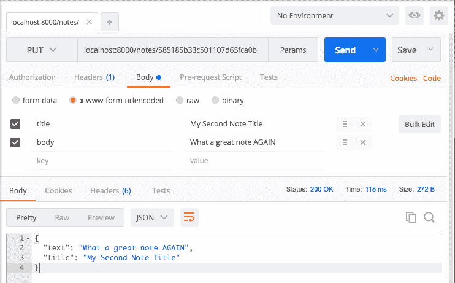

# 在 30 分钟内构建一个 Node.js API

> 原文：<https://www.freecodecamp.org/news/building-a-simple-node-js-api-in-under-30-minutes-a07ea9e390d2/>

斯科特·多姆斯



# 在 30 分钟内构建一个 Node.js API

Node.js 对初学者来说可能有些吓人。但是它灵活的结构和缺乏严格的指导方针使得它看起来比实际更复杂。

本教程是 Node.js、Express 框架和 MongoDB 的快速简单指南，重点介绍基本的 REST 路线和基本的数据库交互。您将构建一个简单的 API 样板，然后可以用作任何应用程序的基础。

**本教程面向谁**:你应该对 REST APIs 和 CRUD 操作有基本的了解，再加上基本的 JavaScript 知识。我用 ES6(主要是胖箭头函数)，但没有太复杂的。

在本教程中，您将为笔记应用程序创建一个后端框架——想想 [Google Keep](http://keep.google.com) 。您希望能够在笔记上完成所有四个 CRUD 操作:创建、读取、更新和删除。

### 安装

如果你没有安装节点，[看这里](https://howtonode.org/how-to-install-nodejs)。

在一个新的目录中，运行 npm init，按照提示进行操作，将你的应用程序命名为“显著”(或者其他你喜欢的名字)。

```
npm init
```

一旦完成，您应该在您的目录中准备好一个 *package.json* 。这意味着您可以开始安装项目所需的依赖项。

您将使用 Express 作为您的框架，MongoDB 作为数据库，以及一个名为 body-parser 的包来帮助处理 JSON 请求。

```
npm install --save express mongodb@2.2.16 body-parser
```

我还强烈建议将 Nodemon 作为开发依赖项安装。这是一个简单的小软件包，当文件改变时，它会自动重启你的服务器。

如果你跑步:

```
npm install --save-dev nodemon
```

然后，您可以将以下脚本添加到 *package.json* 中:

```
// package.json
```

```
 "scripts": {    "dev": "nodemon server.js"  },
```

完整的 *package.json* 应该是这样的:

```
// package.json
```

```
{  "name": "notable",  "version": "1.0.0",  "description": "",  "main": "server.js",  "scripts": {    "dev": "nodemon server.js"  },  "author": "",  "license": "ISC",  "dependencies": {    "body-parser": "^1.15.2",    "express": "^4.14.0",    "mongodb": "^2.2.16"  },  "devDependencies": {    "nodemon": "^1.11.0"  }}
```

现在你可以创建你的 *server.js* 文件并开始构建你的 API。

### 我们的服务器

让我们首先要求您在 *server.js.* 中的所有依赖项

```
// server.js
```

```
const express        = require('express');const MongoClient    = require('mongodb').MongoClient;const bodyParser     = require('body-parser');
```

```
const app            = express();
```

您将使用 MongoClient 与您的数据库进行交互。请注意，您还将应用程序初始化为 Express(您的框架)的实例。

你需要做的最后一件事就是让你的应用程序开始监听 HTTP 请求。

您可以指定一个端口，并开始监听，如下所示:

```
// server.js
```

```
const port = 8000;
```

```
app.listen(port, () => {  console.log('We are live on ' + port);});
```

现在，如果你运行 *npm run dev* (或者 *node server.js* 如果你没有安装 Nodemon)你应该在终端中看到‘我们在端口 8000 上运行’。

您的服务器正在运行。但是它并没有做很多事情。或者别的什么，真的。

让我们解决这个问题。

### 粗糙的路线

对于本例，您想要构建 4 条路线；创建便笺、阅读便笺、更新便笺以及删除便笺。

这将使您很好地了解如何用节点构造几乎任何基本路由。

不过，为了测试您的 API，您需要模拟客户端发出请求。为此，你将使用一款名为 [Postman](https://www.getpostman.com/) 的优秀应用。它允许您使用自定义主体和参数进行简单的 HTTP 请求。

安装 Postman，让我们开始设置您的路线。

### 超级有条理

大多数 Node.js 教程(和许多真正的应用程序)都把它们所有的路线放在一个大的 *routes.js* 文件中。这让我有点不舒服。相比之下，将你的文件分割到不同的文件夹中会有更好的可读性，并使大的应用程序更易于管理。

你没有一个大的应用程序，但是让我们把它做好。制作以下目录:一个 *app* 文件夹，里面有一个 routes 文件夹，里面有一个 *index.js* 和一个 *note_routes.js* 文件。

换句话说:root > app > routes > index.js 和 note_routes.js。

```
mkdir appcd appmkdir routescd routestouch index.jstouch note_routes.js
```

对于简单的小应用程序来说，这些目录似乎有些多余，但是从最佳实践开始总是好的。

### 你的第一条路线

让我们从 CRUD- create 中的 C 开始。你将如何创建一个便笺？

在这之前，你必须建立更多的基础设施。在 Express 中，路由被包装在一个函数中，该函数将 Express 实例和数据库作为参数。

像这样:

```
// routes/note_routes.js
```

```
module.exports = function(app, db) {
```

```
};
```

然后您可以通过您的 *index.js* 导出这个函数:

```
// routes/index.js
```

```
const noteRoutes = require('./note_routes');
```

```
module.exports = function(app, db) {  noteRoutes(app, db);  // Other route groups could go here, in the future};
```

然后导入到 *server.js:* 中使用

```
// server.js
```

```
const express        = require('express');const MongoClient    = require('mongodb').MongoClient;const bodyParser     = require('body-parser');
```

```
const app            = express();
```

```
const port = 8000;
```

```
require('./app/routes')(app, {});app.listen(port, () => {  console.log('We are live on ' + port);});
```

注意，因为您还没有建立数据库，所以您只是传入了一个空对象。

好了，*现在*你可以创建自己的路线了。

语法很简单:

```
// note_routes.js
```

```
module.exports = function(app, db) {  app.post('/notes', (req, res) => {    // You'll create your note here.    res.send('Hello')  });};
```

当应用程序接收到对'/notes '路径的 *post* 请求时，它将执行回调内部的代码——传入一个请求对象(包含请求的参数或 JSON)和一个响应对象(用于回复)。

您可以通过使用 Postman 向 localhost:8000/notes 发送 POST 请求来测试这一点。



You should get the ‘Hello’ back.

不错！你创造了你的第一条真正的路线。

下一步是向您的请求添加一些参数，并在您的 API 中处理它们，最后，添加到您的数据库中。

### 请求参数

在 Postman 中，选择 *x-www-form-urlencoded* 单选按钮后，转到 Body 选项卡并添加一些键值对。

这将向您的请求添加编码的表单数据，您将能够使用您的 API 来处理这些数据。



You can try being more creative than me.

现在在你的 *note_routes.js* 中，让我们只是登出正文。

```
// note_routes.js
```

```
module.exports = function(app, db) {  app.post('/notes', (req, res) => {    console.log(req.body)    res.send('Hello')  });};
```

尝试发送邮差请求，你会看到…未定义。

不幸的是，Express 本身不能处理 URL 编码的表单。但是你确实安装了那个体解析器包…

```
// server.
```

```
const express        = require('express');const MongoClient    = require('mongodb').MongoClient;const bodyParser     = require('body-parser');
```

```
const app            = express();
```

```
const port = 8000;
```

```
app.use(bodyParser.urlencoded({ extended: true }));
```

```
require('./app/routes')(app, {});app.listen(port, () => {  console.log('We are live on ' + port);});
```

现在，您应该在终端中将身体视为一个对象。

```
{ title: 'My Note Title', body: 'What a great note.' }
```

初步路线的最后一步:建立数据库，然后添加数据。

建立一个 Mongo 数据库最简单的方法是通过 [mLab](https://mlab.com/) :它对最小的数据库是免费的，而且建立起来非常快。

创建帐户和 MongoDB 部署后，使用用户名和密码向数据库添加一个用户:



然后在这里抓取网址(第二个):



在项目根目录下的目录 config 中，创建一个 db.js 文件。

```
mkdir config cd configtouch db.js
```

在里面，添加 URL:

```
module.exports = {  url : YOUR URL HERE};
```

不要忘记在 URL 中添加您的用户名和密码(来自数据库用户，而不是您的 mLab 帐户)。(如果你把这个项目提交给 Github，确保包含一个. gitignore 文件[，就像这样](https://github.com/scottdomes/notable-node-api-tutorial/blob/master/.gitignore)，这样你就不会和所有人分享你的密码。)

现在，在您的 *server.js* 中，您可以使用 MongoClient 连接到您的数据库，并使用它来包装您的应用程序设置:

```
// server.js
```

```
const express        = require('express');const MongoClient    = require('mongodb').MongoClient;const bodyParser     = require('body-parser');const db             = require('./config/db');
```

```
const app            = express();
```

```
const port = 8000;
```

```
app.use(bodyParser.urlencoded({ extended: true }));
```

```
MongoClient.connect(db.url, (err, database) => {  if (err) return console.log(err)  require('./app/routes')(app, database);
```

```
 app.listen(port, () => {    console.log('We are live on ' + port);  });               })
```

如果您使用的是最新版本的 MongoDB (3.0+)，请修改如下:

```
// server.js
```

```
const express        = require('express');const MongoClient    = require('mongodb').MongoClient;const bodyParser     = require('body-parser');const db             = require('./config/db');
```

```
const app            = express();
```

```
const port = 8000;
```

```
app.use(bodyParser.urlencoded({ extended: true }));
```

```
MongoClient.connect(db.url, (err, database) => {  if (err) return console.log(err)                        // Make sure you add the database name and not the collection name  const database = database.db("note-api")  require('./app/routes')(app, database);
```

```
 app.listen(port, () => {    console.log('We are live on ' + port);  });               })
```

*(感谢[亚历克斯·斯特鲁尔](https://github.com/astr0-4)修复了 3.0)*

这是您基础架构设置的最后一步！从这里开始都是路线建设。

### 添加到您的数据库

MongoDB 将数据存储在*集合*中——这正是它们听起来的样子。在您的例子中，您希望将笔记存储在一个名为 notes 的集合中。

因为您将数据库作为 routes 中的 *db* 参数传递，所以您可以像这样访问它:

```
db.collection('notes')
```

创建便笺就像在您的收藏上调用 *insert* 一样简单:

```
const note = { text: req.body.body, title: req.body.title}  db.collection('notes').insert(note, (err, results) => {}
```

一旦插入完成(或者由于某种原因失败)，您希望或者发送回一个错误或者发送回新创建的 note 对象。以下是完整的 *note_routes.js:*

```
// note_routes.js
```

```
module.exports = function(app, db) {  const collection =   app.post('/notes', (req, res) => {    const note = { text: req.body.body, title: req.body.title };    db.collection('notes').insert(note, (err, result) =&gt; {      if (err) {         res.send({ 'error': 'An error has occurred' });       } else {        res.send(result.ops[0]);      }    });  });};
```

试试吧！用 Postman 发送一个 x-www-form-urlencoded POST 请求，在 body 选项卡下设置一个*标题*和*正文*。

响应应该是这样的:



如果您登录到 mLab，您还应该在数据库中看到创建的注释。

### 你的阅读路线

现在你可以加快步伐了。

假设您想通过导航到 localhost:8000/notes/{ id }来获取刚刚创建的便笺。在这种情况下，应该是 localhost:8000/notes/585182 BD 42 a C5 b 07 a 9755 ea 3。

(如果您没有其中一个笔记的 ID，可以在 mLab 上检查或创建一个新的)。

下面是这个在 *note_routes.js* 中的样子:

```
// note_routes.js
```

```
module.exports = function(app, db) {  app.get('/notes/:id', (req, res) => {      });
```

```
 app.post('/notes', (req, res) => {    const note = { text: req.body.body, title: req.body.title };    db.collection('notes').insert(note, (err, result) => {      if (err) {         res.send({ 'error': 'An error has occurred' });       } else {        res.send(result.ops[0]);      }    });  });};
```

就像之前一样，您将调用数据库笔记集合上的一个方法。在这里，它被恰当地命名为 findOne。

```
// note_routes.js
```

```
module.exports = function(app, db) {  app.get('/notes/:id', (req, res) => {    const details = { '_id': <ID GOES HERE> };    db.collection('notes').findOne(details, (err, item) => {      if (err) {        res.send({'error':'An error has occurred'});      } else {        res.send(item);      }    });  });
```

```
app.post('/notes', (req, res) => {    const note = { text: req.body.body, title: req.body.title };    db.collection('notes').insert(note, (err, result) => {      if (err) {         res.send({ 'error': 'An error has occurred' });       } else {        res.send(result.ops[0]);      }    });  });};
```

可以通过 *req.params.id* 从 URL 参数中抓取 id。然而，如果你试图只是把绳子放在上面的<和>中，那是行不通的。

MongoDB 不仅需要一个 ID 作为*字符串*，还需要一个 ID *对象*，或者他们称之为 ObjectID。

别担心，这很容易解决。以下是完整的代码:

```
// note_routes.js
```

```
var ObjectID = require('mongodb').ObjectID;
```

```
module.exports = function(app, db) {  app.get('/notes/:id', (req, res) => {    const id = req.params.id;    const details = { '_id': new ObjectID(id) };    db.collection('notes').findOne(details, (err, item) => {      if (err) {        res.send({'error':'An error has occurred'});      } else {        res.send(item);      }     });  });
```

```
app.post('/notes', (req, res) => {    const note = { text: req.body.body, title: req.body.title };    db.collection('notes').insert(note, (err, result) => {      if (err) {         res.send({ 'error': 'An error has occurred' });       } else {        res.send(result.ops[0]);      }    });  });};
```

用你的一个笔记 ID 试试看，应该是这样的:



### 您的删除路线

删除一个对象实际上与查找一个对象非常相似。你只需使用*移除*功能，而不是*查找一个*。这是完整的代码。我强调了与您的 GET 不同之处:

```
// note_routes.js
```

```
// ...
```

```
 app.delete('/notes/:id', (req, res) => {    const id = req.params.id;    const details = { '_id': new ObjectID(id) };    db.collection('notes').remove(details, (err, item) => {      if (err) {        res.send({'error':'An error has occurred'});      } else {        res.send('Note ' + id + ' deleted!');      }     });  });
```

```
// ...
```

### **你的更新路线**

最后一个！PUT 基本上是读取和创建的混合体。找到对象，然后相应地更新它。如果你删除了你唯一的笔记，是时候做另一个了！

代码:

```
// note_routes.js
```

```
// ...
```

```
 app.put('/notes/:id', (req, res) => {    const id = req.params.id;    const details = { '_id': new ObjectID(id) };    const note = { text: req.body.body, title: req.body.title };    db.collection('notes').update(details, note, (err, result) =&gt; {      if (err) {          res.send({'error':'An error has occurred'});      } else {          res.send(note);      }     });  });
```

```
// ...
```

现在，您可以更新您的任何笔记，如下所示:



请注意这段代码的不完美之处——如果您未能提供正文或标题，PUT 请求将使数据库中注释上的这些字段无效。

您可以轻松地添加一些条件逻辑来更新请求中出现的字段——为了简单起见，我省略了这一点。

### API 完成

就是这样！四个主要 CRUD 操作中的每一个都有一个工作节点 API。

本教程的目标是让您对 Express、Node 和 MongoDB 有一定程度的熟悉——您可以使用简单的应用程序作为更复杂项目的启动平台。

在未来，我将编写教程，用不同的语言和框架创建更简单的 API。如果你感兴趣，点击关注按钮！

如果这篇教程对你有所帮助，请点击下面的绿色心脏——它意义重大。如果有任何反馈或问题，请随时给我留言。

感谢阅读！