# 了解 Flexbox:您需要知道的一切

> 原文：<https://www.freecodecamp.org/news/understanding-flexbox-everything-you-need-to-know-b4013d4dc9af/>

本文将涵盖掌握 CSS Flexbox 模型所需的所有基本概念。很长，所以我希望你已经准备好了。

如果你想一次性阅读整个教程。pdf 文档，这里是[下载链接](http://bit.ly/und_f) —无附加条件，&如果你想要更身临其境的体验，使用 [*互动课程*](https://www.educative.io/collection/5191711974227968/5741031244955648) *—是免费的。没有附加条件。*

### 关于 Flexbox 学习曲线的一个注记

这是我非常尊敬的开发人员菲利普·罗伯茨的一条推文:

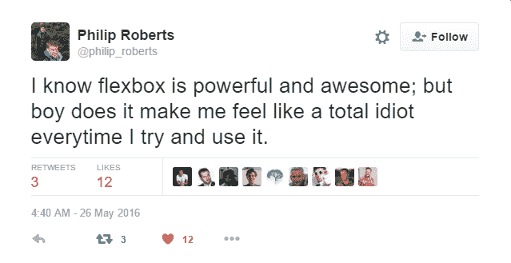

学习 Flexbox 一开始可能并不好玩。它将挑战你对 CSS 布局的了解。但是没关系。一切值得学习的东西都是这样开始的。

Flexbox 当然是你应该认真对待的东西。它为内容布局的现代风格铺平了道路，而且它不会很快消失。它已经成为一种新的标准。所以张开双臂，拥抱它吧！

### 你会学到什么

我将首先向您介绍 Flexbox 的基础知识。我相信任何理解 Flexbox 的尝试都必须从这里开始。

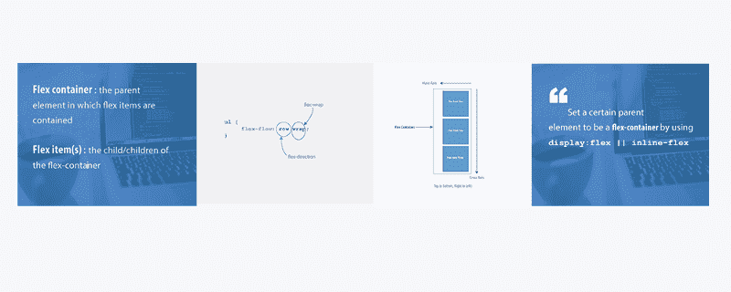

Flexbox fundamentals

学习基本面很酷。更酷的是应用这些基本原理来构建真实世界的应用程序。

我将带你构建许多“小东西”之后，我会用这个完全用 Flexbox 设计的音乐应用程序来结束我的工作。


Music app layout

那看起来不漂亮吗？

当你学习构建音乐应用程序布局时，我将深入研究 Flexbox 的内部工作原理。您还将感受到 Flexbox 在响应式 web 设计中扮演的角色。

我很高兴向你展示这一切。

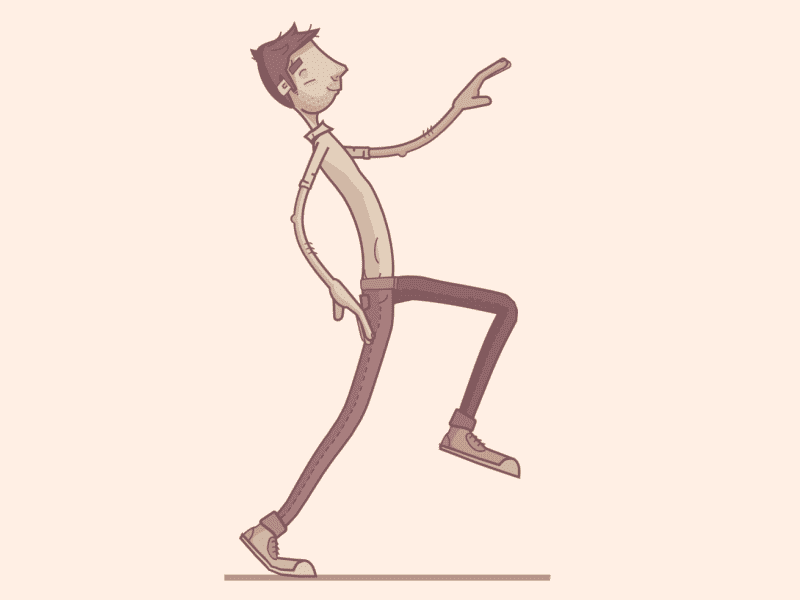

GIF by [Jona Dinges](https://dribbble.com/jonadinges)

但是在你开始构建用户界面之前，我要先给你做一些练习。这可能看起来很无聊，但这是让你熟练使用 Flexbox 的过程的一部分。

让我们开始吧。

### 介绍


CSS 在过去的几年里有了很大的发展。设计师喜欢引入滤镜、过渡和变换。但是缺少了一些东西。我们都渴望的东西。

用 CSS 制作智能页面布局似乎已经持续了太长时间，这让我们中的许多人编写粗糙的 CSS。

我们总是不得不处理浮动、表格显示漏洞以及它们带来的后果。如果你已经写了一段时间的 CSS，你可能会有同感。如果没有，欢迎来到一个更好的世界！

似乎我们作为设计师和前端开发人员的祈祷终于被听到了。这一次，以盛大的方式。

现在，我们都可以抛弃那些讨厌的 CSS 技巧了。不再不停地使用浮动、表格单元显示。

是时候采用更干净的现代语法来设计智能布局了。欢迎 CSS Flexbox 模型。

### 什么是 Flexbox？

根据该规范，Flexbox 模型提供了一种有效的方式来在文档内的元素之间布局、对齐和分配空间——即使视窗和元素的大小是动态的或未知的。

如果这听起来太正式，我理解这种感觉。一会儿，我会用简单的英语解释这是什么意思。

无论你是在梦里写 CSS，还是刚刚入门，都会有宾至如归的感觉。

### 我如何开始使用 Flexbox 模型？

这是每个人问的第一个问题，答案可能比你想象的要简单得多。

要开始使用 Flexbox 模型，您需要做的就是首先定义一个 *flex-container。*

在常规的 HTML 中，排列一个简单的项目列表采用以下形式:

```
<ul> <!--parent element-->  <li></li> <!--first child element-->  <li></li> <!--second child element-->  <li></li> <!--third child element--></ul>
```

如果您浏览了一下，您一定会看到无序列表(`ul`)包含列表元素(`li`)。

您可以将`ul`称为*父*元素，将`li`称为*子*元素。

要使用 Flexbox 模型，您必须使父元素成为 flex 容器(又名*灵活容器*)。

您可以通过为内嵌变体设置`display: flex`或`display: inline-flex`来实现这一点。就这么简单，从这里开始，您就可以使用 Flexbox 模型了。

实际发生的是，Flexbox 格式化上下文被立即启动。

告诉过你没你想象的那么难。

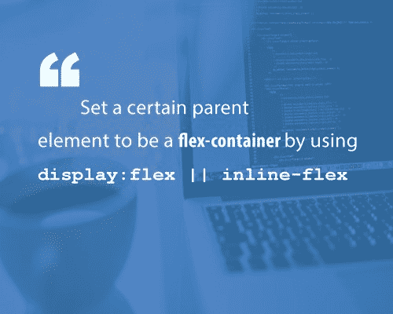

使用一个无序列表和一堆列表元素，下面是启动 Flexbox 格式化上下文的样子。

```
/*Make parent element a flex container*/ul {  display: flex; /*or inline-flex*/}
```

稍微设计一下列表项的样式，这样你就可以看到这里发生了什么。

```
li {  width: 100px;  height: 100px;  background-color: #8cacea;  margin: 8px;}
```

这是你应该有的:

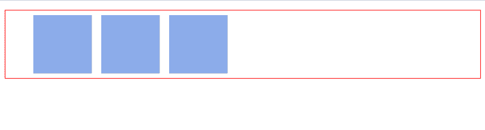

Flexbox activated

你可能没注意到，但有些事情已经发生了。Flexbox 格式化上下文现已启动。

请记住，“li”元素本质上是块元素，这意味着它们是垂直堆叠的，这适用于其他 CSS 块元素，如“div”。

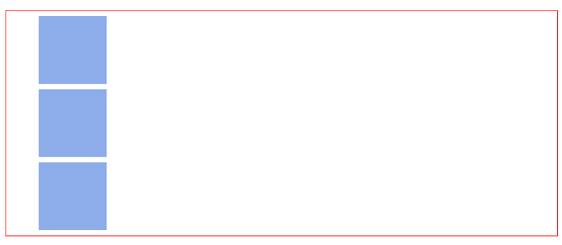

Default viewing for ‘divs’

上图是你可能希望的结果。

然而，通过包含这个简单的一行程序`display:flex`，您可以立即看到布局上的变化。

列表元素现在从左到右水平堆叠。就像你使用 *float 时一样。*


Flexbox enabled

只要您在任何父元素上引入“*flex display”*，Flexbox 模型就会开始工作。

您可能不理解为什么列表元素的方向会发生变化。我保证我会很快深入了解它的内部工作原理。目前，盲目的信任就足够了。

理解包含“*柔性显示器”*是从 Flexbox 模型开始的。

还有一件事我需要提醒你注意。

一旦将 display 属性设置为 flex，无序列表就会自动变成 *flex 容器*，子元素(在本例中是列表元素`li`)变成 *flex 项目*。

当我向您介绍 Flexbox 模型中一些更有趣的东西时，这些术语会反复出现。

我用了两个关键词，我想强调一下。它们对于理解未来至关重要。

1.  **Flex 容器**:你设置`display: flex`的父元素。
2.  **Flex items**:Flex 容器内的子元素。

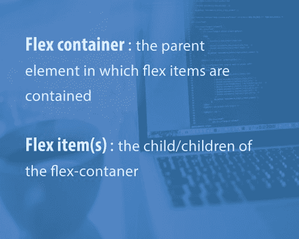

这是使用 Flexbox 模型的基础。

### Flex 容器属性

`Flex-direction || Flex-wrap || Flex-flow || Justify-content || Align-items || Align-content`


在上面的部分，我建立了一些基本原则。什么是 flex 容器和 flex 项目，以及如何启动 Flexbox 模型。

现在是好好利用这些的好时机。

将父元素设置为 flex 容器后，可以在 flex 容器上使用几个对齐属性。

就像您将 block 元素的 width 属性定义为`width: 200px`一样，flex 容器可以有 6 种不同的属性。

好消息是，定义这些属性不需要与您已经习惯的方法不同的方法。

### 1.弯曲方向

`Flex-direction`属性控制伸缩项沿着*主轴*放置的方向。

它可以取四个值中的任何一个。

```
/*where ul represents a flex container*/ul {  flex-direction: row || column || row-reverse || column-reverse;  }
```

通俗地说，`flex-direction`属性让您决定如何布局 flex 项目。*水平*、*垂直*或*反向*两个方向。

技术上来说，*横向*、*纵向*并不是*、【flex 世界】*中所称的方向。

这些被描述为**主轴**和**横轴。**默认显示如下。

再通俗地说，主轴的默认方向感觉像是水平的。“从左到右。

横轴感觉像“*垂直。*“从上到下。

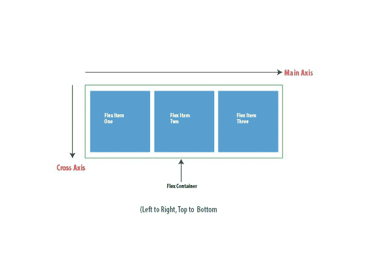

默认情况下，`flex-direction`属性被设置为`row`,它沿着主轴线对齐伸缩项。这解释了本文开始时无序列表的情况。

尽管没有显式设置`flex-direction`属性，但它采用了默认值`row.`

然后将柔性物品横放在主轴上，从左到右水平堆叠。

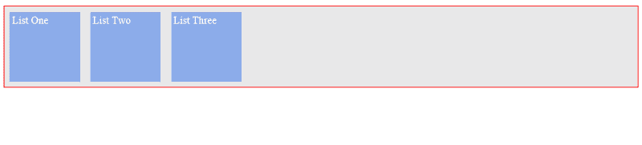

flex-items stacked across the main-axis

如果`flex-direction` 属性被更改为`column,`，伸缩项将沿横轴对齐。

它们将从上到下堆叠，不再是从左到右。

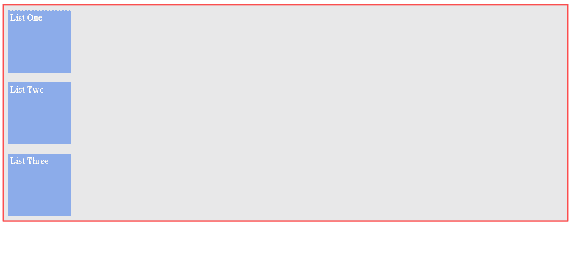

flex-items stacked across the cross-axis

### 2.柔性包装

flex-wrap 属性可以采用三个值中的任何一个:

```
//where ul represents a flex containerul {  flex-wrap: wrap || nowrap || wrap-reverse;  }
```

我将通过一个例子向您解释`flex-wrap`属性是如何工作的。

尝试将更多的列表项粘贴到无序列表中。

你怎么想呢?flex 容器会调整大小来容纳更多内容吗，或者它会把列表项分成另一行吗？

```
/*adding 3 more li elements*/<ul> <!--parent element-->  <li></li> <!--first child element-->  <li></li> <!--second child element-->  <li></li> <!--third child element-->  <li></li>  <li></li>  <li></li></ul>
```

幸运的是，flex 容器可以适应新的 flex 项目

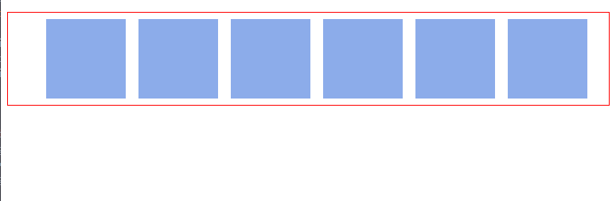

3 more flex-items added to the unordered list

再走远一点。

向父元素添加大量的弹性项。一共 10 件。

会发生什么？

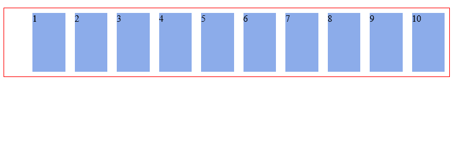

After adding even more list-items

同样，flex 容器可以适应所有的孩子，即使浏览器需要水平滚动。

这是每个 flex 容器的默认行为。flex 容器将在一行中容纳更多的 flex 项目。

这是因为`flex-wrap`属性默认为`nowrap`。这将导致 flex 容器无法换行。

```
ul {    flex-wrap: nowrap;     /*Keep on taking more flex items without breaking (wrapping)*/}
```

`no-wrap`并不是一个铁一般的价值观。是可以改变的。

有了这个数量的 flex-items，您当然希望 flex-items 在 flex-container 中"*包装"*。

“Wrap”是一个有趣的说法，“当 flex-container 中的可用空间无法再容纳默认宽度的 flex-items 时，请分成多行。

这可以通过`wrap`值实现。

```
ul {    flex-wrap: wrap;}
```

有了它，flex-item 现在可以在需要时分解成多行。

在这种情况下，当一行不能再包含默认宽度的所有列表项时，它们会分成多行。甚至在调整浏览器大小时。

这是它的样子。

请注意，弹性项目现在以其默认宽度显示。没有必要将多个 flex 项目强制放在一行中。


flex-wrap initiated

还有一个值，`wrap-reverse`。

是的，你猜对了。它允许伸缩项断开为多行，但方向相反。

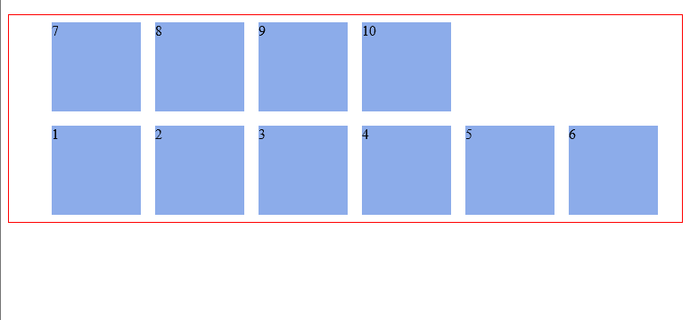

flex-items wrap in reverse

### 3.柔性流

`flex-flow`是一个简写属性，它接受`flex-direction`和`Flex-wrap`的值。

使用过`border`速记属性吗？`border: 1px solid red`。

这里是同一个概念。在一行中声明了多个值。

请参见下面的示例。

```
ul {    flex-flow: row wrap; /*direction "row" and yes, please wrap the items.*/}
```

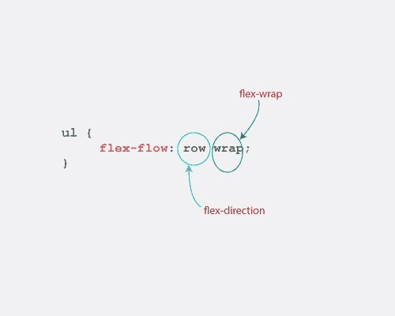

flex-flow broken down in bits

尝试其他可能的组合。`flex-flow: row nowrap`、`flex-flow: column wrap`、`flex-flow: column nowrap`

产生的结果与您看到的`flex-direction`和`flex-wrap`值没有什么不同。

我相信你明白这会产生什么后果。

给他们一个机会。

### 4.调整内容

有了 Flexbox 模型，生活真的很美好。如果你仍然怀疑这一点，`justify-content`属性可能会说服你。

`justify-content`属性采用以下 5 个值中的任何一个。

```
ul {    justify-content: flex-start || flex-end || center || space-between || space-around}
```

而`justify content`属性到底带来了什么呢？

嗯，它可能会让您想起文本对齐属性。

justify content 属性定义伸缩项如何在*主轴*上布局。

一个简单的例子。

考虑下面这个简单的无序列表。

```
<ul>  <li>1</li>  <li>2</li>  <li>3</li></ul>
```

添加一些基本的造型。

```
ul {    border: 1px solid red;    padding: 0;    list-style: none;    background-color: #e8e8e9;  }
```

```
li {      background-color: #8cacea;      width: 100px;      height: 100px;      margin: 8px;      padding: 4px;  }
```

你应该有这个:

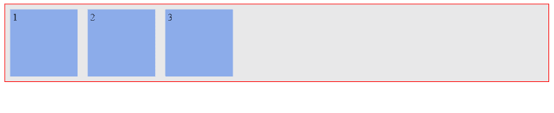

default view after “initiating” flexbox

使用`justify-content property`，三个伸缩项可以按照您想要的任何方式在主轴上对齐。

这是对可能性的分析。

#### ㈠灵活启动

默认值为`flex-start`。

`flex-start`将所有伸缩项目分组到主轴的**起点**。

```
ul {    justify-content: flex-start;  }
```

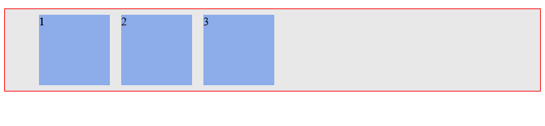

justify-content: flex-start (default behavior)

#### (二)挠性端

`flex-end`将伸缩项分组到主轴的**端**。

```
ul {    justify-content: flex-end;  }
```

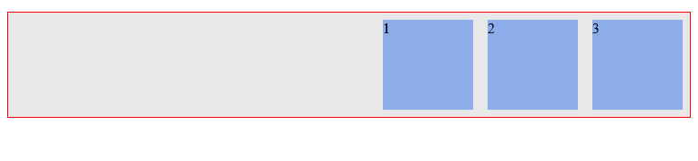

justify-content: flex-end

#### ㈢中心

`Center`正如您所料:它将伸缩项沿主轴居中。

```
ul {    justify-content: center;  }
```

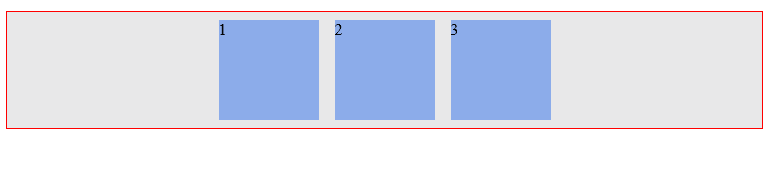

justify-content: center

#### ㈣空间

`Space-between`在每个伸缩项之间保持相同的间距。

```
ul {    justify-content: space-between;  }
```

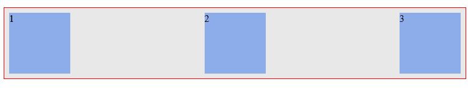

justify-content: space-between

嗯，你注意到这里有什么不同吗？

看看下面的描述图。

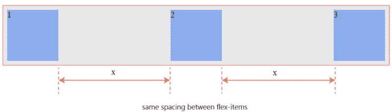

#### ㈤空间环绕

最后，`space-around`在伸缩项周围保持相同的间距。

```
ul {    justify-content: space-around;  }
```

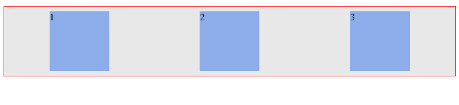

justify-content: space-around

再看一眼也无妨。

请参见下面的描述性图片。

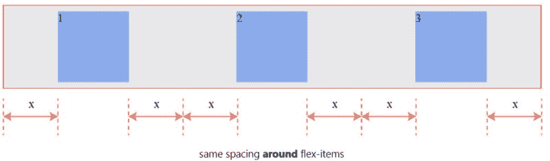

如果这些看起来太难掌握，不要担心。经过一点练习，你会对这个语法非常熟悉。

请务必了解它们如何影响沿主轴的伸缩项目的显示。

### 5.对齐-项目

`align-items`属性有点类似于`justify-content`属性。

理解了`justify-content`属性，这应该更容易理解。

`Align-items`可以设置为以下任意值:`flex-start || flex-end || center || stretch || baseline`

```
/*ul represents any flex container*/ul {    align-items: flex-start || flex-end || center || stretch || baseline}
```

它定义了如何在**横轴**上布置柔性项目。这就是`align-items`属性和`justify-content`的区别。

下面是不同的值如何影响弹性项目。

不要忘记这些属性所影响的方向。横轴。

#### ㈠拉伸

默认值为`stretch.`这将会"*拉伸"*伸缩项，使它们填满伸缩容器的整个高度。

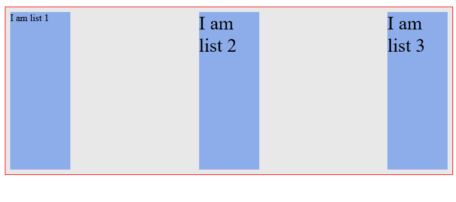

align-items: stretch

#### **(ii)灵活启动**

`flex-start`做你期望的事情。它将伸缩项分组到横轴的起点。

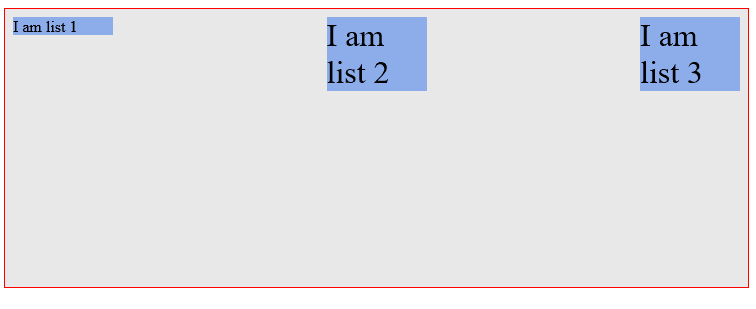

align-items: flex-start

#### **(iii)挠性端**

正如所料，`flex-end`将伸缩项分组到横轴的末端。

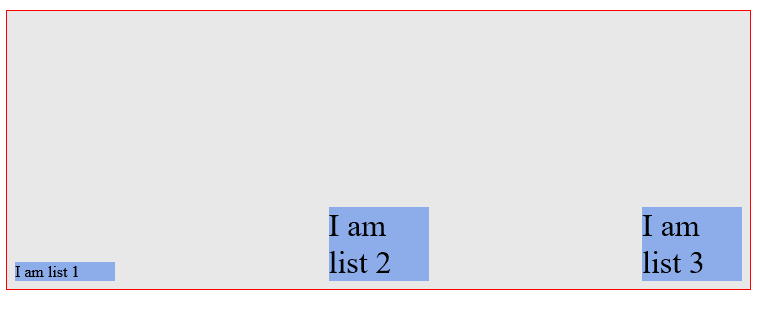

align-items: flex-end

#### **(四)中心**

`center`值同样是可预测的。它将 flex 项与 flex 容器的中心对齐。

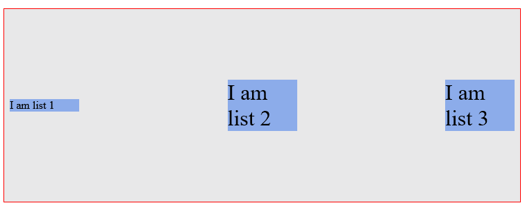

align-items: center

#### **(v)基线**

基线值呢？

它将弹性项目沿着它们的*基线*对齐。

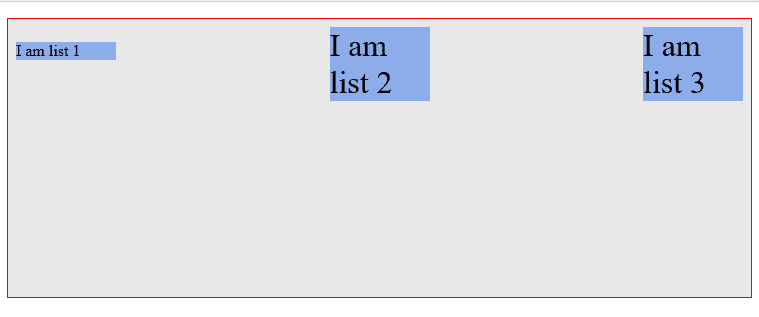

align-items: baseline

“*基线*”听起来确实很花哨。

结果看起来就像`flex-start`一样，但有细微的不同。

“基线”到底是什么？

下图应该会有所帮助。

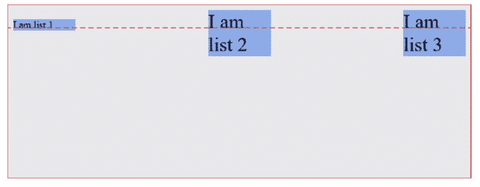

注意所有的 flex-item 是如何对齐的，以使它们的内容位于“基线”上？

### 6.对齐内容

在讨论`wrap` 属性时，您还记得当您向 flex-container 添加更多 flex-item 时发生了什么吗？

你得到了一个*多行*柔性容器。

`align-content`属性用于*多行*柔性容器。

除了`baseline`之外，它采用与`align-items`相同的值。

根据定义，它控制 flex 项目在多行 flex 容器中的对齐方式。

和`align-items`一样，默认值也是`stretch`

这些是你现在应该熟悉的价值观。因此，下面是它们如何影响一个有 10 个灵活项目的*多行*灵活容器。

#### **(一)拉伸**

使用`stretch`，伸缩项被“拉伸”以适应横轴上的可用空间。

您在下面的 flex 项目之间看到的间距是由项目上设置的`margin`决定的。

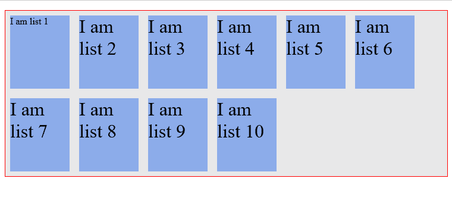

#### **(ii)灵活启动**

你以前见过`flex-start`值。

这一次，它将*多行*容器中的物品对准十字轴的**起点**。

记住默认的横轴是从上到下的。

因此，flex 项目与 flex 容器的顶部对齐。

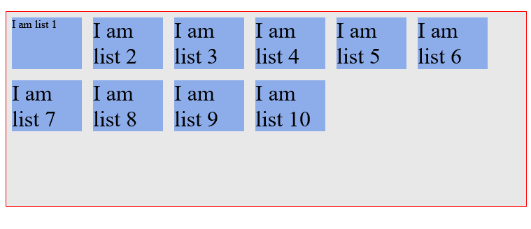

#### **(iii)挠性端**

`flex-end`值将伸缩项与横轴末端对齐。

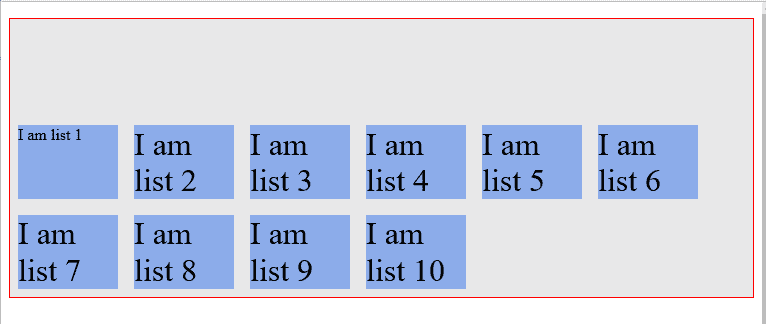

#### **(四)中心**

正如您可能已经猜到的那样，`center`将伸缩项与横轴的**中心**对齐。

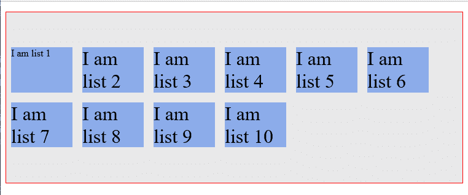

这是 flex 容器的最后一个属性。

您现在了解了如何使用各种 flex 容器属性。

您将使用这些来完成接下来的实践部分。

### 弹性项目属性

`Order || Flex-grow || Flex-shrink || Flex-basis`


在上一节中，我解释了 flex 容器及其对齐属性。

的确很美。

你肯定对未来有所预感。

现在，我将不再关注 flex-containers，而是向您介绍 flex-items 及其对齐属性。

像 flex-containers 一样，所有 flex-item 也提供了一些对齐属性。

让我带你浏览一下。

### 1.命令

order 属性允许对容器中的 flex 项目进行重新排序。

基本上，通过 order 属性，您可以将 flex-item 从一个位置移动到另一个位置。就像你处理“可排序”列表一样。

这是在不影响源代码的情况下完成的。这意味着 HTML 源代码中 flex 项的位置不会改变。

order 属性的默认值为 0。它可能呈现负值，也可能呈现正值。

值得注意的是，flex 项目是根据 order 属性的数值重新排序的。从最低到最高。

举个例子总是有用的。考虑下面的无序列表:

```
<ul>    <li>1</li>    <li>2</li>    <li>3</li>    <li>4</li>                          </ul>
```

默认情况下，所有弹性项目的`order`值都为`0`。

正如你所料，在一些基本的造型后，你得到了这个(见下文)。

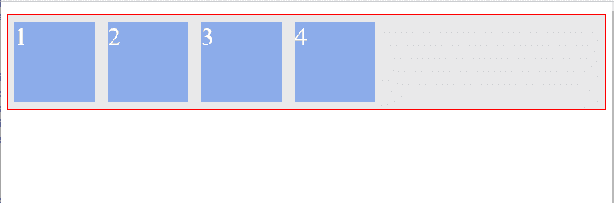

Default viewing

弹性项目的显示与 HTML 源代码顺序中指定的一样。伸缩项目 1，然后是 2、3 和 4。

如果出于某种原因，您希望 flex-item 1 最后出现，该怎么办？而不改变 HTML 文档中的源顺序？

“*不改变源顺序*”意味着您不能这样做:

```
<ul>    <li>2</li>    <li>3</li>    <li>4</li>    <li>1</li>                      </ul>
```

这就是`order`属性的用武之地。

你需要做的就是让 flex-item 1 的`order`值高于其他列表项的值。

如果您曾经在 block 元素上使用过`z-index`属性，您应该对这类事情很熟悉。

```
/*select first li element within the ul */    li:nth-child(1) {        order: 1; /*give it a value higher than 0*/    }
```

然后，弹性项目从低到高重新排序。

不要忘记，默认情况下，列表项 2、3 和 4 的顺序值都是 0。

现在，弹性物料 1 的订单值为 1。

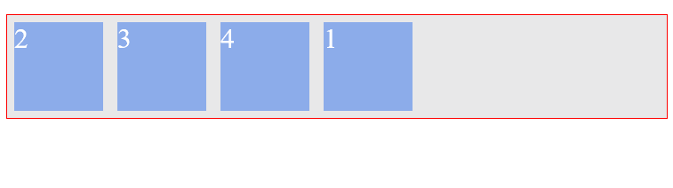

New look after changing the order value for 1

弹性物料 2、3 和 4 的订单值均为 0。因此，HTML 源代码的顺序保持不变——默认显示不变。

如果您给弹性物料 2 的订单值为 2 会怎么样？

是的，你猜对了。它也会在堆栈中向上移动。它现在表示具有最高`order`值的弹性项。

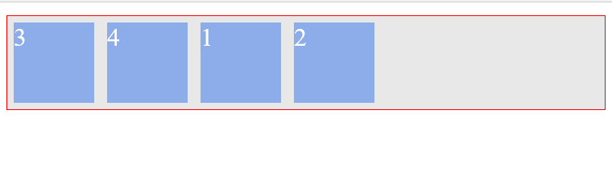

Flex-item 2 now has an higher order value

当两个 flex 项目具有相同的订单值时会发生什么？

在下面的例子中，弹性项目 1 和 3 被赋予相同的`order`值

```
li:nth-child(1) {        order: 1;    }
```

```
li:nth-child(3) {        order: 1;    }
```

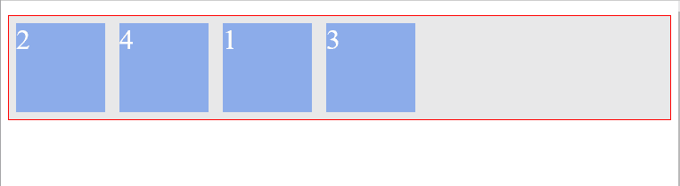

Flex-item 1 and 3 with the same order value

这些项目仍然按照从最低到最高的顺序值排列。

这一次，flex-item 3 出现在最后，因为它在源文件(HTML 文档)中位于 flex-item 1 之后。

当两个或多个 flex 项目具有相同的顺序值时，重新排序基于源文件中的位置。

解释得太多了。

我会搬到其他地方。

### 2.伸缩增长和伸缩收缩

flex 项目的优点是“灵活”

属性`flex-grow`和`flex-shrink`允许我们更多地利用这种*灵活性*。

`flex-grow`和`flex-shrink`属性控制如果有多余的空格，flex-item 应该“增长”(扩展)多少，或者如果没有多余的空格，应该“收缩”多少。

它们可以取从 0 到任何正数的任何值。`0 || positive number`

让我来解释一下。

考虑下面这个简单的无序列表。它只包含一个列表项。

```
<ul>    <li>I am a simple list</li></ul>
```

```
ul {    display: flex;}
```

再多一点造型，看起来就像这样。

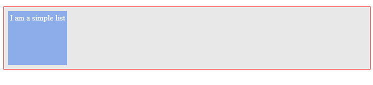

Simple flex-item

默认情况下，`flex-grow`属性被设置为`0`。这意味着，flex-item 不会增长到适合整个可用空间。

值`0`就像一个“关闭”开关。`flex-grow`开关关闭。

但是，如果您将`flex-grow`值更改为`1`，会发生以下情况。

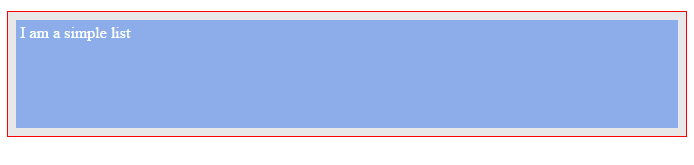

The flex-item grows to fill the available space

flex-item 现在"*增长"*以占据所有可用空间。开关打开了！

如果您尝试调整浏览器的大小，flex-item 也会“收缩”以适应新的屏幕宽度。

为什么？默认情况下，`shrink`属性被设置为 1。这意味着`flex-shrink`开关也被打开！

我稍后将仔细查看一下`flex-grow`和`flex-shrink`属性，以防您对自己的理解仍然不自信。

### 3.弹性基础

还记得我说过弹性物品的优点是“灵活”吗？好吧，看来你也能控制它。

属性指定了一个伸缩项的初始大小。在`flex-grow`或`flex-shrink`属性调整其大小以适应容器之前。

前面的陈述非常重要，所以我要花点时间来强调一下。

默认值为`flex-basis: auto`。`Flex-basis`可以采用您在 normal width 属性中使用的任何值。即`percentages || ems || rems || pixels`等

请注意，当尝试将 basis 属性设置为基于零的值时，也要使用 unit。使用`flex-basis: 0px` 而不仅仅是 `flex-basis: 0`

我会在这里再次带回“一个列表”的例子。

```
<ul>    <li>I am a simple list</li></ul>
```

```
ul {    display: flex}
```

```
li {    padding: 4px; /*some breathing space*/}
```

默认情况下，伸缩项的初始宽度受默认值`flex-basis: auto`的影响。

flex-item 的宽度是根据内容大小自动计算出来的(当然，还要加上你设置的填充)。

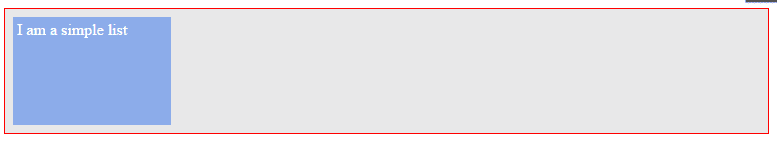

default viewing

这意味着如果您增加了 flex-item 中的内容，它会自动调整大小以适应。

```
<ul>    <li>I am a simple list AND I am a simple list</li></ul>
```


width is automatically computed

但是，如果您想将伸缩项设置为固定宽度，也可以这样做:

```
li {    flex-basis: 150px;}
```

现在，伸缩项的宽度被限制为 150 像素。

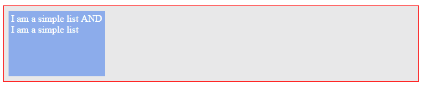

flex-item with a constrained width

越来越有意思了。

### 4.flex 速记

`flex`简写允许你一次设置`flex-grow`、`flex-shrink`和`flex-basis`属性。

在适当的时候，我建议您使用 flex 速记一次设置所有三个属性，而不是单独设置。

```
li {  flex: 0 1 auto;}
```

上面的代码相当于设置了三个属性:`flex-grow: 0; flex-shrink: 1; flex-basis: auto`

请注意顺序。

首先是`Flex-grow`，然后是`flex-shrink`，然后是`flex-basis`。缩写， **GSB** 可能会有帮助。

如果您未能设置 flex-速记中的一个值，会发生什么情况？

如果只设置`flex-grow`和`flex-shrink`的值，`flex-basis`将默认为零。

这被称为绝对弯曲。当你只设置`flex-basis`时，你会得到一个*相对伸缩*。

```
/*this is an absolute flex item*/li {  flex: 1 1; /*flex-basis defaults to 0*/}
```

```
/*this is a relative flex item*/li {  flex-basis: 200px; /*only flex-basis is set*/}
```

我知道你在想什么。*相对*和*绝对*伸缩的目的是什么？

我将在本文后面回答这个问题。再说一次，盲目的信任就足够了。

让我们来看看一些非常有用的 flex 速记值。

#### `1\. flex: 0 1 auto`

```
/*again, the "li" represents any flex-item*/li {  flex: 0 1 auto;}
```

这与编写`flex: default`相同，是所有 flex 项目的默认行为。

让我来解释一下，就一点点。

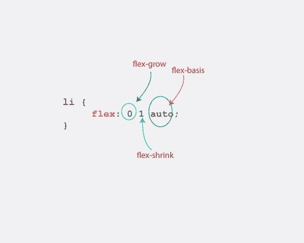

通过先看一下`flex-basis`属性，更容易理解这一点。

`flex-basis`被设置为`auto`，这意味着 flex-item 的初始宽度将根据内容的大小自动*确定。*

*明白了吗？*

*移动到下一个属性，`flex-grow`值为零。这意味着`flex-grow`属性不会改变 flex 项的初始宽度。*

*增长开关关闭。*

*因为 flex-grow 控制 flex-items 的"*增长*"并且它被设置为零，所以 flex-items 不会"增长"到适合屏幕。*

*最后，伸缩收缩值为 1。它是这样说的— *“必要时收缩弹性项目”**

*这是应用于一些 flex 项目时的样子。*

*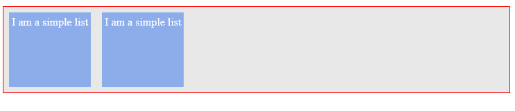

`flex: 0 1 auto`* 

*请注意伸缩项不会增长。宽度是自动计算的，如果需要，它们会在调整浏览器大小时收缩。*

#### *2.`Flex: 0 0 auto`*

```
*`/*again, the "li" represents any list-item*/`*
```

```
*`li {  flex: 0 0 auto;}`*
```

*这个和`flex: none`一样。*

*使用我之前建立的相同框架，宽度被自动计算，但是伸缩项不会增长或收缩(它们都被设置为零)。*

*放大和缩小开关都关闭了。*

*它本质上是一个固定宽度的元素，其初始宽度基于 flex 项目中的内容大小。*

*查看这个弹性简写如何影响两个弹性项目。一个比另一个容纳更多的内容。*

*

`Flex: 0 0 auto`* 

*您应该注意的第一件事是，flex 项都有不同的宽度。*

*这是意料之中的，因为宽度是根据内容大小自动计算的。*

*尝试调整浏览器的大小，您会注意到 flex 项目不会随着其宽度而收缩。它们从父元素中弹出，您必须水平滚动浏览器才能查看所有内容。*

*别担心，稍后我会告诉你如何处理这种奇怪的行为。*

*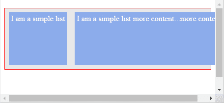

On resizing browser, flex-items do NOT shrink. Instead, they pop out of the flex-container.* 

#### *3.`Flex: 1 1 auto`*

*这个和`flex: auto`一样。*

*使用我之前建立的框架。*

*这表示，*“自动计算初始宽度，但增长以适应整个可用空间，并在必要时收缩”**

*打开“增长”和“收缩”开关，自动计算宽度。*

*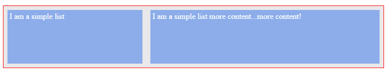

`Flex: 1 1 auto`* 

*这一次，这些条目填满了可用空间，并且在调整浏览器大小时也会收缩。*

#### *4.`Flex: "positive number"`*

*其中“*正数*代表任何正数(不带引号)*

*这个和`flex: “positive number” 1 0`一样。*

*`flex: 2 1 0`同写`flex:2` 2 代表任意正数。*

```
*`/*again, the "li" represents any list-item*/li {  flex: 2 1 0; /*same as flex: 2*/}`*
```

*按照我之前建立的相同框架，这表示，"*将 flex 项的初始宽度设置为零(ehm，no width？)，增大项目以填充可用空间，最后尽可能缩小项目"**

*对于有*没有宽度*的 flex 项目，宽度是如何计算的？*

*`flex-grow`值接管，并决定伸缩项“*加宽*的程度。*

*这解决了*无宽度*的问题。*

*当有多个 flex 项目的初始宽度`flex-basis`被设置为任何基于零的值(例如 0px)时，使用这种 flex 简写更实用*

*实际情况是，伸缩项的宽度是根据`flex-grow`值的比率计算的。*

*我会稍微分解一下。*

*考虑下面标记和样式的两个列表项。*

```
*`<ul>    <li>I am One</li>    <li>I am Two</li></ul>`*
```

```
*`ul {    display: flex;}`*
```

```
*`/*first flex-item*/li:nth-child(1) {    flex: 2 1 0; /*same as just writing flex: 2*/}`*
```

```
*`/*second flex-item*/li:nth-child(2){    flex: 1 1 0;    background-color: #8cacea;}`*
```

*请记住，设置`flex-grow : 1`会让 flex-item 填满可用空间。增长开关打开。*

*这里有两个弹性项目。一个有`1`的`flex-grow`属性，另一个有`2`，那么会发生什么呢？*

*您打开了两个项目的增长开关。然而，增长的幅度不同。1 和 2。*

*它们都膨胀以填满可用的空间，但是以一定的比例。*

*它是这样工作的。*

*后者占可用空间的 2/3，而前者占 1/3。*

*你知道我是怎么得出这个结论的吗？*

*基础数学比。我希望你没有翘掉那些数学课。*

*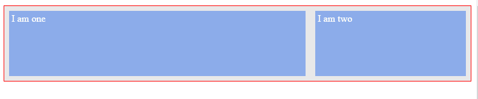

flex items sharing up space* 

*你看到发生了什么吗？*

*尽管两个 flex-item 的内容大小相同(大约)，但是它们占用不同的空间。*

*宽度不是基于内容大小，而是基于增长值。*

*一个大约是另一个的两倍。*

### *5.自我对齐*

*属性进一步给了我们对 flex 项目如此多的控制。*

*您已经看到了`align-items`属性如何帮助在一个 flex 容器中统一对齐所有 flex 项目。*

*如果您想改变一个**单个**伸缩项沿横轴的位置，而不影响相邻的伸缩项，该怎么办？*

*这就是`align-self`房产来拯救的地方。*

*它可以采用以下任何值:`auto || flex-start || flex-end || center || baseline || stretch`*

```
*`/*target first list item*/li:first-of-type {    align-self: auto || flex-start || flex-end || center || baseline || stretch}`*
```

*这些是您已经熟悉的值，但是作为复习，这里是它们如何影响特定的目标项目。*

*在本例中，是容器中的第一项。*

*目标弹性项目显示为红色。*

#### *1.挠性端*

*`flex-end`将目标项目对齐横轴末端。*

*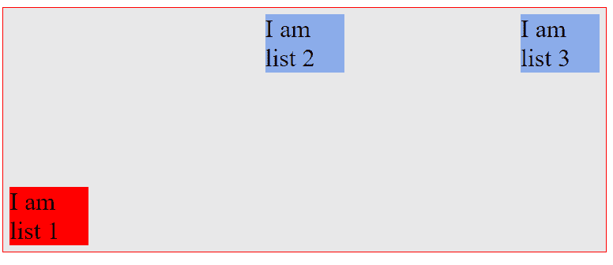

targeted flex item at the end of the cross axis* 

#### *`2\. Center`*

*`center`将目标项目对齐横轴的中心。*

*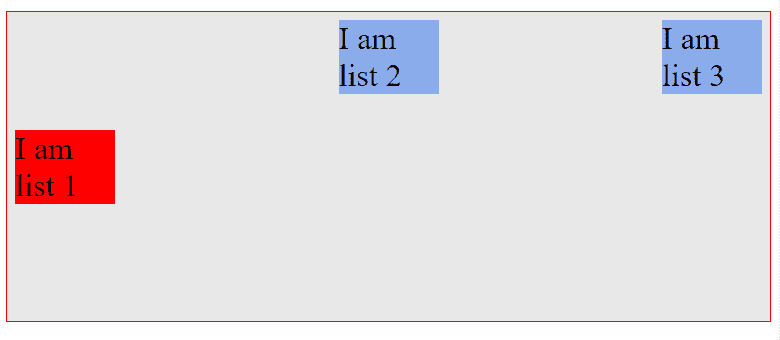

targeted flex item at the center of the cross axis* 

#### *`3\. Stretch`*

*`stretch`“拉伸”目标伸缩项以填充横轴上的可用空间。*

*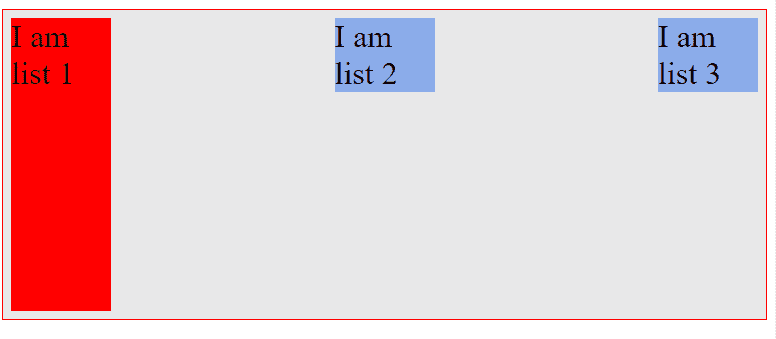

targeted flex item stretched along the cross axis* 

#### *`4\. Baseline`*

*`baseline`沿基线对齐目标柔性项目。*

*它看起来确实和`flex-start`的结果一样，但是我相信你明白基线是什么。*

*我早就解释过了。*

*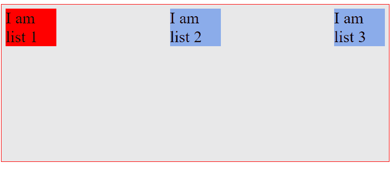

targeted flex item aligned along the baseline* 

#### *`5\. auto`*

*`auto`将目标 flex 项的值设置为父元素的`align-items`值，如果元素没有父元素，则设置为`stretch`。*

*在下面的例子中，flex-container 的`align-items`值为`flex-start`*

*这将所有伸缩项与横轴的起点对齐。*

*目标 flex-item 现在继承了`flex-start`值——父项的`align-items`值。*

*

targeted flex item aligned along the start of the cross-axis* 

*这是上面使用的弹性项目的基本样式。只是为了让你更好地理解发生了什么。*

```
*`ul {    display: flex;    border: 1px solid red;    padding: 0;    list-style: none;    justify-content: space-between;    align-items: flex-start; /*affects all flex-items*/    min-height: 50%;    background-color: #e8e8e9;}`*
```

```
*`li {  width: 100px;  background-color: #8cacea;  margin: 8px;  font-size: 2rem;}`*
```

*现在，您已经为有趣的部分做好了准备:-)。*

### *绝对和相对弹性项目。*

**

*在前面的章节中已经介绍了一些基础知识，在这里澄清一些重要的概念也是很重要的。*

*绝对弹性项目和相对弹性项目之间的真正区别是什么？*

*这两者之间的主要区别在于间距和它们的计算方式。*

*相对伸缩项内的间距是根据其内容大小计算的。在绝对弹性项目中，它仅基于“弹性”，而不是内容。*

*考虑下面的标记。*

```
*`<ul>    <li>        This is just some random text  to buttress the point being explained.    Some more random text to buttress the point being explained.    </li>`*
```

```
 *`<li>This is just a shorter random text.</li></ul>`*
```

*两个列表元素。一个比另一个有更多的文本。*

*增加一点造型。*

```
*`ul {    display: flex; /*flexbox activated*/}`*
```

```
*`li {    flex: auto; /*remember this is same as flex: 1 1 auto;*/    border: 2px solid red;    margin: 2em;}`*
```

*结果如下:*

*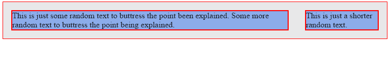*

*如果你已经忘记了，`flex: 1 1 auto`与设置:`flex-grow: 1` `flex-shrink: 1`和`flex-basis: auto`相同*

*使用我之前建立的框架，flex-items 的初始宽度被自动计算`flex-basis: auto`，然后它们*增长*以适应可用空间`flex-grow: 1`。*

*当伸缩项的宽度被自动计算时，`flex-basis: auto`，它是基于伸缩项中包含的内容的大小。*

*上例中的弹性项目没有相同大小的内容。因此，伸缩项的大小将是不相等的。*

*因为单个的宽度在一开始就不相等(这是基于内容的)，所以当项目增长时，宽度也保持不相等。*

**

*上例中的弹性项是相对于的*弹性项。**

*让我们将伸缩项绝对化——这意味着这次它们的宽度应该基于“伸缩”而不是内容大小。*

*一句"*"*妙语连珠。*

```
*`li {    flex: 1 ; /*same as flex: 1 1 0*/}`*
```

*请看下面的结果。*

**

*这次你看到两个 flex 项目有相同的宽度了吗？*

*flex 项的初始宽度为零`flex-basis: 0`，然后它们会*增长*以适应可用空间。*

*当有两个或多个基于零的`flex-basis`值的伸缩项时，它们共享基于`flex-grow` 值的可用间距。*

*我之前讲过这个。*

*现在，宽度不是基于内容大小来计算的。宽度基于指定的弹性值。*

*所以你明白了。对吗？*

*绝对伸缩项的宽度仅基于伸缩，而相对伸缩项的宽度基于内容大小。*

### *自动边距对齐*

**

#### *当心弹性物品上的`margin: auto`对齐。*

*当您在 flex-item 上使用`margin: auto`时，事情看起来会很奇怪。*

*你确实需要明白发生了什么。这可能会导致意想不到的结果，但我会解释这一切。*

*当您在 flex-item 上使用`margin: auto`时，值为`auto`的方向(左、右或两者)将占用任何可用的空白空间。*

*那是一个很难抓住的。*

*我的意思是。*

*考虑下面标记和样式的导航栏:*

```
*`<ul>    <li>Branding</li>    <li>Home</li>    <li>Services</li>    <li>About</li>    <li>Contact</li></ul>`*
```

```
*`ul {    display: flex;}li {    flex: 0 0 auto;}`*
```

*请看下面的结果。*

*

Simple navigation bar* 

*这里有几点需要注意:*

1.  *`flex-grow`值被设置为零。这解释了为什么列表项不会增长*
2.  *伸缩项与主轴的起点对齐(默认行为)*
3.  *由于这些项目与主轴的起点对齐，右侧会留下一些额外的空间。你看到了吗？*

**

*现在在第一个列表项(品牌)上使用`margin: auto`，看看会发生什么。*

```
*`li:nth-child(1) {    margin-right: auto; /*applied only to the right*/}`*
```

*

margin:auto applied to ‘branding’* 

*刚刚发生了什么？*

*存在的额外空间现在被分配到第一个弹性项的右侧。*

**

*你还记得我之前说过的话吗？*

*当您在 flex-item 上使用`margin:auto`时，值为`auto`的方向(左、右或两者)将占用任何可用的空白空间。*

*如果您希望在 flex-item 的两侧自动对齐边距，该怎么办？*

```
*`/*you may use the margin shorthand to set both sides if you wish*/li:nth-child(1) {    margin-left: auto;    margin-right: auto}`*
```

*

margin:auto applied on both sides of the “branding”* 

*现在，空间分布在弹性项目的两侧。*

*那么，这种很酷的自动边距对齐方式有什么好处吗？*

*似乎有一个。如果你不注意的话，它会成为你沮丧的来源。*

*当您在 flex-item 上使用自动边距对齐时，`justify-content`属性不再起作用。*

*例如，通过`justify-content`属性在上面的 flex-container 上设置不同的对齐选项，对布局没有影响。*

```
*`ul {    justify-content: flex-end;}`*
```

*

justify-content has no impact* 

### *实际使用案例*

*导航系统是每个网站或应用程序的重要组成部分。地球上的每个网站都有某种导航系统。*

*看看这些受欢迎的网站，以及它们是如何使用导航系统的。*

*您是否看到 Flexbox 如何帮助您更高效地构建这些布局？*

*仔细看看自动边距特性在哪里也非常有用。*

#### *㈠引导导航*

**

#### *AirBnB 桌面导航*

**

#### *㈢推特桌面导航*

**

*我建议你实际上把写代码作为一种练习。我在这里写了一个实用的指南:[用 Flexbox 创建的最流行的导航栏](https://medium.com/flexbox-and-grids/the-most-popular-navigation-bars-created-with-flexbox-6c0f59f55686)*

*去看看。*

*我会等的。*

### *当您切换伸缩方向时会发生什么？*

*公平的警告:有一些奇怪的东西在路上。*

**

*当开始学习 Flexbox 模型时，这部分是最令人困惑的。*

*我敢打赌，很多新加入" *flex world"* 的人也会有这种感觉。*

*你还记得我说过默认的主轴和横轴是“从左到右”和“从上到下”的方向吗？*

*你也可以改变这一点。*

*这正是在前面章节中描述的使用`flex-direction: column`时发生的情况。*

*当您使用`flex-direction: column`时，主轴和横轴的变化如下图所示。*

*

default main and cross axis* *

New main and cross axis* 

*如果你曾经用英语写过任何文字，那么你已经知道英语是从左到右、从上到下写的。*

*这也是 Flexbox 默认主轴和横轴的方向。*

*但是，在将伸缩方向切换到`column`时，它不再遵循*英语*模式，而是日语！*

*哦，是的，日本人。*

*如果你曾经用日语写过任何文本，那么这应该是很熟悉的。(声明一下，我从来没有用日语写过任何文字。)*

*日本的文字传统上是从上到下写的！没那么奇怪吧。*

*这就解释了为什么这对英国作家来说会有点困惑。*

*

New main and cross axis* 

*看一下这个例子。带有 3 个列表项的标准无序列表，只是这次我将改变 flex-direction。*

```
*`<ul>        <li></li>        <li></li>        <li></li>    </ul>`*
```

```
*`ul {    display: flex;    flex-direction: column;}`*
```

*这是方向改变前的样子:*

**

*之后:*

**

*发生了什么事？*

*“文本”现在是以日本风格书写的——从上到下(主轴)。*

*我想指出一些你可能会觉得好笑的事情。*

*你看到物品的宽度填满了空间，对吗？*

*如果您想在此之前更改它，您只需处理`flex-basis`和(or) `flex-grow`属性。*

*让我们看看这些如何影响我们的新布局。*

```
*`li {    flex-basis: 100px;}`*
```

*…以下是您将得到的结果。*

**

*哇——什么？高度受影响，宽度不受影响？*

*如前所述，flex-basis 属性定义了每个 flex-item 的初始宽度。*

*我错了——或者更确切地说，我是在用英语思考。让我们暂时换成日语。*

*不一定非要“宽”。*

*切换伸缩方向时，请注意影响主轴的每个属性现在都会影响新的主轴。*

*类似于`flex-basis`的属性影响了伸缩项沿主轴的宽度，现在影响的是高度而不是宽度。*

*方向被调换了！*

*所以即使你使用了`flex-grow`属性，它也会影响高度。*

*本质上，在水平轴(当时的主轴)上运行的每个 flex 属性现在都在垂直方向上运行，即新的主轴。*

*这只是方向的转换。*

*这里还有一个例子。我保证在这之后你会有更好的理解。*

*缩小我们刚才看到的弹性物品的宽度，它们不再占据整个空间:*

```
*`li {    width: 200px;}`*
```

**

*如果您想将列表项移动到屏幕中央，该怎么办？*

*在英语中，这就是你到目前为止处理 flex 容器的方式。这意味着“*将伸缩项移动到主轴*的中心”。*

*所以，你应该用`justify-content: center`*

*但是现在这样做是行不通的。*

*因为方向变了，所以中心沿着横轴，而不是主轴。*

*再看一看:*

*

New main and cross axis* 

*所以请从*日文*的角度思考。*

*主轴是从上到下的，你不需要那样。*

*横轴是从左到右。听起来像是你需要的。*

*您需要*“将伸缩项移动到横轴的中心。”**

*这里有什么 flex-container 属性让你想起来了吗？*

*是的，`align-items`地产。*

*`align-items`属性处理横轴上的对齐。*

*所以要把它们移到中间，你应该这样做:*

```
*`ul {    align-items: center;}`*
```

*瞧啊。您已经将弹性项目置于中心位置。*

*

flex-items centered in the new direction* 

*我知道这可能会有点混乱。如果需要的话，再检查一遍。*

*在研究 Flexbox 模型时，我注意到许多 CSS 书籍跳过了这一部分。*

*稍微思考一下日语 *文本*会大有帮助。*

*值得理解的是，所有 Flexbox 属性都是基于现有的`flex-direction`工作的。*

*我相信你又学到了新东西。我很乐意解释这个。我希望你也玩得开心:-)*

### *天哪，Flexbox 解决了这个问题？*

**

*许多设计者面临的 CSS 经典问题已经被 Flexbox 轻松解决了。*

*Philip Walton ，在他的[由 flexbox 解决的项目](https://github.com/philipwalton/solved-by-flexbox)中列出了 6 个经典问题(在撰写本文时)。*

*他广泛讨论了 CSS 以前的局限性，以及 Flexbox 提供的当前解决方案。*

*我推荐你在完成这篇文章后看一看。*

*在接下来的实践部分，我将在带您构建 Flexbox 音乐应用程序布局的过程中解释他提出的一些概念。*

### *不兼容浏览器的 Flexbugs 和陷阱*

*如果你不是那种在梦里写 CSS 的人，你可能想看看这个 github [库](https://github.com/philipwalton/flexbugs)。*

*一些比我聪明的人整理了一份 Flexbox bugs 及其解决方法的列表。*

*当事情不像我预期的那样工作时，这是我第一个要找的地方。*

*在接下来的实践部分，我将为您介绍一些突出的错误。*

*所以你被覆盖了！*

### *使用 Flexbox 构建音乐应用布局*

**

*在经历了枯燥而严谨的工作后，你应该得到一些有趣的项目。*

*是时候通过一个实际的例子来应用你新获得的 *Flexbox 技能*了。*

*我花了几天时间想出一个好项目。*

*由于缺乏创造性的选择，我为猫设计了一个音乐应用程序布局。*

*我称之为*斤音乐*。*

*也许到 2036 年，我们会在火星的某个地方让猫在摇滚乐队里唱歌:-)*

*这是完成后的布局，完全是用 Flexbox 布局的。*

**

*可以在线查看[这里](http://output.jsbin.com/wubudog/)。*

*如果你在移动设备上看，你会有一个稍微不同的外观。这是您将在本文的响应式设计部分进行的工作。*

*不过，我要坦白一件事。*

*我做了一些被很多人认为是错误的事情。*

*我已经用 Flexbox 完成了整体布局。*

*出于多种原因，这可能并不理想。但在这种情况下是故意的。我开始向您展示您可以使用 Flexbox 做的所有事情，所有这些都打包在一个项目中。*

*如果你想知道什么时候使用 Flexbox 模型被认为是对的或错的，你可以看看我的文章。*

*[**Flexbox 很牛逼但是在这里不受欢迎！**](https://medium.com/@ohansemmanuel/flexbox-is-awesome-but-its-not-welcome-here-a90601c292b6)
[*Flexbox 可以说是发生在我们大多数人身上的最好的东西(如果你写 css 的话)，但是它对所有人来说都是完美的吗…*medium.com](https://medium.com/@ohansemmanuel/flexbox-is-awesome-but-its-not-welcome-here-a90601c292b6)*

*好了，我一吐为快了。现在我确信没有人会在读完这篇文章后对我大喊大叫。*

*Catty Music 中的所有内容都使用 Flexbox 模型进行布局，这是为了展示什么是可能的。*

*所以让我们把这个东西造出来！*

*和任何合理的项目一样，一点点计划对筛选低效的项目大有帮助。*

*让我带你通过一个有计划的方法来建立斤音乐布局。*

### *你从哪里开始？*

*无论何时用 Flexbox 构建一个布局，你都应该从寻找你的布局中哪些部分可以作为 flex-container 突出出来开始。*

*然后，您可以利用 Flexbox 提供的强大对齐属性。*

### *崩溃*

*您可以将整个包含主体作为 flex 容器(包含在下图中的红色边框内)，并将布局的其他部分拆分为 flex 项目(项目 1 和 2)。*

**

*这完全有意义，因为项目 1 包含布局的每个部分，除了“*页脚”*——包含音乐控制按钮的部分。*

*您知道 flex-item 也可以做成 flex-container 吗？*

*是的，这是可能的！*

*您可以想嵌套多深就嵌套多深(尽管明智的做法是将嵌套保持在合理的水平)。*

*因此，随着新的启示而来的是…*

*项目 1(第一个弹性项目)也可以成为弹性容器。*

*侧边栏(项目 1b)和主要部分(项目 1a)将是弹性项目。*

**

*你还和我在一起，对吗？*

*像这样分解你的布局会给你一个很好的思维模型。*

*当您开始使用 Flexbox 模型构建更复杂的布局时，您会发现这是多么重要。*

*你不需要一个像上面这些花哨的图像。一个简单的草图应该可以让你开始。*

*你记得我说过你想窝多深就窝多深吗？看来你可以在这里多筑巢一次。*

*看一下上面的主要部分(1a 项)。*

*它也可以做成一个 flex 容器来容纳下面突出显示的部分。“*项 1a — A* ”和“*项 1a — B**

**

*您可能决定不将主要部分(项目 1a)作为 flex 容器，而只是在其中放置两个“div”来容纳突出显示的部分。*

*是的，这是可能的，因为“*项目 1a — A* ”和“*项目 1a — B* ”是垂直堆叠的。*

*默认情况下，“ *divs* 垂直堆叠。这就是盒子模型的工作原理。*

*如果您选择让主要部分成为 flex 容器，那么您将获得强大的对齐属性。以防你随时需要它们。*

*Flexbox 中的“ *flex* ”表示灵活。*

*默认情况下，Flex-containers 是灵活的，反应灵敏的。*

*这可能是使用 flex-container 而不是常规" *divs* "的另一个原因。这取决于案例场景。*

*当你建立猫腻音乐的时候，我会涉及一些其他的东西。你现在应该开始写一些代码了。*

#### *基本 HTML 设置*

*从下面的基本 HTML 设置开始。*

```
*`<!DOCTYPE html>  <html>  <head>  <title>Catty Music</title>  </head>  <body>`*
```

```
*`<main></main> <!--to contain the main section of the app-->`*
```

```
*`<footer></footer> <!--to contain the music control buttons and song details-->`*
```

```
*`</body></html>`*
```

*所以这种风格…*

```
*`html,  body {    height: 100%; /*setting this explicitly is important*/  }`*
```

```
*`body {    display: flex; /*flex superpowers activated! */    flex-direction: column; /*Stack the flex-items (main and footer elements) vertically NOT horizontally*/  }`*
```

*使用 Flexbox 模型的第一步是建立一个 flex 容器。*

*这正是上面的代码所做的。它将 body 元素的显示属性设置为`flex`*

*现在您有了一个 flex 容器，即 body 元素。*

*还定义了弹性物料(物料 1 和物料 2)，如之前完成的分解一样。*

*请注意，如果这个概念对你来说仍然模糊不清，你应该再看一下我在之前的初始分解中展示的图片。*

*保持端的形象在视图中，你应该得到灵活的项目工作。*

#### *让页脚粘在底部。*

*容纳音乐控件的页脚贴在页面的底部，而主要部分填满了剩余的空间。*

*你是怎么做到的？*

```
*`main {    flex: 1 0 auto; /*fill the available space*/  }`*
```

```
*`footer {    flex: 0 0 90px; /*don't grow or shrink - just stay at a height of 90px.*/  }`*
```

*请查看上面代码清单中的注释。*

*感谢`flex-grow`属性。让主要部分填满整个空间相对容易。*

*只需将`flex-grow`值设置为 1。您还应该将`flex-shrink`属性设置为零。为什么？*

*原因可能不明显，因为弯曲方向改变了。*

*在一些浏览器中，有一个允许 flex 项目缩小到其内容大小以下的错误。这是相当奇怪的行为。*

*解决这个问题的方法是将`flex-shrink`的值保持在`0`，而不是`1`的默认值，并且将`flex-basis`属性设置为`auto`。*

*就像说:*“请自动计算 flex 项的大小，但绝不收缩。”**

*使用这个简写值，您仍然可以获得 flex 项目的默认行为。*

*在调整浏览器大小时，flex 项会收缩。调整大小不是基于`shrink`属性。它基于自动重新计算弹性项目的宽度。`flex-basis: auto`*

*这将导致 flex-item 至少与其宽度或高度(如果已声明)或其默认内容大小一样大。*

*请不要忘记我分解`flex-shorthand`属性的框架。接下来会有很多速记的东西。*

*现在一切都准备好了，让我们加入一些样式来定义间距和颜色:*

```
*`body {    display: flex;    flex-direction: column;    background-color: #fff;    margin: 0;    font-family: Lato, sans-serif;    color: #222;    font-size: 0.9em;  }  footer {    flex: 0 0 90px;    padding: 10px;    color: #fff;    background-color: rgba(61, 100, 158, .9);  }`*
```

*还没有什么神奇的。*

*这是你现在应该有的:*

**

*看到事情开始成形，你会做得更好。*

#### *修复侧栏。*

*如果你正在编码，更新你的 HTML 文档。*

```
*`<main>  <aside> <!--This represents the sidebar and contained in it are icon sets from font-awesome-->    <i class="fa fa-bars"></i>    <i class="fa fa-home"></i>    <i class="fa fa-search"></i>    <i class="fa fa-volume-up"></i>    <i class="fa fa-user"></i>    <i class="fa fa-spotify"></i>    <i class="fa fa-cog"></i>    <i class="fa fa-soundcloud"></i>  </aside>`*
```

```
*`<section class="content"> <!--This section will house everything other than the sidebar-->  </section>`*
```

```
*`</main>`*
```

*上面的清单很能说明问题。*

*对于图标集，我使用流行的字体库。*

*拥有你想要的图标就像添加一个 CSS 类一样简单。这是我在`aside`标签中所做的。*

*如前所述，上面的“ *main* 部分也将成为一个 flex 容器。侧边栏(由 aside 标签表示)和部分将是 flex-items。*

```
*`main {  flex: 1 0 auto; /*Is a flex item*/  display: flex; /*I just included this! - now a flex container with flex items: sidebar & main content section*/  }`*
```

*好吧，越来越有趣了，是吧？*

*现在，您拥有了作为 flex 容器的主要部分。处理它的一个 flex 项目，侧边栏。*

*就像你让页脚贴在页面底部一样，你也想让侧边栏贴在页面的左边。*

```
*`aside {       flex: 0 0 40px; /*do not grow or shrink. Stay fixed at 40px*/ }`*
```

*侧边栏应该有垂直堆叠的图标。*

*你可以把侧边栏做成一个 flex 容器，给它一个 flex 方向，让所有的图标垂直堆叠。*

*然后应用对齐属性，使图标就位。*

*在下面的清单中看看你可以如何做。*

```
*`aside {       /* ...  */`*
```

```
 *`display: flex; /*Now a flex-container too*/          flex-direction: column; /*stack icons vertically*/          /*since direction is changed, this works on the vertical direction*/`*
```

```
 *`justify-content: space-around;`* 
```

```
 *`align-items: center; /*direction is changed! This affects the horizontal direction. Places Icons in the center*/          background-color: #f2f2f2; /*make me pretty*/  }`*
```

```
 *`aside i.fa {        font-size: 0.9em;  /*font size for the icons*/  }`*
```

*我痴迷地评论了上面的代码，现在看到所有的东西都布置得多么漂亮。*

*非常简洁，只有几行代码。*

*合理的代码，没有混乱的黑客。*

*

Sidebar dealt with nicely* 

*主要内容部分当前为空。别忘了这是第二条。侧边栏是第一个。*

*在那里放些东西。*

#### *向主要部分添加内容。*

*你可以再看一眼完成的项目，这样你就不会看不到它的发展方向。*

*更重要的是，它会帮助您理解下一个代码清单。*

*更新您的 HTML 文档，并将它们放在`.content`部分。*

```
*`<section class="content"> <!--This section was empty. Populating it with content-->`*
```

```
*`<div class="music-head"> <!--First list item: contains music details-->`*
```

```
 *` <!--Album art-->`*
```

```
 *`<section class="catty-music"> <!--other details of the album-->          <div>            <p>CattyBoard Top 100 Single Charts (11.06.36)</p>            <p>Unknown Artist</p>            <p>2016 . Charts . 100 songs</p>          </div>`*
```

```
 *`<div> <!--Music controls-->            <i class="fa fa-play">  Play all</i>            <i class="fa fa-plus">  Add to</i>            <i class="fa fa-ellipsis-h">  More</i>          </div>     </section>`*
```

```
 *`</div> <!--end .music-head-->`*
```

```
*`<!--Second list item: Contains a list of all songs displayed-->`*
```

```
*`<ul class="music-list">        <li>          <p>1\. One Dance</p>          <p>Crake feat CatKid & Cyla</p>          <p>2:54</p>          <p><span class="catty-cloud">CATTY CLOUD SYNC</span></p>      </li>`*
```

```
 *`<li>          <p>2\. Panda</p>          <p>Cattee</p>          <p>4:06</p>          <p><span class="catty-cloud">CATTY CLOUD SYNC</span></p>      </li>`*
```

```
 *`<li>          <p>3\. Can't Stop the Feeling!</p>          <p>Catin Cimberlake</p>          <p>3:56</p>          <p><span class="catty-cloud">CATTY CLOUD SYNC</span></p>      </li>`*
```

```
 *`<li>          <p>4\. Work From Home</p>          <p>Cat Harmony feat Colla</p>          <p>3:34</p>          <p><span class="catty-cloud">CATTY CLOUD SYNC</span></p>      </li>    </ul></section>`*
```

*嗯，我比上次多加了一点，但是很简单。*

*我用一个`div`填充了空的内容部分，它保存了专辑封面和专辑的一些细节。*

*`ul`保存专辑中的歌曲列表。*

**歌名*、*艺人*、*时长*、*斤云同步*包含在列表内的个别段落中。*

*那你打算怎么做造型呢？*

*看到我做了什么吗？*

*首先，你应该让`.content`部分成为一个 flex 容器。*

```
*`.content {    display: flex;`*
```

```
 *`flex: 1 1 auto; /*this makes sure the section grows to fill the entire available space and shrinks too*/`*
```

```
 *`flex-direction: column;}`*
```

*您还应该处理它的弹性项目:*

```
*`.music-head {   flex: 0 0 280px; /*Same memo, don't grow or shrink - stay at 280px*/`*
```

```
 *`display: flex;    padding: 40px;  background-color: #4e4e4e;}`*
```

```
*`.music-list {    flex: 1 0 auto;    list-style-type: none;    padding: 5px 10px 0px;}`*
```

*`.music-head`保存专辑封面和其他相关专辑详细信息。*

*同样的备忘录，不要增长或收缩，但保持 280 像素的高度。*

*身高？不是宽度？是啊！*

*父元素已经切换了`flex-direction`。*

*哦，你会需要这是一个灵活的容器。所以输入`display: flex`*

*`.music-list`保存歌曲列表，并填满与上面的`.music-head`共享的剩余可用空间。*

*这感觉不是很好，但是如果你还在关注的话，你会做得很好。*

*竖起大拇指。*

*

catty music- unfinished* 

*这里有几个问题。*

1.  *歌单看起来很糟糕。*

*

list of songs* 

*2.包含音乐艺术的部分有看起来很丑的文字。*

*

Ugly looking music art texts* 

*同样，我会带你解决这些问题。*

*以下是我提出的解决方案。*

#### *处理歌曲列表*

*每个歌曲列表包含 4 个段落。歌名，艺人，时长，还有“斤云同步”。*

*必须有一种方法将所有这些放在一行中，每一段在这一行中占据相等的空间。*

*Flexbox 来拯救我们了！*

*这里的概念与许多网格系统中采用的相同。*

*翻译成代码。*

```
*`li {  display: flex; /*Paragraphs are now displayed on one line*/  padding: 0 20px; /*Some breahing space*/  min-height: 50px;}`*
```

```
*`li p {  flex: 0 0 25%; /*This is the sweet sauce*/}`*
```

*你看到这些段落发生了什么吗？*

```
*`flex: 0 0 25%;`*
```

**“不要增长或收缩，但每段要占可用空间的 25%”*。*

*这些段落之间的空间是平均分配的。*

#### *使用这种技术*

*这项技术是无价的。你可以用它来创建不平等的内容区域。比如说，两列视图。*

*一部分可以占据 60%的可用空间，另一部分可以占据 40%*

```
*`.first-section: 0 0 60%;`*
```

```
*`.second-section: 0 0 40%;`*
```

*您可以使用这种技术来制作网格系统。*

*现在列表应该是这样的。*

*

List of songs fixed* 

*给列表交替颜色，处理“猫腻云同步”标签。*

```
*`li span.catty-cloud {  border: 1px solid black;  font-size: 0.6em;  padding: 3px;}`*
```

```
*`li:nth-child(2n) {  background-color: #f2f2f2;}`*
```

*所以，你正在杀死它，并真正开始更好地理解 *flexbox 行话*。*

*这是你现在应该有的。*

*

Catty music — almost done* 

*现在将处理第二个问题。*

#### *使相册细节文本看起来更漂亮。*

*下面发生的事情非常简单。*

```
*`.catty-music{  flex: 1 1 auto;  display: flex;  flex-direction: column;  font-weight: 300;  color: #fff;  padding-left: 50px;}`*
```

```
*`.catty-music div:nth-child(1){  margin-bottom: auto;}`*
```

```
*`.catty-music div:nth-child(2){  margin-top: 0;}`*
```

```
*`.catty-music div:nth-child(2) i.fa{  font-size: 0.9em;  padding: 0 0.7em;  font-weight: 300;}.catty-music div:nth-child(1) p:first-child{  font-size: 1.8em;  margin: 0 0 10px;}`*
```

```
*`.catty-music div:nth-child(1) p:not(:first-child){  font-size: 0.9em;  margin: 2px 0;}`*
```

*你做到了。*

*你差不多完成了。*

*

Music art texts looking much better* 

### *快速练习*

*我已经保存了页脚，供您作为练习使用。*

*尝试自己修复页脚。只是采用相同的技术。你能做到的，你知道吗？*

*如果你卡住了，你可以随时查看猫腻音乐的完整源代码。*

*你也可以把整个页脚分成灵活的条目，然后从那里开始。*

*

Footer explained* 

*哇哦。我不敢相信你到了这一步。太好了！你现在要成为 Flexbox 忍者了。*

*接下来，您将看到 Flexbox 如何帮助响应式设计。*

### *使用 Flexbox 的响应式设计*

**

*有人写过关于响应式设计的书，很好的书。*

*由于本文关注的是 Flexbox 模型，所以我不会深入探究响应式设计的一般状态。*

*就像我之前在某个地方说过的，我们确实通过 Flexbox 模型获得了一些开箱即用的响应能力。*

*柔性盒，如“*柔性盒*”。*

*但是，可以通过媒体查询以各种屏幕尺寸为目标，然后更改 flex 行为。*

*这里有一个例子。*

*方便的无序列表又来了。*

```
*`<ul>    <li>Home</li>    <li>About</li>    <li>Contact</li>    <li>Register</li>    <li>Login</li>  </ul>`*
```

*再加上一点造型…*

```
*`ul {        list-style-type: none;        display: flex;        border: 1px solid #4e4e4e;    }`*
```

```
*`li {        flex: 0 0 auto;        padding: 10px;        margin: 10px;        background-color: #8cacea;        color: #fff;        font-size: 1em;    }`*
```

*你现在是这方面的专家了，所以你知道上面发生了什么。*

*这是导航栏的外观。*

*

Flexbox Navigation* 

*虽然这对于台式机和平板电脑来说可能很酷，但在某些屏幕尺寸下，它看起来尤其不好看。*

*在手机上，你会想要垂直堆叠导航项目。*

*然后是媒体的询问。*

```
*`@media screen and (max-width: 769px) {`*
```

```
*`/* code here only applies to screen devices that have a width lesser than 769px*/         ul {        flex-direction: column; /* On smaller devices, switch the direction*/    }`*
```

```
*`}`*
```

*

Navigation bar for mobile devices* 

*如果你之前知道一些关于响应式设计的事情，那很好。*

*只需将 Flexbox 模型移植到您现有的知识中，就万事大吉了。*

*顺便说一下，我假设你了解什么是媒体查询。*

*如果你不知道，请看下面的简短介绍。*

#### *媒体查询*

*媒体询问是响应式设计的核心。它们可以让您锁定特定的屏幕尺寸，并指定仅在设备上运行的代码。*

*媒体查询最常用的形式是所谓的*@媒体规则*。*

*看起来是这样的:*

```
*`@media screen and (max-width: 300px) {  /*write your css in this code block*/}`*
```

*看着它，你几乎可以猜到它是做什么的。*

**“对于最大宽度为 300px 的屏幕设备…这样做和那样做*”*

*代码块中的任何样式仅适用于匹配表达式“ *screen 和(max-width:300 px)”*的设备*

*我想这有助于澄清一些困惑。*

#### *快速练习*

*猫腻音乐在移动设备上的展现是不一样的。这是个好消息。更好的是你应该试着重现这一切。*

*

mobile catty music* 

*如果遇到困难，本教程的资源库链接在下一节中。这个问题的解决方案也在回购中。*

*你快到终点了！*

*在结论部分，我将讨论浏览器支持、有用的链接和资源，让你动起来。*

### *结论*

**

*您已经学习了如何使用 flex 容器和 flex 项目对齐属性。*

*我带您了解了绝对和相对伸缩、自动边距对齐和切换伸缩方向。*

*你也有机会将你的"*灵活技能"*应用到构建*斤音乐*中，然后我也接触了响应式设计。*

*这确实是一段漫长的旅程。*

*现在，我将向你解释一些最终的概念。帮助你的资源和链接，我想你会发现很有帮助。*

### *浏览器对 Flexbox 的支持如何？*

*当希望在生产中使用 Flexbox 模型时，这是一个常见的问题。*

*我不能完美地回答这个问题，但是[can use](http://caniuse.com/)网站对此做了公正的评价。*

*这里有一张*can use*的截图，浏览器支持相当可观。你可以在这里亲眼看到。*

**

*在我职业生涯的早期，我浏览过*can use*很多次，仍然不能理解这些数据代表的意思。所以这里简单解释一下。*

*在*can use*网站的右下方是一个图例。*

*

[caniuse](http://caniuse.com) legend* 

*看看上面的图片，或者只是访问该网站，找到传说，你就可以走了。*

*这实际上就是全部了。*

### *额外资源*

*我希望这些对您有所帮助:*

1.  *以 [PDF 文档](http://bit.ly/und_f)的形式获取完整的《了解 Flexbox》文章—直接链接*
2.  *Flexbox [互动课程](https://www.educative.io/collection/5191711974227968/5741031244955648)*
3.  *[在线玩猫腻乐码](http://output.jsbin.com/wubudog/)*
4.  *[整个“了解 Flexbox”教程的回购](https://github.com/ohansemmanuel/Understanding-Flexbox)*
5.  *[Flexbox Froggy:一款很酷的 Flexbox 游戏](http://flexboxfroggy.com/)*

*最后，我必须感谢您的参与。*

### *想成为职业选手吗？*

*下载我的免费 CSS Grid 小抄，还能免费获得两门优质互动 Flexbox 课程！*

*

[Get the Free CSS Grid Cheat sheet + Two Quality Flexbox Courses for free!](http://eepurl.com/dcNiP1)* 

*[立即获取](http://eepurl.com/dcNiP1)*