# 2017 年新程序员应该听的 10 个播客

> 原文：<https://www.freecodecamp.org/news/10-more-podcasts-that-new-coders-should-listen-to-in-2017-3c7db301dfb/>

作者 Ayo Isaiah

# 2017 年新程序员应该听的 10 个播客

自从我发表关于新程序员的最佳播客和收听播客的最佳工具的文章以来，已经过去将近一年了。从那以后，我发现了几个更精彩的节目，它们让我的学习经历变得更好。

无论你是一个绝对的初学者还是已经在这个行业工作，肯定会有对你有用的东西。

以下是我对最好的编程播客的看法，以便在旅途中学习编程。这些将帮助您在 2017 年掌握最新的工具和实践。

### 1.[全栈无线电](http://www.fullstackradio.com/)

全栈电台是我最喜欢的播客之一。主持人 Adam Wathan 每个月都会有几次邀请一位嘉宾来讨论如何构建优秀的软件产品。讨论的一些突出主题包括测试、代码架构中的最佳实践和软件设计。

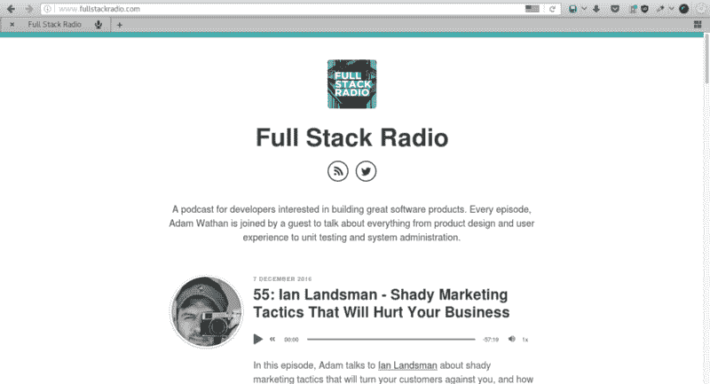

### 2.[跟我学编码](http://learntocodewith.me/podcast/)

“跟我学编码”是我的另一个爱好，由福布斯撰稿人劳伦斯·布拉德福德主持，她两年前才开始自学编码。你可以想象，这个播客是初学者友好的。它专注于与完善学习过程、消除干扰和获得技术工作相关的主题。

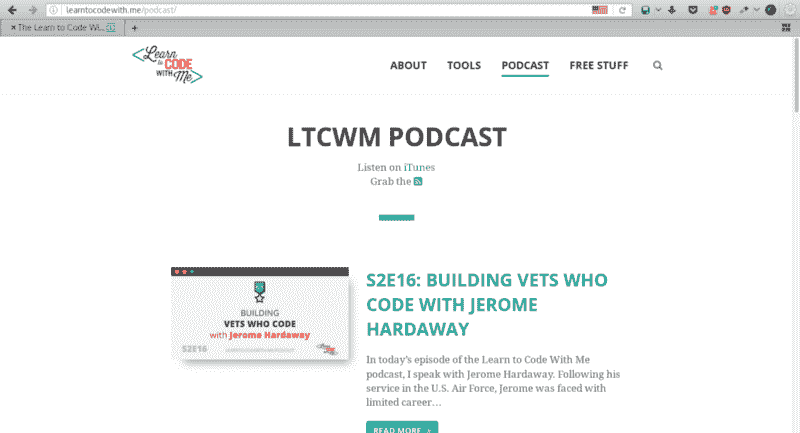

### 3. [Ctrl + Click 播客](http://ctrlclickcast.com/)

虽然不一定是面向初学者的，但 Ctrl+Click Cast 提供了对行业专业人士的高质量采访。它应该给你一个关于如何着手设计和开发网站和应用程序的有见识的视角。讨论的主题包括内容管理系统、用户体验设计、性能和电子商务。

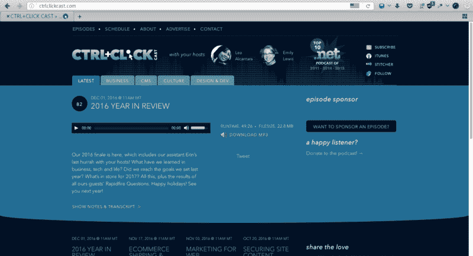

### 4.[从这里开始 FM](http://starthere.fm/)

“从这里开始”是一个 noob 友好的播客，我强烈推荐，尽管新的剧集没有像我希望的那样经常发布。然而，在我写这篇文章的时候，它已经有 30 集了。每一期都充满了大量的讨论，比如如何知道你什么时候准备好了，如何建立关系网，自由职业等等。

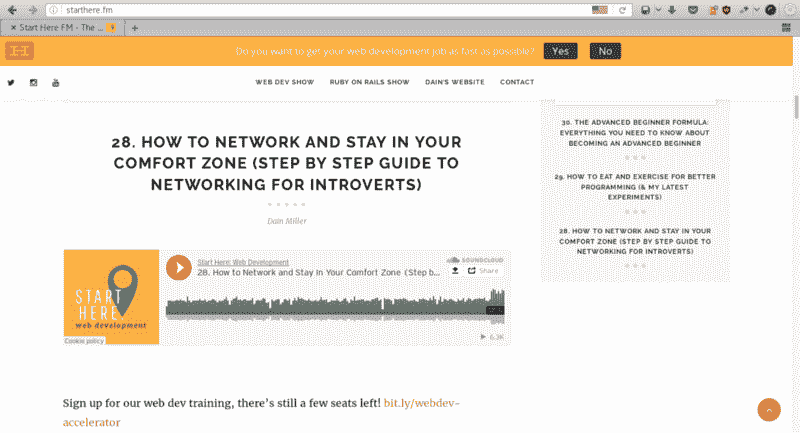

### 5.[你好世界播客](https://wildermuth.com/hwpod)

主持人 Shawn Wildermuth 采访了资深软件开发人员，讲述了他们是如何进入这个行业的，以及他们是如何克服在取得成功的道路上所面临的各种困难的。听这个播客提醒我，只要有一点点坚持和努力，我就可以实现任何事情。我相信它对你也很有价值。

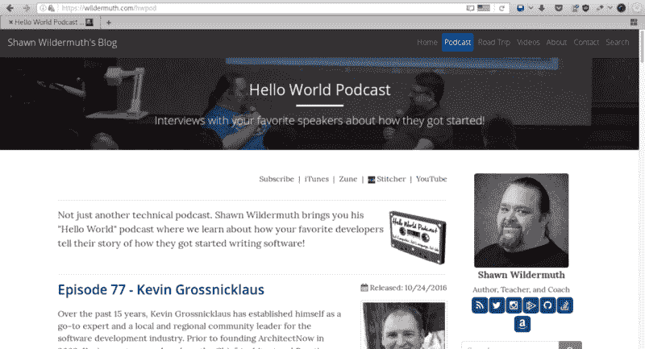

### 6.[远离键盘](http://awayfromthekeyboard.com/)

《远离键盘》是一个技术性但随意的播客，讨论软件开发中更人性化的方面。它讲述了个人的故事以及他们是如何进入技术行业的，但很多对话也围绕着担任技术职位是什么感觉，以及他们在技术之外做什么。

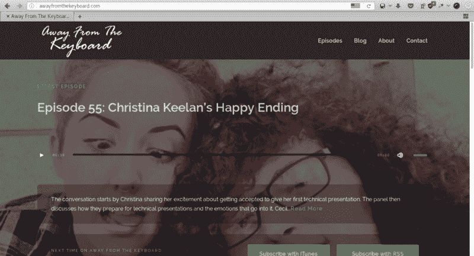

### 7.[简单程序员](https://simpleprogrammer.com/podcasts/)

这个播客——实际上只是 John Sonmez 的 YouTube 视频的音频版本——专注于帮助所有水平的软件开发人员在他们的职业生涯中取得成功。虽然有时会有关于特定技术的展示，但您可以在这里获得的最有价值的内容是那些讨论如何提高开发人员的人际技能、心理健康和生产力的内容。如果你正处于科技之旅的初级阶段，许多讨论的话题将会特别有帮助。

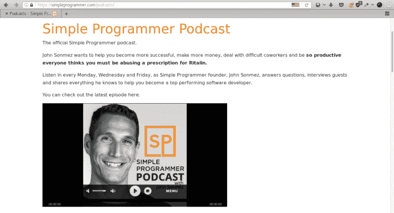

### 8.[软件工程无线电](http://www.se-radio.net/)

软件工程广播是一个基于采访的节目，提供了大量关于软件如何构建以及开发人员如何将新知识付诸实践的见解。尽管这个播客是针对专业开发人员的，但我认为每个人都可以从中获得一些有用的想法。我真的很喜欢约翰·桑梅兹关于推销自己和管理职业生涯的采访，所以这是一个很好的开始。

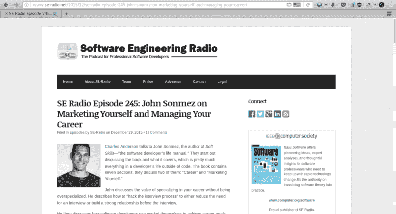

### 9.[。净岩](http://www.dotnetrocks.com/)

不要被名字所迷惑。Net Rocks 为各种经验和技术的开发者提供了有用的内容。虽然他们的许多节目都围绕着微软。NET 平台，它们还涵盖了软件开发中的其他主题，包括 JavaScript 框架、构建移动应用程序和 DevOps。到目前为止，已经有超过 1300 集，所以你可以浏览档案，调到你感兴趣的特定剧集。

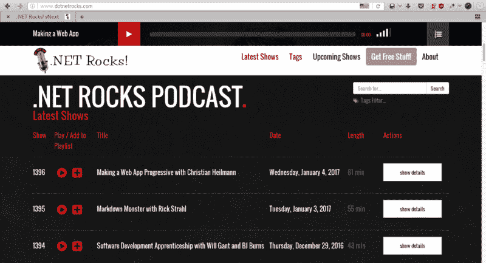

### 10.[小时分钟](http://hanselminutes.com/)

Hanselminutes 是一个优秀的播客，适合那些希望从业内受尊敬的个人那里获得关于软件开发热门话题的新观点的人。主题变化很大，通常涵盖最新的技术。大部分剧集都在 30 分钟左右结束——足够覆盖你的办公室通勤时间。

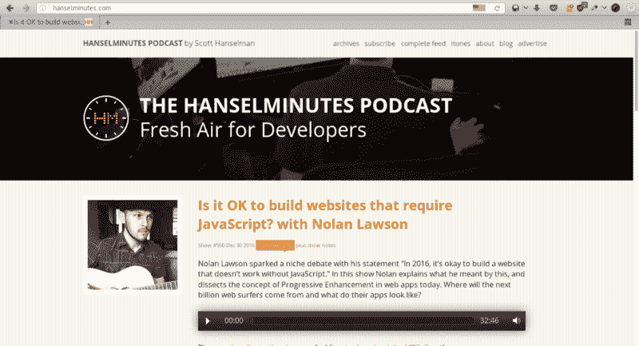

### 奖金— [Mixergy](https://mixergy.com/)

许多人学习编程是希望自己创业。如果这是你的目标，我建议你定期听 Mixergy。他们收集了大量成功企业家的采访，分享他们的日常奋斗、挑战和胜利，最重要的是，告诉你如何经营一家成功的企业。

如果你想在未来创办一家新公司，这个节目将让你深入了解那些久经考验的企业家是如何做他们的事情的，以及你可以用来建立一个成功企业的经验。

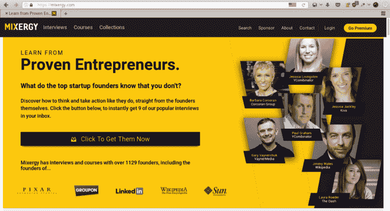

这就是我说的，我真的很好奇你最喜欢的编码播客是什么，所以如果你有任何建议，请在评论中留言。

如果你喜欢这篇文章，请与你的开发者朋友分享，并点击下面的绿色“❤”心，这样其他人也可以找到它。感谢阅读！

