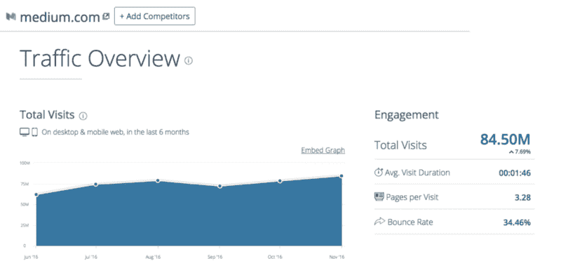

# 我从分析 2016 年前 252 个媒体故事中学到了什么

> 原文：<https://www.freecodecamp.org/news/what-i-learned-from-analyzing-the-top-253-medium-stories-of-2016-9f5f1d0a2d1c/>

Medium 可能正在努力寻找一种可持续的商业模式，但他们还有多年的资金，读者也比以往任何时候都多。



According to SimilarWeb, Medium had more than 84 million visits last month.

媒介不会很快消失。因此，让我们把注意力放在如何在 2017 年写出对读者有帮助的故事上。

我找出了 2016 年最热门的 252 个故事——所有这些故事都有至少 2500 条来自 Medium 读者的推荐——并分析了数据集。

客观地看，作家们去年在媒体上发表了 750 万篇故事。所以这个数据集代表了 2016 年最受欢迎的 0.00336%的故事。

这 252 个故事总共获得了 1，033，961 条推荐。有很多绿色的心。

以下是我从这个数据集中学到的一些东西，可以帮助你在 2017 年的写作中接触到更广泛的受众。

### 洞察力#1:你不一定要出名才能在媒体上做得好

169 位不同的作家出版了这些排名前 252 的故事之一。其中一些作家有多个头条新闻。

以下是写了不止一篇 252 强报道的人:

```
+----------------------+---------+---------------------+|         Name         | Stories | Mostly writes about |+----------------------+---------+---------------------+| Benjamin Hardy       |      17 | Self Improvement    || Quincy Larson        |      16 | Technology          || Jon Westenberg       |      13 | Life                || Darius Foroux        |       7 | Life Lessons        || Julie Zhuo           |       4 | Design              || Sarah Cooper         |       4 | Satire              || Jonathan Z. White    |       3 | Design              || Bill Sourour         |       3 | Programming         || Jessica Semaan       |       3 | Life Lessons        || Jason Fried          |       3 | Business            || Thomas Oppong        |       3 | Life                || Larry Kim            |       3 | Productivity        || Gary Vaynerchuk      |       3 | Entrepreneurship    || Chris Dixon          |       3 | Technology          || Amanda Rosenberg     |       3 | Humor               || Andy Raskin          |       2 | Marketing           || Charles Scalfani     |       2 | Programming         || Chris Messina        |       2 | Design              || James Altucher       |       2 | Life                || John Fawkes          |       2 | Productivity        || John Saito           |       2 | Design              || Marc Cenedella       |       2 | Business            || Tobias Van Schneider |       2 | Design              |+----------------------+---------+---------------------+
```

在阅读他们在 Medium 上的作品之前，我只听说过这个名单上的一个人，克里斯·迪克森，一个著名的科技博客。

如果你在他们的领域里，你可能会认出其中一些名字，但是我怀疑如果你在超级市场碰到他们，你会不会认出这些人。他们可能是“网络名人”,但离家喻户晓的名字还相差甚远。

如果你能写出持续有用的故事，并逐渐建立一个追随者，你也能打破这个列表。

### 洞察力#2:媒体是一个严肃的地方

以下是这 252 个故事中最常见的标签:

```
+------------------+-------------+------------+|       Tag        |   Stories   | Percentage |+------------------+-------------+------------+| Startup          |          62 | 25%        || Tech             |          47 | 19%        || Life Lessons     |          45 | 18%        || Entrepreneurship |          37 | 15%        || Design           |          34 | 13%        || Self improvement |          31 | 12%        || Productivity     |          26 | 10%        || Politics         |          21 | 8%         || Programming      |          18 | 7%         || UX               |          18 | 7%         || JavaScript       |          10 | 4%         || Web Development  |          10 | 4%         |+------------------+-------------+------------+
```

以下主题——大多数流行杂志的基础——出现次数为零:

*   运动
*   健康
*   汽车
*   婚礼
*   赌博
*   家
*   食物
*   名人
*   金融

“幽默”出现了 9 次，“讽刺”出现了 5 次。但仅此而已。

似乎大多数人阅读媒介是为了:

*   获得动力
*   更多地了解他们的领域

从这个数据集来看，Medium 的读者群是开发者-设计者-骗子的刻板印象与事实相差不远。

### 洞察力#3:你绝对应该试着把你的故事发表出来

```
+----------------------+---------+-----+----------------+|      Publication     | Stories |  %  |     Topic      |+----------------------+---------+-----+----------------+| Not in a publication |      67 | 26% | n/a            || The Mission          |      52 | 21% | Productivity   || Free Code Camp       |      30 | 12% | Technology     || Signal VS Noise      |       7 | 3%  | Startups       || Hi My name is Jon    |       4 | 2%  | Jon Westenberg || Slackjaw             |       4 | 2%  | Humor          || Startup Grind        |       4 | 2%  | Startups       || Year of Looking Glass|       4 | 2%  | Julie Zhuo     || The Startup          |       4 | 2%  | Startups       || Be Yourself          |       3 | 1%  | Life           || Art of Practicality  |       3 | 1%  | Productivity   || Conquer Corp America |       3 | 1%  | Productivity   || Personal Growth      |       2 | 1%  | Productivity   || The Coffeelicious    |       2 | 1%  | Startups       || Development Set      |       2 | 1%  | Education      || UX Design            |       2 | 1%  | UX             |+----------------------+---------+-----+----------------+
```

前 252 篇报道中的绝大多数都发表在媒体的出版物上。

如果你想一想，这是完全有道理的。这些故事不仅出现在关注作者的读者的新闻订阅中，也出现在关注出版物的读者中。

其中一些出版物有很多追随者。

### 洞察力#4:个人故事做得更好

下面是对排名前 252 的故事标题中最常见的单词的词法分析。我已经过滤掉了像“the”和“of”这样的停用词

```
+-------+-----------------+| Count |      word       |+-------+-----------------+|    42 |  you            ||    39 |  i              ||    30 |  how            ||    24 |  your           ||    16 |  about          ||    15 |  my             ||    14 |  people         ||    14 |  life           ||    12 |  why            ||    11 |  design         ||    10 |  me             ||     9 |  trump          ||     9 |  read           ||     9 |  learn          ||     8 |  time           ||     7 |  new            ||     7 |  letter         ||     6 |  yourself       ||     6 |  live           ||     6 |  job            ||     6 |  better         ||     5 |  year           ||     5 |  white          ||     5 |  silicon valley ||     5 |  stop           ||     5 |  never          ||     5 |  most           ||     5 |  f***           ||     5 |  free           ||     5 |  apps           ||     4 |  world          ||     4 |  work           ||     4 |  websites       ||     4 |  web            ||     4 |  successful     ||     4 |  smarter        ||     4 |  open           ||     4 |  javascript     ||     4 |  hard           ||     4 |  guide          ||     4 |  f******        ||     4 |  code           ||     3 |  wish           ||     3 |  technology     ||     3 |  startup        ||     3 |  secret         ||     3 |  quit           ||     3 |  productivity   ||     3 |  programming    ||     3 |  powerful       ||     3 |  medium         ||     3 |  love           ||     3 |  future         ||     3 |  development    ||     3 |  developer      ||     3 |  designer       ||     3 |  career         ||     3 |  business       |+-------+-----------------+
```

“你”和“我”这两个词是最常见的，这表明直接以个人身份称呼读者比以第三人称写作更好。

不在 100 个最常见英语单词之列的最常见单词是“生活”和“设计”

说到英语，排名前 252 的故事中，除了三个以外，其他都是用英语写的。

### 观点 5:你不需要说脏话来引起人们的注意

许多人抱怨媒体标题中大量的脏话。

虽然“F”这个词确实存在，但它及其变体在排名前 252 位的标题中只出现了 13 次，“S”这个词只出现了 3 次。

### 洞察力# 6:“Listacles”仍然存在，但它们并不主宰媒体

前 252 个故事中只有 23 个是明确的“列表”——项目符号驱动的故事。

这些故事的标题遵循“在你(时间)之前你应该做的事情的数量”的模式

全面披露:其中一个例子是我关于 Linux 岁生日的故事。

但总的来说，我认为 listacles 的衰落是一件好事。

我个人给作家的建议是，专注于深入单一主题的故事。

### 洞察力#7: 7 分钟仍然是理想的故事长度


前 252 个故事的平均长度为 6.7 分钟，与 Medium 的数据科学团队在 2014 年确定的最佳长度相同。

### 洞察力#8:包含图像。

只有 16 个头条新闻没有任何图片。

一个故事包含的图片数量的中位数是 3。

也不要担心过度使用图像。11%的故事使用了 10 个或更多的图像，其中两个故事使用了 50 个以上的图像。

### 洞察力#9:拥有大量追随者绝对有帮助

截至年底，这些作者的关注人数中位数为 6809 人。

即使你还没有很多关注者，仍然有希望破解 2017 年的热门故事。其中 29 位作者的粉丝不到 2000 人，如果你能写一些受欢迎的故事，你可以在几个月内找到他们。

让人们追随你的最好方法是提醒他们追随你。

如果有人一直读到你文章的底部，提醒他们关注你是合理的(这也符合 Medium 的服务条款)。

### 洞察力#10:不要禁用响应。

只有 6 个热门故事有残疾反应。

想象有人正在阅读你的故事，并想到一些有见地的补充。他们滚动到你的故事的底部，却发现他们不能分享他们的想法，因为你已经禁用了响应。

他们会推荐你的故事吗？我肯定不会。

不要妨碍围绕你的故事的论述。允许你的读者回应你。

### 现在让我们继续写作

非常感谢 Levent Aş kan，他花时间编辑了这 252 个顶级媒体故事。你可以在这里阅读他关于他们[的故事。](https://medium.com/startup-grind/mediums-most-recommended-stories-of-2016-171efdd705c5#.jlfo409vs)

此外，感谢 [Kande Bonfim](https://www.freecodecamp.org/news/what-i-learned-from-analyzing-the-top-253-medium-stories-of-2016-9f5f1d0a2d1c/undefined) 对 Levent 数据集的进一步扩展。

如果你对在 2016 年获得更多读者感兴趣，看看我的关于在人们会阅读的媒体上写故事的[小贴士](https://medium.freecodecamp.com/how-to-write-medium-stories-people-will-actually-read-92e58a27c8d8#.n4ps93qhe)。

[**如何写媒介故事人们会实际阅读**](https://medium.freecodecamp.com/how-to-write-medium-stories-people-will-actually-read-92e58a27c8d8)
[*每个月有超过 3000 万人使用媒介。他们来这里寻找值得一读的东西。某事…*medium.freecodecamp.com](https://medium.freecodecamp.com/how-to-write-medium-stories-people-will-actually-read-92e58a27c8d8)

我的非官方[媒体风格指南](https://medium.freecodecamp.com/a-style-guide-for-writing-on-medium-fcbad27492ea#.hxj5qm1vw):

[**媒体写作风格指南**](https://medium.freecodecamp.com/a-style-guide-for-writing-on-medium-fcbad27492ea)
[*在花了 1000 多个小时为我们的媒体刊物撰写和编辑故事后，我决定创作……*medium.freecodecamp.com](https://medium.freecodecamp.com/a-style-guide-for-writing-on-medium-fcbad27492ea)

干杯，祝写作愉快！

我只写编程和技术。如果你在推特上关注我，我不会浪费你的时间。？