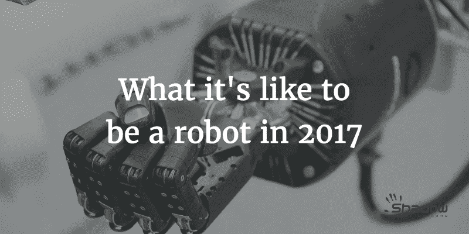
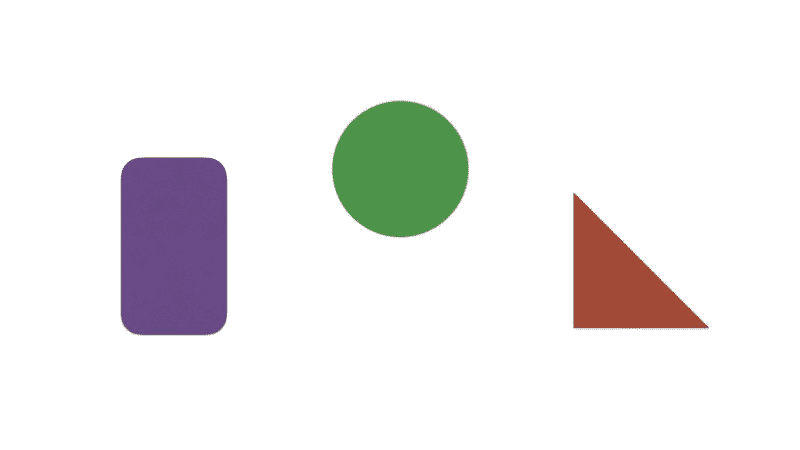
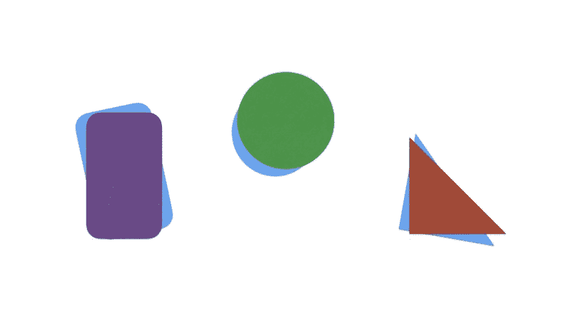
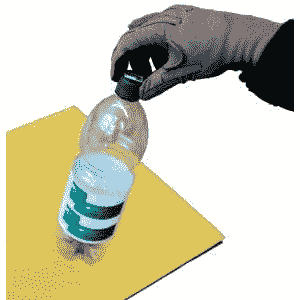
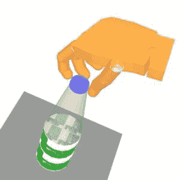
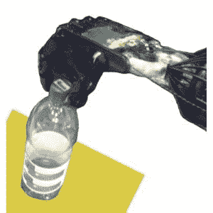
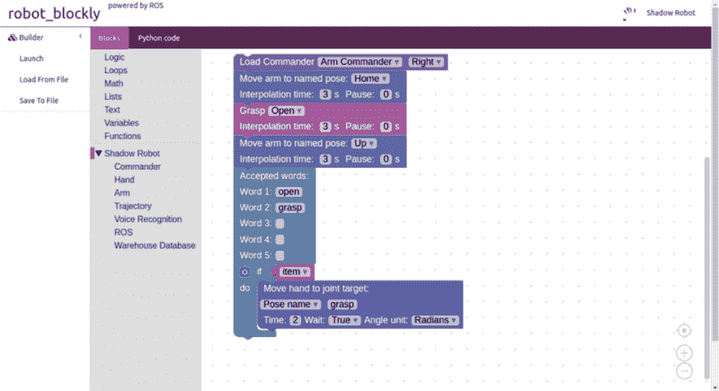

# 2017 年做机器人是什么感觉

> 原文：<https://www.freecodecamp.org/news/what-its-like-to-be-a-robot-in-2017-dc41368894a0/>

乌戈·库普契奇

2017 年做机器人是什么感觉

A brief overview of the state of the art in grasping and manipulation. Image credit: [ESA](http://www.esa.int/images/DSC03062.JPG)

2017 年，最先进的机器人能做什么？

有许多不同类型的机器人，从人形机器人到可以以惊人的精度和速度移动的工业手臂。

鉴于我的专业领域，我会更专注于抓取和使用物体。如果你想让机器人真正有用，这些是机器人需要掌握的人类核心技能。

但是为什么机器人复制这些技能如此困难呢？

以下是机器人需要的能力:

#### 对于抓取/操纵机器人

硬件方面，抓取或操纵机器人需要一只手臂、一只手和一个 3d 传感器。手臂通常有大约 6 个自由度(作为参考，人类手臂有 7 个)。这使得到达工作空间中的任何给定点成为可能。

除了良好的位置控制(能够快速可靠地驱动每个关节朝向其给定目标)之外，手臂和手还需要可靠的扭矩控制。这意味着你可以用给定的关节施加给定的扭矩。

一只高级的手还会有触觉，这使得操纵物体成为可能。

[A 3d scene](http://www.ros.org/news/assets_c/2015/06/pallet-thumb-480x375-1206.png) acquired from a Kinect.

对于一个现代机器人来说，了解它的环境是必不可少的。如果你看不见一个物体，你就不能抓住或使用它。

此任务最常用的管道如下:

*   首先，视觉管道将运行一个**分割算法**来隔离进入场景中的不同对象，例如，一个 3d 点云。
*   然后它会运行一些**识别步骤**。目标是尽可能地识别对象，并对齐对象的一些已知网格。

与上面的真实用例相比，下面的图表非常简单。深度学习的最新进展[显示出该领域的巨大前景](https://devblogs.nvidia.com/parallelforall/image-segmentation-using-digits-5/)。

Full scene / segmented results: each object is a different color / each object is recognised, the model is aligned in blue.

既然机器人对场景中的东西有了大致的了解，它需要能够在环境中导航，避开障碍物。这是**运动规划**的领域。有[大量的](https://medium.com/@ugocupcic/how-to-make-your-robot-go-from-a-to-b-without-hitting-things-1063a8890947)不同的[算法](https://medium.com/@ugocupcic/how-to-make-your-robot-go-from-a-to-b-without-hitting-things-9b86a758a3ae)处理运动规划。

既然机器人已经有了到达你想让它抓住的物体的方法，你需要知道如何握紧物体周围的手。有不同的方法来解决这个问题，但最常用的两种主要方法是**掌握计划**和**通过演示教学**。

在抓取规划方法中，该算法使用一些试探法来计算不同的抓取，并使用[抓取质量测量](https://medium.com/@ugocupcic/how-to-tell-if-my-robots-grasp-is-stable-7811fa3d16b8)来评估抓取。在示范教学中，人类向机器人展示如何做动作。该算法然后负责提取信息，以使动作在机器人上可靠地工作。

Teaching by demonstration — opening a bottle at [Bielefled university](https://ni.www.techfak.uni-bielefeld.de/robotics/manual_action_representation).

最后，可以使用机器人中可用的不同传感器来完成一个动作，例如在检测滑动时稳定抓取，或者在物体上移动手指而不放开它。运行一个紧密的**控制循环**，然后用它的数据修改机器人的下一个命令是机器人学最具挑战性的方面之一。

# 我们如何向前迈进

开发所有这些功能并让它们在所有环境中工作需要做大量的工作。每个人和每个机器人部门都有自己特定的专业领域。例如，我的专业领域是抓取和操纵，而其他人则更专注于人形机器人、移动平台和视觉。

然而，我们都面临着同样的挑战:用不可靠的数据解决复杂的问题。

高级机器人仍然常常是专家的专利。它们很难编程，你需要很多知识来让它们完成新的事情。但通常，你希望你的机器人做什么可以很容易地描述出来。这是一项你可以自己完成的任务。

为了解决这个问题，越来越多的公司转向机器人领域的可视化编程接口: [NAO 的 Choregraphe](https://www.youtube.com/watch?v=q2ihy_mVpY8) 、[机器人 Blockly](http://wiki.ros.org/blockly) (用于 Shadow 和乐儿机器人公司)、[弗兰卡的办公桌](https://www.franka.de/#chapter2)。

Shadow Robot’s Blockly interface.

但是，为了能够通过这些接口直观地对高级机器人进行编程，你需要高级且健壮的能力。

我个人认为，前进的方向是在工具本身内部构建越来越多的智能。这样，每个功能都可以由专家来实现。

这种黑盒方法可以更容易地组合不同的高级功能，重用不同专家开发的各种最新技术。盒子不必是黑色的，但结果应该是最终用户能够只关注那个盒子的功能——它的输入和输出——而不是被该功能应该如何实现所分散。

作为机器人专家，如果我们希望高级机器人对非专业人员有用，我们需要简化界面。但是为了做到这一点，我们首先需要实现越来越多的高级功能，然后将它们包装在工具本身中。

如果你喜欢这篇文章，喜欢并分享它怎么样？还有，如果你想讨论机器人技术，那就[上 Twitter](http://twitter.com/ugocupcic) 连线吧。

