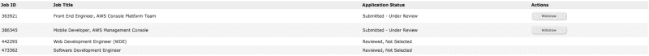
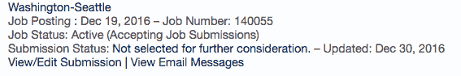
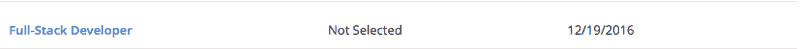
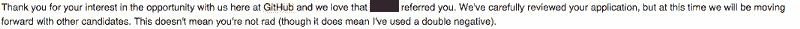

# 如果你想要一份开发人员的工作，那就无所畏惧，大胆梦想

> 原文：<https://www.freecodecamp.org/news/if-you-want-a-developer-job-be-fearless-and-dream-big-f1ff81e41462/>

作者内森

# 如果你想要一份开发人员的工作，那就无所畏惧，大胆梦想

作为自由代码营的导师和老师，我经常扮演顾问的角色。无数人在为找工作发愁。通常，这不是因为他们被拒绝，而是因为他们害怕申请。

我的建议总是一样的。我试图减轻他们的担心和自我怀疑。我说:“未寄出的申请肯定会被拒绝。”或者我告诉他们我个人的一个信念:“真正的成功只有在冒着失败风险的岗位上才有可能。”

现在，我正走在从美国军队退休的快车道上，我自己也进入了求职市场。我现在明白了他们曾经担心的事情。所有的“谢谢你的申请，但是我们已经决定和其他申请人继续前进。”

缺乏人情味和有意义的反馈令人沮丧。

Failure

Failure Again

Yet again…

Nope

This one stung badly. Did not appreciate the quip/sarcasm.

我收到了许多其他的拒绝，我想我还会收到更多。

然而，这并不完全是悲观的。我取得了一些成功，对此我由衷地感激。我想我失败的次数会比成功的次数多很多。这没关系。

我已经申请了谷歌、微软、亚马逊(多次)，以及西雅图地区的一些当地公司。我想申请脸书大学，但我没有账户，所以这可能是不可能的(我钦佩脸书和他们的远见，但我选择没有账户，所以我不能发布可能对我的安全许可有影响的愚蠢的事情)。

其中一些可能是登月，但嘿——他们只给了尼尔·阿姆斯特朗 50%的成功登月的机会。

不过，我注意到一件事:在我相信他们使命的地方，我有更多的面试成功机会。

如果你处在我的位置，请和我一起无所畏惧，大胆梦想。不要害怕申请。

不要认为“我永远也不可能在那家公司工作——他们远远不是我的对手。”

我们都倾向于限制自己的期望，并为被拒绝做好准备。但是不要让这阻止你去尝试。

埋头学习那些算法，[总是在编写](https://medium.com/always-be-coding/abc-always-be-coding-d5f8051afce2#.mpo3qp5h6)代码，并确保在编写过程中获得乐趣。

如果你想学习如何编程，你可以获得大量的资源。为什么不给[免费代码营](https://www.freecodecamp.com)一个机会？而且我怎么推荐 [Coursera](https://www.coursera.org/) 、 [Edx](https://www.edx.org/) ，或者 [Udacity](https://www.udacity.com/) 都不够。不需要 21 天[学习](http://i.imgur.com/kj8Um.png)的新年决心。相反，专注于清除最困难的步骤——开始。