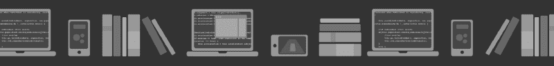
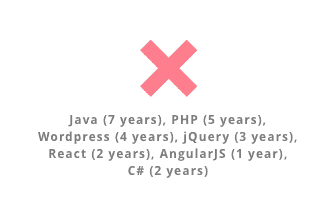
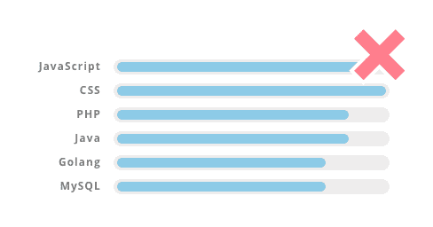
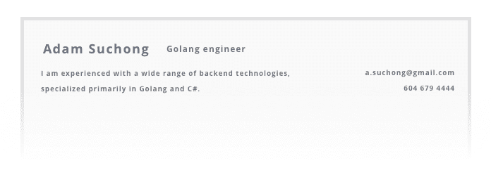
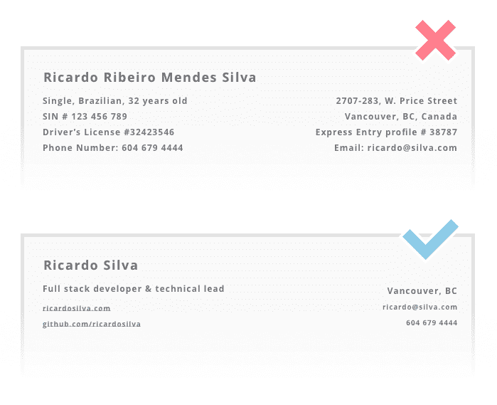
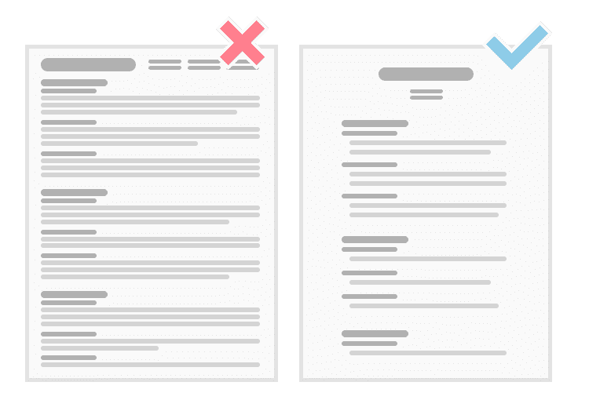
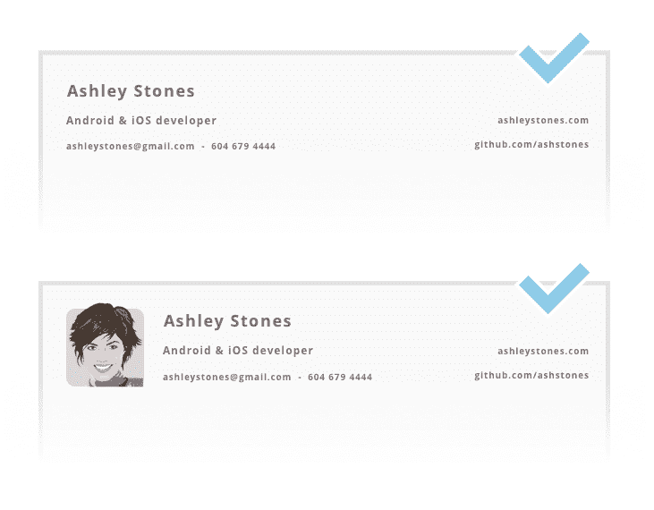
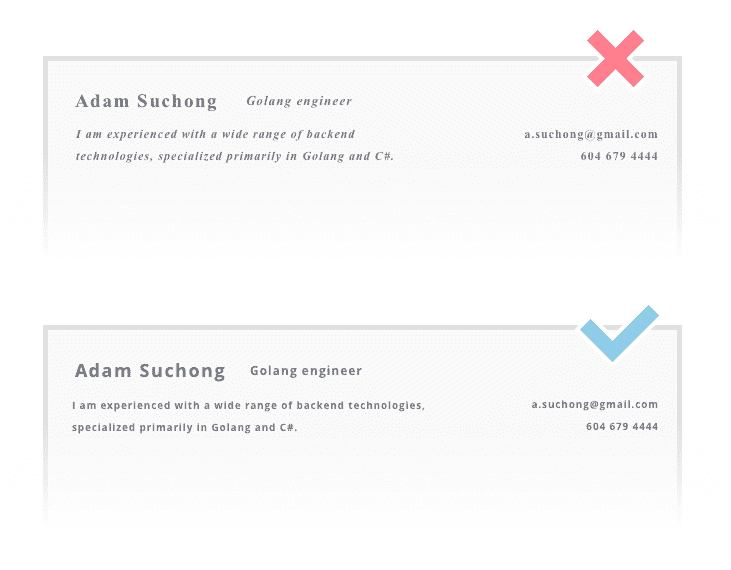
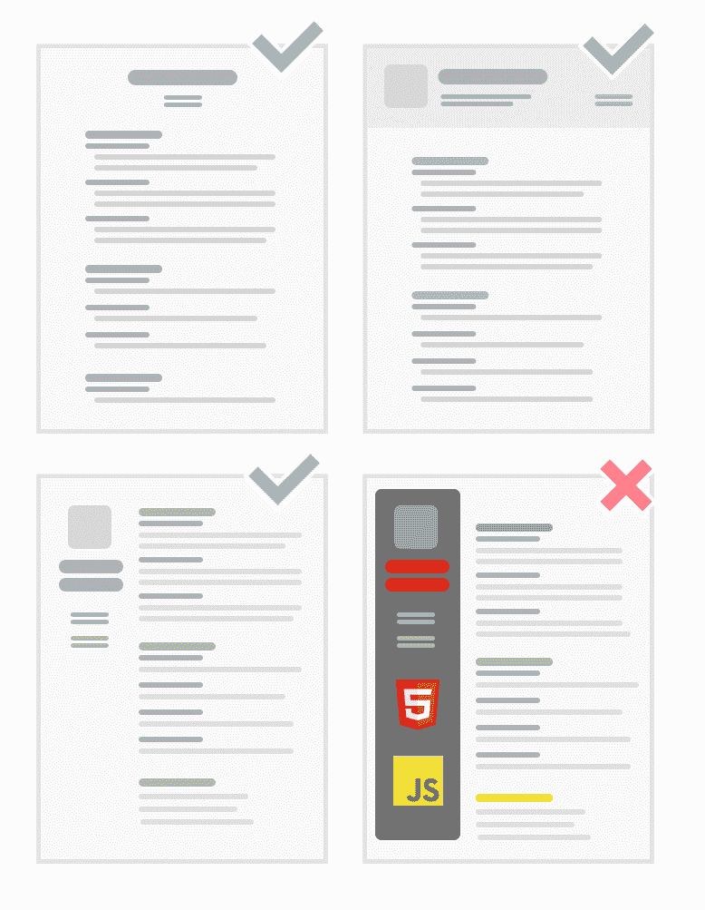
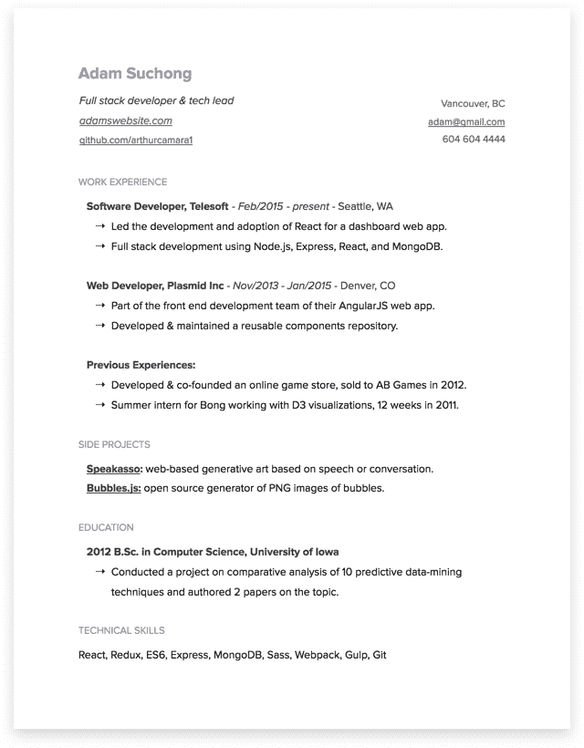

# 2017 年撰写开发者简历的见解性指南

> 原文：<https://www.freecodecamp.org/news/how-to-write-a-good-resume-in-2017-b8ea9dfdd3b9/>

阿瑟·卡迈尔

# 执拗的开发人员简历写作指南

不到一个世纪前的形式现在是获得任何面试的第一步:**投简历**。

这份冗长的打印文档现在已经变成了 PDF、网页、LinkedIn 简介、 [Stack Overflow 开发者故事](http://stackoverflow.com/users/story/join)、[Youtube 视频](https://www.youtube.com/watch?v=c_PZTAW5piQ)、Github 简介，或者这些的某种组合。

我们所知的简历注定要失败。更有效的工作申请和评估形式终将出现。但是我们还没到那一步。因为这还没有发生(或者我应该说，因为我们，开发者和企业家，还没有*让*发生)，我和我的同事们将继续每周接收和评估来自全球各个角落的开发者简历。

在过去的几年里，我已经看到大多数候选人在试图通过简历交流他们的经验、技能和潜力时是多么的无效。

这篇文章是为那些想最大化在酷公司和创业公司获得面试机会的开发者提供的最新指南。它反映了*我自己对该做什么和不该做什么的观点和看法*。

我过去也犯过错误。在过去的几年里，我从自己的成功和对他人简历的评估中学到了很多。希望这个指南能帮助其他想在游戏中领先的人。

让我们首先不要把自己评价为 Java 专家和 C#中级专家，让我们放下 Times New Roman，让我们提醒自己，除了把 4 页的简历压缩成一页之外，还有很多事情要做。让我们有目的地忘记透露我们的完整地址、社会安全号码和联系信息，以供参考。

### TL；本指南的灾难恢复摘要:

1.  简历应该是什么样的:经验、副业和教育。
2.  技术技能被高估了。如何*有效*展示自己的技能。
3.  求职信被高估了。如何*有效*介绍自己？
4.  不要包含无关的个人信息。甚至不知道你的全名。
5.  现代的展示是关键:长度、布局、照片、字体、格式。
6.  好处 1:发送下一份简历前的终极清单。
7.  额外收获#2:谷歌文档上的简单简历模板。
8.  最后的话

### 什么是简历，应该关注什么？

简历本质上还是老样子:介绍信*和*意向书*。除了没有人再有时间写长信，大多数人更喜欢收到易于浏览的结构化列表。*

*第一条规则是你应该永远诚实。你下一个最重要的目标是写一份易于*浏览*的文档。如果你从事 web 开发，那对你来说应该或多或少是很自然的。本质上，这就是我们优化大多数消费者驱动的网络应用和网站的目的。人们浏览网页，他们的眼睛快速地取样单词。你应该针对同样的用户行为，有效优化你的简历。*

*你的意图是含蓄的:你想得到一次面试，并最终得到一份工作。你的*简介*几乎就是你写在简历上的所有东西，是你很适合这份工作的证据。*

*作为一名开发人员，你最好关注三件事:**经验、辅助项目和教育。除了极少数的例外，你必须能够针对你申请的任何一份工作，为**提供至少两个** **。*****

*如果你申请的是技术领导的职位，展示你有丰富的相关经验和扎实的基础教育足以让你获得面试机会。如果你申请的是初级职位，而你还没有太多的实践经验，你的学历证书和兼职项目会对你有所帮助。*

*如果你不能诚实地为其中至少两个职位提出有力的理由，你就应该事先花时间改进它们，或者考虑一个更适合你目前情况的职位。*

#### ***经历***

*经验是证明你在某项工作上取得成功的主要证据。列举过去的职位主要不是为了显示你过去几年的工作经历，而是为了总结*你具体在做什么*，以及它对今天的你和你的专业技能有何贡献。尽管如此，请记住你的首要目标是让你的简历易于浏览，所以**保持重点**。*

*在创业的场景中，头衔并不那么重要，所以保持头衔简短，专注于你的职责。写一小段或几个要点，突出你对你所在企业的主要贡献。*

*经验部分也是展示你具备这份工作所需技能的最好地方。例如，如果你申请的是 React 开发人员的职位，表明你以前有过使用 React 的经验或者突出 JavaScript 相关的角色将会对你有利。*

*像下面这样简单的事情可能会非常有效:*

> *工作经历*

> ****2015 年 2 月至今:软件开发人员，Telesoft —华盛顿州西雅图***
> *——领导 React 在仪表板 web 应用中的开发和采用。*
> *——使用 Node.js、Express、React、MongoDB 的全栈开发。*
> ***2013 年 11 月—2015 年 1 月:Plasmid Inc. —丹佛，CO***
> *——angular js Web app 前端开发团队的一员。*
> *-开发的&维护了一个可重用的组件库。*
> ***以往经历:***
> *——开发&合作创办网游商店，2012 年卖给 AB Games。*
> *——2011 年 12 周，Bong 暑期实习生，从事 D3 可视化工作。**

*请注意，在上面的示例中，仅详细描述了最后 2 个位置。如果你在你的职业生涯中有很多相关的经验，并想全部提及，考虑只写最近的 2 或 3 个职位，在最后的“以前的经验”部分列出其他的。*

*(*应届毕业生和大三学生特别注意:如果你没有太多经验，这个世界明白。别装了，看下一节)**

#### *辅助项目*

*在此应用*经验*部分的相同原则。简单点，做你自己。兼职项目是你展示你选择使用的技能和技术的机会。这也是一个表达创业才能或兴趣的好机会。*

*许多开发人员认为他们必须有一个开源项目才能有一份好的简历。不是这样的。如果相关的话，你可以包括非开源的个人项目。只要确保你包含了显示你的潜力和帮助你建立你的案例的东西。示例:*

> *项目*

> *[***Spice***](http://www.csc.kth.se/~acvds/spice/)***:使用语音命令改变网页的外观***
> *——用户说“使背景变成紫色”之类的话，改变网站样式*
> *——使用 vanillaJS 和 Wit.ai*
> ***开发的 Chrome 扩展:订购披萨的 Slack bot***
> *——使用 Go 和 Wit.ai 开发的 Slack bot **-[bubbles . js](https://www.google.ca/search?q=bubbles&biw=2381&bih=1339&source=lnms&tbm=isch&sa=X&ved=0ahUKEwjWqvHW_tTQAhVkHGMKHQLvBgcQ_AUIBigB):泡泡的 PNG 图像开源生成器****

*你的一些项目可以在网上找到吗？包括链接。确保它们有效。它们是开源的吗？如果他们在 [GitHub](http://github.com/arthurcamara1) 上，请附上链接，并确保你是一个重要的贡献者(请不要链接到*。zip 文件或任何需要下载的文件)。*

*包括项目，因为你以它们为荣，而不是简单地填满这一部分。如果你没有任何副业，那很好(前提是你出示经验)。如果学校项目很有趣，并且你个人对它们的成功做出了重大贡献，那么它们也是相关的。说到这个…*

#### *教育*

*这里没必要说得太具体。说明你拥有的相关学位，以及学校和毕业日期就足够了。一般来说，学位是按时间倒序排列的，并且只包括相关的内容。例如，如果你有大学学位，提到你在哪里上的高中就没什么关系了。此外，没人那么在乎你的平均绩点，所以不要把它包括在内(当然，除非工作描述明确要求这样做，或者如果你刚刚毕业，想要证明你做得很好)。*

*众所周知的学位和项目在不同的机构中是非常相似的，所以一行就足以概括你的高水平学习:*

> *教育*

> ****2012 年爱荷华大学计算机科学学士****

*然而，我认为你应该包括更多的教育细节，如果这些细节非常有趣或者与职位相关的话。例如，如果你申请的是一个数据分析师的职位，而你的大学论文是关于一种创新的数据挖掘技术，可以考虑用几行文字来描述你的论文、发现或项目。*

> *教育*

> ****2012 年爱荷华大学计算机科学学士***
> **-** *进行了一个关于 10 种预测数据挖掘技术的比较分析的项目，并就该主题撰写了两篇论文。**

*请记住，为教育建立一个强有力的案例并不一定意味着正规教育或大学。有很棒的项目、训练营和课程值得一提。对于技术职位来说，最重要的是展示你的计算机科学知识和理解能力。*

**

### *列举技能被高估了*

*我们，开发人员，经常认为在一个单独的部分列出*所有*我们曾经工作过或者学习过(或者在极端情况下甚至听说过)的技术是一个好主意，这个部分通常被称为“技能”或者“技术技能”在大多数情况下，**这是不必要的:**没有必要列出你曾经遇到过的每一种语言和框架。此外，在描述你在过去的角色或项目中的经历时，你应该已经展示了你的技术技能。*

*然而，我理解你可能*希望*包含一个“技能”部分。如果你对它有强烈的感觉，列出你的技能的最好方法是超级简单的。**就列出来:***

> ****技术技能***
> *——React、Redux、ES6、Express、MongoDB、Sass、Webpack、Gulp、Git**

*在这里，少即是多，所以一些小贴士可以缩短你的清单:*

1.  *只包括你在技术上很强且知识丰富的技能，以及与职位相关的技能。*
2.  *没有必要把*多余的*技能包括在内**。例如，我希望列出 CSS3 的人了解 CSS，所以不要包括后者。我见过很多简历都有超级冗余的技能列表，比如一个候选人连续列出了以下所有技能:“ *HTML、DHTML、XHTML、HTML5。”我记得当我第一次寻找实习机会时，我也是这样做的，所以我明白这看起来有多诱人。事实上，这只会制造混乱，让你看起来既缺乏经验，又试图用一长串单词来给人留下深刻印象。****
3.  *开发人员被期望成为相当熟练的计算机用户。因此，**避免列举基本的计算机/软件使用技能**，如“微软办公软件包”、“Windows/Mac/Linux”或“Adobe 套件”*

#### *多年的经验并不意味着什么*

*依我看，报告每种语言或框架的经验年限是不相关的，无意义的，也是不准确的。*

**

*随着时间的推移，很难衡量技术的使用情况。对我来说，通常，年数简单地解释为“申请人多久前第一次使用该语言/框架”，这并不反映熟练程度**或**经验。*

*例如，我 16 岁开始使用 PHP，它是我在大学自由职业网站上使用的主要语言之一。然而，在我职业生涯的后期，我从未追求更多的 PHP 经验，我对其生态系统的知识现在肯定过时了。我可以说我有 10 年的 PHP 经验吗？不会吧。如果你只是想展示经验，用你过去的工作和项目来展示。好多了。这个技能部分应该最多反映你当前的专业重点。*

#### *永远不要认为自己是专家。*

*大多数我认为是某方面专家的人不会在简历中明确写他们是专家。他们的经验和项目不言自明。他们明白学习是一个持续的过程，他们每天都在学习。“专家”这个词干脆*音* *音*。*

#### *也不要认为自己是初学者。*

*写“C++(初级)”对你没有任何好处。如果这是你的情况，你刚刚开始学习一些东西，你可能还不应该把它包括在你的技能列表中(谁从来没有这样做过？\_(ツ)_/ ).当你感到足够舒适地使用它时，你就可以继续前进，告诉世界你的新超能力。*

#### *忘记进度条。*

*进度条就是*这么错*！有一个完整的进度条意味着你知道关于一个主题的所有事情，我*怀疑没有人知道。**

*

These progress bars make no sense whatsoever* 

*有一个部分填充的条意味着你确切地知道你缺少什么去了解关于一个主题的所有知识，我也*怀疑*。*

*你不必试图把主观测量变成比较图表。不要在简历中包含进度条。不要把它们放在你的网站上。不要在任何地方包含它们。*

#### *如果你还想证明你在围棋方面比 Python 强:*

*我见过的一种至少可以接受的显示不同熟练程度的方式是将你的技能分成两类:*强*和*博学*。这稍微好一点:你没有明确地认为自己是专家，也没有包括你不熟悉和不熟悉的技术。请记住，你应该诚实，不要认为自己精通你在[黑客新闻](https://news.ycombinator.com/)上读到的技术。一个很好的例子如下:*

> ****技术技能***
> 强: *React，ES6，Express，Sass，Gulp，Git*
> 博学: *Redux，MongoDB，Webpack，LESS，Angular**

**

### *求职信被高估了。*

*当你申请工作时，你的意图很明确:你想得到这份工作。因此，没有必要写一封充满目标和赞美你自己的信。在很大程度上，人们似乎并不怎么阅读它们。*

#### *如何介绍你自己*

*如果你非常想写一篇关于你自己的文章，可以考虑在简历的顶部写一段描述你自己的文章——一个简短的“关于”部分。*

**

#### *如果你还想写一封信，或者工作描述需要的话*

*有时工作描述或自动申请系统要求我们提交一封求职信。如果是这样的话，保持简短，尽量避免过于正式的语言。做你自己就好。没有必要说“亲爱的先生或女士”或“致相关人员”。*

*展示你很聪明，你能把事情做好，你很适合这份工作，你会很好地融入公司的文化。*

#### *当我认为求职信是必须的时候*

*如果你申请的职位*根本不存在*或者不公开，你绝对应该写一封求职信。这时你应该清楚地表明你的意图，因为你不仅需要向公司展示你的聘用将如何给他们带来好处，还要展示你提出的新工作将如何给他们带来巨大价值。*

*顺便说一句，申请不公开的职位也没什么不好。如果你有动力，并且认为你有能力，那就去做吧。展示问题并提出解决方案，这将让他们为你量身定做一份工作。可能你通过这种方式获得面试的机会更小，但有些人真的很欣赏这种勇气。*

**

### *你的婚姻状况无关紧要。你的地址也不是。或者你的生日。*

*过去，简历通常包括身体特征，如身高、体重、性别、种族和一系列其他个人信息。我们放弃这些是有原因的:它们是不相关的。*

*然而，我经常在收到的简历中发现大量个人信息——这些信息对评估一个人的技术能力或决定是否继续面试没有任何价值。为什么我需要知道你的政府颁发的身份证号码，以建立一个初步的聊天和采访？你的婚姻状况如何帮助你证明你是一名优秀的开发人员？你为什么要公开你的公寓号码？我建议从你的简历中删除以下所有信息:*

*   *全名(有些人有*多个*名字:名和姓就好)*
*   *年龄或生日*
*   *婚姻/关系状况*
*   *性别*
*   *性取向*
*   *种族划分*
*   *社会保险号*
*   *驾照(做司机对你这个*开发者有什么帮助？*)*
*   *完整地址(如果你想给出一个大概的概念，城市和州/国家都可以)*
*   *国籍*
*   *移民身份*
*   *您会说的语言**
*   *爱好**

*

The second version of the resume is much better! It's clean, focused, and has all the relevant info.* 

*简历上的每一个字都占据了宝贵的空间，你不应该把它浪费在那些在最初的简历评估中毫无意义的事情上。运用常识，对于你添加的每一个词，问问自己:*这条信息是否有助于雇主决定是否给我打电话面试*？*

#### *移民身份也不应该包括在内*

*开发人员在不同国家寻找工作似乎比以往任何时候都更加普遍。我的许多朋友有时不确定是否在简历中披露他们的公民身份或具体的移民身份(例如:有效的工作许可证、永久居民、绿卡持有者、需要的工作签证)。*

*一方面，作为公民和/或拥有在他们居住的国家工作的适当授权的人有时报告说，他们觉得自己的名字“太洋气了”，因此，如果他们认为自己可能需要工作签证，雇主甚至可能在面试之前就拒绝他们。因此，为了安全起见，他们更愿意包括他们的公民身份或移民身份。*

*另一方面，愿意搬迁或远程工作的开发人员想知道，披露他们的移民身份并明确提到他们需要工作许可证是否会降低他们获得面试的机会。*

*我个人认为开发商**不应该把移民身份**写进简历。*

*首先，这些信息在评估技术能力方面没有价值。科技公司通常只是在这个初始阶段对寻找人才感兴趣。如果你的专业技能引起了他们的兴趣，他们想问你任何问题(包括你是否有工作授权)，他们会给你打电话或邀请你参加第一次面试。这正是面试的目的——问问题，给双方更多了解对方的机会。*

*其次，取决于你如何分享这些信息，这可能看起来是你申请工作的唯一原因*是为了获得工作签证。我看到一些申请人在简历上分享一些非常具体和个人的细节，比如他们的移民案件号码或目前的签证到期日期。这些显然与简历的重点无关。**

**最后，你可以总是只提到你正在寻找重新安置或远程工作，而不必不必要地透露个人信息。如果你晋级的话，细节肯定会在面试阶段处理。在美国和加拿大，公司会问你是否有合法工作的授权，法律上不允许在你面试时问你的国籍、移民身份或家庭血统。那么为什么要在简历中分享它们呢？**

#### **您会说的语言***

**对此可能会有一些争议，但事实是，对您的工作最重要的语言是您将在工作中使用的本地语言(如果您正在申请工作，您可能会说得很流利)和非常常用的英语(大多数面向开发人员的文档和资源都是用英语编写的)。如果你在法国申请一份工作，列出你也会说日语和芬兰语对你的简历没什么价值。这绝对是一个关于你的有趣事实，但你将有其他机会告诉你即将成为同事的人。我可以看到这个建议的一些例外，但是根据经验，它与开发人员角色无关。**

#### **其他有趣的事实和爱好***

**有些人喜欢包括关于他们和爱好的有趣的事实。虽然这些绝对是超级酷的点，但它们最终不是必要的。我知道，你可能认为我是这个房间里最无聊的人，但是请容忍我一会儿。没有人会邀请你去面试*，因为*你喜欢摄影、滑雪或跳伞。**

> **特别提示*: 如果你非常想把最后两点包括进来，那就简单点。我知道这会给你的简历带来人情味，增加一点个性。另外，如果你准备去面试，这些信息对打破僵局的谈话会很有用。**

****

### **表述不重要。但事实如此。**

**演示是关于内容、设计和格式的。虽然我听到一些人说，简历应该没有任何格式，演示文稿并不重要，但我仍然认为，一份设计良好的文档肯定会脱颖而出，给人留下更好的第一印象。**

#### **我的简历应该只有一页长吗？**

**一页？两页？多少页？简历应该尽可能长。很明显，你应该尽量简洁，但是如果你的简历用了几页纸，那完全没问题。**

**为了遵守“一页原则”,我见过很多申请人把字体变小，页边空白变小，去掉大部分的行与段之间的间隔，把所有的内容都压缩在一页纸上。这不是重点，也不会让你的简历更容易阅读或略读。事实上，它恰恰相反。**

**

Don't squash all your content! It makes it harder to read.** 

**相反，改变内容，总结事情，确保你说到点子上了。少担心页数，多关心你的内容。**

#### **我可以加一张我的脸的照片吗？**

**这当然是一个有争议的话题，但是*个人来说*，我看没什么问题。个人资料照片在网上随处可见，你可能在 LinkedIn、Github 和其他一些网站上都有。如果你想的话，我不明白为什么你不应该把它们添加到你的简历中。带有高质量照片的简历会带来人际关系和同理心，甚至可能给你带来优势。**

**有人说不专业，但我看不出露脸有什么*这么不专业*的。其他人说招聘经理可以根据外表来判断。老实说，我更喜欢假设诚信，相信雇主在寻找人才，尤其是对于开发人员来说，没有人在乎长相。微笑使人们聚在一起，不会造成任何伤害。**

**显然，不添加照片也是完全可以接受的，任何工作申请都不应该*要求*一张照片。**

**

It’s not 1995, photos are okay.** 

#### **选择漂亮的字体**

**你可能不是一个专业的设计师，也没有印刷术的学位，但是你应该尽你所能让你的简历易读、干净、好看、现代。像 *Times New Roman (* 或者更糟， *Comic Sans)* 这样过时的常用字体会让你的简历看起来超级俗气。**

**

Simple font changes make a huge difference** 

### **布局和设计**

**只要你的简历是干净的，一点颜色和布局创意都是受欢迎的。只是不要过度。**

********

### **奖金#1:开发人员的终极简历清单**

****(对照此清单检查你的下一份简历)****

****总体:**
**✔写出了真相。**
**✔保持了简历的简洁和易于略读。**✔把次要的项目保持在重点上，只列出几个重要的和相关的我贡献很大的项目，包括我的角色和技能。✔简要说明了我的学历，但没有包括平均绩点。
**✔** 如果列出技术技能，没有包括:
⨯多余或无关的技能
⨯
中我不熟悉或不了解的技能 **✔** 没有列出我的编程技能使用:
⨯进度条。
⨯各种水平的熟练程度。
⨯多年的经验。**

****个人信息:**
**✔言简意赅，只陈述必要的联系方式，自我介绍的话不超过几句。**** 

********呈现:**
**✔** 布局简洁美观。
**✔** 如果有图:好看，专业，质量好。不需要。✔有大量的空白，文字也不会杂乱无章。看我的简历很容易。它只是流动？✔使用漂亮而现代的字体。✔有漂亮宜人的颜色。******

************

### ******额外收获#2:谷歌文档上的简单简历模板******

******

[**Click here to open the template on Google Docs**](https://docs.google.com/document/d/1-dozESPE5ND2w6BTxHhuQb2s4DAdwAV6yI7v7V0mSsk)****** ************

### ******最后的话******

******感谢您阅读本指南。我希望它对你有所帮助，让你对尽可能展示你的经验和能力感到兴奋。如果你不同意我的任何建议，请随时[联系我](https://twitter.com/arthur_camara)或者在下面留下你的回答。我很乐意讨论想法，讨论不同的观点，并最终围绕这个主题建立建设性的对话，这可能会帮助我们大型社区中的许多其他开发人员。******

******如果你想了解更多，请阅读我的朋友兼同事本尼是如何在一家科技公司找到工作的。******

******最后，如果你想申请我们在 Axiom Zen 的一些很棒的职位，并且认为你很适合，我们正在招聘，我们绝对希望收到你的来信。[请随意申请](http://careers.axiomzen.co/)或联系我们(并让我们知道你是从 Medium 上的这篇文章中找到我们的)！这将是超级令人兴奋的经历你的冷静和修改过的简历。******

************