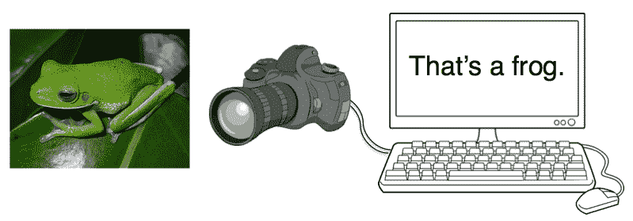
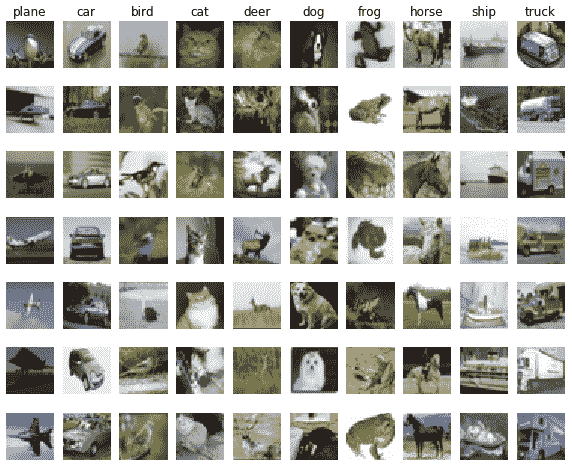
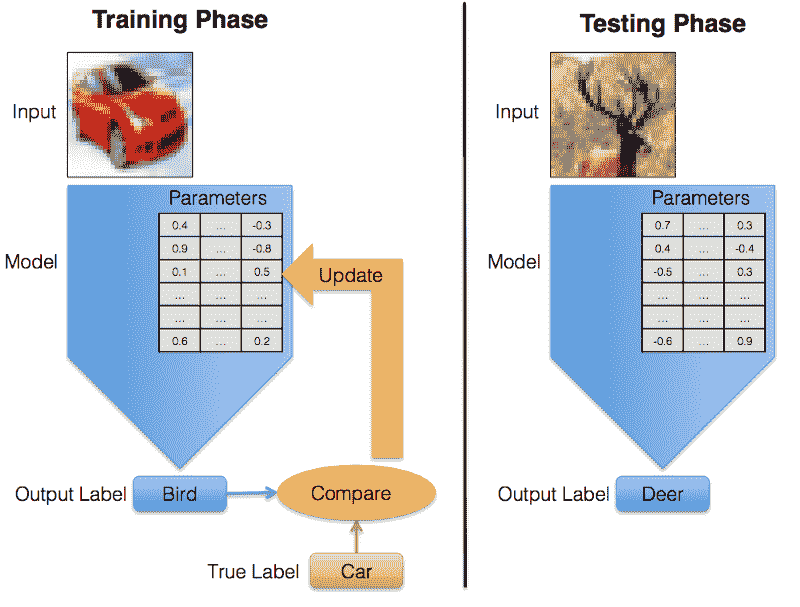
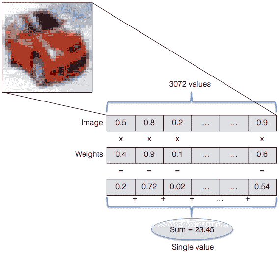
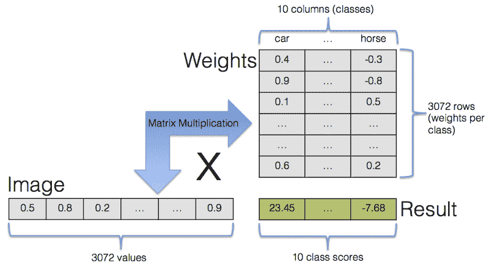
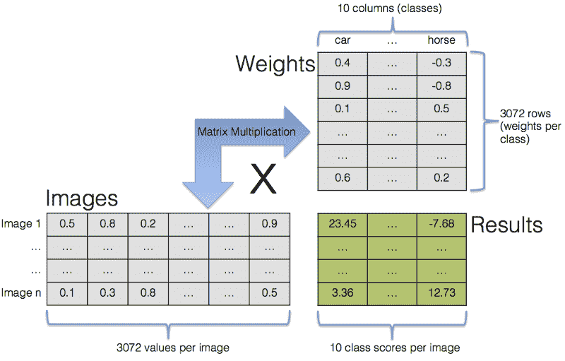

# 如何用 TensorFlow 构建一个简单的图像识别系统(上)

> 原文：<https://www.freecodecamp.org/news/how-to-build-a-simple-image-recognition-system-with-tensorflow-part-1-d6a775ef75d/>

沃尔夫冈·拜尔

# 如何用 TensorFlow 构建一个简单的图像识别系统(上)



这不是对人工智能、机器学习或深度学习的一般性介绍。已经有很多关于这些话题的好文章了(例如这里的或者这里的)。

这不是一个关于人工智能是否会奴役人类或者仅仅偷走我们所有工作的讨论。你可以在其他地方找到大量的猜测和一些不成熟的恐慌。

相反，这篇文章详细描述了如何通过构建一个(在某种程度上)能够识别图像中所见的系统来开始机器学习。

我目前正在学习人工智能和机器学习的旅程中。我学习的最好方式不仅仅是通过阅读，而是通过实际建造和获得一些实践经验。这就是这篇文章的内容。我想向您展示如何构建一个执行简单计算机视觉任务的系统:识别图像内容。

我自己并不自称是专家。我还在学，要学的东西很多。我正在描述我一直在玩的东西，如果它对你有点意思或有帮助，那就太好了！另一方面，如果你发现错误或有改进的建议，请让我知道，这样我可以向你学习。

你不需要任何机器学习的经验就能跟上。示例代码是用 Python 编写的，所以掌握 Python 的基础知识会很好，但是掌握任何其他编程语言的知识可能就足够了。

### 为什么是图像识别？

图像识别是开发和测试机器学习方法的一项重要任务。视觉无疑是我们最强大的感觉，是我们人类与生俱来的。但是我们实际上是怎么做的呢？大脑如何将我们视网膜上的图像转化为我们周围环境的心理模型？我想没有人确切知道。

关键是，这对我们来说似乎很容易做到——简单到我们甚至不需要付出任何有意识的努力——但对计算机来说却很难做到(实际上，对我们来说可能也没那么容易，也许我们只是不知道有多少工作量。我们大脑的一半以上似乎都直接或间接参与了视觉)。

当我们甚至不知道我们自己是如何做的时候，我们怎么能让计算机做视觉任务呢？这就是机器学习发挥作用的地方。我们不再试图提出如何解读图像的详细的一步一步的指令，并将其翻译成计算机程序，而是让计算机自己解决它。

机器学习的目标是在没有明确告诉计算机如何做的情况下，赋予计算机做某事的能力。我们只是提供某种通用结构，并给计算机从经验中学习的机会，就像我们人类从经验中学习一样。

但在我们开始考虑计算机视觉的完整解决方案之前，让我们稍微简化一下任务，看看一个更容易处理的具体子问题。

### 图像分类和 CIFAR-10 数据集

我们将试图解决一个尽可能简单和小的问题，同时仍然有足够的难度来给我们提供有价值的教训。我们希望计算机做的事情如下:当呈现一个图像(具有特定的图像尺寸)时，我们的系统应该分析它并给它分配一个标签。它可以从固定数量的标签中进行选择，每个标签都是描述图像内容的类别。我们的目标是让我们的模型尽可能多地选择正确的类别。这个任务叫做图像分类。

我们将使用一个名为 [CIFAR-10](https://www.cs.toronto.edu/~kriz/cifar.html) 的标准化数据集。CIFAR-10 由 60，000 幅图像组成。有 10 个不同的类别，每个类别有 6000 张图片。每个图像的大小只有 32×32 像素。小尺寸有时让我们人类很难识别正确的类别，但它简化了我们的计算机模型，并减少了分析图像所需的计算负载。



Random images from each of the 10 classes of the CIFAR-10 dataset. Because of their small resolution humans too would have trouble labeling all of them correctly.

我们将这些图像输入模型的方法是给模型输入一大堆数字。每个像素由代表该像素的红、绿、蓝值的三个浮点数来描述。这导致每个图像有 32 x 32 x 3 = 3，072 个值。

除了 CIFAR-10 之外，还有大量其他图像数据集在计算机视觉社区中被普遍使用。使用标准化数据集有两个目的。首先，创建这样一个数据集需要大量的工作。你需要找到这些图像，对它们进行处理以满足你的需求，并给它们分别贴上标签。第二个原因是，使用相同的数据集允许我们客观地比较不同的方法。

此外，标准化的图像数据集导致了计算机视觉[高分榜](https://rodrigob.github.io/are_we_there_yet/build/classification_datasets_results.html)和竞赛的产生。最著名的竞赛可能是[图像网竞赛](http://www.image-net.org/)，其中有 1000 个不同的类别需要检测。2012 年的获胜者是由来自多伦多大学的 Alex Krizhevsky、Ilya Sutskever 和 Geoffrey Hinton 开发的算法([技术论文](https://papers.nips.cc/paper/4824-imagenet-classification-with-deep-convolutional-neural-networks.pdf))，该算法在比赛中占据主导地位，并以巨大优势获胜。这是第一次获胜的方法是使用卷积神经网络，这对研究界产生了巨大的影响。卷积神经网络是在动物中发现的视觉皮层之后松散地模拟的人工神经网络。这种技术已经存在了一段时间，但当时大多数人还没有看到它的潜在用途。这种情况在 2012 年 Image-Net 比赛后发生了变化。突然，人们对神经网络和深度学习(深度学习只是用于解决多层神经网络的机器学习问题的术语)产生了浓厚的兴趣。这个事件在过去几年的深度学习热潮中发挥了重要作用。

### 监督学习

我们如何使用图像数据集让计算机自主学习？即使计算机自己完成了学习部分，我们仍然要告诉它学什么和怎么学。我们这样做的方法是通过指定计算机应该如何评估图像的一般过程。

我们正在定义一个如何从输入图像到输出标签的通用数学模型。特定图像的模型具体输出不仅取决于图像本身，还取决于模型的内部参数。这些参数不是由我们提供的，而是由计算机学习的。

整个事情变成了一个最优化问题。我们首先定义一个模型，并为其参数提供初始值。然后，我们将带有已知和正确标签的图像数据集提供给模型。那是训练阶段。在此阶段，模型会反复查看训练数据，并不断更改其参数值。目标是找到使模型输出尽可能正确的参数值。这种训练，其中正确的解决方案与输入数据一起使用，被称为监督学习。还有无监督学习，其目标是从没有标签的输入数据中学习，但这超出了本文的范围。

训练完成后，模型的参数值不再改变，并且该模型可用于对不属于其训练数据集的图像进行分类。



During training the model’s predictions are compared to their true values. This information is then used to update the parameters. During testing there is no feedback anymore, the model just generates labels.

### TensorFlow

[TensorFlow](https://www.tensorflow.org/) 是一个用于机器学习的开源软件库，由谷歌于 2015 年发布，并迅速成为全球研究人员和从业者正在使用的最受欢迎的机器学习库之一。我们用它来为我们的图像分类模型做数值提升。

### 建立模型，Softmax 分类器

这个模型的完整代码在 Github 上有[。为了使用它，您需要安装以下软件:](https://github.com/wolfib/image-classification-CIFAR10-tf)

*   Python(代码已经用 Python 2.7 测试过了，但是 Python 3.3+应该也能工作，[链接到安装说明](https://wiki.python.org/moin/BeginnersGuide/Download))
*   TensorFlow ( [链接至安装说明](https://www.tensorflow.org/versions/r0.12/get_started/os_setup.html))
*   CIFAR-10 数据集:从 https://www.cs.toronto.edu/~kriz/cifar.html[下载数据集的 Python 版本](https://www.cs.toronto.edu/~kriz/cifar.html)或者使用[直接链接](https://www.cs.toronto.edu/~kriz/cifar-10-python.tar.gz)到压缩的存档。将提取的`cifar-10-batches-py/`目录放在您放置 python 源代码的目录中，这样图像的路径就是`/path-to-your-python-source-code-files/cifar-10-batches-py/`。

好了，现在我们终于准备好出发了。让我们看看我们实验的主文件，`softmax.py`并逐行分析它:

根据 [TensorFlow 风格指南](https://www.tensorflow.org/versions/r0.11/how_tos/style_guide.html)，future-statement 应出现在所有 TensorFlow Python 文件中，以确保与 Python 2 和 3 兼容。

然后我们导入 TensorFlow、用于数值计算的 numpy 和时间模块。`data_helpers.py`包含帮助加载和准备数据集的函数。

我们启动一个计时器来测量运行时间并定义一些参数。当我们真正使用它们的时候，我会在后面谈到它们。然后，我们加载 CIFAR-10 数据集。由于读取数据不是我们正在做的核心工作的一部分，我将这些函数放入单独的`data_helpers.py`文件中，该文件基本上只是读取包含数据集的文件，并将数据放入一个易于我们处理的数据结构中。

不过，有一件事值得一提。将 60000 张图片分成两部分。较大的部分包含 50000 张图片。这个训练集是我们用来训练模型的。其他 10000 幅图像称为测试集。我们的模特在训练结束前不会看到这些。只有这样，当模型的参数不能再改变时，我们才使用测试集作为模型的输入，并在测试集上测量模型的性能。

训练和测试数据的分离非常重要。如果我们的模型暴露在同一个数据集中进行训练和测试，我们就不知道它的泛化能力有多好。在最坏的情况下，想象一个模型，它准确地记住了它看到的所有训练数据。如果我们使用相同的数据进行测试，只要在内存中查找正确的解决方案，该模型就可以完美地运行。但是它不知道如何处理以前从未见过的输入。

这种模型学习训练数据的特定特征并可能忽略一般特征的概念被称为过度拟合，我们更希望模型学习一般特征。过度拟合以及如何避免它是机器学习中的一个大问题。关于过度拟合的更多信息以及为什么通常建议将数据分成不止两个而是三个不同的数据集可以在[这个视频](https://www.coursera.org/learn/machine-learning/lecture/QGKbr/model-selection-and-train-validation-test-sets) ( [youtube mirror](https://www.youtube.com/watch?v=z6aBwtEby_Y) )(该视频是吴恩达在 Coursera 上的免费[机器学习课程的一部分)。](https://www.coursera.org/learn/machine-learning)

回到我们的代码，`load_data()`返回一个字典，其中包含

*   `images_train`:50，000 乘 3，072 (= 32 像素 x 32 像素 x 3 个颜色通道)值的数组形式的训练数据集。
*   `labels_train`:训练集的 50000 个标签(每个标签是 0 到 9 之间的数字，代表训练图像属于 10 个类别中的哪一个)
*   `images_test`:测试集(10000 乘 3072)
*   `labels_test`:测试集的 10000 个标签
*   `classes` : 10 个文本标签，用于将数值类别值翻译成单词(0 代表“飞机”，1 代表“汽车”，等等。)

现在我们可以开始构建我们的模型了。实际的数值计算由 TensorFlow 处理，tensor flow 使用快速高效的 C++后端来完成。TensorFlow 希望避免在 Python 和 C++之间反复切换，因为那会降低我们的计算速度。

因此，常见的工作流程是首先通过构建一个所谓的张量流图来定义我们想要执行的所有计算。在此阶段，实际上没有执行任何计算，我们只是在搭建舞台。只有在之后，我们才通过提供输入数据和记录结果来运行计算。

让我们开始定义我们的图表。我们首先通过创建占位符来描述张量流图的输入数据。这些占位符不包含任何实际数据，它们只是指定输入数据的类型和形状。

对于我们的模型，我们首先为图像数据定义一个占位符，它由浮点值(`tf.float32`)组成。`shape`参数定义了输入尺寸。我们将同时提供多个图像(我们将在稍后的讨论这些批次[，但是我们希望在实际提供多少图像上保持灵活性。因此`shape`的第一维度是`None`，这意味着维度可以是任意长度。第二个维度是 3，072，即每个图像的浮点值的数量。](http://www.wolfib.com/Image-Recognition-Intro-Part-1/#batching)

类别标签信息的占位符包含整数值(`tf.int64`)，每个图像的值在 0 到 9 的范围内。因为我们没有指定我们将输入多少图像，所以`shape`参数是`[None]`。

`weights`和`biases`是我们要优化的变量。不过先说说我们的模式吧。

我们的输入由 3，072 个浮点数组成，期望的输出是 10 个不同整数值中的一个。我们如何从 3072 个值中得到一个值？让我们从后面开始。除了 0 到 9 之间的单个整数值，我们还可以查看 10 个分值(每个类一个),然后选择得分最高的类。所以我们最初的问题现在变成了:我们如何从 3072 个值得到 10 个值？

我们采用的简单方法是单独查看每个像素。对于每个像素(或者更准确地说，每个像素的每个颜色通道)和每个可能的类别，我们询问像素的颜色是增加还是减少该类别的概率。

假设第一个像素是红色。如果汽车的图像经常有红色的第一个像素，我们希望汽车的分数增加。我们通过将像素的红色通道值乘以一个正数并将其添加到 car-score 中来实现这一点。因此，如果马的图像在位置 1 没有或很少有红色像素，我们希望马的分数保持较低或降低。这意味着乘以一个小的或负数，然后把结果加到马的分数上。

对于 10 个类别中的每一个，我们对每个像素重复这一步骤，并将所有 3，072 个值相加以获得单个总得分，这是我们的 3，072 个像素值与该类别的 3，072 个参数权重的加权和。最后我们有 10 个分数，每个班一个。然后我们就看哪个分数最高，那就是我们的班级标签。



An image is represented by a linear array of 3,072 values. Each value is multiplied by a weight parameter and the results are summed up to arrive at a single result — the image’s score for a specific class.

通过使用矩阵符号，可以极大地简化将像素值与权重值相乘并将结果相加的符号。我们的图像由一个 3072 维的向量表示。如果我们将这个向量乘以一个 3，072 x 10 的权重矩阵，结果是一个 10 维的向量，其中正好包含我们感兴趣的加权和。



Calculating an image’s class values for all 10 classes in a single step via matrix multiplication.

3，072 x 10 矩阵中的实际值是我们的模型参数。如果它们是随机的/无用的，我们的输出将是随机的/无用的。这就是训练数据发挥作用的地方。通过查看训练数据，我们希望模型自己计算出参数值。

我们在上面显示的两行代码中告诉 TensorFlow 的是，有一个 3，072 x 10 的权重参数矩阵，它们在开始时都被设置为 0。此外，我们定义了第二个参数，一个包含偏差的 10 维向量。偏差不直接与图像数据相互作用，而是被添加到加权和中。偏差可以被看作是我们分数的一种起点。

想象一个全黑的图像。它的所有像素值都将是 0，因此所有的类分数也将是 0，无论`weights`矩阵看起来如何。有偏见允许我们从非零的班级分数开始。

这是预测发生的地方。我们已经安排了向量和矩阵的维数，使得我们可以在一个步骤中评估多个图像。该操作的结果是每个输入图像的 10 维向量。



Calculating class values for all 10 classes for multiple images in a single step via matrix multiplication.

获得`weights`和`bias`参数的良好值的过程称为训练，其工作方式如下:首先，我们输入训练数据，并让模型使用其当前参数值进行预测。然后将该预测与正确的类别标签进行比较。这种比较的数字结果称为损失。损失值越小，预测标签越接近正确标签，反之亦然。

我们希望模型的损失最小化，这样它的预测就接近真实的标签。但是在我们研究损失最小化之前，让我们先看看损失是如何计算的。

上一步计算的分数存储在`logits`变量中，包含任意实数。我们可以通过应用 [softmax 函数](https://en.wikipedia.org/wiki/Softmax_function)将这些值转换成概率(0 到 1 之间的实际值，总和为 1)，这基本上是将其输入压缩成具有所需属性的输出。其输入的相对顺序保持不变，因此得分最高的类保持为概率最高的类。然后将 softmax 函数的输出概率分布与真实概率分布进行比较，真实概率分布对于正确的类的概率为 1，对于所有其他类的概率为 0。

我们使用一种叫做[交叉熵](https://en.wikipedia.org/wiki/Cross_entropy)的度量来比较这两种分布(更技术性的解释可以在[这里](https://cs231n.github.io/linear-classify/#softmax)找到)。交叉熵越小，预测概率分布和正确概率分布之间的差异就越小。这个值代表我们模型中的损失。

幸运的是，TensorFlow 通过提供一个完全符合我们需求的函数来为我们处理所有细节。我们将模型的预测值`logits`与正确的类别标签`labels_placeholder`进行比较。`sparse_softmax_cross_entropy_with_logits()`的输出是每个输入图像的损失值。然后，我们计算输入图像的平均损失值。

但是我们如何改变我们的参数值来减少损失呢？这就是 TensorFlow 施展魔法的地方。通过一种称为自动微分的技术，它可以计算相对于参数值的损失梯度。这意味着它知道每个参数对总损失的影响，以及少量减少或增加是否会减少损失。然后，它会相应地调整所有参数值，这会提高模型的准确性。在该参数调整步骤之后，该过程重新开始，并且下一组图像被馈送到模型。

TensorFlow 了解将梯度信息转化为实际参数更新的不同优化技术。这里，我们使用一个简单的选项，称为梯度下降，它在确定参数更新时只查看模型的当前状态，而不考虑过去的参数值。

梯度下降只需要一个参数，即学习率，它是参数更新大小的一个比例因子。学习率越大，每步后参数值变化越大。如果学习率太大，参数可能超过它们的正确值，并且模型可能不收敛。如果它太小，模型学习非常慢，并且需要太长时间来达到好的参数值。

对输入图像进行分类、将预测结果与真实结果进行比较、计算损失以及调整参数值的过程被重复多次。对于更大、更复杂的模型，计算成本可能会迅速增加，但对于我们的简单模型，我们既不需要太多的耐心，也不需要专门的硬件来查看结果。

这两条线衡量模型的准确性。沿维度 1 的`logits`的`argmax`返回得分最高的类的索引，即预测的类标签。然后由`tf.equal()`将这些标签与正确的类别标签进行比较，返回一个布尔值向量。布尔值被转换为浮点值(每个值为 0 或 1)，其平均值是正确预测图像的分数。

我们终于完成了张量流图的定义，并准备开始运行它。图表在一个会话中启动，我们可以通过`sess`变量访问该会话。启动会话后，我们做的第一件事是初始化我们之前创建的变量。在变量定义中，我们指定了初始值，这些值现在被分配给变量。

然后我们开始重复`max_steps`次的迭代训练过程。

这些行从训练数据中随机选取一定数量的图像。从训练数据得到的图像和标签块被称为批次。批次大小(单个批次中的图像数量)告诉我们执行参数更新步骤的频率。我们首先对一批中的所有图像的损失进行平均，然后通过梯度下降来更新参数。

如果不是在一批之后停止，而是首先对训练集中的所有图像进行分类，我们将能够计算真实的平均损失和真实的梯度，而不是在处理批时的估计。但是对于每一个参数更新步骤，都需要更多的计算。在另一个极端，我们可以将批处理大小设置为 1，并在每一个图像后执行参数更新。这将导致更频繁的更新，但更新将更加不稳定，而且经常不会朝着正确的方向发展。

通常，介于这两个极端之间的方法能够最快地改善结果。对于更大的模型，内存考虑也非常重要。通常最好选择尽可能大的批量，同时仍然能够将所有变量和中间结果存储到内存中。

这里，第一行代码选择 0 和训练集大小之间的随机索引。然后，通过选取这些索引处的图像和标签来构建批次。

每 100 次迭代，我们就在训练数据批次上检查模型的当前准确性。为此，我们只需要调用我们之前定义的精度操作。

这是训练循环中最重要的一条线。我们告诉模型执行单一的训练步骤。为了能够进行参数更新，我们不需要重申模型需要做什么。所有的信息已经在张量流图的定义中提供了。TensorFlow 知道梯度下降更新依赖于知道`loss`，它依赖于`logits`，后者依赖于`weights`、`biases`和实际输入批次。

因此，我们只需要向模型提供一批训练数据。这是通过提供一个 feed 字典来实现的，在这个字典中，一批训练数据被分配给我们前面定义的占位符。

训练完成后，我们在测试集上评估模型。这是模型第一次看到测试集，所以测试集中的图像对模型来说是全新的。我们正在评估经过训练的模型处理未知数据的能力。

最后几行打印出训练和运行模型所花的时间。

### 结果

让我们用命令“`python softmax.py`”来运行这个模型。以下是我的输出结果:

```
Step   0: training accuracy 0.14 Step 100: training accuracy 0.32 Step 200: training accuracy 0.3 Step 300: training accuracy 0.23 Step 400: training accuracy 0.26 Step 500: training accuracy 0.31 Step 600: training accuracy 0.44 Step 700: training accuracy 0.33 Step 800: training accuracy 0.23 Step 900: training accuracy 0.31 Test accuracy 0.3066 Total time: 12.42s
```

这是什么意思？在测试集上评估训练好的模型的准确率约为 31%。如果您自己运行代码，您的结果可能是 25–30%左右。因此，我们的模型能够在大约 25-30%的时间里为它从未见过的图像选择正确的标签。那还不错！

有 10 个不同的标签，所以随机猜测的准确率为 10%。我们非常简单的方法已经比随机猜测好得多了。如果你认为 25%听起来仍然很低，不要忘记这个模型仍然很愚蠢。它没有实际图像特征的概念，比如线条甚至形状。它严格地单独查看每个像素的颜色，完全独立于其他像素。移动一个像素的图像将代表对该模型的完全不同的输入。考虑到这一点，25%看起来也不算太寒酸了。

如果我们训练更多的迭代会发生什么？这可能不会提高模型的准确性。如果你看结果，你可以看到训练精度不是稳步增加，而是在 0.23 和 0.44 之间波动。似乎我们已经达到了这个模型的极限，看到更多的训练数据没有帮助。这种模式不能够提供更好的结果。事实上，不是训练 1000 次迭代，我们会在更少的迭代后获得相似的精度。

你可能注意到的最后一件事是:测试精度比训练精度低很多。如果这个差距相当大，这往往是过度拟合的迹象。然后，该模型将更好地调整到它已经看到的训练数据，并且它不能推广到以前没有看到的数据。

这篇文章已经很长了。我要感谢你全部读完(或者直接跳到最下面)！我希望你找到了你感兴趣的东西，无论是机器学习分类器如何工作，还是如何用 TensorFlow 构建和运行简单的图形。当然，我还有很多材料要补充。到目前为止，我们只讨论了 softmax 分类器，它甚至没有使用任何神经网络。

我的下一篇博文改变了这一点:找出使用一个小的神经网络模型能在多大程度上改善结果！[看这里](https://medium.com/@woolfib/how-to-build-a-simple-image-recognition-system-with-tensorflow-part-2-c83348b33bce#.t279qavhj)。

感谢阅读。你也可以看看我在我的博客上写的其他文章。