# 使用 AWS Cognito 的用户管理— (1/3)初始设置

> 原文：<https://www.freecodecamp.org/news/user-management-with-aws-cognito-1-3-initial-setup-a1a692a657b3/>

作者:黄

# 使用 AWS Cognito 的用户管理— (1/3)初始设置

#### 完整的 AWS 网络样板——教程 1A

> [**主目录点击这里**](https://medium.com/@kangzeroo/the-complete-aws-web-boilerplate-d0ca89d1691f#.uw0npcszi)

> **A 部分:** [初始设置](https://medium.com/@kangzeroo/user-management-with-aws-cognito-1-3-initial-setup-a1a692a657b3#.pgxyg8q8o)

> **B 部分:** [核心功能](https://medium.com/@kangzeroo/user-management-with-aws-cognito-2-3-the-core-functionality-ec15849618a4)

> **C 部分:** [羽翼丰满的最后一步](https://medium.com/@kangzeroo/user-management-with-aws-cognito-3-3-last-steps-to-full-fledged-73f4a3a9f05e#.v3mg316u5)

点击下载 Github [。](https://github.com/kangzeroo/Kangzeroos-AWS-Cognito-Boilerplate)

### 介绍

设置用户认证可能需要很长时间，但它是任何生产应用程序的重要基石。有一些选项，比如 AuthO 和 PassportJS，但是它们要么有很难的学习曲线，需要持续的维护，要么容易出现程序员错误，因为它们需要自我设置。要是云上有一个无需干预、可定制、安全且高度可扩展的用户管理服务就好了。

介绍 Amazon Cognito 和联合身份。Cognito 是用于管理用户配置文件的 AWS 解决方案，联合身份有助于在多次登录时跟踪用户。AWS Cognito 集成到 AWS 生态系统中，为高级前端开发开辟了一个可能性的世界，因为 Cognito+IAM 角色为您提供了对其他 AWS 服务的选择性安全访问。想只允许特定的注册用户访问 S3 存储桶吗？只需连接一个具有 IAM 角色的 Cognito 登录名，就可以访问 bucket，现在您的 bucket 是安全的了！最重要的是，免费层为您提供了 50，000 个月活跃用户，因此您不必担心支付更多费用，直到您准备好蓬勃发展。

这个样板文件是一个 React-Redux web 应用程序，它预集成了 AWS Cognito 和联邦身份的全部功能。如果您有一个应用程序，希望从一开始就使用生产就绪的身份验证服务来开发，请使用此样板文件。事实上，这是你下一个伟大想法的强大发射台。

从 AWS 控制台上的 AWS Cognito 开始！

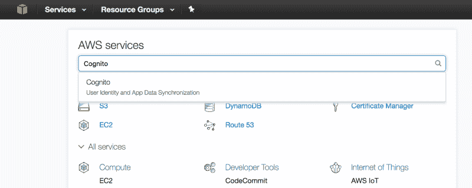

### 初始设置—认知

我们将设置 AWS Cognito，这是一个自定义的登录池(如使用电子邮件登录)。Cognito 不是任何类型登录(如脸书和 Gmail)的登录管理器，只用于自定义登录。

让我们首先通过单击“管理您的用户池”来创建一个用户池。用户池是一组完成相同任务的用户。如果你要克隆优步，你需要创建两个用户池——一个给司机，一个给乘客。现在，让我们创建一个名为“App_Users”的新用户池。设置屏幕应该如下所示:

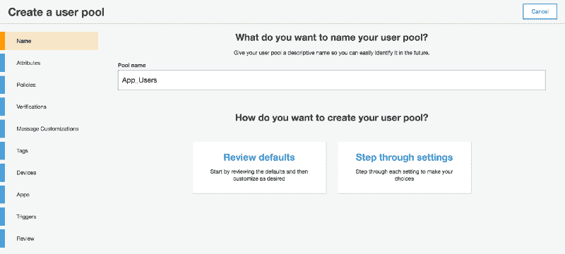

User Pool Name

我们将逐步完成此过程，因此输入“App_Users”池名称，然后单击“逐步完成设置”。下一步是“属性”，我们定义“App_Users”将拥有的属性。

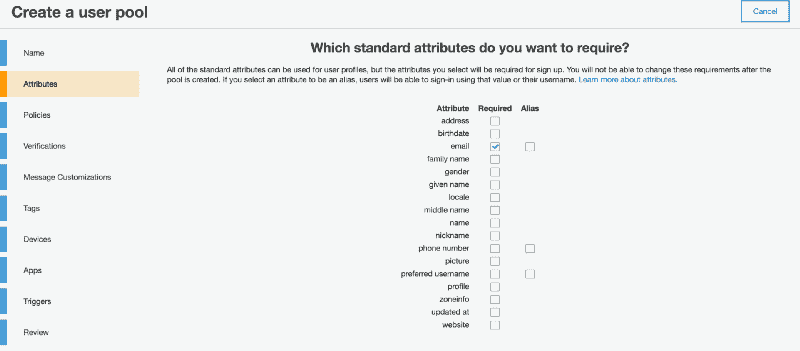

User Attributes

我们现在，我们只想有一个电子邮件，密码和“代理名称”。电子邮件是用户的唯一标识符，密码是必填字段(这就是为什么您在标准属性列表中看不到它)。我们希望用户能够有一个代号，所以让我们设置“agentName”是一个自定义属性。我们仅使用“agentName”来展示如何添加自定义属性。向下滚动，您将看到添加自定义属性的选项。

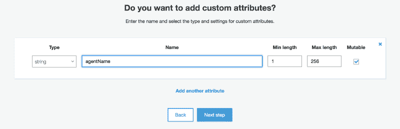

Custom Attributes

截至本教程编写之日，您无法返回并更改自定义属性(尽管 AWS 似乎可以)，所以请确保第一次就做对了！如果您需要更改属性，您必须创建一个新的用户池。希望 AWS 尽快解决这个问题。无论如何，继续帐户政策！

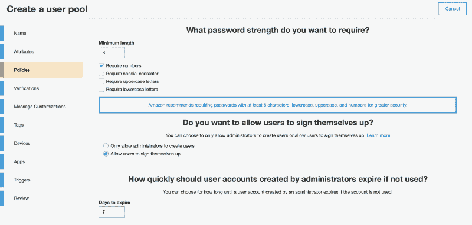

Account Policies

因此，我们可以看到，我们的密码可以强制要求某些字符。显然，要求混合各种字符类型会更安全，但用户通常不喜欢这样。作为折中，我们只要求密码长度为 8+字符，并且至少包含 1 个数字。我们也希望用户能够自己注册。其他部分并不重要，所以让我们进入下一步:验证。

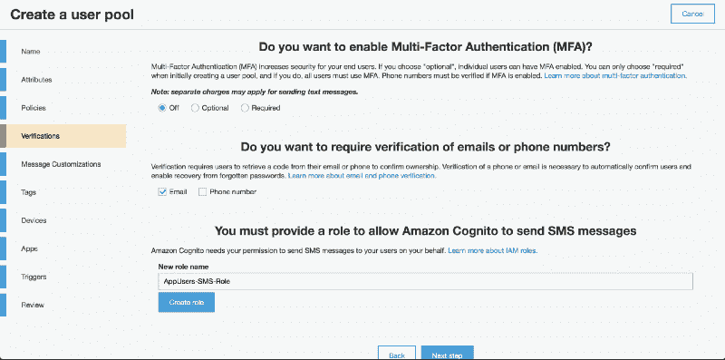

Account Verifications

这部分很酷，我们可以轻松集成多因素认证(MFA)。这意味着用户必须使用电子邮件以及电话号码等其他形式的身份验证来注册。PIN 将被发送到该电话号码，用户将使用它来验证他们的帐户。我们不会在本教程中使用 MFA，只是电子邮件验证。将 MFA 设置为“关闭”,并仅选中“电子邮件”作为验证方法。我们可以保留已填写的“AppUsers-SMS-Role”(IAM Role)，因为我们不会使用它，但将来可能会使用它。Cognito 使用该 IAM 角色来授权发送在 MFA 中使用的 SMS 文本消息。因为我们没有使用 MFA，所以我们可以继续:消息定制。

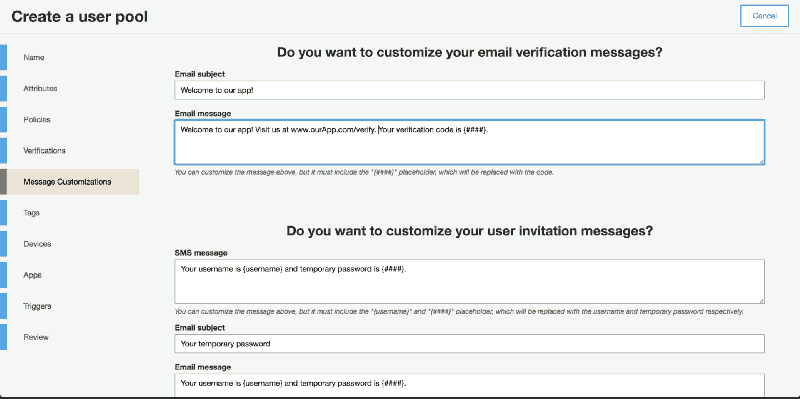

Custom Account Messages

当用户收到他们的帐户验证电子邮件时，我们可以指定该电子邮件的内容。在这里，我们制作了一个自定义电子邮件，并以编程方式将它放入表示为`{####}`的验证 PIN 中。不幸的是，我们不能传入其他变量，如验证链接。为此，我们必须结合使用 AWS Lambda 和 AWS SES。

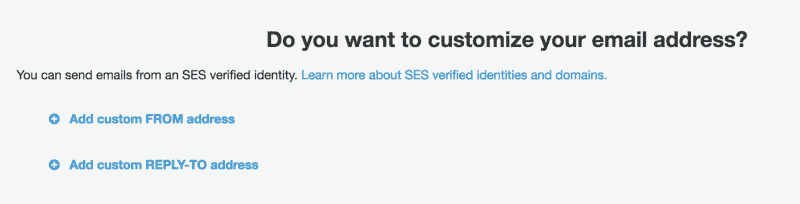

Custom Account Messages

在邮件定制步骤中向下滚动页面，我们可以添加自己的默认发件人和回复地址。为了做到这一点，我们需要在 AWS SES 中验证一封电子邮件，这很容易设置，而且非常快速。在新选项卡中，通过单击左上角的橙色立方体转到 AWS 控制台主页。在控制台主页中，搜索 SES(简单电子邮件服务)。单击进入 SES 页面，然后单击左侧菜单中的电子邮件地址链接。

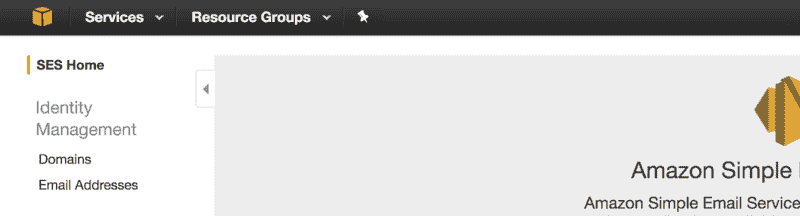

接下来点击“验证新地址”，并输入您想要验证的电子邮件。

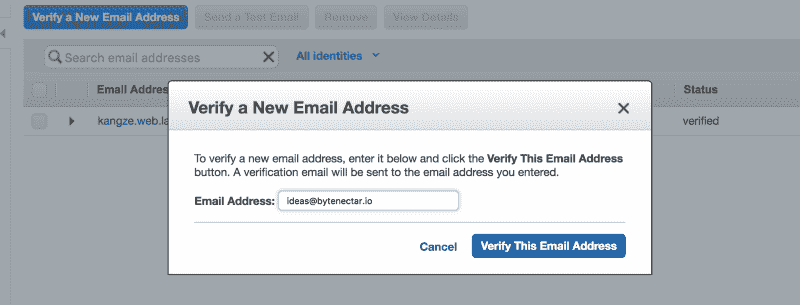

现在登录你的邮箱，从 AWS 打开邮件。单击电子邮件中的链接进行验证，您将再次被重定向到 AWS SES 页面。您已经成功验证了一封电子邮件！那很容易。

现在已经完成了，让我们回到 AWS Cognito，继续讨论:Tags。

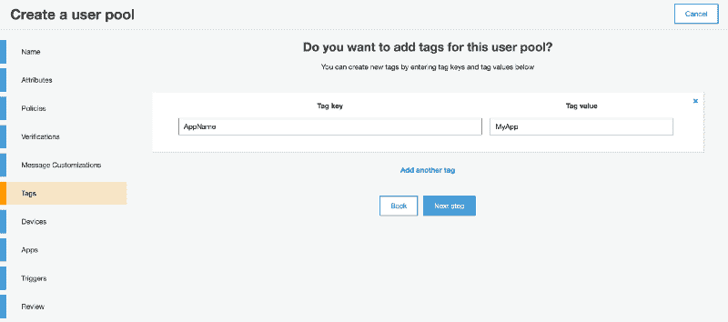

User Pool Tags

向用户池添加标签并不是强制性的，但是对于管理许多 AWS 服务来说，这绝对是有用的。让我们为“AppName”添加一个标记，并将其设置为值“MyApp”。我们现在可以继续:设备。

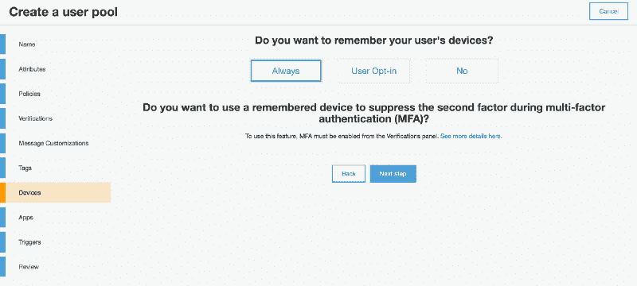

Devices

我们可以选择记住用户的设备。我通常选择“总是”，因为记住用户设备是免费的，不需要我们编写代码。这些信息也很有用，为什么不呢？下一步:应用程序。

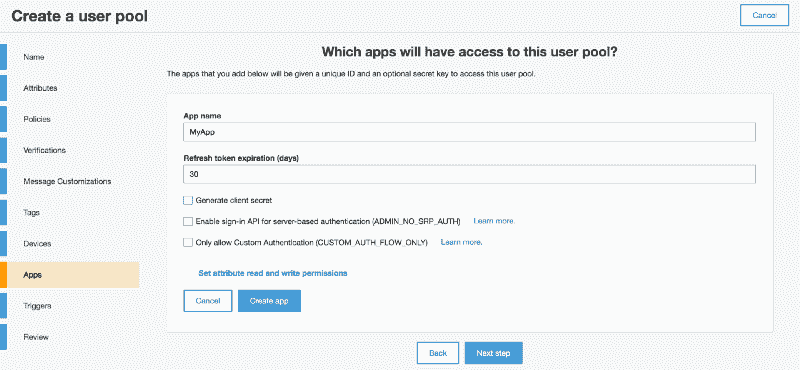

Apps

我们希望某些应用程序能够访问我们的用户池。这些应用程序在 AWS 生态系统的任何其他地方都不存在，这意味着当我们创建一个“应用程序”时，它只是一个认知标识符。应用程序是有用的，因为我们可以有多个应用程序访问同一个用户池(想象一个优步克隆应用程序，和一个免费的驾驶考试练习应用程序)。我们将刷新令牌设置为 30 天，这意味着每次登录尝试都将返回一个刷新令牌，我们可以使用该令牌进行身份验证，而不是每次登录。我们取消单击“生成客户端密码”，因为我们打算从前端而不是后端登录到我们的用户池(因此，我们不能在前端保存密码，因为这是不安全的)。点击“创建应用”,然后点击“下一步”进入:触发器。

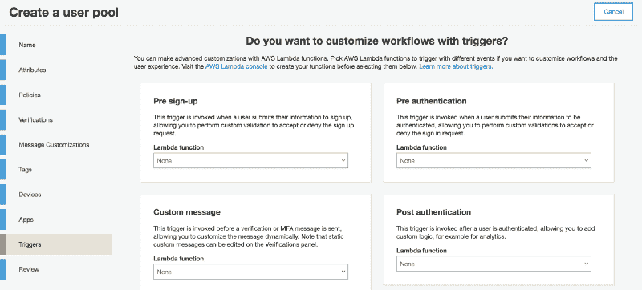

Triggers

我们可以在用户认证和设置流程中触发各种动作。还记得我们说过我们可以使用 AWS Lambda 和 AWS SES 创建更复杂的帐户验证电子邮件吗？这就是我们要设置的地方。对于本教程的范围，我们将不使用任何 AWS Lambda 触发器。下面进入最后一步:复习。

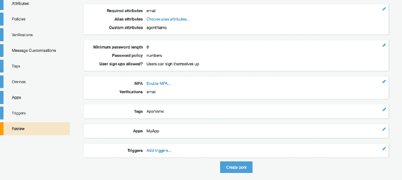

Review

在这里，我们回顾一下我们所做的所有设置配置。如果您确定此信息，请单击“创建库”，我们的 Cognito 用户库将会生成！

记下“Pool details”选项卡中的池 Id `us-east-1_6i5p2Fwao`。

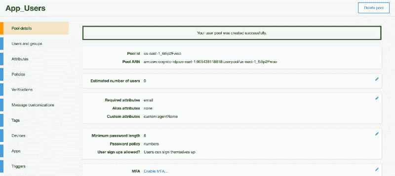

Notice the Pool Id

以及应用标签中的应用客户端 id `5jr0qvudipsikhk2n1ltcq684b`。我们将需要这两个在我们的客户端应用程序。

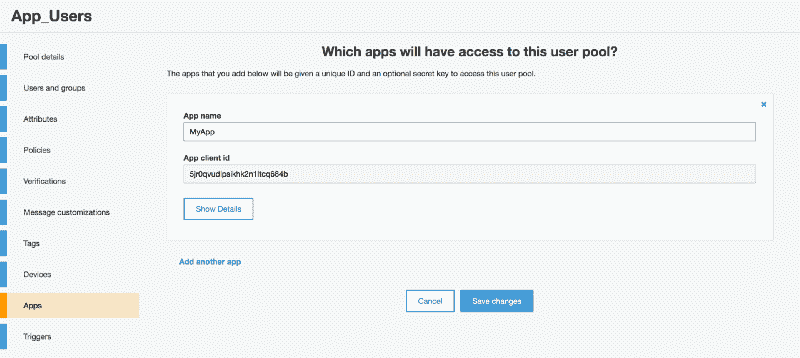

Notice the App client id

既然已经设置了 Cognito，我们就可以为多个登录提供者设置联合身份了。在本教程中，我们不涉及 FB 登录的细节，因为它不在本系列教程的范围之内。然而，集成 FB 登录是非常容易的，我们将在下面的部分展示如何完成。

### 初始设置—联合身份

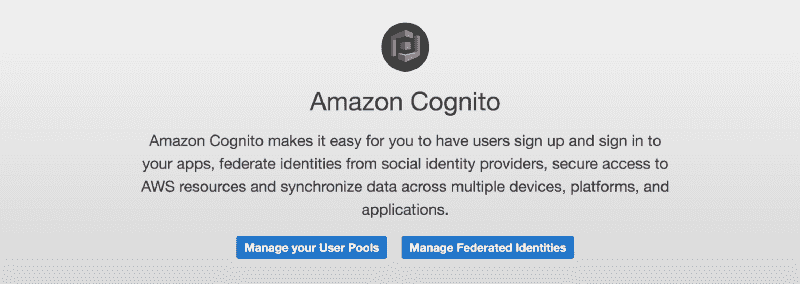

接下来，我们要设置“联合身份”。如果我们有一个应用程序，允许多个登录提供商(亚马逊认知，脸书，Gmail..等等)，我们将使用联合身份来集中所有这些登录。在本教程中，我们将使用我们的亚马逊 Cognito 登录，以及一个潜在的脸书登录。转到联合身份并开始创建新身份池的过程。给它一个合适的名字。

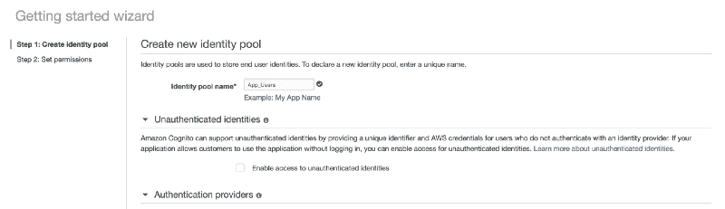

现在展开“身份验证提供者”部分，您将看到下面的屏幕。在 Cognito 下，我们将添加刚刚创建的 Cognito 用户池。复制并粘贴我们之前记下的用户池 ID 和应用程序客户端 ID。

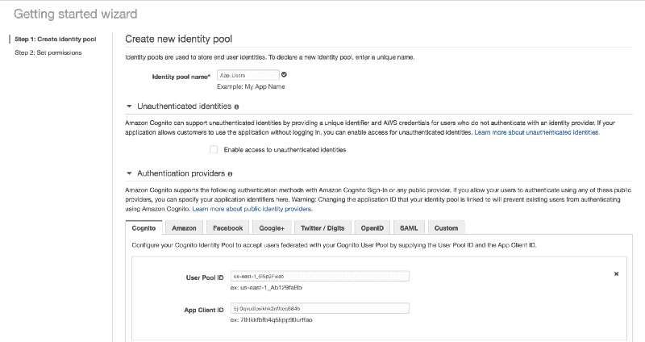

如果我们希望脸书登录同一个用户身份池，我们可以转到脸书选项卡，只需输入我们的脸书应用程序 ID。这就是 AWS 控制台上的全部内容！

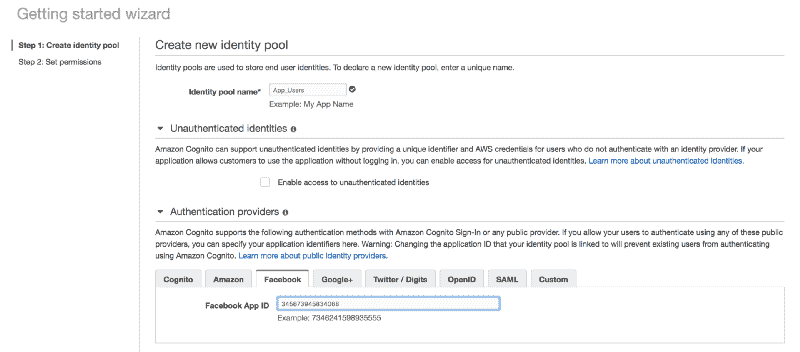

保存身份池，您将被重定向到下面的屏幕，在这里创建 IAM 角色来表示联合身份池。未经身份验证的 IAM 角色适用于非登录用户，经过身份验证的版本适用于登录用户。我们可以授予这些 IAM 角色访问其他 AWS 资源的权限，如 S3 存储桶等。这就是我们如何通过在整个 AWS 生态系统中集成我们的应用程序来实现更高的安全性。继续完成此身份池的创建。

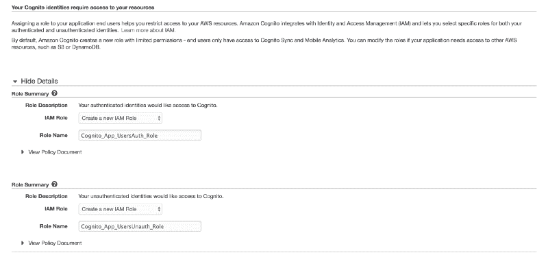

成功创建身份池后，您现在应该会看到下面的屏幕。您现在只需要注意一件事，即身份池 ID(即我们将在后面的代码中使用它。太好了！

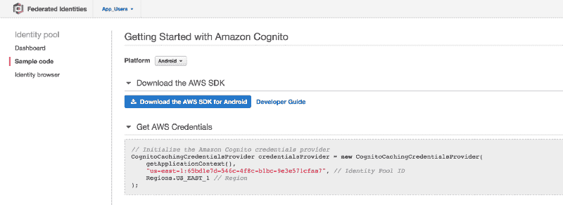

退出所有程序，返回 AWS Cognito 主屏幕。如果我们进入 Cognito 部分或 Federated Identities 部分，我们会看到已经设置了两个必要的池。AWS Cognito 和 AWS 联合身份已准备就绪！

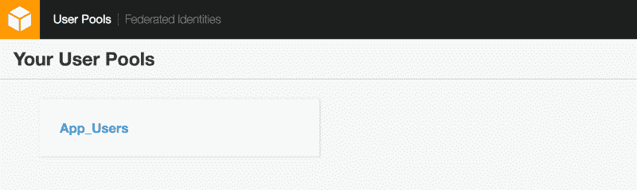

AWS Cognito

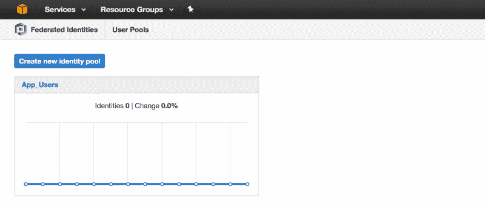

AWS Federated Identities

这就是全部的设置！有了这两个池，我们可以将其余代码集成到 Amazon 的完整认证服务中，并实现顶层用户管理。这比自定义 OAuth+Passport.js 简单多了！如果你喜欢你目前所看到的，请继续阅读！记住你学会这一次以后，以后就超级容易了，所以时间投入绝对值得。下一节再见！

> [**主目录点击这里**](https://medium.com/@kangzeroo/the-complete-aws-web-boilerplate-d0ca89d1691f#.uw0npcszi)

> **A 部分:** [初始设置](https://medium.com/@kangzeroo/user-management-with-aws-cognito-1-3-initial-setup-a1a692a657b3#.pgxyg8q8o)

> **B 部分:** [核心功能](https://medium.com/@kangzeroo/user-management-with-aws-cognito-2-3-the-core-functionality-ec15849618a4)

> **C 部分:** [羽翼丰满的最后一步](https://medium.com/@kangzeroo/user-management-with-aws-cognito-3-3-last-steps-to-full-fledged-73f4a3a9f05e#.v3mg316u5)

> 这些方法在 [renthero.ca](http://renthero.ca) 的部署中被部分使用