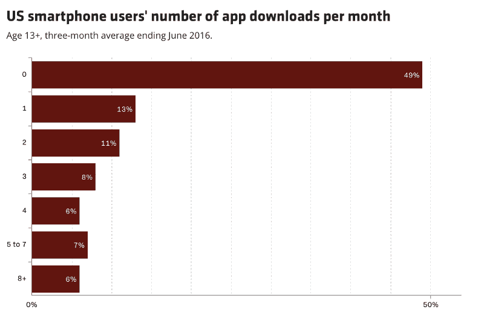
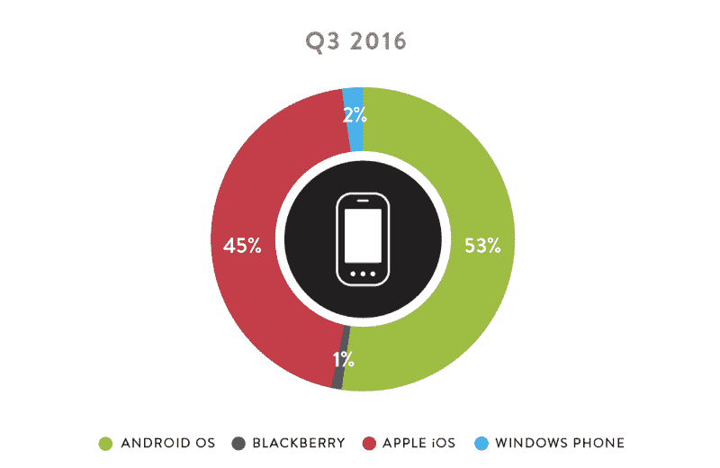
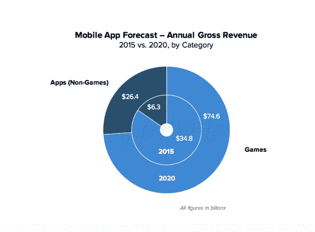

# 所有 2016 年的顶级移动应用都属于谷歌或脸书

> 原文：<https://www.freecodecamp.org/news/all-of-2016s-top-mobile-apps-are-owned-by-either-google-or-facebook-a9c56d77a74b/>

今天尼尔森发布了他们关于 2016 年最广泛使用的移动应用的报告。排名前 8 的应用都被两家公司拥有:谷歌和脸书。

这些应用中有一半是收购的结果:

*   谷歌在 2004 年收购了后来的谷歌地图。
*   谷歌在 2006 年收购了 YouTube。
*   脸书在 2011 年收购了白鲸，并把它变成了 Facebook Messenger。
*   脸书在 2012 年收购了 Instagram。

尽管现在 88%的美国人都有智能手机，但他们基本上已经停止下载新应用了。

Chart by [Recode](http://www.recode.net/2016/9/16/12933780/average-app-downloads-per-month-comscore). Data by [Comscore](http://www.comscore.com/Insights/Presentations-and-Whitepapers/2016/The-2016-US-Mobile-App-Report).

换句话说，移动应用似乎正在变成一个赢家通吃的市场，新来者很难获得任何吸引力。

### 移动应用市场是如何变得如此停滞不前的？

所有这些整合的一个原因是移动应用商店让人们很难发现新的应用。即使你的朋友告诉你一个特定的应用程序，你也知道你在搜索什么，你仍然会在山寨应用程序和彻头彻尾的假货中寻找。

人们不安装新应用的另一个原因是，安装新应用需要时间，而且不利于你的数据计划。呆在脸书的应用程序里做事情更容易。

因此，每月有 16.5 亿人平均每天使用脸书 50 分钟。脸书的使用正在稳步增长，蚕食着其他应用的使用。

过去几年，很难找到突破性应用的例子。不受大公司支持的颠覆性新人的最好例子是 Snapchat，它最近的日使用量超过了 Twitter。

2014 年，脸书试图收购 Snapchat，但 Snapchat 拒绝了他们 30 亿美元的报价。

我不知道还有多少羽翼未丰的初创公司有胆量拒绝这样的提议。2012 年，Groupon 拒绝了谷歌 60 亿美元的收购要约，结果不到一年后，Groupon 董事会解雇了其首席执行官。

### 其他大公司的应用程序呢？

你可能认为苹果会有最受欢迎的应用程序。毕竟，iPhone 占据了美国智能手机市场的半壁江山。

US Smartphone operating systems by market share in 2016\. Data and chart by [Nielsen](http://www.nielsen.com/us/en/insights/news/2016/tops-of-2016-digital.html).

但唯一进入尼尔森前十的苹果应用是苹果音乐，它是在经过一场激烈的营销活动后于今年夏天推出的。

就试用期结束后付费继续使用的人而言，苹果音乐的数字看起来并不太好。明年 Apple Music 不太可能成为顶级应用。

苹果有很多成功的应用程序，尽管其中许多都很受欢迎，因为它们是苹果 iOS 中的默认应用程序，并且与 Siri 等工具紧密集成。但是这些应用都没有谷歌和脸书的旗舰应用受欢迎。

手机上的其他应用程序可能包括作为服务入口的实用程序，如亚马逊、网飞和优步。你可能也有一些来自银行、航空公司、杂货店和其他传统企业的应用，鼓励你下载他们的应用。

这就是移动应用的全部内容。

但是等等。我们忘记了谷歌和苹果应用商店真正的摇钱树。

### 80%的移动应用收入来自游戏

手机游戏占据了应用商店的收入。他们可能会继续这样做。

Chart by [Gamasutra](http://www.gamasutra.com/view/news/265580/Mobile_games_to_drive_app_store_revenue_to_101_billion_by_2020.php)

但和非游戏应用一样，游戏也是赢家通吃的命题。普通的手机游戏[的总收入只有大约 3000 美元](http://smallbusiness.chron.com/average-revenue-iphone-game-60261.html)——远远不足以抵消其开发成本。

那些巨大的成功呢？2016 年的必备游戏《精灵宝可梦 Go》怎么样？

嗯,《精灵宝可梦 Go》是建立在任天堂的知识产权之上的，任天堂是一家有着 127 年历史的跨国公司，显然不是独立游戏工作室。

而且 Pokémon Go 游戏本身就是 Niantic 开发的，Niantic 是……你猜对了——谷歌的部分子公司！

没错——即使 Pokémon Go 在 2016 年足够受欢迎，成为顶级应用，也不会改变这个基本现实:谷歌和脸书拥有移动应用行业。

### 好的。那么，移动应用结束了吗？

我将不再害羞地说[本地应用注定](https://medium.com/javascript-scene/native-apps-are-doomed-ac397148a2c0)。

如果你碰巧掌管着一家拥有数百万客户的大公司，投资开发优秀的移动应用程序可能还是值得的。你至少可以让你的一些客户使用这些应用，他们可能会获得足够的价值来证明自己的努力。

但如果你是一家初创公司或开发者，希望真正建立用户基础并赚钱，我会建议你非常谨慎地进行移动应用开发。

网络是一个更便宜、更容易制造产品和吸引用户的地方。这也是一个你不会因苹果和谷歌应用商店的突发奇想而生离死别的地方。

像 Cordova 或 React Native 这样的工具可以让你使用 JavaScript 更快、更便宜地构建移动应用。有了这些，你可以推迟学习特定平台语言和框架的需要，或者寻找专业的 iOS 和 Android 开发人员，直到你的应用已经有很多用户。

还有像[渐进式网络应用](https://www.smashingmagazine.com/2016/08/a-beginners-guide-to-progressive-web-apps/)这样的选项，它们基本上是 JavaScript 驱动的网络应用，可以离线工作，并具有推送通知等重要的移动应用功能。

即使剩下的两个移动应用生态系统——iOS 和 Android——确实已经成熟到不允许新的可行的移动应用出现，我也不会太担心。智能手机只是有待开拓的前沿领域之一。

2017 年可能会出现对虚拟现实应用的真正需求。亚马逊在这个假期销售了数百万台 Echo 设备。它现在可能有足够大的安装基础，让使用 Alexa 对话界面的应用程序起飞。

勇敢的开发人员和企业家总会探索新的领域。

我只写编程和技术。如果你在推特上关注我，我不会浪费你的时间。？