# 2017 年你可以期待的 JavaScript 大会

> 原文：<https://www.freecodecamp.org/news/javascript-conferences-to-attend-in-2017-b46b288a5df0/>

作者:Dheeraj Joshi

# 2017 年你可以期待的 JavaScript 大会

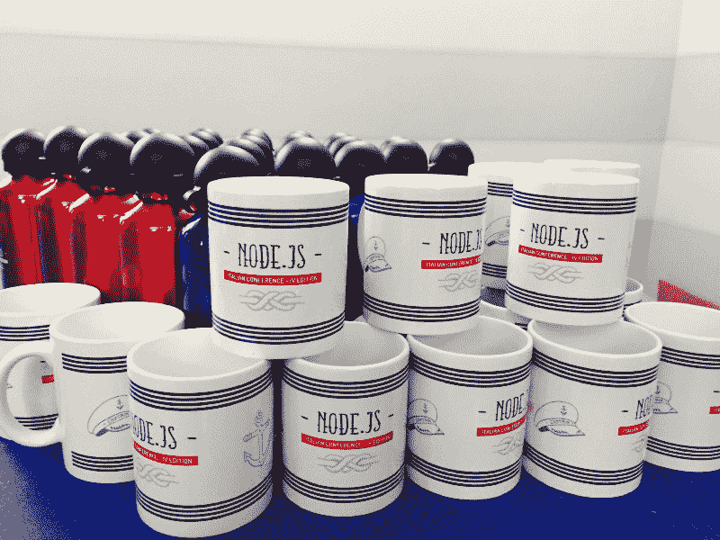

A picture from Node.js Conference ’16, Italy

会议是交朋友和向专家学习的好方法。你甚至可以尝试就一个主题进行陈述。

以下是 2017 年值得期待的一些 JavaScript 大会。

#### 布达佩斯 NodeConf 月 19 日至 20 日，匈牙利布达佩斯

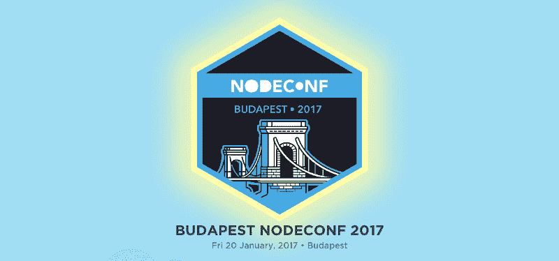

布达佩斯 node conf 是一个为期一天的单场会议，重点关注人们需要了解的 Node.js。前一天还有一场特殊的 NodeSchool 活动。

#### 代理商会议:1 月 20 日至 21 日，奥地利多恩比恩

[AgentConf](http://www.agent.sh/) 是第一个关于 JavaScript 和软件工程的 alpine 会议。专家和核心贡献者将展示他们在 ReactJS、ReactNative、Node 等领域的工作。

#### 剧本 17:1 月 27 日，奥地利林茨

[Script’17](https://scriptconf.org/)是一个为期一天的活动，重点是 JavaScript。

#### 开发者周:2 月 13 日至 15 日，加利福尼亚州旧金山

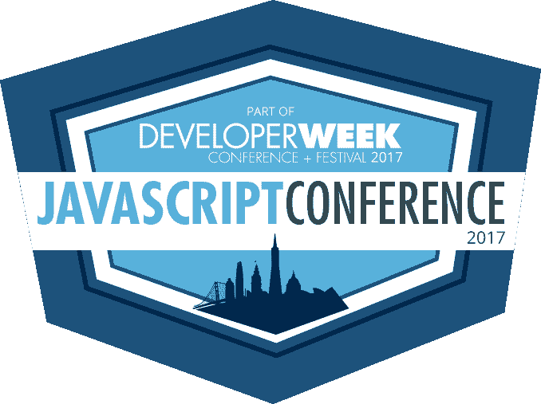

这是 [DeveloperWeek](http://www.developerweek.com/javascript-conference/) 第一次举办 JavaScript 会议。这是为期 3 天的关于 JavaScript 的研讨会和行业讨论。

#### react London:3 月 28 日，英国伦敦

Red Badger 将于 2017 年在伦敦举办一场名为 [React London 2017](https://react.london/) 的新会议。

#### ember conf:3 月 28 日至 29 日，俄勒冈州波特兰

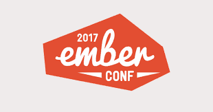

EmberConf 与来自世界各地的 Ember 核心团队和社区成员一起举办会议、活动和欢乐时光。

#### 渲染:3 月 30 日至 31 日，英国牛津

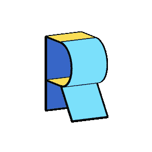

[Render Conf](http://2017.render-conf.com//) 是为前端开发者举办的为期 2 天的会议。它是 [jQuery UK](https://medium.com/@whiteoctevents/life-after-jquery-uk-5253277d556c#.9dtjtzs7j) 的继任者，于 2017 年回归牛津，进入第二年。这是一个单轨会议。

#### SmashingConf:4 月 4 日至 5 日，加利福尼亚州旧金山

[SmashingConf](https://smashingconf.com/) 专注于 UX 和前端开发。

#### ng-conf:4 月 5 日至 7 日，犹他州盐湖城

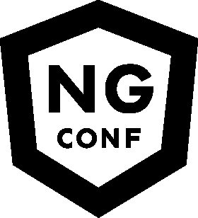

[ng-conf](https://www.ng-conf.org/) 是世界原创角大会。

#### 反应阿姆斯特丹:4 月 21 日在荷兰阿姆斯特丹

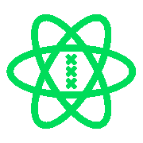

[React 阿姆斯特丹](https://react.amsterdam/)是一个全天的双轨制会议，讨论 React 的所有内容。

#### 活性成分:4 月 28 日，加州旧金山

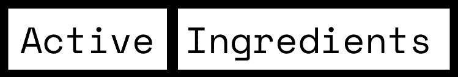

[Active Ingredients 2017](https://activeingredients.info/) 是全球首个聚焦 JAMstack 的会议。花一天时间向一些 web 开发领域最杰出的人学习。

#### JSConf EU:5 月 6 日至 7 日，德国柏林

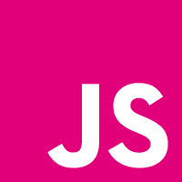

JSConf EU 是欧洲 JavaScript 社区的爱心工作会议。

#### JSDay 意大利:5 月 10 日至 11 日，意大利维罗纳

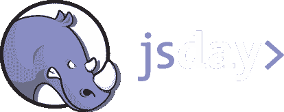

phpDay 的组织者表示，JSDay 是在意大利举办的第一个关于 JavaScript 的国际会议。

#### react Europe:5 月 18 日至 19 日在法国巴黎举行

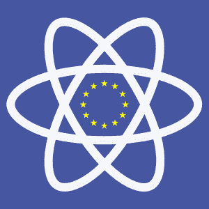

ReactEurope 将探索使用 React.js、React Native、GraphQL、Relay、Universal apps、Webpack、inline CSS 等工具的新方法。

#### 前沿趋势，5 月 24 日至 26 日，波兰华沙

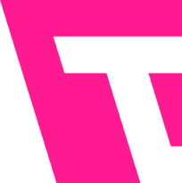

[前沿趋势](https://2017.front-trends.com/)专注于前端开发。

#### ng-cruise:5 月 29 日-6 月 2 日，佛罗里达州迈阿密

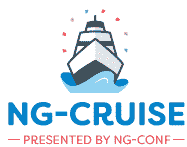

第一届[角巡航](https://ngcruise.com/)发布会。游轮从迈阿密出发，前往巴哈马。

#### 流利:6 月 19 日至 22 日，加利福尼亚州圣何塞

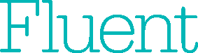

[O'Reilly Fluent](http://conferences.oreilly.com/fluent/fl-ca) 将专注于 web 开发及其他方面。

#### vue conf:6 月 21 日至 23 日，波兰弗罗茨瓦夫

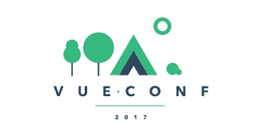

[VueConf](https://conf.vuejs.org/) 是全球第一个正式的 Vue.js 大会。

#### AngularCamp:7 月，西班牙巴塞罗那

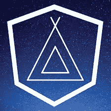

[AngularCamp](https://angularcamp.org/) 会议是一个为期一天的单场会议，由国际知名的社区演讲者进行精彩的演讲。

#### 前端会议:8 月 31 日至 9 月 1 日在瑞士苏黎世举行

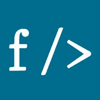

苏黎世的[前端会议](https://frontendconf.ch/)是瑞士关于前端和 UX 技术的会议。

#### 北欧会议:9 月 7 日至 8 日在瑞典斯德哥尔摩举行

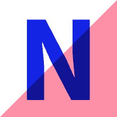

[Nordic.js](http://nordicjs.com/) 是一个为期两天的 JavaScript 会议。

#### angular connect:11 月 7 日至 8 日在英国伦敦举行

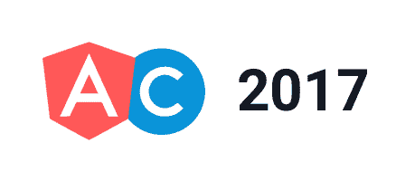

[AngularConnect](http://angularconnect.com/) 是一个为期两天的多轨道会议，有各种各样的 Angular 实验，包括谷歌的核心 Angular 团队。

#### half stack 2017:11 月 17 日在英国伦敦举行

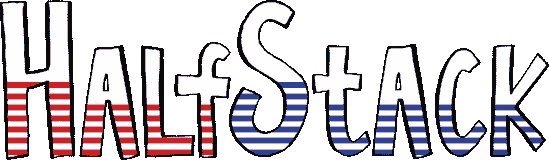

HalfStack 是一个在酒吧里举行的为期一天的单场 JavaScript 会议。

最近，我有几次机会参加关于 JavaScript 安全性的精彩会议并发言。你可以[了解我的经历](http://engineering.wingify.com/posts/wingify-at-europe-uk-conferences/)和[在 Twitter 上关注我](https://twitter.com/dheerajhere)。