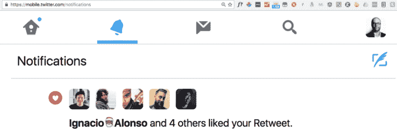
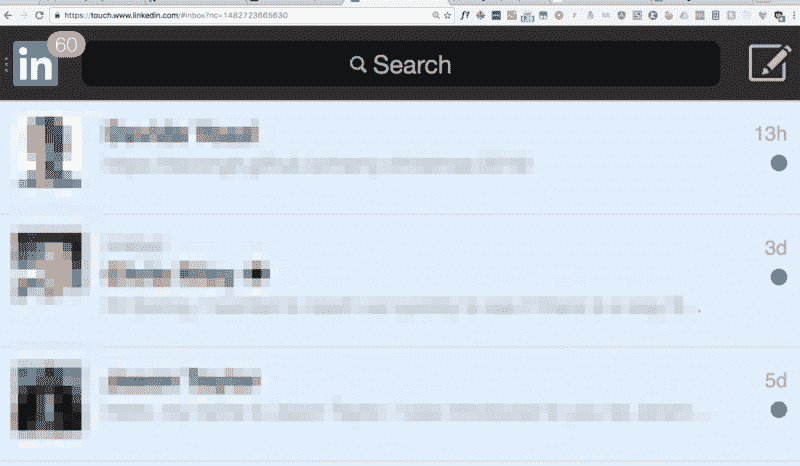
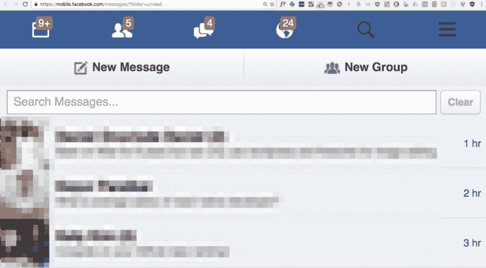
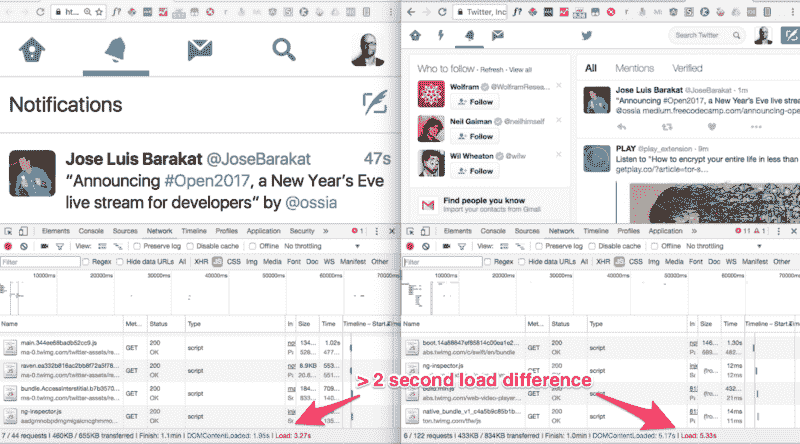
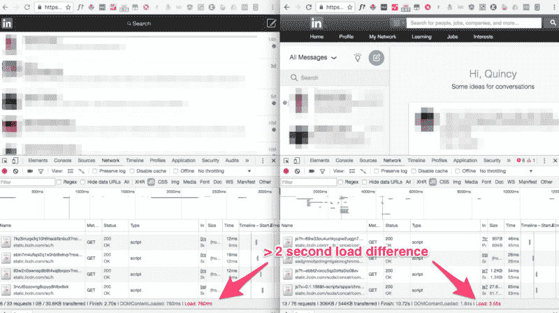
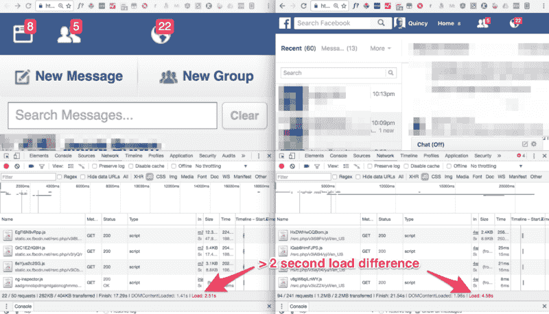

# 如何使用隐藏的移动网络更快地完成工作

> 原文：<https://www.freecodecamp.org/news/its-faster-here-5634f8a9a262/>

在我发表这篇文章一个小时后，好莱坞传奇和《星球大战》女演员凯丽·费雪去世了。我没有删除《星球大战》中的引用，而是决定将这篇文章献给她作为纪念。安息吧，凯莉。

宇宙中最快的东西:

1.  超光速引擎
2.  曲速 9
3.  光
4.  运行在桌面上的移动网络

### 生活专家提示:使用网站的移动网络版本

等等。现在是 2017 年。早在 2011 年，我们就有了响应式网站。现在还有专门的手机网页版本的网站吗？

令人惊讶的是，是的。脸书、Twitter 和 LinkedIn 就是三个这样的网站。所有这些都比他们的桌面和移动应用程序要好得多。

原因如下:

*   他们更快
*   他们的广告少得多
*   他们有更干净、更少干扰的界面

所以让我们开始在 zen 模式下使用网络。

### 微型推特

您将获得:

*   您的新闻源
*   您的通知
*   你的信息

你不明白:

*   趋势
*   在空白处播放视频
*   偶然点击的瞬间按钮

### 小 LinkedIn

您将获得:

*   您的通知
*   你的信息
*   您的连接邀请

你不明白:

*   发布与工作或职业无关的内容的新闻源
*   LinkedIn 缠着你“完成你的个人资料”
*   LinkedIn 第 n 次缠着你给你所有的电子邮件联系人发垃圾邮件

### 快速脸书

您将获得:

*   您的新闻源
*   您的朋友请求
*   你的信息
*   您的通知

你不明白:

*   趋势(基本上是脸书的广告)
*   自动播放视频
*   到处都有聊天框
*   侧边栏中的假新闻

### 我有提到它更快吗？

下面是 Chrome 网络标签打开时 Twitter 的硬刷新:

和 LinkedIn:

和脸书:

由于这些页面使用较少的多媒体、较少的样式和较少的 JavaScript，您在其中做的一切都感觉更快。你进去，把事情做完，然后很快出来。

### 开始在桌面上使用移动网络。

将这些链接加入书签:

*   手机网络推特通知:[https://mobile.twitter.com/notifications](https://mobile.twitter.com/notifications)
*   移动网络 LinkedIn 消息:[https://touch.www.linkedin.com/#inbox](https://touch.www.linkedin.com/#inbox)
*   手机网 https://mobile.facebook.com/messages 消息:[脸书](https://mobile.facebook.com/messages/?folder=unread)

你经常使用的其他网站可能会有手机网页版本。例如，亚马逊的禅宗式移动网络购物体验及其核心搜索功能。

所以加入我的网络更快。

我只写编程和技术。如果你在推特上关注我，我不会浪费你的时间。？