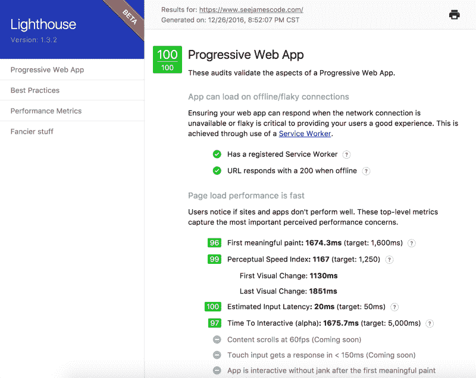
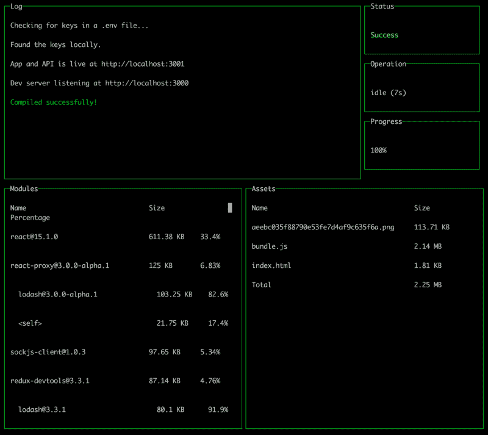
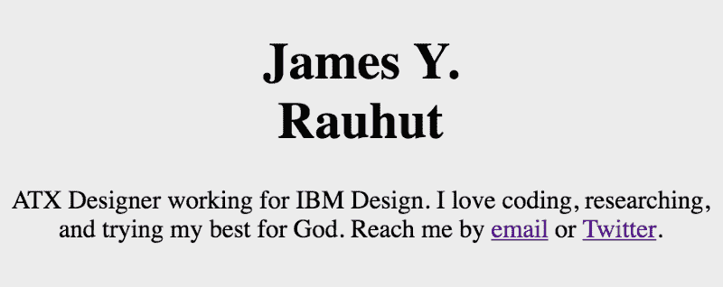

# 如何将你的渐进式网络应用程序的谷歌灯塔得分提高到 100 分

> 原文：<https://www.freecodecamp.org/news/how-to-crank-your-progressive-web-apps-google-lighthouse-score-up-to-100-cfc053eb7661/>

如果 Chrome 开发团队想向开发者传递一个信息，那就是:**性能至关重要**。

速度是他们最近的 Chrome 开发者峰会的中心议题。他们非常清楚地表明，用户没有耐心，移动网络有很高的延迟。

如果你能最大限度地提高网络应用的速度，谷歌会在搜索引擎结果中给你优先排名。更好的排名意味着更多的用户。也是更快乐的用户。



谷歌甚至建立了一个名为 Lighthouse 的[命令行界面和 Chrome 插件工具来引导你走向高性能。](https://github.com/GoogleChrome/lighthouse/)

Lighthouse 模拟了许多可能影响用户体验的不同情况。然后，它会返回一个 1-100 分的等级，说明你的渐进式网络应用程序如何处理它们。

现在你可能会想，“为什么我要让谷歌指挥我如何构建我的网站？”或者你可能在想，“好吧，谷歌不知道我除了速度之外的所有其他项目要求。”

嗯，我不相信谷歌试图成为这个领域的权威，或者定义你的首要任务应该是什么。相反，我认为谷歌建立 Lighthouse 是为了将达到他们认为用户要求的性能指标的过程游戏化。

所以你应该根据你现有的优先级来权衡每一个灯塔标准，然后自己决定哪些瓶颈是值得解决的。

当我第一次发现 Lighthouse 插件时，我测试了我的 90 年代作品集网站。今年早些时候，在我厌倦了手动更新我的工作后，我把这个 web 应用程序扔在了一起。

使用 Node、Webpack 和 React，我的网站——[seejamescode.com](https://www.seejamescode.com/)——通过从许多不同的 API 获取我最近的活动来响应请求。我对这个应用相当满意。

直到我运行了 Lighthouse，它给了我 63/100 的分数。但是，我并没有对此感到愤怒，而是把他们的分数当成了一种挑战，让我在空闲时间学习新东西。

每当我学会一种技术来帮助提高我个人网站的分数时，我就会回到公司的项目中，按照以下顺序进行改进:

1.  改进第一个有意义的“画图”(用户界面渲染)
2.  提高感知速度指数
3.  为目录添加清单文件
4.  添加 HTTPS 并重定向到它
5.  为离线功能添加服务人员
6.  确保关闭 JavaScript 的用户仍然收到与启用 JavaScript 的用户相同的信息。

让我们更深入地看看这些优化都需要什么。

### 第一幅有意义的画

首先，有意义的绘画是 web 开发人员一直在追踪的东西，但有一点小小的变化。我们一直关心用户需要多长时间才能看到页面上的一些内容(首次绘制)。第一幅*有意义的*画要求我们记录用户需要多长时间才能看到主要内容，而不仅仅是导航条。

有趣的是，这可以用我们许多人已经解决性能问题的方法来解决:确保应用程序发送尽可能少的数据。

例如，一个评论者曾经检查过我的网站。他们发现我要求的图像尺寸大约是 1200 像素宽！我很高兴他们发现了这一点，因为这是减少我的网站加载时间的第一步。尽管我的 CSS 不会显示比 500 像素更宽的图像，但是用户还是要花很多时间来加载这些图像。

通过请求小到 500 像素的图像，我能够将这些图像请求的大小减半。

减少我第一次有意义的绘画的另一个技巧是更聪明地使用我的 Webpack 包。如果您使用 Webpack，请确保查看您可以为生产做出的许多优化。你能做的最重要的事情就是聪明地对待你的依赖。

[检查你的捆绑包](https://www.npmjs.com/package/webpack-bundle-analyzer)并确定是否有你不需要的第三方代码。在我自己的捆绑包检查之后，我意识到我并不真正需要 Moment.js。虽然这个库增加了很多价值，但是将它作为一个依赖项从我的捆绑包中删除了 60kb。

降低 Node 应用程序负载的最快方法是确保发送的所有内容都经过压缩。查看一下 [Node.js 压缩中间件](https://www.npmjs.com/package/compression#expressconnect)。如果您使用 Express，您只需要这个中间件，它将为您处理其余的事情。我已经看到这个中间件将应用程序的负载大小减少了一半以上！



If you would like to keep track of your Webpack bundle’s dependencies during development, checkout [Webpack Dashboard](https://github.com/FormidableLabs/webpack-dashboard) from the infamous [Ken Wheeler](https://twitter.com/ken_wheeler/). “Now when you run your dev server, you basically work at NASA.”

### 感知速度指数？

感知速度指数是一个很好的统计数据，因为它与用户体验相结合。你的用户认为你的应用有多快？在加载内容时，他们是否看到抖动？他们有信心知道页面已经加载完毕吗？

“内容跳跃”是糟糕的感知速度指数的最大原因之一。发生这种情况有两个原因:

1.  你的用户会尽快开始寻找他们想要的内容，这意味着他们会在你的页面加载完成之前向下滚动。
2.  您的包含元素在 CSS 中没有预定义的高度。

解决这个问题的棘手之处在于，你要么知道你的内容在屏幕上占据的物理空间，要么尽可能地伪装它。

许多开发者在脸书的移动应用中看到了一个解决方案，叫做“框架占位符”虽然脸书的移动应用程序获取数据，但它用灰色条填充帖子，模拟标题、图像和段落间距。

一个更简单的解决方法是指定包含元素的最小高度。这将降低用户遇到暴力内容跳转的可能性。

### 用清单文件帮助网站


You will not find any results for “Flipkart” on the Apple App Store. However, that is no problem with their progressive web app!

这主要是一个政治问题。谷歌和微软想用你的网络应用取代苹果的应用商店。公司使用您清单中的元信息将您的 web 应用程序分类并归档到他们的目录中。当你的用户将你的应用程序保存到他们的主屏幕时，它还可以帮助浏览器创建令人愉快的图标。

作为一名 web 开发人员，没有强烈的理由反对这个标准。在我在本文中提到的所有问题中，这个问题是最容易解决的。创建一个 [manifest.json 文件](https://github.com/seejamescode/see-james-code/blob/master/public/manifest.json)，并将其引用到一个 [HTML 链接标签](https://github.com/seejamescode/see-james-code/blob/master/index.html#L8)。

### 保护堡垒

用 HTTPS 保护你的网站通常不是初级开发人员首先想到的事情。毕竟你的网站没有它也能过得去。

但是[浏览器正在推动](https://developers.google.com/web/fundamentals/security/encrypt-in-transit/why-https)每个网站拥有 SSL 证书。这确保了第三方不会将代码发给你的用户。

所以告别注入式广告的风险！你可以从[获得免费的 SSL 证书让我们加密](https://letsencrypt.org/)。而且各大主机平台好像都有在他们平台上入门 Let's Encrypt 的教程。例如，我在搜索“[让我们加密和 Bluemix](https://www.ibm.com/blogs/bluemix/2016/08/securing-custom-domains-lets-encrypt/) ”时发现了这篇有帮助的文章

灯塔希望你能更进一步。你不仅应该有一个 SSL 证书，以便“https://…”网址为您的网站工作。Lighthouse 还希望你将任何试图访问“http://…”的用户重定向到你网站的 https 版本。

这是一个主动的步骤，有助于将您的用户转移到安全的目的地。

幸运的是，这就是我使用 Node 和 Express 来满足这一要求所花费的全部时间:

```
// Avoid redirect if on localhost developing
if (NODE_ENV === 'production') {
  // Redirect http to https
  app.enable('trust proxy');
  app.use (function (req, res, next) {
    if (req.secure) {
      next();
    } else {
      res.redirect('https://' + req.headers.host + req.url);
    }
  });
}

// I swear this came from StackOverflow like half of my code
```

### 变得脱机友好

服务人员帮助您指定用户的浏览器应该在本地保存哪些文件。您可以将其视为更智能的缓存，以确保用户即使在飞行模式下也可以访问信息。

这也将加快你的网站的加载时间，当你的用户在未来回到它。

很长一段时间我都被困在实现服务工作者上，因为我不知道从哪里开始。然后我发现最神奇的 git diff 来自 [Jeffrey Posnick](https://twitter.com/jeffposnick) 演示了三个简单的文件更改，帮助创建-反应-应用程序支持服务人员。我喜欢这个例子，因为它准确地显示了帮助您实现它的部分，而不是仅仅将您指向整个样板文件。

在未来，我计划探索使用 [IndexedDB](https://developer.mozilla.org/en-US/docs/Web/API/IndexedDB_API) 来存储用户第一次访问时收到的 API 数据，以便更快地回访。

### 没有 JavaScript，没问题

最重要的是确保用户即使在浏览器中禁用了 JavaScript 也能收到信息。为什么人们会在浏览器中禁用 JavaScript？有[多个奇怪的用例](http://softwareengineering.stackexchange.com/questions/26179/why-do-people-disable-javascript)。但底线是:我们关心用户！我们如何支持他们？



A screenshot of what users see when they visit my website without JavaScript enabled. I do want to provide more information to non-JavaScript users soon, but for the meantime this is the bare essentials. Server-side rendering would be a great solution to this.

我们支持禁用 JavaScript 的浏览器，方法是用 [< noscript >标签](https://developer.mozilla.org/en-US/docs/Web/HTML/Element/noscript)踢它的老派。只要用户禁用了 JavaScript，就会显示这个 html 标记中的任何内容。如果您想给这些用户完整的体验，您可以添加服务器端渲染。

### 去灯塔吗？

您可以看到从 11 月 14 日到 12 月 18 日的所有提交。

尽管我的所有提交都在一个月内完成，但实际上我花了相当长的时间才在 Lighthouse 上达到满分。这是因为 Lighthouse 上的每个标准都是有用的，你可以独自去学习。这些都不需要互相依赖，但都有助于你的应用程序的整体用户体验。

每当我学习如何在我的投资组合中实现一个新的比特，我就很容易地把它实现到我的工作项目中。

我敢肯定，最终会有一个灯塔的更新，使我的分数下降。不过这不是问题！该插件仍处于测试阶段，将继续为我提供新的学习科目。

我希望你能自己接受这个挑战，尽一切努力帮助改善用户的体验。

请在评论中分享或[发推特给我](https://twitter.com/seejamescode)一些你提高灯塔分数的酷方法！我会试着分享它们。我也强烈推荐 [Addy Osmani](https://twitter.com/addyosmani) 用 React.js 在 [PWAs 上的系列！](https://medium.com/@addyosmani/progressive-web-apps-with-react-js-part-i-introduction-50679aef2b12#.dhyo6dmuj)

你也可以通过留言、[给我发邮件](mailto:james@seejamescode.com)或者发微博给 [@seejamescode](https://twitter.com/seejamescode) 来联系我。我在 ATX 的 IBM Design 工作，总是喜欢和网页设计社区交流。

另外，感谢[大卫·康纳](https://twitter.com/Dave_Conner)和[杰森·伦斯托夫](https://twitter.com/jlengstorf)对这篇文章的同行评议！