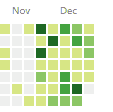
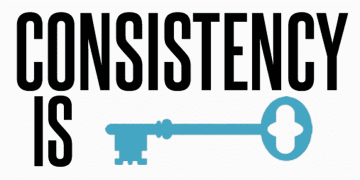

# 从我长达一个月的 GitHub 提交记录中得到的教训

> 原文：<https://www.freecodecamp.org/news/lessons-from-my-month-long-github-commit-streak-b8f3167d34ac/>

由 JS

# 从我长达一个月的 GitHub 提交记录中得到的教训

> “我想学 JavaScript。就像，真正的学习它。喜欢，真正地*理解它。*“—2016 年 11 月的我

当然，这是一个崇高的目标。尤其是对于一个仅仅从事编程六个月的人来说，毫无疑问是在 *not-JavaScript* (Ruby，如果你一定要知道)*。*一项特别艰巨的任务在你被一遍又一遍地告知 JavaScript 有多*怪异*之后。但是我可以很固执。

大约两个月前，我结束了在消防软管项目的一段时间，在那里我一边兼职学习，一边做一名律师。这是一次很棒的经历。我学习了构建复杂的 Ruby on Rails 应用程序、测试驱动开发等等。但是当这个项目结束后，我想学习更多关于 JavaScript 的知识——这是一种为网络提供强大动力的语言。

我求助于 [freeCodeCamp](https://freecodecamp.com) ，这是我在注册 Firehose 项目之前最初用来学习基本 HTML 和 CSS 的资源。freeCodeCamp 有一个健壮的、项目驱动的、面向 JavaScript 的课程，看起来是掌握基础知识的完美选择。

然而，如果没有付费项目的结构，我担心我会成为拖延症的受害者，或者想出一些借口来解释为什么当事情变得困难时我应该停下来。

我想到了一个解决方案:完成 freeCodeCamp 项目，在至少一个月的时间里，每天至少向 GitHub 提交一次。不管怎样。不管我是否想编码。不管我在某一天感觉如何。我很高兴地说，我实现了我的目标。我学到的东西让我吃惊。

#### 第一课:即使在我不想编码的日子里，一旦我强迫自己开始，我也经常愉快地工作几个小时。

30 days (and counting) of commits!

> “不写作的乐趣如此之大，以至于一旦你开始沉迷其中，你就再也不会写作了。”——约翰·厄普代克。

坐以待毙等待合适的时机或灵感来临时是个糟糕的主意。虽然这种等待灵感的想法大多出现在创意领域，但它的一种变体也可以在其他学科扎根。

不要等到你“有心情编码”或者想到一个新应用的好主意。不要等待灵感。开始吧。

如果你没有任何正在进行的项目，登录 [Code Wars](https://codewars.com) 做几个形。在您一直想要检查的框架中做一个简单的实现。这个领域足够广阔，总有你可以研究的*东西*。

此外，开始这个简单的行为可能会激励你继续下去。

在过去的一个月里，有好几天，在漫长的一天工作之后，我最不想做的事情就是坐在家里的办公桌前，与一些编码问题作斗争。但更多的时候，一旦开始工作，我发现很容易坚持下去。

头脑有一种可怕的小题大做的方式。不要上当。

#### 第二课:我认识到我能够在一段时间内致力于某事——不是因为我为此付了很多钱，也不是因为我被要求——而是因为我设定了一个我想要实现的目标。

Don’t let Shia down.

我很难坚持做我不感兴趣的事情。

我的每个新爱好都有一个短暂的蜜月期，这是我一天中唯一能想到的事情。这持续了大约一个月，大概是这样的:我进步很快，每天都在学习一些很棒的东西。我感觉更自信了。我开始有夸大妄想。“我很快就会成为一名大师(钢琴家/摄影师/艺术家/作曲家)，”我小声对自己说。

然后，突然之间，我停止了明显的进步。它变得很难。我碰壁了。魔法消失了。我在想这东西到底是不是不适合我。

除非你是个神童，否则你很可能经历过类似的事情。戒烟是如此容易(任何曾短暂看到我脖子上挂着 DSLR 或手里拿着素描本的人都可以作证)。但是这是一个很糟糕的方式去做好任何事情。

学习编程并不容易。任何人都可以告诉你这并不总是有趣的。有时候我想放弃，因为我觉得自己进步得不够快。但是学习编程更像是一场马拉松，而不是短跑，当你考虑你的目标，以及几周、一个月或一年后你想达到的目标时，记住这一点很重要。没有人会在一夜之间成为这方面的专家。

记住这一点，真正重要的是要勇敢面对，坚持度过艰难时期。

我一直认为，当事情变得无聊或困难时，我会停止做的倾向只是一种个人缺陷。一些我注定要与之共度余生的东西。我，一个喜欢涉猎一切，但实际上不擅长任何一件事的人。

的确，现在是学习一项新技能或爱好的最佳时机——有如此多的免费资源，而且进入门槛往往如此之低，以至于你能学的东西基本上没有限制。这真的难以置信，我不会有任何其他方式。

但是，如果你像我一样，在兴趣和爱好方面漫不经心，那就不太好了。在 2016 年，当事情变得艰难或火花熄灭时，从一个话题跳到另一个话题是非常容易的。如果你想变得优秀(在任何事情上)，抵制这种诱惑是很重要的，不管这种诱惑有多强烈。

连续一个月对 GitHub 进行编码和每日提交帮助我认识到我有能力坚持度过艰难时期并继续前进，即使它并不有趣或令人兴奋。

#### 第三课:持续的练习是最好的练习。

?

坚持适度的甚至短时间的练习比一周一两次马拉松要好得多。有大量关于实践和训练的研究证实了这一点，但是如果你接受这个挑战，你会自己看到证据。

通过持续不断的练习，你有机会在忘记一切之前巩固你在之前几天所学的知识。这种强化是理解复杂编程概念的关键。坐下来几个小时，阅读关于`this`或原型遗传是如何工作的，然后走开一个星期是不够的。如果到那时你还没有完全忘记你读过的东西，那么，恭喜你有比我更好的记忆力。

更好的策略是阅读，记笔记，练习一些实现，然后第二天*回去回顾你所做的*。通过坚持不懈地练习，组织你的课程，让你在不断复习旧材料的同时学习新材料，你可以在巩固知识基础的同时确保进步。

#### 第四课:记日记帮助我保持动力。

“Dear Journal…”

在我的 GitHub 个人资料上看到所有这些绿色方框是很棒的，但是我也选择写日记，这样我就可以详细地回顾我的成就。我的日记还允许我记录我所有的非 GitHub 工作，其中有很多(因为，就像我前面说的，一旦我开始，我通常不想停止)。

你的日志可以是任何东西——谷歌文档、空白笔记本或手机上的笔记应用。我选择了一个小的每日计划器，它有一个为每个月准备的日历，然后在随后的页面上，有空间写下每一天。每天晚上结束的时候，我会在日历上勾掉一天，然后写下我那天做了什么。让我告诉你，检查那些盒子感觉不可思议。

每当你感到气馁或沮丧时，你可以回头看看你的日记，看看你已经走了多远。我真的很惊讶，这竟然是多么强大。

#### 下一步是什么？加入我吧！

展望新的一年，我想尽可能长时间地保持这种势头。虽然就技能水平而言，我还远远没有达到我想要的水平，但在过去的一个月里，我已经学到了很多东西，我完全被这种公认的不那么革命性的方法所打动(大声喊出 [#100DaysOfCode](https://medium.freecodecamp.com/join-the-100daysofcode-556ddb4579e4#.h37k9z229) ，这是我对自己的个人挑战的一个稍微更有条理、明显更长的版本)。

我不明白为什么它对任何人、任何技能、任何话题都不起作用。

如果你有灵感开始自己的#承诺月，在 twitter 上给我打电话。我很乐意收到你的来信。

> "业余爱好者坐着等待灵感，我们其余的人只是起身去工作."—斯蒂芬·金