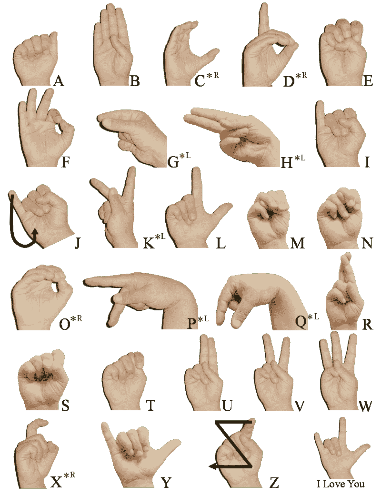
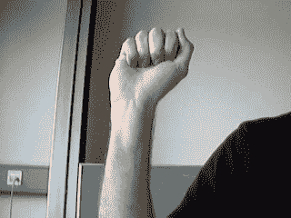
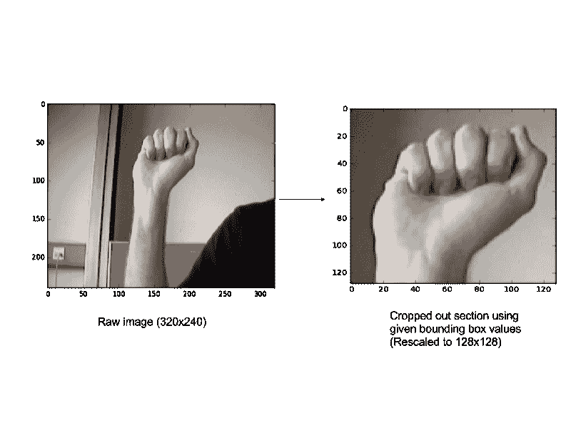
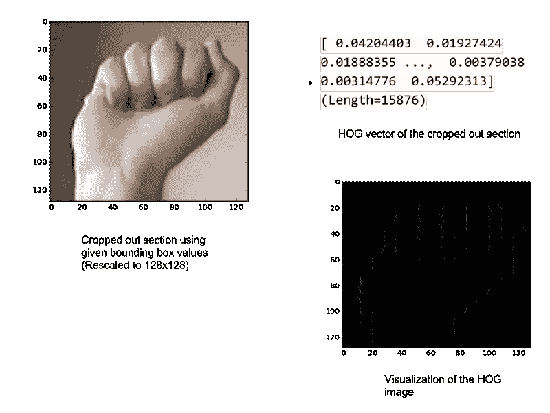

# 周末项目:使用 scikit-learn 进行手语和静态手势识别

> 原文：<https://www.freecodecamp.org/news/weekend-projects-sign-language-and-static-gesture-recognition-using-scikit-learn-60813d600e79/>

作者:斯雷哈里

# 周末项目:使用 scikit-learn 进行手语和静态手势识别



让我们建立一个机器学习管道，它可以通过查看一个人的手的原始图像来阅读手语字母表。



A raw image indicating the alphabet ‘A’ in sign language

这个问题有两个部分:

1.  建立静态手势识别器，这是一个预测静态手语手势的多类分类器。
2.  在原始图像中定位手，并将这部分图像提供给静态手势识别器(多类分类器)。

你可以在这里获得我的这个项目[的示例代码和数据集。](https://github.com/mon95/Sign-Language-and-Static-gesture-recognition-using-sklearn)

### 首先，一些背景。

手势识别是机器视觉领域的一个开放问题，机器视觉是计算机科学的一个领域，它使系统能够模拟人类视觉。手势识别在改善人机交互方面有许多应用，其中之一是在手语翻译领域，其中符号手势的视频序列被翻译成自然语言。

已经开发了一系列用于相同目的的先进方法。在这里，我们将看看如何使用 scikit learn 和 scikit 图像库来执行静态手势识别。

#### 第 1 部分:构建静态手势识别器

对于这一部分，我们使用一个数据集，该数据集包括原始图像和一个相应的 csv 文件，该文件具有指示每个图像中手的边界框的坐标。([使用 Dataset.zip 文件获取样本数据集。按照自述文件](https://github.com/mon95/Sign-Language-and-Static-gesture-recognition-using-sklearn)中的说明提取

这个数据集是按用户方式组织的，数据集的目录结构如下。图像名称表示图像所代表的字母表。

```
dataset
   |----user_1
          |---A0.jpg
          |---A1.jpg
          |---A2.jpg
          |---...
          |---Y9.jpg
   |----user_2
          |---A0.jpg
          |---A1.jpg
          |---A2.jpg
          |---...
          |---Y9.jpg
   |---- ...
   |---- ...
```

静态手势识别器本质上是一个多类分类器，在表示 24 种静态手语手势(A-Y，不包括 J)的输入图像上进行训练。

使用原始图像和 csv 文件构建静态手势识别器相当简单。



要使用 scikit learn 库中的多类分类器，我们需要首先构建数据集，也就是说，每幅图像都必须转换为一个特征向量(X ),并且每幅图像都将有一个与其表示的手语字母对应的标签(Y)。

现在的关键是使用适当的策略对图像进行矢量化，并提取有意义的信息以提供给分类器。如果我们计划使用简单的多类分类器(与使用卷积网络相反)，简单地使用原始像素值是行不通的。

为了对我们的图像进行矢量化，我们使用了梯度方向直方图(HOG)方法，因为它已经被证明可以在类似这样的问题上产生良好的结果。可以使用的其他特征提取器包括局部二进制模式和 Haar 滤波器。



#### 代码:

我们在 get_data()函数中使用 pandas 来加载 CSV 文件。两个函数-crop() 和 converttograytHog()**用于获得所需的 hog 向量，并将其添加到我们正在构建的向量列表中，以便训练多类分类器。**

```
`# returns hog vector of a particular image vector
def convertToGrayToHOG(imgVector):
    rgbImage = rgb2gray(imgVector)
    return hog(rgbImage)

# returns cropped image 
def crop(img, x1, x2, y1, y2, scale):
    crp=img[y1:y2,x1:x2]
    crp=resize(crp,((scale, scale))) 
    return crp

#loads data for multiclass classification
def get_data(user_list, img_dict, data_directory):
  X = []
  Y = []

  for user in user_list:
    user_images = glob.glob(data_directory+user+'/*.jpg')

    boundingbox_df = pd.read_csv(data_directory + user + '/'
 + user + '_loc.csv')

    for rows in boundingbox_df.iterrows():
      cropped_img = crop( img_dict[rows[1]['image']], 
                         rows[1]['top_left_x'], 
                         rows[1]['bottom_right_x'], 
                         rows[1]['top_left_y'], 
                         rows[1]['bottom_right_y'], 
                         128
                        )
       hogvector = convertToGrayToHOG(cropped_img)

       X.append(hogvector.tolist())
       Y.append(rows[1]['image'].split('/')[1][0])

    return X, Y`
```

**下一步是将输出标签(Y 值)编码成数值。我们使用 sklearn 的标签编码器来完成这项工作。**

**在我们的代码中，我们这样做了:**

```
`Y_mul = self.label_encoder.fit_transform(Y_mul)`
```

**其中，label_encoder 对象在手势识别器类构造函数中的构造如下:**

```
`self.label_encoder = LabelEncoder().fit(['A', 'B', 'C', 'D', 'E', 'F', 'G', 'H', 'I', 'K', 'L', 'M', 'N', 'O', 'P', 'Q', 'R', 'S', 'T', 'U', 'V', 'W', 'X', 'Y'])`
```

**完成后，可以使用您从 scikit 学习工具箱中选择的任何多类分类算法来训练该模型。我们已经使用线性核的[支持向量分类](http://scikit-learn.org/stable/modules/generated/sklearn.svm.SVC.html)训练了我们的。**

**使用 sklearn 训练一个模型不涉及超过两行代码。你可以这样做:**

```
`svcmodel = SVC(kernel='linear', C=0.9, probability=True) 
self.signDetector = svcmodel.fit(X_mul, Y_mul)` 
```

**超参数(即，在这种情况下 C=0.9)可以使用网格搜索来调整。在此阅读更多关于此[的内容。](http://scikit-learn.org/stable/modules/grid_search.html)**

**在这种情况下，我们并不完全了解这些数据(即 hog 向量)。因此，尝试使用 xgboost(极端梯度提升)或随机森林分类器等算法，并观察这些算法的性能，不失为一个好主意。**

#### **第 2 部分:构建本地化程序**

**与第一部分相比，这部分需要稍多一点的努力。**

**概括地说，我们将采用以下步骤来完成这项任务。**

1.  ****使用给定的数据集和每个图像的边界框值，建立一个包括手和非手部分图像的数据集**。**
2.  ****训练二进制分类器**使用上述数据集检测手/非手图像。**
3.  **(可选)使用**硬负挖掘**改进分类器。**
4.  **使用一个 [**滑动窗口方法**](http://www.pyimagesearch.com/2015/03/23/sliding-windows-for-object-detection-with-python-and-opencv/) **以各种比例**，在查询图像上隔离出感兴趣的区域。**

**这里，我们不会使用任何图像处理技术，如过滤、颜色分割等。scikit 图像库用于读取、裁剪、缩放、将图像转换为灰度以及提取 hog 矢量。**

#### **构建手/非手数据集:**

**数据集可以用你喜欢的任何策略来构建。做到这一点的一种方法是生成随机坐标，然后检查相交面积与并集面积的比率(即，与给定边界框的重叠程度)以确定它是否是非手形部分。(另一种方法可以是使用滑动窗口来确定坐标。但是这非常慢而且没有必要)**

```
`"""
This function randomly generates bounding boxes 
Returns hog vector of those cropped bounding boxes along with label 
Label : 1 if hand ,0 otherwise 
"""
def buildhandnothand_lis(frame,imgset):
    poslis =[]
    neglis =[]

    for nameimg in frame.image:
        tupl = frame[frame['image']==nameimg].values[0]
        x_tl = tupl[1]
        y_tl = tupl[2]
        side = tupl[5]
        conf = 0

        dic = [0, 0]

        arg1 = [x_tl,y_tl,conf,side,side]

        poslis.append( convertToGrayToHOG(crop(imgset[nameimg],  x_tl,x_tl+side,y_tl,y_tl+side)))

        while dic[0] <= 1 or dic[1] < 1:
            x = random.randint(0,320-side)
            y = random.randint(0,240-side) 
            crp = crop(imgset[nameimg],x,x+side,y,y+side)
            hogv = convertToGrayToHOG(crp)
            arg2 = [x,y, conf, side, side]

            z = overlapping_area(arg1,arg2)
            if dic[0] <= 1 and z <= 0.5:
                neglis.append(hogv)
                dic[0] += 1
            if dic[0]== 1:
                break
        label_1 = [1 for i in range(0,len(poslis)) ]
        label_0 = [0 for i in range(0,len(neglis))]
        label_1.extend(label_0)
        poslis.extend(neglis)

        return poslis,label_1`
```

#### **训练二元分类器:**

**一旦数据集准备好了，就可以像第 1 部分中看到的那样训练分类器了。**

**通常，在这种情况下，一种称为[硬否定挖掘](https://www.reddit.com/r/computervision/comments/2ggc5l/what_is_hard_negative_mining_and_how_is_it/)的技术被用来减少假肯定检测的数量并改进分类器。使用随机森林分类器进行一次或两次硬负挖掘迭代，就足以确保您的分类器达到可接受的分类精度，在本例中，分类精度为 80%以上。**

**请看一下这里的[代码，它是同一个](https://github.com/mon95/Sign-Language-and-Static-gesture-recognition-using-sklearn/blob/master/dataset/gesture_recognizer1.py#L221)的示例实现。**

#### **检测测试图像中的手:**

**现在，为了实际使用上述分类器，我们通过各种因素来缩放测试图像，然后对所有这些因素使用[滑动窗口方法](http://www.pyimagesearch.com/2015/03/23/sliding-windows-for-object-detection-with-python-and-opencv/)来挑选完美捕捉感兴趣区域的窗口。这是通过选择对应于由二元(手/非手)分类器在所有尺度上分配的最大置信度得分的区域来完成的。**

**测试图像需要缩放，因为我们在所有图像上运行一个设定大小的窗口(在我们的例子中，它是 128×128)来挑选感兴趣的区域，并且感兴趣的区域可能不完全适合这个窗口大小。**

**[样本实施](https://github.com/mon95/Sign-Language-and-Static-gesture-recognition-using-sklearn/blob/master/dataset/gesture_recognizer1.py#L312)和[跨所有规模的整体检测](https://github.com/mon95/Sign-Language-and-Static-gesture-recognition-using-sklearn/blob/master/dataset/gesture_recognizer1.py#L416)。**

#### **把所有的放在一起**

**在这两个部分都完成之后，剩下要做的就是在提供测试图像时连续调用它们以获得最终输出。**

**也就是说，给定一个测试图像，我们首先获得图像的不同尺度上的各种检测区域，并从中挑选最佳的一个。该区域然后被裁剪、重新缩放(到 128×128)并且其对应的 hog 向量被馈送到多类分类器(即，手势识别器)。手势识别器然后预测图像中的手所表示的手势。**

#### **要点**

**总而言之，这个项目包括以下步骤。这些链接引用了 github 存储库中的相关代码。**

1.  **[建立手/非手数据集](https://github.com/mon95/Sign-Language-and-Static-gesture-recognition-using-sklearn/blob/master/dataset/gesture_recognizer1.py#L71)。**
2.  **[将所有图像(即带有手势和手的裁剪部分，非手图像)转换为其矢量化形式。](https://github.com/mon95/Sign-Language-and-Static-gesture-recognition-using-sklearn/blob/master/dataset/gesture_recognizer1.py#L43)**
3.  **[使用这些数据集构建用于检测手部的二元分类器，并构建用于识别手势的多类分类器。](https://github.com/mon95/Sign-Language-and-Static-gesture-recognition-using-sklearn/blob/master/dataset/gesture_recognizer1.py#L360)**
4.  **[一个接一个地使用上述分类器来执行所需的任务。](https://github.com/mon95/Sign-Language-and-Static-gesture-recognition-using-sklearn/blob/master/dataset/gesture_recognizer1.py#L403)**

**Suks 和我在这个项目上工作，这是我们在大学学习的机器学习课程的一部分。为她所做的贡献大声欢呼吧！**

**此外，我们想提一下 [Pyimagesearch](https://www.pyimagesearch.com) ，这是一个很棒的博客，我们在项目工作时广泛使用过！请务必查看有关图像处理和 opencv 相关内容的内容。**

**干杯！**