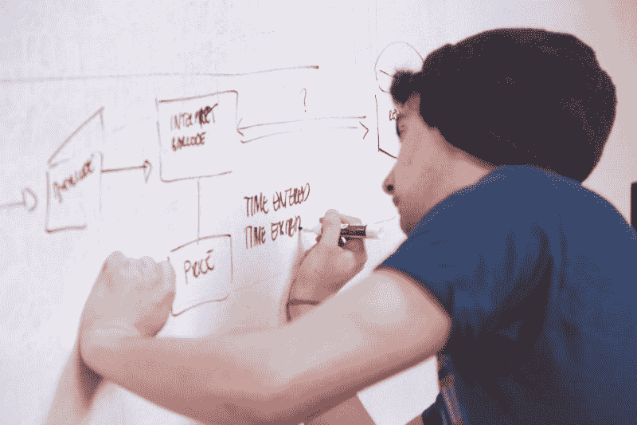

# 当谈到白板编码面试时，记得做好准备

> 原文：<https://www.freecodecamp.org/news/before-you-code-remember-to-prep-for-your-coding-interview-2ccfb58147db/>

安迪·蒂芙尼

# 当谈到白板编码面试时，记得做好准备

PREP 是我创造的一种助记法，帮助你记住解决白板编码问题所涉及的步骤。它代表 **P** 参数， **R** eturn， **E** 示例， **P** seudocode。

记忆术是新的，但基本技术是经过战斗考验的。这本质上是一个初学者友好的[测试驱动开发](https://en.wikipedia.org/wiki/Test-driven_development)版本，很好地适应了编码挑战。

让我们开门见山，通过一道例题学习 PREP。我们将使用 JavaScript，但是这种技术几乎适用于任何编程语言。

### 你的面试官要求你写一个函数，接受一个句子并返回最长的单词。你是做什么的？

#### “P”代表参数

大多数问题都涉及到编写函数。在这一步，你需要决定你的函数应该接受什么参数。然后你需要给它们取一个有意义的名字。

在问题陈述中，像“接受”或“接受”这样的关键词会引导你到这里。如果不清楚，也可以找面试官澄清。在您的例子中，语句“接受一个句子”告诉您函数应该接受单个字符串参数。

所以你已经确定了参数的类型。但是你应该给它取什么名字呢？这听起来可能很简单，但是好的命名是一项至关重要的编程技能，并且需要练习。

你可以把你的命名为“sentenceString”，但是称它为“sentence”更简洁，并且仍然清楚地表明我们正在处理一个字符串。

由于这是您的第一步，您还需要为您的函数本身想一个有意义的名称。在你的例子中，“longest word”*既简洁又有描述性。现在您已经决定了这一点，您可以像这样为您的函数编写外壳:*

#### *“R”代表返回*

*这个函数*返回*什么？是数字吗？布尔型？一根绳子？*

*记住:函数返回的值和它在 print/log 语句中显示的不一样。*

*同样，您可以查看问题陈述进行澄清。“返回最长的单词”告诉你你正在返回一个*单词，*并且你知道单词是字符串。让我们通过创建一个变量来表示这个返回值，并装配您的函数来返回它，来清楚地说明这一点。尽管您还没有返回正确的答案，但是您已经被设置为返回正确的类型。您已经创建了一个占位符，这将使接下来的步骤更容易。*

#### *例如“E”*

*即使对于专业开发人员来说，静态代码也比运行代码更难理解。你想让你的代码尽可能快地运行和“活跃”。您可以通过一个示例测试调用为您的函数注入活力。*

*你知道，如果你的函数接受“我看见了一只河马”这句话，一旦它正常工作，它*应该*返回字符串“河马”。但是现在，您只想看到最后一步中的占位符值，以确认您的代码是可运行的并且设置正确。*

#### *最后一个“P”是伪代码*

*虽然现在就开始编码很有诱惑力，但是太容易被某个细节所吸引，从而分散你对全局的注意力。你需要首先设计一个策略，而*伪代码*正是这个策略。*

*伪代码是用口语注释写的一系列精确的语句，描述你需要做什么。*

### *你已经准备好了。现在你可以编码了！*

*PREP 中的四个步骤帮助你清晰地框定问题，思考如何解决。事实上，准确的框架是成功的一半。大多数面试官看到你有条不紊的方法已经印象深刻了。在这一点上，你的目标只是编写代码，让你的例子和测试通过。您将通过对每个伪代码步骤进行编码来做到这一点。*

*当您可以运行代码并看到正确的输出时，您就知道您已经有了一个可行的解决方案。*

*你现在已经度过了最困难的部分。您可以松一口气，因为您至少找到了一个可行的解决方案。此时，只剩下两个问题需要考虑:*

*   *有没有会破坏代码的边缘情况？例如，你是否需要考虑以句号结尾的句子？您将为这些边缘案例编写更多的测试案例，然后在必要时修改代码。*
*   *现在能让代码更干净或者更高效吗？你应该和面试官讨论你的想法，让他们在冒险打破解决方案之前知道你的想法。*

*就是这样！这个过程一开始可能看起来过于机械，但是相信我，它会成为第二天性——就像学习驾驶的步骤一样。即使在编程超过 12 年后，这仍然是我解决问题时大致遵循的顺序。我更可能使用正式的测试框架，而不是像我们在这里所做的那样使用日志语句，但是步骤是一样的。*

*现在你试试！以下是一些初级问题，你可以按照难度大致递增的顺序来练习:*

1.  *假设你有一个类似[ "adios "，" bye "，" ciao" ]的字符串数组。您的任务是编写一个名为 total_characters 的函数，该函数接受这样一个数组作为参数，并返回数组中所有字符串的字符总数。*
2.  *写一个函数来翻转硬币 n 次，返回“正面”被翻转的次数。*
3.  **(来自[自由代码营](https://www.freecodecamp.com/challenges/sum-all-numbers-in-a-range) )* 我们会给你传递一个两个数的数组。返回这两个数字的和，以及它们之间的所有数字。最低的数字将*而不是*总是排在第一位。试着先用 PREP 自己设置一下，然后在这里[随意确认你的设置并完成解决。](https://www.freecodecamp.com/challenges/sum-all-numbers-in-a-range)*

*PREP 已经帮助几个[第一步编码](https://firststepcoding.com)学习者通过了编码面试，我希望它也能帮助你。编码快乐！*

**如果您喜欢，请点击？所以其他人会在媒体上看到这个。**