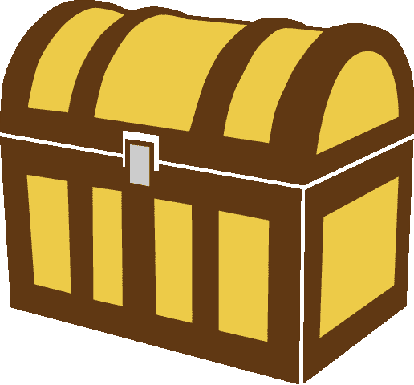
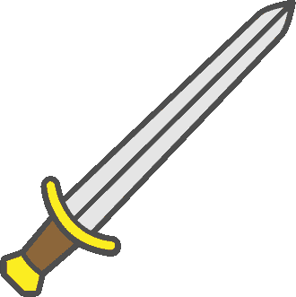
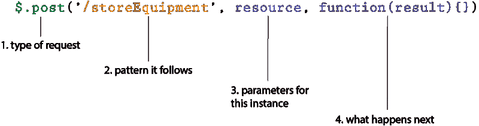
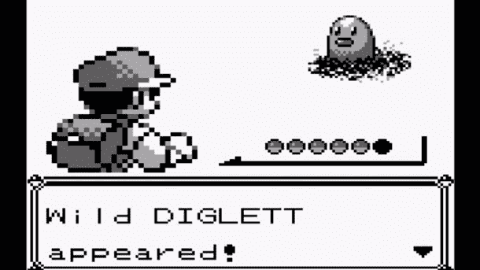
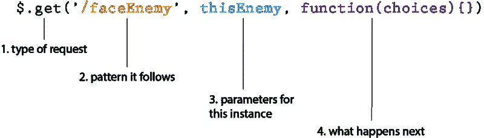
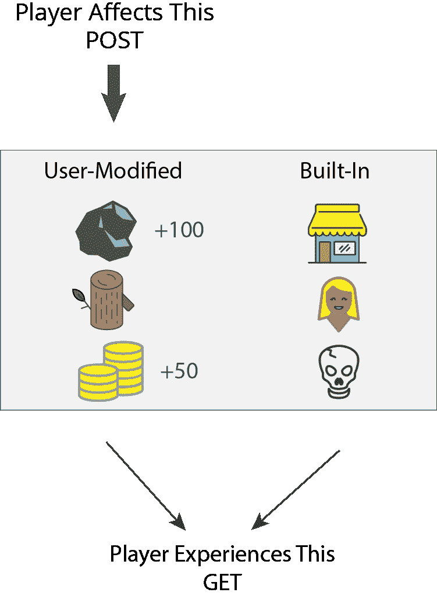

# AJAX 通过升级你的视频游戏角色来解释

> 原文：<https://www.freecodecamp.org/news/ajax-explained-by-upgrading-your-video-game-character-17d26305163c/>

凯文·科诺年科

# AJAX 通过升级你的视频游戏角色来解释

#### 如果你玩过电子游戏，那么你就能理解 POST 和 GET 的基本原理。

AJAX(异步 JavaScript 和 XML 的缩写)对于新的 web 开发人员来说很难掌握。如果不知道浏览器如何与服务器交互，AJAX 看起来就像是被施了魔法。

但是不要失去希望。把 AJAX 想象成类似于你在角色扮演游戏如口袋妖怪或最终幻想中如何升级你的角色。

您可以使用 AJAX 构建现代 web 应用程序，只需最少的页面重新加载次数。如果您想构建一个可以在不同屏幕和功能之间轻松流动的站点，那么您需要 AJAX 根据用户请求动态加载内容。

这篇文章将关注使用两种最常见的 AJAX 方法与服务器交互的方式:post 和 GET。

我假设你已经知道了回调的[基础知识。此外，我假设您已经在 web 应用程序中勾勒出了一个需要动态加载数据的位置。](https://medium.freecodecamp.com/javascript-callbacks-explained-using-minions-da272f4d9bcd)

### 发布请求就像向库存添加物品

您可以使用 POST 向数据库添加数据。在你的电子游戏中，这有点像你打开视线内的每个宝箱直到找到你需要的物品的过程。

假设你需要一个新的武器来迎接游戏中更大的挑战。你搜寻每一件藏起来的物品，直到你最终找到它——一把新的剑！这个武器比你开始游戏时用的球杆更轻、更快、更强。

所以现在你想拿起这把可怕的剑，抛弃你的旧的，臭俱乐部。从代码的角度来看，您需要存储一些东西:

1.  你添加的装备类型(剑)
2.  重量(假设为 20)
3.  每次攻击的伤害(假设是 10)
4.  这是一种金属(比如说钢)
5.  防御/阻挡能力(比如说 5)

为了将这些数据发送到服务器并保存，您需要发布这些数据。

注意，我们将使用 jQuery——最流行的 JavaScript 库之一——来简化发出这些请求的过程。

您的帖子请求将包含 4 个部分:

1.  无论你是在做`$.post`还是`$.get`
2.  **路线。路由是您的后端可以识别的可重复模式。在这种情况下，添加几乎任何装备，像剑、盾或胸甲，都会遵循类似的模式，因为它们都可以装备在你的角色身上。如果你在收集资源，比如金属矿石、木材或硬币，你会使用不同的路线。虽然这些需要储存，但它们不会被“装备”到你的角色身上——只是储存在你的物品清单中。这些路径可能是“/gathereresource”或“/collectCoins”。**
3.  实际将要存储的数据。在这里，你存储了装备的属性:装备的类型，伤害，重量等等。，就像我们上面概述的那样。我们可以为此使用一个对象。
4.  回电。这使您可以指定在 POST 完成后应该立即发生什么。你可能要装备剑，掉球杆。

下面是您将用来存储剑的完整代码:

最困难的部分是弄清楚什么应该在路线中，什么应该在参数/数据中。在这种情况下，您正在编写一个更一般化的`storeEquipment`路线，因为您可以遵循类似的过程来添加任何类型的设备。这些参数允许您提供细节。

关系数据库超出了本教程的范围，但是如果您想建立一个数据库来存储它，您可以创建一个“设备”表来存储每个用户的所有设备。它看起来会像这样:

构建 web 应用程序时，您可以使用 POST 请求来:

1.  创建新用户
2.  存储用户创建的条目
3.  存储用户创建的评论

### 获取请求就像滋生敌人

GET 请求允许您检索已经存储在数据库中的数据。您没有修改或添加任何东西，您只是呈现已经存在的数据。这有点像你在口袋妖怪里跑来跑去，这种情况发生了:

假设你踩死了这个可怜的迪格利特。这不会改变你的服务器上有一个叫 Diglett 的口袋妖怪的事实。你将来仍然可以面对迪格雷特斯。

假设你在地牢里跑来跑去，你面对的是有史以来最可怕的敌人:骷髅(其实不是)。

我们需要编写代码，使这个随机骨架具有某些特征。以下是它的一些属性:

1.  类型:骨骼
2.  攻击:10
3.  机动性:5
4.  防守:2
5.  装备:头盔，狼牙棒

您可以像这样构建 GET:

1.  `$.get`或`$.post`
2.  路线。GET route 意味着您将在特定的包中从服务器检索数据。与 POST 类似，您希望这条路线被一般化，以便它捕捉与敌人的任何类型的交互。
3.  参数。关于这个特定敌人的细节。
4.  回电。当你和这个敌人战斗时会发生什么？

当你最初设计游戏的时候，你就决定了一个骨架的样子，它会如何移动。现在，你需要动态地创建一个骨骼来面对你的角色。GET 请求将允许你召唤一个由你的参数指定的具有特定特征的骨骼。

如果你的角色打败了这个骷髅，它不会从你的服务器上删除任何东西。这仅仅意味着你的角色优于骨骼所代表的数据组合。

现在让我们说，你正在建立一个电子商务网站，你在那里销售纸箱。用户可能希望根据以下条件对他们的选择进行排序:

1.  盒子的厚度
2.  盒子的大小
3.  可用数量

您可能希望允许用户对选项进行动态排序。因此，您可以使用 GET 请求来检索所有具有特定特征的框，而不必在每次选中或取消选中某个框时让用户重新加载页面。

### 总之…

*   您的数据库中充满了可以调用并呈现给用户的组件。有些是应用程序初始化的，有些是用户添加的。
*   POST 请求允许您向数据库添加组件。
*   GET 请求允许您动态调用内置的和以前添加的组件。基于 GET 请求的参数，它们可以以不同的方式组合。

如果你喜欢这篇文章，你可能也会喜欢我对挑战 CSS 和 JavaScript 主题的其他解释，比如定位、模型-视图-控制器和回调。

如果你认为这可能会帮助和你处境相同的人，那就给它一颗“心”吧！