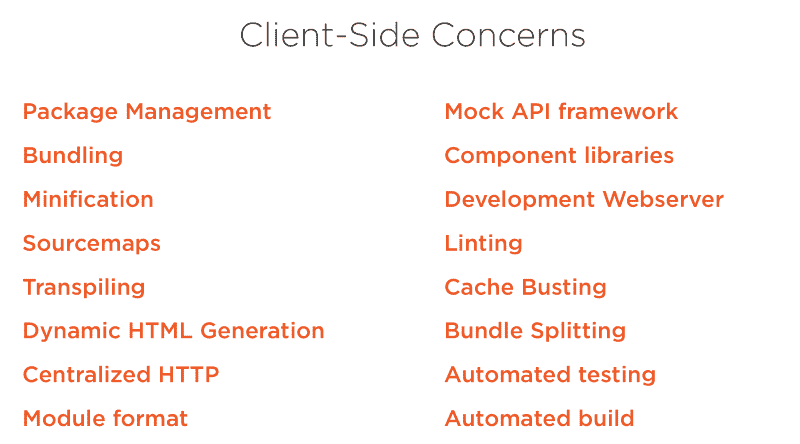
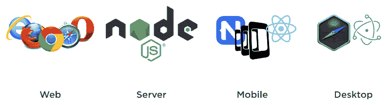

# 这就是客户端渲染获胜的原因

> 原文：<https://www.freecodecamp.org/news/heres-why-client-side-rendering-won-46a349fadb52/>

十年前，几乎每个人都在使用 ASP.NET、Ruby on Rails、Java 和 PHP 等技术在服务器上呈现他们的 web 应用程序。

然后像 jQuery 这样方便的库出现了，突然之间服务器端的渲染不再有意义了。jQuery 之后是一长串客户端库，比如 Backbone、Knockout、Angular、Ember 和 React。随着每一次迭代，客户端渲染变得更加容易和强大。

这种风格有很多名字:单页应用、spa、[JAM stack](https://jamstack.org)…随便你怎么称呼。关键是，今天，客户端渲染已经成为构建富 web 应用程序的事实上的方式…但是为什么呢？

### 嘿各位，让我们来硬的

不可否认，客户端渲染更难做好。你必须考虑捆绑、传输、林挺、缓存破坏、[等等。在客户端做正确的事情是如此困难，以至于我在](http://bit.ly/jsdevenv)[我的新 Pluralsight 课程](http://bit.ly/jsdevenv)中讲述了你需要做出的 40 多个决定。

Just a few reasons client-side development is challenging.

那么，为什么我们要让自己承受这样的痛苦呢？因为客户端渲染提供了一长串服务器端渲染无法企及的好处。

这就是客户端渲染胜出的原因。

#### 不需要重新加载整页

对于传统的服务器端呈现，服务器通过为每次交互生成并返回一个全新的页面来做出响应。这通常会降低加载速度，占用更多带宽，并导致用户体验响应速度较慢。

当页面的一部分发生变化时，客户端呈现避免了对整个页面进行不必要的请求。这在一个越来越多地通过高延迟的移动网络浏览的世界里尤其有用。

#### 惰性装载

客户端渲染支持应用程序部分的延迟加载，以节省带宽和加速初始加载。例如，您可以在用户向下滚动或用户更改其搜索参数时加载附加记录、图像和广告，而无需执行完全回发。

#### 丰富的互动

客户端呈现支持丰富的动画交互、转换和过渡。删除时淡出一行，或淡入一个对话框。当然，您可以将这些优点加入到服务器端应用程序中，但是这通常会导致在客户端和服务器端维护相同的模板，或者管理与服务器端框架进行 JavaScript 交互的复杂性。

#### 廉价托管

托管静态文件通常比托管传统的服务器端技术(如 ASP.NET、PHP 或 Ruby)更便宜。您不需要很大的马力来服务一个静态文件。事实上，提供静态文件是如此便宜，以至于存在各种各样的免费选项，包括 [Surge](http://surge.sh) 、 [Firebase](https://firebase.google.com) 和 [Netlify](https://www.netlify.com) 。

#### 使用 CDN

静态前端可以通过内容交付网络(CDN)托管。cdn 通过在全球范围内分配资产来提高性能，并通过消除 web 服务器的负载来提高可扩展性。上述静态主机利用 CDN。

#### 易于部署

静态文件易于部署。当发生小的变化时，您不一定需要执行整体构建来生成新的二进制文件。借助前面提到的一些服务，如 Surge 和 Netlify，您可以通过它们提供的 CLI 轻松创建自动化部署。当你这样做的时候，你没有破坏任何后端的风险——它是完全独立处理的。

Easy automated deployments? Yes please.

#### 强制分离关注点

许多团队努力将数据访问和业务逻辑保持在用户界面之外。对于客户端呈现，关注点的分离是通过编程实现的。没有办法直接打到数据库。你必须呼叫一个单独的服务。这有助于在开发团队中培养面向服务的思维模式，因为没有办法走捷径直接从 UI 调用数据库。

#### 学一次，到处写

想象你是一名新毕业生。什么是唯一允许你构建 web 应用程序、API、移动应用程序和桌面应用程序的语言？JavaScript。越来越多的人认为这正是应届毕业生所追求的。JavaScript 无处不在，为什么一个新毕业生要学习一门专门的服务器端技术？

这就是它会继续吞噬世界的原因。

JavaScript 就像 Visa。你想去哪里都可以。

#### Web、本地移动和桌面使用相同的 UI 技术

假设您想要构建一个 SPA 风格的 web 应用程序、一个本地移动应用程序和一个桌面应用程序。今天的现代 JavaScript 框架允许您在所有三种场景中使用相同的 UI 技术。

例如，您可以使用角度、离子和电子，对所有三个目标进行角度操作。或者，可以使用 React、React Native 和 Electron 在 React 中为所有三个目标工作。由此产生的应用程序可以在 iOS、Android、Windows 和 macOS 上运行。当然胜过学习目标——C、Swift、Java、C#、WPF 和更多支持所有这些平台的语言！

I’m pretty sure these umbrellas spell JS. Somewhere.

**编辑** —我在这里有一个关于渐进式 Web 应用程序支持的观点，但是不正确。您不需要进行客户端渲染来构建 PWA。

#### 所以。很多。免费。

JavaScript 发展如此之快，以至于客户端渲染最困难的部分是选择如何完成它。免费选项的数量简直多得令人应接不暇，而且还在快速增长。

#firstworldproblems

是啊，这是个大问题。而且不需要为你的团队需要的库、框架和编辑器付费。在“[构建 JavaScript 开发环境](http://bit.ly/jsdevenv)”中，我浏览并设置了几十个有用的免费工具。([免费试用](https://www.pluralsight.com/pricing))

### 服务器端渲染还有意义吗？

当然可以。但是比以前少多了。

如果你需要交互性，又不能依赖 JavaScript，那么显然客户端渲染就 out 了。

如果您正在构建一个大部分是静态的站点，服务器端呈现可能更容易。尽管像[杰基尔](https://jekyllrb.com)、 [Gitbook](https://www.gitbook.com) 、[盖茨比](https://github.com/gatsbyjs/gatsby)和[这样令人敬畏的工具，无数的替代品](https://www.staticgen.com)也正在侵占这个领域。由于像这样的工具只是生成静态 HTML，你也不必担心 SEO 的影响。

SEO 是服务器端渲染的一个常见卖点，但是 React 等库中同构/通用渲染的出现也解决了这个问题。通用渲染曾经很难，但是像 Zeit 的 next.js 这样的现代工具最终也让它变得简单了！

考虑到以上所有的优势，我很难找到继续使用传统服务器端渲染的好理由。

当然要做好还是很难的。但是基于以上原因，客户端渲染胜出了。

[Cory House](https://twitter.com/housecor) 是关于 JavaScript、React、clean code、[多门课程的作者。NET，以及 Pluralsight](http://pluralsight.com/author/cory-house) 上的更多内容。他是 reactjsconsulting.com[公司的首席顾问，微软 MVP 公司 VinSolutions 的软件架构师，在国际上培训软件开发人员，如前端开发和干净编码。Cory 在 Twitter 上以](http://www.reactjsconsulting.com) [@housecor](http://www.twitter.com/housecor) 的身份发关于 JavaScript 和前端开发的推文。