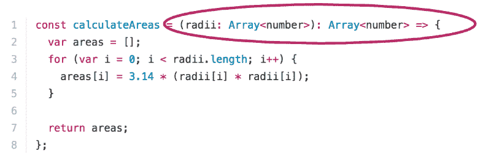
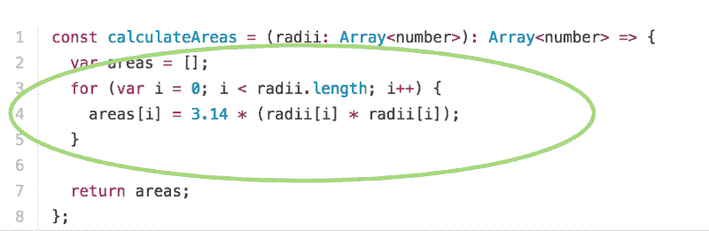
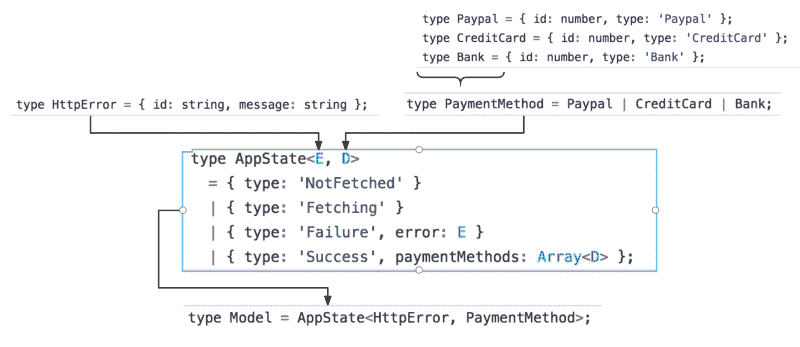

# 为什么在 JavaScript 中使用静态类型？优点和缺点

> 原文：<https://www.freecodecamp.org/news/why-use-static-types-in-javascript-part-2-part-3-be699ee7be60/>

作者:Preethi Kasireddy

# 为什么在 JavaScript 中使用静态类型？优点和缺点

我们在第一部中涉及了很多内容！语法问题已经解决，让我们最终进入有趣的部分:探索使用静态类型的优点和缺点。

### **使用静态类型的优势**

编写程序时，静态类型有很多好处。让我们探索其中的几个。

#### 优势 1:你可以尽早发现错误

静态类型检查允许我们在不实际运行程序的情况下验证我们指定的不变量是否为真。如果有任何违反这些不变量的情况，它们将在运行之前被发现，而不是在运行期间。

举个简单的例子:假设我们有一个简单的函数，它取半径并计算面积:

现在，如果我们要通过一个不是数字的半径(例如‘我是邪恶的’)…

…我们会回到`NaN`。如果某个功能依赖于这个`calculateArea`函数总是返回一个数字，那么这个结果可能会导致一个 bug 或者崩溃。那不是很令人愉快，是吗？

如果我们使用静态类型，我们可以为函数指定确切的输入和输出类型:

现在尝试向我们的`calculateArea`函数传递除数字之外的任何东西，Flow 将向我们发送一条非常方便的消息:

现在我们保证了函数只接受有效的数字作为输入，并返回有效的数字作为输出。

因为类型检查器会在您编码时告诉您什么时候有错误，这比在代码交付给您的客户后才发现错误要方便得多(也便宜得多)。

#### 优势 2:你得到了活的文档

类型为我们自己和代码的其他用户提供了活生生的文档。

为了说明这一点，让我们来看看我曾经在一个大型代码库中发现的方法:

第一眼(以及第二次和第三次)，我不知道如何使用这个功能。

是引用一个`number`？还是一个`boolean`？支付方式是一种`object`吗？又或许是代表支付方式类型的`string`？该函数是否以`string`的形式返回日期？还是作为`Date`对象？

不知道。

我当时的解决方案是通过代码库评估业务逻辑和 grep，直到我弄明白为止，但是仅仅理解一个简单的函数是如何工作的就需要做大量的工作。

另一方面，如果我们写了这样的东西:

函数将哪种类型的数据作为输入，将哪种类型的数据作为输出返回，这一点变得非常清楚。这演示了我们如何使用静态类型来传达函数的意图。我们可以告诉其他开发者我们对他们的期望，也可以看到他们对我们的期望。下次有人去用这个功能，就不会有问题问了。

有一种观点认为，添加代码注释或文档可以解决同样的问题:

这个管用。但它要冗长得多。除了冗长之外，像这样的代码注释很难维护，因为它们不可靠并且缺乏结构——一些开发人员可能写了很好的注释，一些可能写了模糊的注释，还有一些可能根本就忘了写。

当你重构时，很容易忘记更新它们。然而，类型注释有定义好的语法和结构，永远不会过时——它们被编码到代码中。

#### 优势 3:它减少了复杂的错误处理

类型有助于消除复杂的错误处理。让我们再来看看我们的`calculateArea`函数是如何实现的。

这一次，我将让它接受一个半径数组，并计算每个半径的面积:

这个函数可以工作，但是不能正确处理无效的输入参数。如果我们想确保正确处理输入不是一个有效数字数组的情况，我们最终会得到一个如下所示的函数:

哇哦。对于一点点功能来说，代码太多了。

但是对于静态类型，我们可以简单地做:

现在，这个函数实际上看起来就像它最初的样子，没有了错误处理带来的视觉混乱。

很容易看到好处，对吧？:)

#### 优势#4:您可以更加自信地进行重构

我将通过一个轶事来解释这一点:我曾经在一个非常大的代码库中工作，有一个方法定义在我们需要更新的`User`类上——特别是，我们需要将一个函数参数从`string`更改为`object`。

我做了更改，但是没有勇气提交更改——代码库中有太多对该函数的调用，以至于我不知道是否正确地更新了所有的实例。如果我错过了一些未经测试的助手文件中的调用怎么办？

知道的唯一方法是发布代码，并祈祷它不会因为错误而崩溃。

使用静态类型可以避免这种情况。如果我更新了一个函数，并且反过来更新了类型定义，类型检查器会在那里为我捕捉我错过的所有错误，这给了我保证和安心。我所要做的就是检查这些类型错误并修复它们。

#### 优势 5:它将数据与行为分开

静态类型的一个鲜为人知的好处是，它们有助于将数据与行为分开。

让我们用静态类型来重温一下我们的`calculateAreas`函数:

想想我们该如何构造这个函数。因为我们正在注释类型，所以我们被迫首先考虑我们打算使用的数据类型，以便我们可以适当地定义输入和输出类型。

只有这样，我们才能实现逻辑:

这种从行为中精确表达数据的能力允许我们明确我们的假设，并更准确地传达我们的意图，这减轻了一些精神负担，并给程序员带来一些精神上的清晰。没有它，我们只能以某种方式在精神上追踪它。

#### 优势 6:它消除了一整类的错误

作为 JavaScript 开发人员，我们遇到的最常见的错误之一是运行时的类型错误。

例如，假设我们的初始应用程序状态被定义为:

让我们假设我们然后进行一个 API 调用来获取消息，以便填充我们的`appState`。接下来，我们的应用程序有一个过于简化的视图组件，它将`messages`(在我们的状态中定义)作为一个属性，并将未读计数和每条消息显示为一个列表项:

如果获取消息的 API 调用失败或返回`undefined`，我们将在生产中以类型错误结束:

`TypeError: Cannot read property ‘length’ of undefined`

…你的程序崩溃了。你失去了一个顾客。真扫兴。

让我们看看类型如何帮助我们。我们将从向应用程序状态添加流类型开始。我将输入别名`AppState`，然后用它来定义状态:

因为我们获取消息的 API 是不可靠的，这里我们说`messages`是字符串数组的`maybe`类型。

与上次相同—我们从不可靠的 API 获取消息，并在我们的视图组件中使用它:

除了现在,“心流”会抓住我们的错误并抱怨:

哇伙计！

因为我们将`messages`定义为`maybe`类型，所以我们说它可以是`null`或`undefined`。但是它仍然不允许我们在没有进行`null`检查的情况下对其执行操作(如`.length`或`.map`),因为如果`messages`值实际上是`null`或`undefined`，如果我们对其执行任何操作，我们将会以类型错误结束。

因此，让我们返回并更新我们的视图函数，如下所示:

Flow 现在知道我们已经处理了消息是`null`或`undefined`的情况，因此代码类型检查没有错误。长期停滞运行时类型错误:)

#### 优势#7:它减少了单元测试的数量

我们前面看到了静态类型如何帮助消除复杂的错误处理，因为它们保证了输入和输出类型。因此，它们也减少了单元测试的数量。

例如，让我们回到带有错误处理的动态类型的`calculateAreas` 函数:

如果我们是勤奋的程序员，我们可能会想到测试无效输入，以确保它们在我们的程序中得到正确处理:

…等等。除了我们很可能忘记测试一些边缘案例——那么我们的客户就是发现问题的人。:(

因为测试仅仅基于我们认为要测试的案例，所以它们是存在的，并且容易规避。

另一方面，当我们需要定义类型时:

…我们不仅保证了我们的意图与现实相符，而且它们也更难逃脱。与基于经验的测试不同，测试类型是通用的，很难含糊其辞。

这里的大背景是:测试擅长测试逻辑，类型擅长测试数据类型。结合起来，部分之和大于整体。

#### 优势#8:它提供了一个领域建模工具

我最喜欢的类型用例之一是领域建模。领域模型是一个领域的概念模型，包括数据和数据上的行为。理解如何使用类型进行领域建模的最好方法是看一个例子。

假设我有一个应用程序，其中用户有一种或多种支付方式在平台上购物。他们可以使用三种支付方式(Paypal、信用卡、银行账户)。

因此，我们首先将这三种不同的支付方式类型命名为:

现在我们可以将我们的`PaymentMethod`类型定义为一个不相交的并集，有三种情况:

接下来，让我们为我们的应用程序状态建模。为了简单起见，让我们假设我们的应用程序数据只包含用户的支付方式。

这样够好了吗？我们知道，要获得用户的支付方式，我们需要发出一个 API 请求，根据我们在获取过程中的位置，我们的应用程序将有不同的状态。所以实际上有四种可能的状态:

1)我们尚未获取付款方式
2)我们正在获取付款方式
3)我们已成功获取付款方式
4)我们尝试获取，但获取付款方式时出错

但是我们简单的带有`paymentMethods`的`Model`类型并没有涵盖所有这些情况。相反，它假设`paymentMethods`一直存在。

嗯。有没有一种方法可以将我们的应用程序状态建模为这四种情况之一，并且只有这四种情况？让我们来看看:

我们使用分离联合类型将我们的状态定义为上述四种场景之一。请注意我是如何使用一个`type`属性来确定我们的应用程序处于四种状态中的哪一种。这个`type`属性实际上是使它成为一个不相交的并集的原因。利用这一点，我们可以进行案例分析，以确定何时有支付方式，何时没有。

您还会注意到，我将一个泛型类型`E`和`D`传入应用程序状态。类型`D`将代表用户的支付方式(上面定义的`PaymentMethod`)。我们还没有定义类型`E`，这将是我们的错误类型，所以现在让我们这样做:

现在，我们可以将我们的应用领域建模为:

总之，我们的应用程序状态的签名现在是`AppState<E,` D > — `w`这里 E 是`shape Htt` pErro `r`和 `D is Payment` Method `. And Ap` pState 有四个(且只有这四个)可能的 st `ates: NotF` et `ched, Fe` tc `hing, F` ailur `e and S`成功。

我发现这种类型的领域建模对于思考和构建针对特定业务规则的用户界面非常有用。业务规则告诉我们，我们的应用程序只能处于其中一种状态。因此，这允许我们显式地表示构建我们的应用程序状态，并保证它只会处于预定义的状态之一。当我们构建这个模型时(例如，创建一个视图组件)，很明显我们需要处理所有四种可能的状态。

此外，代码变得自文档化——您可以查看联合案例并立即弄清楚应用程序状态是如何构造的。

### 使用静态类型的缺点

像生活和编程中的其他事情一样，静态类型检查也有它的缺点。

重要的是我们要理解和承认它们，这样我们才能做出明智的决定，什么时候静态类型有意义，什么时候静态类型不值得。

以下是其中的一些考虑因素:

#### 缺点 1:静态类型需要前期投资来学习

对于初学者来说，JavaScript 是一种如此神奇的语言，原因之一是它不需要学生在使用这种语言之前学习整个类型系统。

当我最初学习 Elm(一种静态类型的函数式语言)时，类型经常碍事。我会经常遇到与我的类型定义相关的编译器错误。

学习如何有效地使用类型系统已经是学习语言本身的一半了。因此，静态类型使得 Elm 的学习曲线比 JavaScript 更陡峭。

这对初学者来说尤其重要，因为他们学习语法的认知负荷一直很高。向组合中添加类型会让初学者不知所措。

#### 缺点 2:冗长会让你陷入困境

静态类型经常使程序看起来更加冗长和混乱。

例如，代替:

我们必须写下:

而不是:

我们必须写下:

显然，这会增加额外的代码行。但是有几个论点反对这是一个真正的负面影响。

首先，正如我们前面提到的，静态类型有助于消除整个测试类别。一些开发人员会认为这是一个完全合理的权衡。

其次，正如我们前面看到的，静态类型有时可以消除复杂的错误处理，从而大大减少代码的视觉混乱。

很难说冗长是否是反对类型的真正理由，但这是一个值得记住的理由。

#### 缺点 3:掌握字体需要时间

学习如何在程序中最好地指定类型需要时间和大量的练习。此外，对于什么是值得静态跟踪的，什么是保持动态的，培养良好的判断力也需要仔细的思考、实践和经验。

例如，我们可能采取的一种方法是用类型对关键的业务逻辑进行编码，同时让短暂的或不重要的逻辑保持动态，以避免不必要的复杂性。

这种区别可能很难区分，尤其是当对类型缺乏经验的开发人员正在匆忙做出判断的时候。

#### 缺点 4:静态类型会阻碍快速开发

正如我前面提到的，在我学习 Elm 的时候，类型让我犯了一点错误——特别是在添加代码或者进行修改的时候。经常被编译器错误分心让我很难感觉到自己有任何进步。

这里的论点是，静态类型检查可能会导致程序员过于频繁地失去注意力——正如我们所知，注意力是编写好程序的关键。

不仅如此，静态类型检查器并不总是完美的。有时，您会遇到这样的情况，您知道您需要做什么，但是类型检查正好碍事。

我确信我还遗漏了其他的权衡，但这些对我来说是最重要的。

### 接下来，[最后的结论](https://medium.com/@preethikasireddy/why-use-static-types-in-javascript-part-4-b2e1e06a67c9#.cb2z6mty8)

在最后一节中，我们将讨论使用静态类型是否有意义。

我会在那里见你。