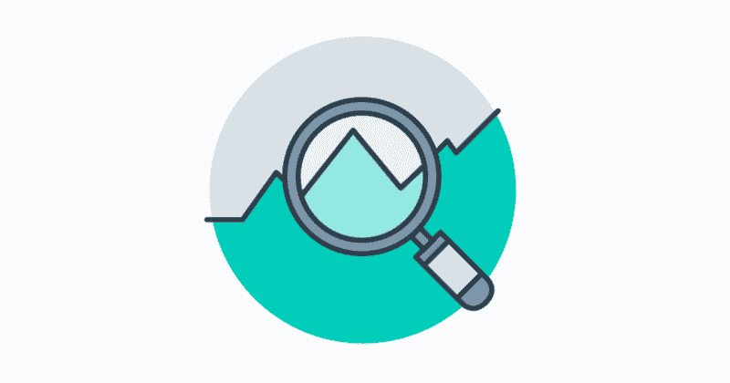
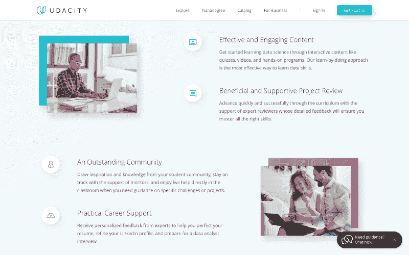
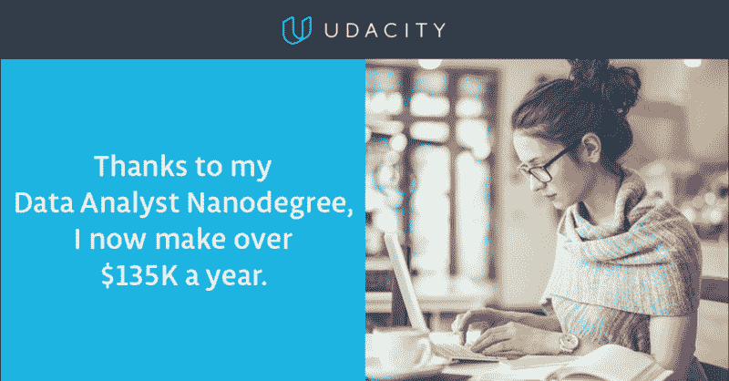
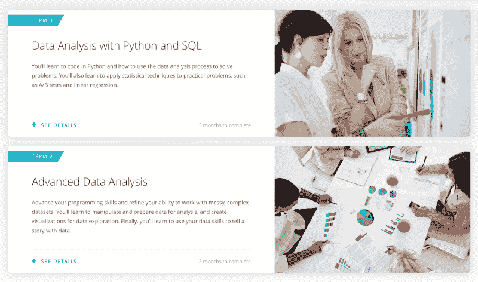
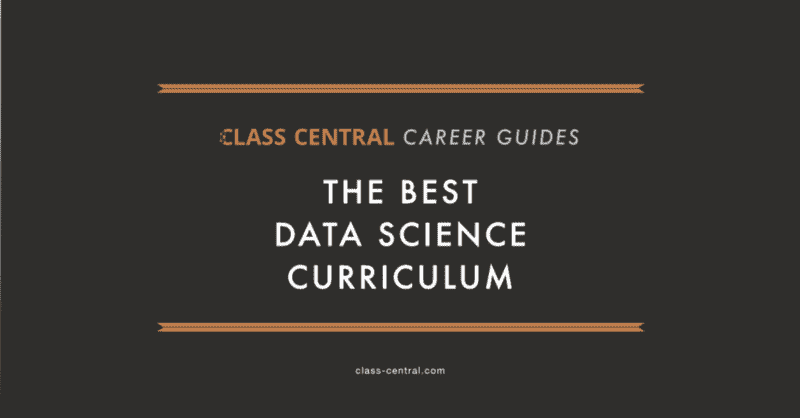
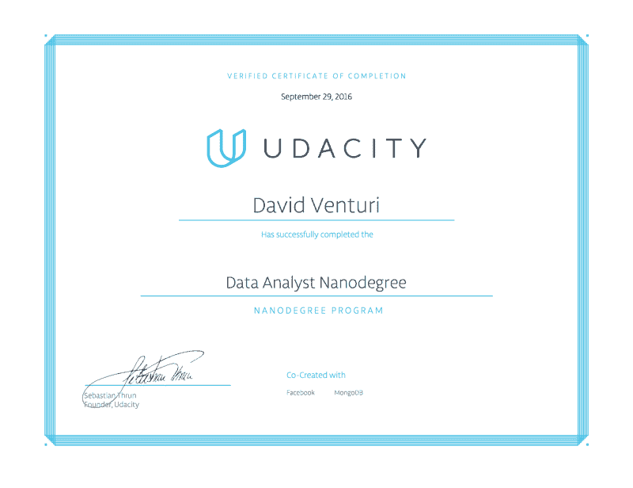

# 综述:Udacity 数据分析师纳米学位计划

> 原文：<https://www.freecodecamp.org/news/review-udacity-data-analyst-nanodegree-1e16ae2b6d12/>

大卫·文丘里

# 综述:Udacity 数据分析师纳米学位计划

Udacity’s [Data Analyst Nanodegre program](https://www.udacity.com/course/data-analyst-nanodegree--nd002)

Udacity 的[数据分析师纳米学位项目](https://www.udacity.com/course/data-analyst-nanodegree--nd002)是在线教育革命中首批在线数据科学项目之一。它旨在“确保你掌握在数据科学领域建立职业生涯所必需的技能。”它实现目标了吗？这是现有的最佳选择吗？

我在 2016 年秋天完成了这个项目。利用来自 [Class Central 的开源评审模板](http://davidventuri.com/s/Class-Central-Review-Template.pdf)的灵感，下面是我对 Udacity 的数据分析师纳米学位项目的评审。

***更新:*** *数据分析师纳米学位项目于 2017 年 9 月以新的内容和学生服务刷新。详情[此处](https://blog.udacity.com/2017/09/new-data-analyst-nanodegree-program.html)。我也被[带到](https://twitter.com/venturidb/status/870318727870517249)来帮助重新创作一些新内容。**本综述的大部分内容保持不变。** **事实更新用斜体表示。***

### 背景资料

#### 是什么让我决定参加这个项目？

2016 年初，我开始利用网络资源创建自己的数据科学硕士项目。(你可以在这里阅读。)我报名参加数据分析师纳米学位项目有几个原因:

*   我想要一本介绍数据科学的指南。
*   我想要一个有凝聚力的课程，而不是来自不同供应商的个别课程。
*   它获得了[星级评价](https://www.class-central.com/certificate/data-analyst-nanodegree--nd002)。
*   我以前上过一些 Udacity 的课程，我很喜欢他们的教学风格。

#### 我的目标是什么？

虽然这个项目可以作为通向工作的桥梁(稍后会有更多的介绍)，但我想用这个项目来介绍更高级的材料。这种“更高级的材料”既适用于课程中包含的科目，也适用于没有包含的科目。

#### 什么是 Udacity 纳米学位项目？

Udacity 是领先的在线教育提供商之一。前斯坦福大学教授、Google X 创始人巴斯蒂安·特龙创建了该公司，并担任总裁兼董事长，专注于 Udacity 的创新。[唯帅·马基贾尼是首席执行官](https://venturebeat.com/2016/04/22/udacitys-new-ceo-is-vish-makhijani-sebastian-thrun-becomes-president-and-chairman/)。

[纳米学位项目](https://www.youtube.com/watch?v=iC3eZwI4Lt8)是由 Udacity 提供的在线凭证。它们是 Udacity 课程的汇编(有些免费，有些不免费)，附有项目，由 Udacity 的付费项目评审员进行评审。他们还提供一系列学生服务。

Slack 是一个社区工具，Udacity 的学生可以在这里与其他学生以及他们项目的教师和其他 Udacity 的工作人员进行互动。在大多数项目中，学生都有指定的导师，并通过一个私人聊天频道与他们交流，该频道在 Udacity 教室中随时可用。

“Why Take The Data Analyst Nanodegree Program?”

数据分析师纳米学位计划最初于 2014 年发布。这是 Udacity 的第二个纳米学位项目。尽管多年来经历了一些变化，但该计划的核心是完整的。

#### 指导老师是谁，他们的背景是什么？

因为数据分析师 Nanodegree 项目是 Udacity 课程的汇编(同样，有些是免费的，有些不是)，所以有几个讲师。他们的简历通常包括在主要科技公司的显赫职位和美国顶尖学校的学位。

他们本身并不是“指导者”，但 Udacity 的项目审查人员、*导师和学生体验人员(他们与指导者一起监督 Slack】是你接触最多的人。他们非常非常有帮助。稍后会详细介绍。*

#### 费用

这个项目分为两个阶段。第一学期费用为 499 美元。第二学期费用为 699 美元。如果你对第一学期教授的技能有很强的掌握，你可以跳过它，只完成第二学期，仍然可以获得证书。

#### 推荐的先决条件

对于第一学期，Udacity 建议学生熟悉描述性统计，并有一些在电子表格或 SQL 中处理数据的经验。

对于第二学期，学生应该有使用 Python 分析数据的经验，以及对推断统计学及其应用的扎实理解。

#### 我加入该计划的背景/技能

我在 2016 年 5 月开始这个项目，当时我有几个月的编程经验，大部分是用 C 和 Python。这种经历的绝大部分来自我的数据科学硕士项目的桥接模块，在那里我参加了[哈佛的 CS50:计算机科学导论](https://medium.com/@davidventuri/review-harvard-cs50-introduction-to-computer-science-75405e684a61#.oseb0bx5c)和 [Udacity 的编程纳米学位课程导论](https://medium.com/@davidventuri/review-udacity-intro-to-programming-nanodegree-b38b4a9bf924#.z7u2wsq1g)。

我还完成了本科化学工程课程，并有了 24 个月与量化相关的工作经验。这意味着我已经学了几门统计学课程，对数据很熟悉。

Udacity promo material

### 该计划

#### 结构

数据分析师纳米学位项目分为两个阶段。每个学期有三门课程和四个项目(额外的项目是帮助你适应 Udacity 学习环境的介绍项目)。 [Mat Leonard](https://twitter.com/MCLeopard) 是更新时该项目的课程负责人，他在整个项目中介绍每门课程、其在项目中的目的及其讲师。

课程内容由视频、文本和测验组合而成。根据 Udacity 的风格，视频往往从 30 秒到 5 分钟不等。这些短视频后面通常会有自动评分的测验。这些测验通常是选择题、填空题或小型编程任务。*在[收购了 CloudLabs](https://www.class-central.com/report/udacity-acquires-terminal-com/) 之后，这些编程任务现在在 Udacity 教室的 Jupyter Notebook 和 SQL 编码环境中进行。*

同样，每个部分都有一个评分项目。这些项目和来自 Udacity 付费项目评审员的反馈是学生的价值所在。

#### 摘要

我的版本有七个部分:

*   P1:描述性和推断性统计
*   P2:数据分析介绍(熊猫和熊猫)
*   P3:与 MongoDB(或 SQL)的数据争论
*   P4:探索性数据分析(带 R)
*   P5:机器学习简介
*   P6:用 D3.js 实现数据可视化
*   P7:设计一个 A/B 测试

新项目的第一个学期叫做**用 Python 和 SQL 进行数据分析**。课程和项目包括:

*   ***介绍项目:*** *探索天气趋势。SQL 和电子表格(或者 Python/R，如果你已经熟悉的话)用于分析和可视化温度数据。*
*   ***课程:****Python 入门。**项目:**探索美国自行车共享数据。*
*   ***课程:*** *数据分析入门，包括数据分析流程和用于数据分析的 SQL。**项目:**调查一个数据集。*
*   ***课程:*** *实用统计。**项目:**分析 A/B 测试结果。*

*第二个学期叫做**高级数据分析**。课程和项目包括:*

*   ***介绍项目:*** *测试一个感性现象。基于一种被称为 [Stroop 效应](http://www.psytoolkit.org/lessons/stroop.html)的心理现象，计算描述性统计数据并对数据集进行统计测试。*
*   ***课程:*** *数据扯皮(用 Python)。**项目:**争论，分析数据。这是我创建的课程和项目。？*
*   ***课程:*** *探索性数据分析(带 R)。**项目:**发掘和总结数据。*
*   ***课程:*** *资料评书(附 Tableau)。**项目:**打造一个 Tableau 的故事。*

*巨大的变化，在这篇[博文](https://blog.udacity.com/2017/09/new-data-analyst-nanodegree-program.html) :* 中描述了全部细节

*   现在程序里教 Python。
*   机器学习和 A/B 测试现在作为选修材料，不再是毕业的必要条件。推理:“这个项目的重点是让你为数据分析师的工作做好准备。我们的研究表明，机器学习并不是绝大多数数据分析师职位的要求。”A/B 测试的基础知识现在包含在新的实用统计课程中，让学生接触到他们在工作中需要的知识。
*   新的课程和项目。具体来说，数据分析入门(包括用于数据分析的 Python 和用于数据分析的 SQL)、实用统计学(由巴斯蒂安·特龙教授)和数据争论。

Term 1 and Term 2 of the Udacity Data Analyst Nanodegree program

**分级**

根据一个独特的标准，项目以通过/失败(官方说法是“符合规范”和“需要修改”)为基础进行评分。你的项目必须满足该标准的所有部分。如果你所有的项目都符合规范，你就毕业了。这意味着自动评分的测验不会计入你的成绩。

如果提交的项目需要更改，您的项目评审员将为您提供可行的反馈。实施这些更改后，您可以重新提交。没有提交限制。

### 我的经历

#### 时间表

当我开始时，Udacity 的数据分析师纳米学位项目的预计时间是 378 小时，这意味着学生平均需要 6-7 个月才能完成。据 [Toggl](https://toggl.com) (一款时间追踪 app)统计，整个程序花了我 5 个多月 369 个小时。这个时间表包括投入大量时间使我的项目达到组合质量，而不是产生满足通过/失败标准的最小量。

*节目浓缩于 2017 年秋季刷新。新的估计时间表是 260 小时。每个学期在 13 周内每周 10 小时，尽管学生有 19 周的时间来完成每个学期。*

#### 课程内容怎么样？

在我这一期的课程中，P1(统计学)、P2(数据分析导论)、P4(探索性数据分析)、P5(机器学习)和 P7 (A/B 测试)的课程内容得到了我的五颗星。P3(数据争论)和 P6 得到三颗半星。

脸书员工(P4)的探索性数据分析内容很有启发性。巴斯蒂安·特龙和凯蒂·马龙(P5)上的机器学习入门课程是我上过的所有在线课程中最有趣的。谷歌员工(P7)的 A/B 测试内容是如此独特。如果可以的话，我会给这三门课打六颗星。

SQL 和数据争论的内容(P3)并不惊人。数据可视化内容(P6)也是如此，尽管这可能是因为 D3.js 对于 JavaScript 新手来说非常难教。根据班级中心对这些课程的评论，这些观点并不少见。看看这里的[和这里的](https://www.class-central.com/mooc/3253/udacity-intro-to-relational-databases)和。

在 2017 年秋季更新中，**移除了**旧节目中的这些“不惊人”的内容。现在包括数据分析、SQL、统计、数据争论和数据可视化介绍的改进内容。实用统计学内容侧重于推断统计学，描述统计学是先决条件，在[数据基础纳米学位项目](https://www.udacity.com/course/data-foundations-nanodegree--nd100)中教授。数据可视化课程现在使用 Tableau 而不是 D3.js 进行教学

#### 项目怎么样？

同样，项目是 Udacity 区别于其他在线教育平台的地方。他们[投资于他们的项目评审过程](https://medium.com/@olivercameron/how-a-udacity-graduate-earns-11k-a-month-reviewing-code-c2a7d295724c#.fogyv4k14)并且得到了回报。数据分析师纳米学位项目也不例外。

所有的项目都强化了你在视频中学到的内容。项目评审人员了解他们的工作。它们告诉你哪里成功了，哪里有错误和/或遗漏。在实践中监督学习。它工作了。

当你陷入困境时，论坛和论坛导师尤其有用。搜索论坛，看看你的问题是否是一个常见的问题(通常都是)。运气不好吗？自己发布一个新问题。有一位论坛导师迈尔斯·卡兰(Myles Callan)，他似乎对所有事情都了如指掌，并在几个小时内做出回应。我怀疑他睡着了。

虽然论坛仍然存在并发挥作用，Slack 和[课堂导师](https://www.udacity.com/start-mentoring)现在是推荐的支持渠道。学生可以张贴问题，答案以相同或更高的即时性提供(在几个小时内，通常更快)。Slack 社区由 Udacity 的教师和他们的学生体验人员监管，他们确保学生的问题、评论等。得到及时的处理。著名的迈尔斯·卡兰现在是一名导师。

如果你很想看看这些项目是什么样子，看看这个 [Github 库](https://github.com/davidventuri/udacity-dand)。

#### 有多难？

统计学的内容对我来说很简单，因为我在大学时上过几门统计学课程。如果你以前有过这方面的经验，这可能适用于纳米学位项目的每一个主题。

我认为这个项目的大部分属于中等难度。没有很多小测验的讲座内容(尽管它们经常有)可能很容易，这不一定是件坏事。这些项目锻炼你的大脑。如果你想彻底了解的话，每一个都可能需要你二十多个小时。

探索性数据分析项目是最难通过的。我花了 3.5 次提交。查看这个 [Twitter 帖子](https://twitter.com/venturidb/status/768105068268777472)了解更多细节。

#### 毕业后你能马上申请工作吗？

你可以。如果你认真对待的话，这个项目应该能让你具备入门级数据分析师角色所需的技能。Eli Kastelein 就是一个很好的例子。你可以在下面阅读更多关于他的故事。

[**【如何在没有计算机科学学位的情况下在科技行业建立职业生涯**](https://medium.com/udacity/how-to-build-a-career-in-tech-without-a-cs-degree-1beccd89be46)
[*2014 年春天，我是一名刚从大学辍学的学生，坐在灰狗巴士上，不知去往何处。*medium.com](https://medium.com/udacity/how-to-build-a-career-in-tech-without-a-cs-degree-1beccd89be46)

你也可以继续学习更高级的课程，包括课程中的科目和其他科目。这是我选择做的。

### 最后的想法

#### 如果我知道我现在所知道的，我还会参加这个项目吗？

在项目接近尾声时，我开始创建 Class Central 的[数据科学职业指南](https://medium.freecodecamp.com/the-best-data-science-courses-on-the-internet-ranked-by-your-reviews-6dc5b910ea40)。这需要研究为数据科学中的每个学科提供的每个在线课程。

虽然我喜欢纳米学位项目*(更新:新课程已经取代了我不喜欢的课程)*中的大多数课程，但其他供应商的课程在某些科目上获得了更好的评价。[统计](https://medium.freecodecamp.com/if-you-want-to-learn-data-science-take-a-few-of-these-statistics-classes-9bbabab098b9)为例。如果我在开始的时候能看到我的指南，我会考虑每门课单独上课的路线。**然而，Udacity 的学生服务和项目审查流程对学习非常有效，我无论如何都要参加数据分析师纳米学位项目。**

如果你是那种想要 100%定制在线教育体验，但又想利用 Udacity 的项目和服务的人，那么就要考虑为每个科目研究你最喜欢的课程(我建议使用 [Class Central](https://www.class-central.com/) ),然后报名参加纳米学位项目来完成这些项目。

#### 替代方案

*这是我在参加数据分析师纳米学位项目时考虑的五个备选项目:*

*   约翰·霍普金斯大学在 Coursera 上的[数据科学专业](https://www.coursera.org/specializations/jhu-data-science)
*   edX 上的微软[数据科学专业计划证书](https://www.edx.org/microsoft-professional-program-certficate-data-science)
*   卫斯理大学在 Coursera 上的[数据分析和解释专业](https://www.class-central.com/certificate/data-analysis-specialization)
*   DataCamp 的 [Python 和 R tracks](https://www.datacamp.com/tracks/skill)
*   Dataquest 的[数据分析师和数据科学家之路](https://www.dataquest.io/help/article/UzbJfHKufW-differences-between-paths)

*注意:由于 Udacity 关于评论其他提供商的政策，我已经删除了我对这些计划的评论。*

### 结论

Udacity 的数据分析师纳米学位计划为您提供了从事数据科学职业所需的基本技能。毕业后，你将能够针对你的优势和劣势，并在必要的地方补充你的学习。此外，你会带着一些现成的项目离开。

我喜欢它，其他人也喜欢它。

★★★★¾