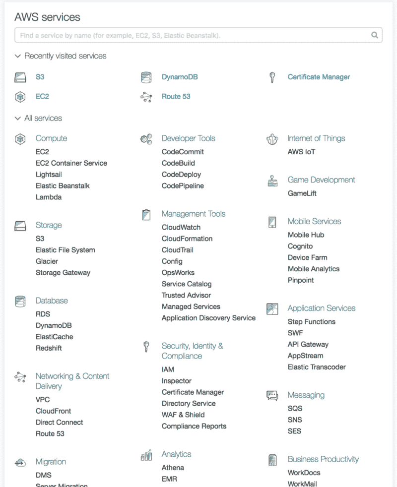
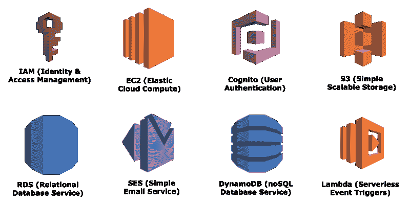
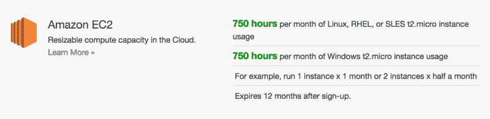
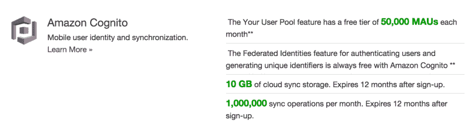
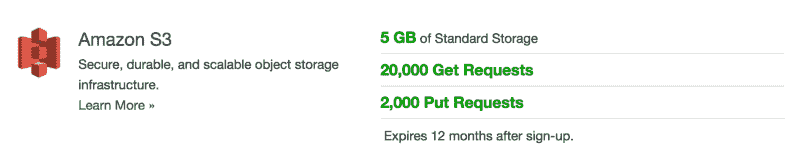
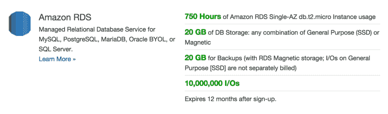
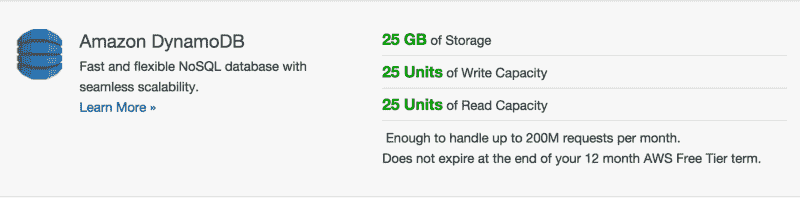
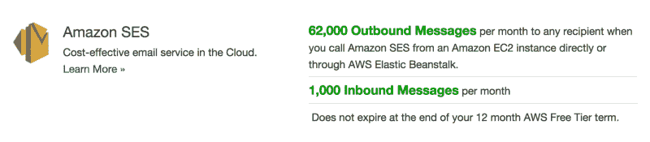

# 完整的 AWS Web 样板文件

> 原文：<https://www.freecodecamp.org/news/the-complete-aws-web-boilerplate-d0ca89d1691f/>

作者:黄

# 完整的 AWS Web 样板文件

#### 利用亚马逊云构建强大的可扩展 web 应用

### 目录

> **第 0 部分:** [介绍完整的 AWS Web 样板文件](https://medium.com/@kangzeroo/the-complete-aws-web-boilerplate-d0ca89d1691f#.3eqpvcjsy)

> **第 1 部分:** [使用 AWS 认知的用户认证](https://medium.com/@kangzeroo/user-management-with-aws-cognito-1-3-initial-setup-a1a692a657b3#.cbkz7b2jp) (3 部分)

> **第二部分:** [用亚马逊 S3 节省文件存储成本](https://medium.com/@kangzeroo/amazon-s3-cloud-file-storage-for-performance-and-cost-savings-8f38d7769619#.l9so2hk00) (1 部分)

> **第三部分:** [用亚马逊 SES 发送邮件](https://medium.com/@kangzeroo/sending-emails-with-amazon-ses-7617e83327b6#.5nhcrr609) (1 部分)

> 第 4 部分:使用 AWS IAM 管理用户和权限**【即将推出】**

> 第 5 部分:使用 AWS EC2 和 ELB 的云服务器托管**【即将推出】**

> 第 6 部分:MongoDB 黑仔:AWS DynamoDB **【即将推出】**

> 第 7 部分:使用 AWS RDS 的无痛 SQL 伸缩**【即将推出】**

> 第 8 部分:使用 Amazon Lambda 的无服务器架构**【即将推出】**

### 你好 2017

您希望构建可扩展的生产就绪型应用程序，但没有资源来雇佣多人团队来管理大型联盟所需的所有代码。你听说过两个人的神奇团队，他们用传统团队数千美元预算的一小部分创造出了效率惊人的应用程序。如果你能只为你需要的服务付费，而没有任何固定的管理费用，你的钱包会喜欢你的。所以你做了调查，来到亚马逊网络服务公司，这个世界上最大最全面的云服务提供商。但是在调查一个小时后，你会被可用的解决方案的庞大规模和多样性所淹没。“该死”，你说，“我该从哪里开始？”

如果你曾经研究过 AWS 的文档并试图理解所有部分是如何连接在一起的，你就会知道这不是一件容易的事情。当你试图实现像 S3 这样简单的东西时，你会为了安全而进入 IAM，并从那里潜在地进入 AWS STS，AWS Cognito…这个列表还在继续。EC2 怎么样？安全组？AWS Lambda？就是一个又一个兔子洞。

An intimidating look at Amazon Web Services

The new homepage still looks intimidating

现在你不必事事都用亚马逊。如果您已经知道如何使用现有方法集成用户身份验证，那么这可能是您的最佳选择。不需要增加额外的复杂性。但是如何扩展数据库呢？当然，也许你还不需要扩展，所以没问题。但是你安全地管理你的应用秘密吗？您是否通过将大型文件托管在云的其他地方来节省服务器带宽？也许你作为一个企业会从收集大量用户数据中受益，但是你不确定你的主数据库是否能处理额外的负载。你可以做很多事情来发展你的产品，但是不要做，因为这太费事了。

介绍 Kangzeroo 的完整 AWS Web 样板——一个入门应用程序，它将 Amazon 完全集成到每个繁琐的基础架构任务中，并自动扩展。通过从一开始就在你的应用中利用 AWS，你的业务可以立即投入运行，并将你的宝贵资源集中在改进你的产品上。这是一个真正的现代堆栈，可以让您以很少的成本和时间行使整个开发团队的权力。我们不会涵盖每一项亚马逊服务，只是你可能会用到的核心服务。如果你很兴奋并准备好开始，继续阅读。虽然这是一个高级教程系列，但是不要害怕跟随，即使你没有编码——知识是非常宝贵的。所以让我们开始吧！

### AWS 基础设施概述

The 8 Amazon services we will be using

之前所有 AWS 服务的截图超级吓人。老实说，我只是想吓吓你。这是我们将实际使用的 8 项服务。让我们看一下每项服务及其用途，以及潜在的免费层选项。为了使用 AWS，您必须注册一个需要信用卡的帐户。好消息是，你不必付费，因为每个新的 AWS 帐户都可以免费使用一年。

#### 身份和访问管理(IAM)

Amazon IAM 用于管理整个 Amazon 帐户的权限。一个亚马逊账户可能有几个用户，比如一个用于部署应用，另一个纯粹用于分析数据。因为您不希望分析师能够修改任何内容，所以我们需要为分析师提供一个单独的“帐户”。我们可以使用 IAM 来创建和管理单独的“帐户”(通过 IAM 用户或角色)，并遏制我们的偏执。谢天谢地！IAM 还可以用于向某些服务授予特定权限，例如专门用于发送电子邮件或访问 S3 存储桶的 IAM 角色。我是完全自由的。

#### 弹性云计算(EC2)

Amazon EC2 用于在虚拟云服务器上托管您的应用。这是最常用的亚马逊服务，也可能是你能得到的最便宜、最可靠的云托管服务。你可能听说过 EC2 的竞争对手，如 DigitalOcean、Linode 和一个看起来非常用户友好的小橘子。诚然，它们对用户非常友好，但为什么不呆在亚马逊生态系统中呢？把所有东西都放在亚马逊，你就不用学习多个不同的系统了。最好的部分是，免费层非常慷慨！您可以保持服务器 24/7 全天候运行，同时仍在空闲层限制范围内。

#### 和你在一起

AWS Cognito 是一种用户认证和管理服务。有了 Cognito，您不需要跟踪用于散列密码的密钥，也不需要实现核心安全性。这都是由 Amazon 处理的，您甚至可以获得双因素身份验证和“忘记密码”功能等高级功能。使用 Cognito 还可以很容易地限制对其他 AWS 服务的公共访问，比如 S3，方法是将 IAM 角色与 Cognito 登录相关联，并只授予该角色访问权限。Cognito 非常慷慨，即使在免费层到期后，每月仍有多达 50，000 名免费活跃用户。

#### 简单可扩展存储(S3)

AWS S3 是云文件存储。这是一项非常受欢迎的亚马逊服务，允许我们在独立于服务器的文件系统上存储任何类型、任何大小的文件。从性能的角度来看，这很好，因为服务器不需要浪费计算能力和带宽来传输文件。从财务角度来看，S3 也是一个廉价品，因为 S3 的带宽/存储比 EC2 的带宽/存储便宜得多。你发送的不是图像文件，而是一个 url 字符串，你的应用程序客户端从 S3 获取图像。亚马逊 S3 也有免费层，但即使没有它也便宜得离谱。存储 10GB 的图像，传输 30GB 的数据和 100 万个 GET 请求，每月总计需要 1.89 美元。

#### 关系数据库服务

AWS RDS(多么拗口)是一个云管理的关系数据库服务。虽然 Amazon 提供了自己专有的关系数据库，称为 Amazon Aurora，但是您可以选择使用各种现有的知名数据库。选项包括 MySQL、PostgreSQL、Oracle 和 Microsoft SQL Server。RDS 的伟大之处在于它可以自动扩展，为您节省昂贵的人力/专业时间。

#### DynamoDB

AWS DynamoDB 是由 Amazon 管理和自动扩展的专有 noSQL 数据库。它非常适合存储您的 misc 非结构化数据，或者作为 AWS Redshift 的“近似替代方案”,如果您负担不起的话。DynamoDB 经过这些年已经真正成熟了。几年前它只是一个键值存储(因为没有嵌套的对象或数组)，但是今天它非常灵活。您可以嵌套多达 16 层的对象，并在多个索引上进行查询。这也使它成为 MongoDB 的“近似替代方案”,假设您有自己的数据结构检查。最棒的是，25GB 的免费存储空间在你免费试用后不会过期！

#### 简单电子邮件服务

当你可以使用 AWS SES 时，为什么还要设置自己的电子邮件服务器呢？如果您的产品使用电子邮件发送收据、时事通讯或作为活动日志，您可以使用 ses 来经济地管理这些通信。电子邮件发送是一个非常标准的云服务，你可以选择 MailChimp 和 SendGrid 等提供商，但同样，包含在亚马逊生态系统中有很多好处！MailChimp 每月给你 12000 封免费邮件，而 AWS SES 给你 62000 封。这就是您的规模经济！

#### 希腊字母的第 11 个

AWS Lambda 是亚马逊提供的一项非常独特的服务。留在亚马逊生态系统中的一个主要好处是，您可以使用 AWS Lambda 从一个服务到另一个服务触发事件或操作，而无需运行自己的服务器。例如，如果您想在每次用户注册时在您的 S3 存储桶中创建一个用户文件夹。或者，如果有人从您的数据库中删除了某些内容，您可能希望触发一封电子邮件。或者，您可能希望建立数据管道来传输用户数据，以便进行实时处理和路由。可能性是灵活的，无穷无尽的！AWS Lambda 在试用期结束后也是免费的。

### 结论

在看到我们将使用的亚马逊服务的高层次概述后，你可能真的被夸大了。这很好，因为我相信你应该热爱你正在使用的技术。Amazon 既强大又实惠，让你在思想和实践上成为 10 倍的开发者(完成 10 个其他程序员的工作)。你感觉到能量在你的血管里流动了吗？学会这一叠，你兴奋吗？您准备好从第一天开始扩展了吗？如果有，那就开始吧。

### 目录

> **第 0 部分:** [介绍完整的 AWS Web 样板文件](https://medium.com/@kangzeroo/the-complete-aws-web-boilerplate-d0ca89d1691f#.3eqpvcjsy)

> **第 1 部分:** [使用 AWS 认知的用户认证](https://medium.com/@kangzeroo/user-management-with-aws-cognito-1-3-initial-setup-a1a692a657b3#.cbkz7b2jp) (3 部分)

> **第二部分:** [用亚马逊 S3 节省文件存储成本](https://medium.com/@kangzeroo/amazon-s3-cloud-file-storage-for-performance-and-cost-savings-8f38d7769619#.l9so2hk00) (1 部分)

> **第三部分:** [用亚马逊 SES 发送邮件](https://medium.com/@kangzeroo/sending-emails-with-amazon-ses-7617e83327b6#.5nhcrr609) (1 部分)

> 第 4 部分:使用 AWS IAM 管理用户和权限**【即将推出】**

> 第 5 部分:使用 AWS EC2 和 ELB 的云服务器托管**【即将推出】**

> 第 6 部分:MongoDB 黑仔:AWS DynamoDB **【即将推出】**

> 第 7 部分:使用 AWS RDS 的无痛 SQL 伸缩**【即将推出】**

> 第 8 部分:使用 Amazon Lambda 的无服务器架构**【即将推出】**

> 这些方法在 [renthero.ca](http://renthero.ca) 的部署中被部分使用