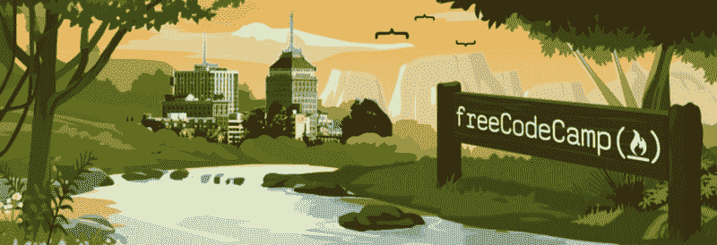
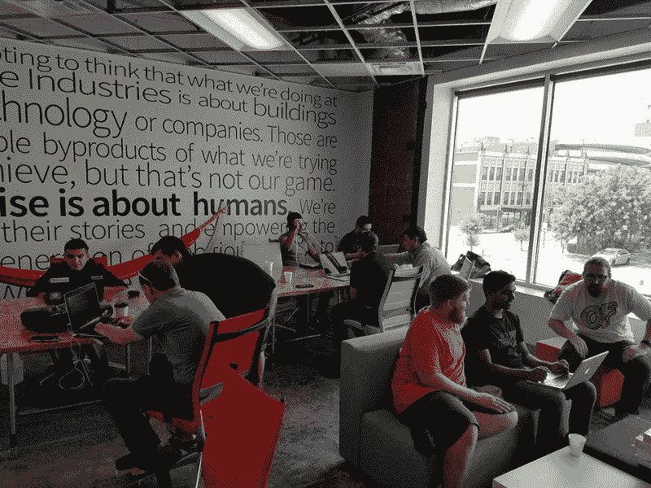
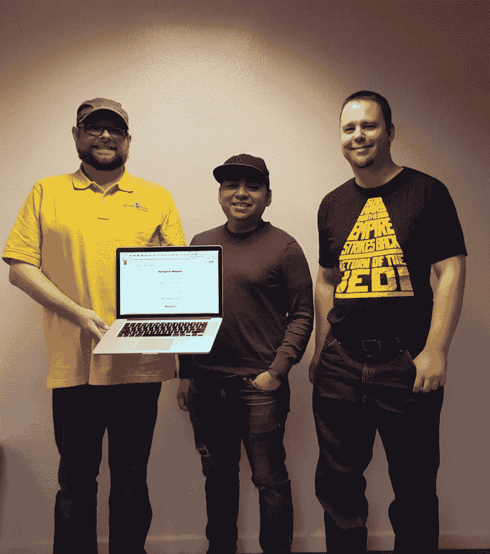
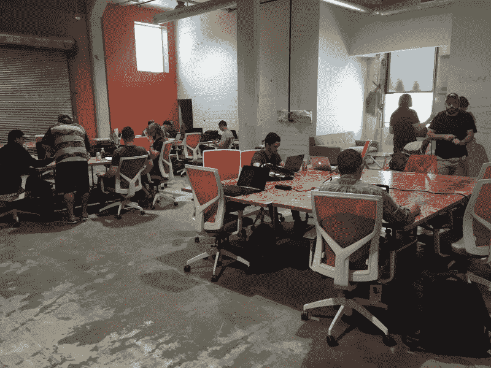
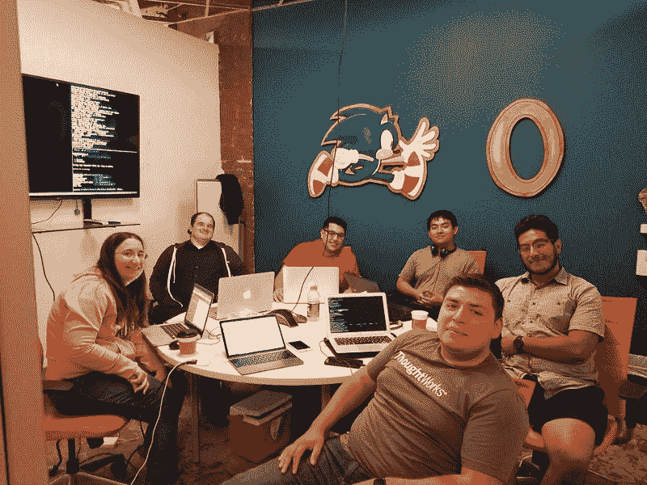
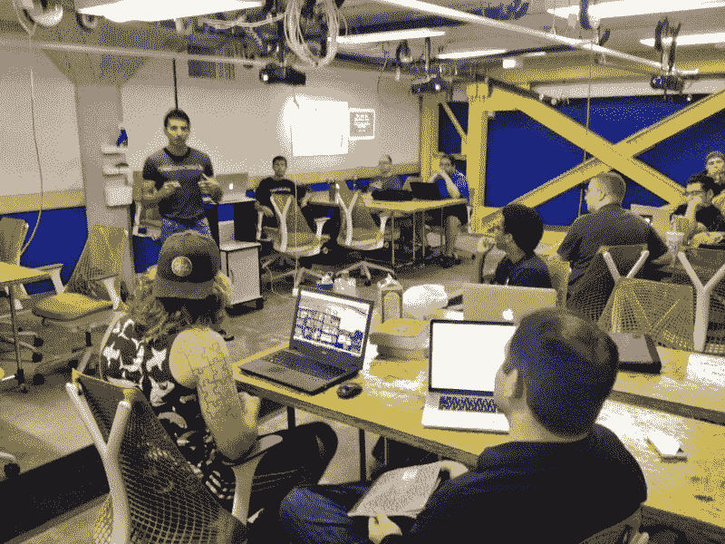
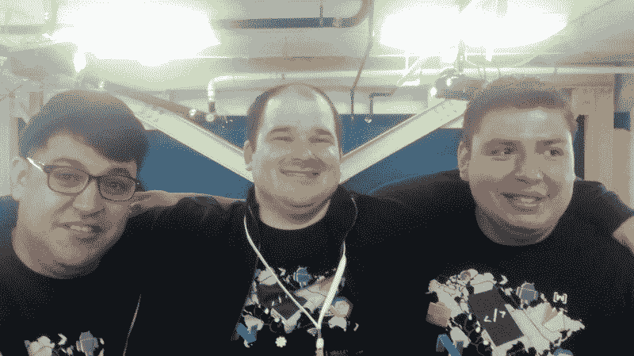

# 弗雷斯诺的一群陌生人如何找到一个场地，举办编码活动，并获得开发人员的工作

> 原文：<https://www.freecodecamp.org/news/why-fresnos-free-code-camp-is-awesome-8c0c10aaf7de/>

作者里克·G

# 弗雷斯诺的一群陌生人如何找到一个场地，举办编码活动，并获得开发人员的工作

一年前，我从韩国搬了回来。我靠着几份教学工作的积蓄生活，不太确定下一步该做什么。

后来，我的朋友托马斯·克莱恩向我伸出了手。他邀请我帮他复兴弗雷斯诺的自由代码营弗雷斯诺分会。

我以前管理过一个当地的技术社区，我知道这需要做很多工作。尤其是你一个人做的时候。但这也很有趣。所以我告诉汤姆，如果他和我能作为一个团队来做，我很乐意再做一遍。

尽管我喜欢独自编写代码，但我更喜欢在团队中编写代码。回到韩国后，我开始了自己的编码聚会。但是所有这些都发生在自由代码营出现之前。

你可以想象，当我在回美国的航班前发现釜山有一个新的[自由代码营分会时，我有多嫉妒。令我惊讶的是，它是由我的来自大邱的老教授，](https://www.facebook.com/groups/free.code.camp.busan/) [Stephen Mayeux](https://www.freecodecamp.org/news/why-fresnos-free-code-camp-is-awesome-8c0c10aaf7de/undefined) 带领的。

我能够研究斯蒂芬的许多策略，并将它们应用到新复兴的弗雷斯诺分会。

### 找到一个很棒的场地

That day we took over a hashtag

我联系了 [Bitwise](https://twitter.com/BitwiseFresno) 的活动协调员[塔丽莎](https://twitter.com/talishabrand)，这是“弗雷斯诺科技教育、合作和创新的母舰”她提到她正在寻找与那里举办的其他活动不同的东西，并对我们的自由代码营章节感到兴奋。

我们一起决定每个月的第一个星期六组织一次结对编程会议。在第三个星期六，这个活动更多的是一个咖啡和代码的事情，将逐渐变成一个动态的代码圈会议。

我永远不会忘记托马斯和我对视一笑的那一刻，因为房间里的对话越来越响，人们分享他们对代码的热爱。

### 我们第一年的成就

Our first meetup was at the Bitwise’s previous building.

我们的代码营努力创造一个开放的环境，让每个人都能聚集在一起，共同成长。

在过去的一年里，我们:

*   主持了一次白板编码挑战会议
*   在 2015 年[女性科技创客国际女性庆典](http://wtm.gdgfresno.com/)上赞助并管理代码实验室
*   就我们在技术行业找工作的经历进行了各种各样的讨论
*   贝克斯菲尔德和弗雷斯诺有组织的算法类
*   在 2016 年[valley devest](https://valleydevfest.com/)上主持了谷歌地图 API 代码实验室，然后根据我们在那里建立的原型创建了一个成熟的应用程序

A photo from our whiteboard coding meetup in May 2016

一路走来，我们帮助了人们:

*   在技术行业找工作
*   获得编码训练营的奖学金
*   大幅提高他们的编码技能
*   获得免费代码营证书
*   获得信心并成为我们社区的领导者
*   吃一吨披萨！(非常感谢迈克尔·克里斯科，他从一开始就是我们的会员)

[Jaime J. Rios](https://www.freecodecamp.org/news/why-fresnos-free-code-camp-is-awesome-8c0c10aaf7de/undefined)’ scholarship talk

### 阳光明媚的弗雷斯诺前途光明

这一年，我见证了很多人的成长和改变，无论是个人还是职业。

我很自豪能成为这个团体的一员，这个团体如此热衷于帮助我们彼此成长。每个人都在合作改善中央山谷的科技社区。

我在这个团体的经历甚至激励我申请一个非营利组织的地位，该组织通过志愿者和付费项目帮助有抱负的专业人士获得技术行业的经验。如果你有兴趣参加，请在 Twitter 上给我发消息。

我想感谢我们所有的成员，让过去的一年成为弗雷斯诺自由代码营令人敬畏的一年。

我完全被每个人流露出来的真诚善意所感动。如此多的人站出来贡献他们的时间，在我们的部落中分享知识。如此多的人努力用代码来增强自己的能力——他们中的许多人现在都是开发人员！

我真的很自豪，我们已经在弗雷斯诺建立和培育了这样的东西，而且它还在继续增长。我喜欢这里的每一分钟。

在未来的一年里，我们将继续通过新的项目和活动来发展我们的社区——甚至可能是一次黑客马拉松！所以，如果你在弗雷斯诺附近，你应该加入我们。

