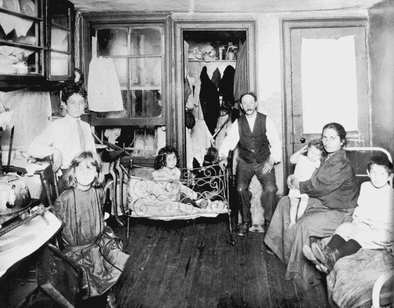
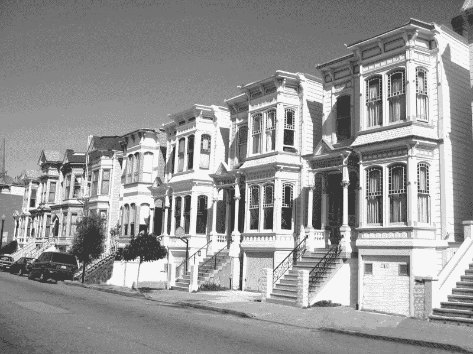
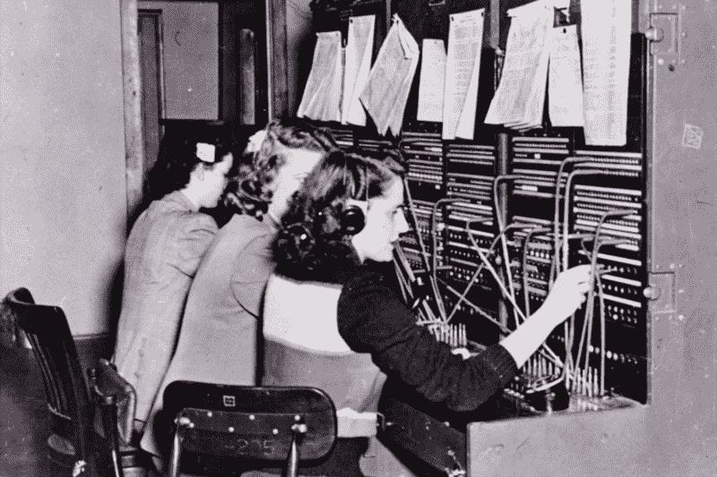
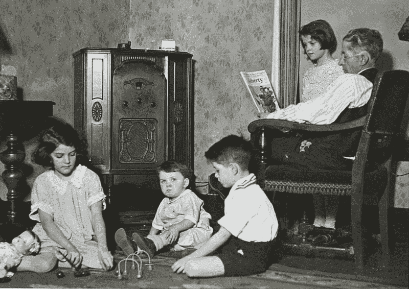
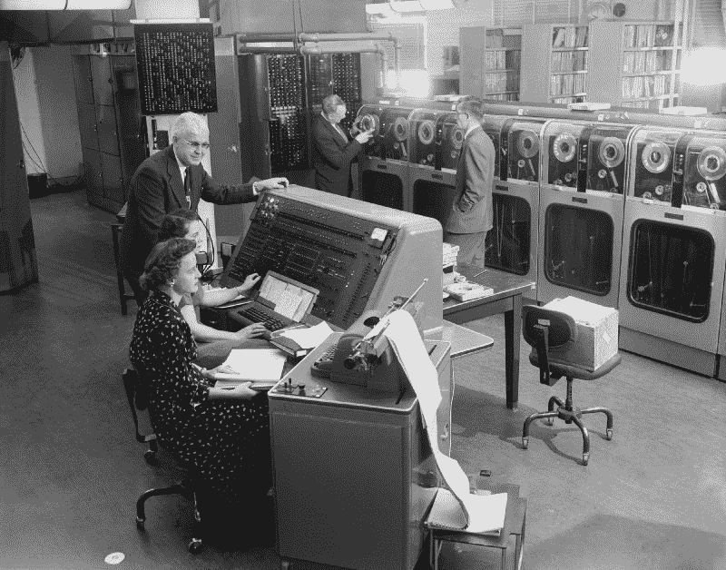
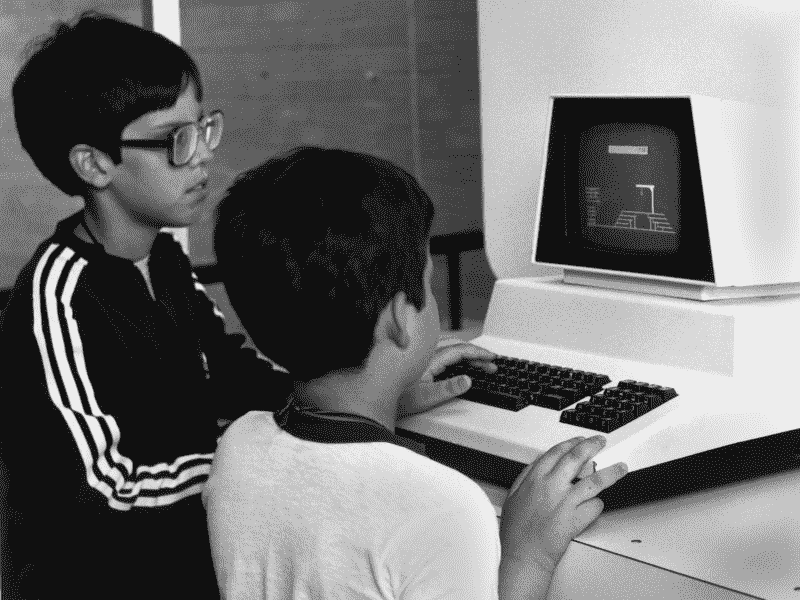
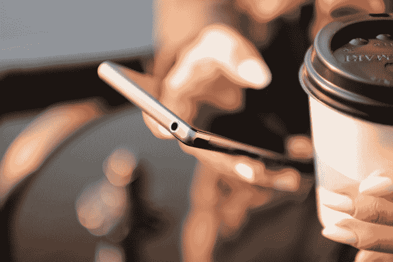
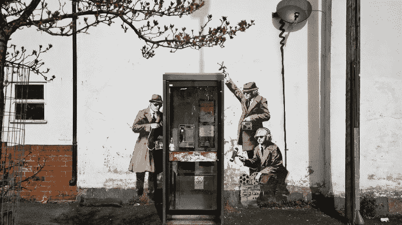
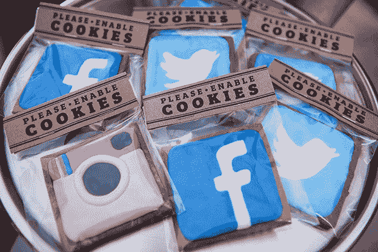

# 你的隐私正受到几项可怕的新法律的攻击

> 原文：<https://www.freecodecamp.org/news/your-privacy-is-disappearing-one-law-at-a-time-heres-what-you-can-do-about-it-b85c814035a4/>

> "如果隐私是非法的，只有不法之徒才会有隐私."—菲利普·齐默曼，PGP 的创始人

上周，英国通过了一项新法案，允许“极端监控”。这项调查权法案(更广为人知的名称是“探听者宪章”)几乎没有遭到反对就在议会通过了。

因此，英国的监控法律将很快比地球上任何其他国家都更具侵略性——包括许多独裁国家。

但是很少有人意识到这一点。我交谈过的大多数英国人甚至没有听说过这项法案。

去年，加拿大政府通过了一项法案，实质上建立了一个几乎不受监督的“秘密警察”。

现在，加拿大政府想更进一步，强迫软件开发者在他们的应用程序中建立后门，这样他们就可以在没有授权或任何通知用户的情况下进行间谍活动。

他们还希望能够合法地迫使公民解密他们自己的任何数据。

几天前，德国内政部的一项新法案草案浮出水面。该法案不仅会扩大政府监视德国人的能力，还会剥夺公民了解正在收集的关于他们的数据的权利。

我们这里说的是德国。

这就是 27 年前柏林墙倒塌的同一个国家。东柏林是史塔西的大本营，史塔西是有史以来最专制的秘密警察。因为害怕被监视，父母会在自己的家里俯身对着自己的孩子耳语。

那个德国。

甚至他们也在采取措施取缔隐私。

如果你生活在英国、加拿大和德国之外，这一切对你意味着什么？

意味着你是下一个。

因为这些法案——以及他们的公民无力阻止它们——只会鼓励其他政府推动类似的法律。

### 我们的祖先努力让隐私成为可能。

在人类历史的大部分时间里，隐私的概念甚至不存在。大多数家庭都挤在一室一厅的房子里。

A typical New York family in the early 1900’s — all living in a single-room tenement together.

想象一下每晚和你的家人睡在同一张床上。整个晚上，当人们翻身或起身撒尿时，他们会把你吵醒。生活就是这样。

但随着庞大的中产阶级的出现，多居室住宅变得越来越普遍。甚至孩子们也经常有自己的卧室。

随着技术的进步，它带来了更多的隐私。

例如，大多数家庭的第一部电话不是独立线路。这些是他们和其他几户人家共用的“电话线路”。任何人都可以在任何时候拿起电话，在你不知道的情况下偷听你的电话。

大多数呼出电话都需要你先和接线员通话，然后接线员会给你接通。接线员也可以在你不知情的情况下窃听你的电话。

但是电话发展到可以直接给人打电话的程度。你不再需要电话或接线员了。你可以相对自信地认为没有人在偷听你的电话。

然后收音机出现了。家人会围坐在一起听。每个人都必须听同样的东西。如果你爸爸想听足球比赛，你别无选择。你也不得不听。

但后来，耳机开始广泛使用。

第一次，你可以想听什么就听什么。你可以把喧嚣的世界拒之门外，给自己一个特别的空间。

计算机也是这样开始的。

如果你想使用电脑，你必须在一个共享的房间大小的主机上预留时间，在那里技术人员可以监控你在做什么。

但是技术全速前进。

个人电脑革命帮助中产阶级家庭拥有了自己的电脑。

现在，您有了自己的私人主机，可以放在口袋里随身携带。

在过去的 100 年里，技术和经济进步给了你更多的隐私，而不是更少。

但是，就像詹姆斯·邦德最新电影中的反派一样，有权势的人总是阴谋夺走你的隐私。正如我们在欧洲看到的，他们在这方面非常有效。

### 政府将如何取缔隐私

“Spy Booth” by Banksy. Stencil on concrete. Cheltenham, England. 2013.

“用自由换安全”最常见的理由是公共安全。

每一次恐怖袭击，每一次校园枪击，每一次便利店抢劫——这些都是安装更多监控和通过更多限制你隐私的法律的借口。

留意那些提出类似观点的政府和企业:

*   “如果所有的医疗记录都是公开的，制药公司可以更有效地研究救命药物。”
*   “如果所有的保险公司都了解每个人的风险因素，他们就可以给每个人一个公平的保险价格。”
*   “如果广告商更多地了解你，他们就会向你展示更多相关和有用的广告，而不是烦人的无关广告。”
*   “如果警察更多地了解每个人，他们就能在犯罪发生之前就阻止犯罪发生”

这些争论都涉及到你为了一些可疑的利益而放弃你的隐私权。但你可能足够聪明，能看穿这些伎俩。

问题是大多数人都不是。大多数人似乎不会再考虑用他们的隐私来换取利益，不管这种利益有多短暂。

一位行为艺术家展示了这一现象，他走近陌生人，给他们提供社交媒体主题的饼干，以换取他们的密码和社会安全号码。

好吧，所以很多人不重视他们的隐私。他们会用它来交换饼干这样微不足道的东西。这对你有什么坏处？

好吧，如果政府想要通过繁重的监控法律，就像他们刚刚在英国通过的那样，他们不需要亲自说服你。他们只需要说服那些愿意用自己的社会安全号码换一块饼干的人。

### 你能做些什么呢？

幸运的是，在为时已晚之前，你可以做很多事情来阻止你的政府。

#### 方法 1:支持电子前沿基金会(EFF)

EFF 是一个非营利组织，倡导通过立法、政策分析和隐私增强技术来保护隐私。它“确保权利和自由随着我们对技术的使用的增长而得到加强和保护。”

说到保护我们的隐私权，联邦调查局相当于一支精英特遣部队。看看他们在过去 26 年里所有重要的法律胜利吧。

[支持 EFF](https://supporters.eff.org/donate/) 。

#### 方法 2:给你的政府代表打电话

如果你在美国，打电话给你的代表。这比给他们发邮件有效多了。

他们的实习生可能会回答。但是只要坚持不懈，再加上一点运气，你也许可以直接和你的销售代表谈。

告诉他们你对自己隐私的担忧。鼓励他们为保护它而战。

请记住，这些政客主要关心他们自己选区的居民(他们能够为他们投票)，所以首先关注你自己的代表。

这是所有众议院代表和 T2 参议院代表的电话号码。

#### 方法 3:了解隐私状况

不管你对像朱利安·阿桑奇和爱德华·斯诺登这样有争议的人物有什么感觉，我强烈推荐你阅读格伦·格林沃尔德的《无处可藏》。它涵盖了像美国国家安全局这样的监控机构使用的大多数已知策略。

[**无处藏身:爱德华·斯诺登、美国国家安全局、美国监控国家**](http://amzn.to/2fNcACb)
[*编辑描述* amzn.to](http://amzn.to/2fNcACb)

#### 方法 4:加密你的整个生活

通过加密你所有的通信和数据，你可以防止政府和企业监视你。这样做是 100%合法且免费的，不到一个小时就可以[完成。](https://medium.freecodecamp.com/tor-signal-and-beyond-a-law-abiding-citizens-guide-to-privacy-1a593f2104c3)

[**如何在不到一小时的时间里加密你的整个人生**](https://medium.freecodecamp.com/tor-signal-and-beyond-a-law-abiding-citizens-guide-to-privacy-1a593f2104c3)
[*“只有偏执狂才能生存。”—medium.freecodecamp.com 的安迪·格罗夫*](https://medium.freecodecamp.com/tor-signal-and-beyond-a-law-abiding-citizens-guide-to-privacy-1a593f2104c3)

#### 方法 5:与你的朋友和家人谈论隐私

乔治·奥威尔的《1984》是美国学生的必读作品。每个人都读过这本书，或者至少知道它的内容。

好吧，1984 年离今天英国发生的事情不远了，某种程度上美国也是如此。

可能会觉得尴尬。可能感觉危言耸听。但是我们需要公开讨论隐私、隐私的重要性以及反对隐私的力量。我们需要讨论权衡的成本。我们需要感谢我们的祖父母所做的所有努力，这样我们才能享受这种隐私。

如果我们允许自己成为为了方便而牺牲所有隐私的一代，我们的孩子将很难——也许不可能——赢回隐私。

> "独处是现代世界中最珍贵的东西。"― **安东尼·伯吉斯**

我只写编程和技术。如果你在推特上关注我，我不会浪费你的时间。？