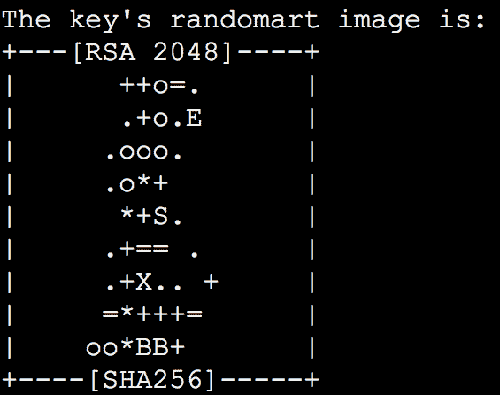
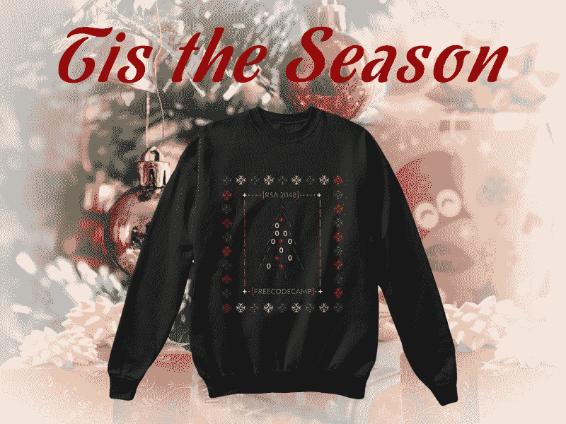

# 随机艺术和加密圣诞树

> 原文：<https://www.freecodecamp.org/news/the-geekiest-ugly-sweater-ever-34a2e591483f/>

当我第一次学习如何编码时，我的第一个任务是设置一个 SSH 密钥，这样我就可以使用加密安全地连接到我朋友的 Linux 服务器。

我运行命令:

```
ssh-keygen -t rsa
```

然后我的电脑创建了我的 SSH 密钥，并吐出了这个“randomart”:



“这是什么？”我问道，斜睨着兰多玛特，试图从混乱中恢复秩序。

我的朋友靠在我的肩膀上说，“哦，那是一个 randomart。看起来你得到了一棵可爱的加密小圣诞树。”

我有点眯起眼睛，转过头。果然，它看起来有点像圣诞树！

原来这些 randomart 挺有用的。尽管它们看起来很混乱，但对于人类来说，它们比一长串十六进制代码更容易区分。

比较这两个 randomart:

```
+--[ RSA 2048]----+|        .        ||       + .       ||      . B .      ||     o * +       ||    X * S        ||   + O o . .     ||    .   E . o    ||       . . o     ||        . .      |+-----------------+
```

```
Versus:
```

```
+--[ RSA 2048]----+|       .o o..    ||       o +Eo     ||        + .      ||         . + o   ||        S o = * o||           . o @.||            . = o||           . o   ||            o.   |+-----------------+
```

现在试着比较这两串十六进制代码:

```
2048 1b:b8:c2:f4:7b:b5:44:be:fa:64:d6:eb:e6:2f:b8:fa 192.168.1.84 (RSA)
```

```
Versus:
```

```
2048 1b:27:ac:a5:76:28:2d:36:63:1b:56:4d:eb:df:a6:48 192.168.1.84 (RSA)
```

明白我的意思吗？因此兰多玛特。QED。

### 奇怪的节日传统

快进到上周。我在考虑为假期设计一件难看的毛衣。

除了一件我阿姨给我织的毛衣，我从来没有过一件难看的毛衣。我甚至没有意识到这是一件丑陋的毛衣，直到多年后，当我翻阅奶奶的剪贴簿，看到自己穿着它的可怕照片。

尽管如此，我开始相信难看的毛衣确实是一种时尚。

“人家开丑毛衣派对！”他告诉我的。“你穿上你能找到的最丑的圣诞毛衣，然后一起去喝蛋酒！”

快速的谷歌搜索证实了他是对的。这些年来我一直生活在幻想中，错过了丑陋毛衣派对的精彩。

### 设计难看的毛衣

所以我头脑风暴了一会儿。我能想象到的与编程有关的最丑陋的事情是什么？缩小的 CSS？C++堆栈跟踪？

这时我想起了我的第一个 SSH 密钥 randomart，以及我朋友对它看起来像圣诞树的评论。

我和德克萨斯州奥斯汀的平面设计师韦斯利·瑟兰通了电话。韦斯利和我来回讨论了几天设计想法。

我做了敏捷的事情，[在推特上发布了](https://twitter.com/ossia/status/803266288009129984)我们设计的草稿，以获得我们社区的反馈。

人们希望我们去掉 2016 年圣诞节毛衣(我用它代替了 RSA 2048 ),这样他们就可以在接下来的假期穿这件毛衣了。他们还想要 t 恤和帽衫。所以我们提供了这些。

像往常一样，我们对这些资产进行了知识共享许可，并将它们放在自由代码营的[资产回购](https://www.github.com/freecodecamp/assets)上，供每个人使用。

下面是成品毛衣的样子，配以俗气的背景:



所以现在你可以举办难看的圣诞毛衣派对，或者只穿一件去家庭聚会。你将是那里最令人讨厌的人(这是一件好事！)穿着你牛逼的宋承宪 key randomart 丑毛衣。

这些将在未来几天在[我们社区的商店](https://freecodecamp.com/shop)出售，所以去买一个吧。

加密快乐！