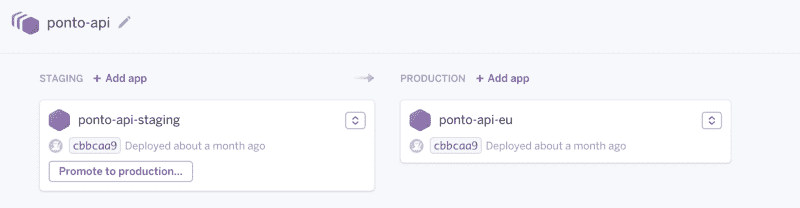
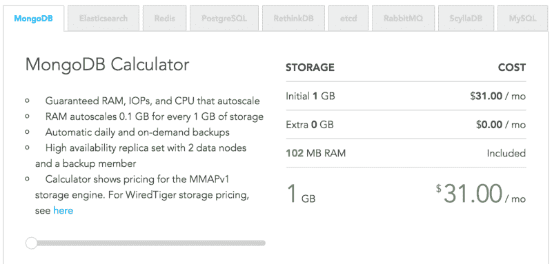
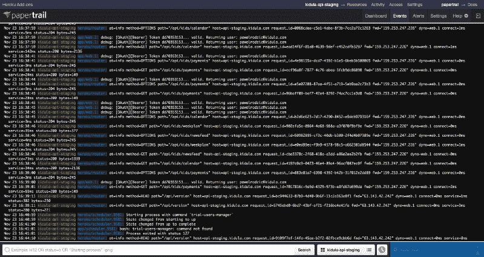
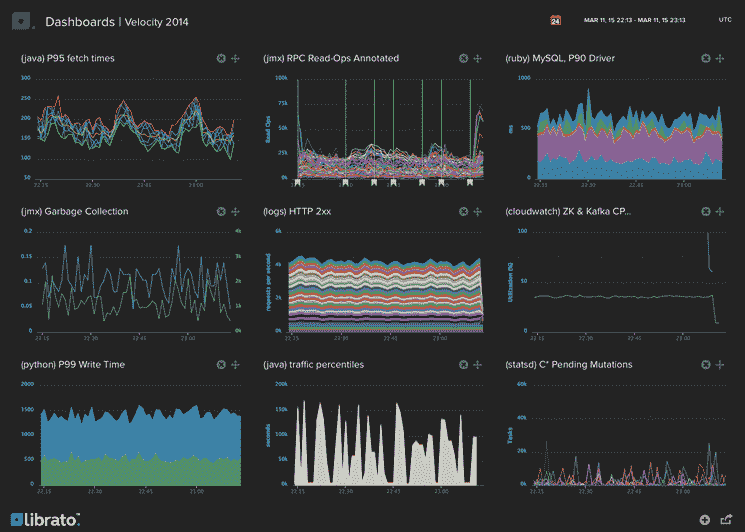

# 您的初创公司如何以每月不到 200 美元的成本利用生产级基础架构

> 原文：<https://www.freecodecamp.org/news/how-your-startup-can-leverage-production-grade-infrastructure-for-less-than-200-month-15c3724038b4/>

在推出新服务之前，您需要基础设施。您需要可靠性、可伸缩性和许多其他特性。但你不想倾家荡产。

在过去的几年里，我经历了推出几项新服务的过程。每一次，我都在探索选择的领域。

本文的目标是帮助您关注您的解决方案为用户提供的价值，同时最大限度地减少花费在基础设施上的时间和金钱。

我们将使用一切交钥匙托管服务，目标是账单低于 200 美元/月。

请注意，我与本文中推荐的任何产品或服务都没有关系，也不持有任何股份。我只是喜欢他们做的事情。

让我们开始吧。这是你需要的:

*   高可用性 API
*   一个 web 应用(除非你的服务纯粹是一个 API，或者只是在一个移动应用、聊天机器人等里面消费。)
*   文件存储器
*   两个环境:一个用于测试和演示，一个用于生产
*   监控生产平台的工具
*   动态扩展生产服务器的能力

### 生产与暂存

您将需要两个环境:一个是生产环境，您的客户将实际使用，另一个是“试运行”环境，您的团队将使用它来测试和潜在地向客户演示 beta 特性。

运行您的应用程序时，登台应该只需要最少的设置。您不需要担心这方面的负载测试。

您的生产环境将对其所有服务进行负载平衡，出于可靠性考虑，每种服务至少有两个实例。稍后，我们将介绍一些基本但全面的工具，它们可以帮助您实现 24/7 全天候监控。

### 后端托管

我建议您将后端 API 托管在 Heroku 上。它适用于大多数语言。您可以在此查看支持语言的完整列表[。请注意，虽然 ASP.NET 还没有得到官方支持，但是有开源的](https://www.heroku.com/languages)[构建包](https://github.com/friism/heroku-buildpack-mono)使这成为可能。

虽然一些开发人员可能认为原始 AWS EC2 实例比 Heroku dynos 便宜，但只有当您考虑服务器的成本时，这才是正确的。由于 Heroku 的安装速度更快，并且更容易与额外的服务集成，您将节省开发人员的工作时间，这应该足以弥补价格差异。

让我们通过两步为您的 API 创建一个 Heroku 管道:登台和生产。您将通过将代码推送到临时应用程序来进行部署。然后，一旦您测试了它，您将“升级”一个版本的产品。此过程将有助于防止错误的部署到达您的生产服务器，并最终到达您的客户。

您的管道将如下所示(在此阅读更多详细信息[):](https://devcenter.heroku.com/articles/pipelines)

我建议您从以下几点开始:

*   1 个 hobby dyno，7 美元/月，用于暂存
*   2 个标准-1X dyno，用于生产，每个每月 25 美元

**费用:57 美元/月**

### 数据库托管

如果你使用 PostgreSQL，只需使用 Heroku 的服务。它将在网络方面更加一致，你将得到一行账单，而不是两行。

对于更一般的情况，使用[合成](http://www.compose.com)。最低的资源计划对于早期阶段来说已经足够了。根据需要缩放资源“滑块样式”。

Compose 涵盖了必须具备的:节点故障转移、每日备份、SSL 加密和基本的监控面板。

您可以在 Compose 中的一个“部署”上运行临时数据库和生产数据库。但是，为了使您的生产数据与未经测试的代码隔离开来，并且不会被损坏，您应该使用两个独立的数据库。

对于成本，我们将 MongoDB 作为每个部署每月 31 美元的基准(PostgreSQL 将是每月 27 美元)。

**费用:每月 62 美元**

关于为 MongoDB 托管使用 [mlab 的一个快速提示:我们也是从 mlab 开始的。我们有一个别致的专用副本集，包含 2 个节点，1.7 GB RAM 和 40 GB SSD。所有费用都是每月 260 美元(180 美元用于集群本身，80 美元用于打开 SSL)。](https://mlab.com)

服务很好——尤其是他们的监控组件，遥测系统。

但是在几个月的运行和几千名用户之后，所有的图表仍然显示不到 10%的消耗。集群的杀伤力太大了，而且会持续一段时间。因此，我们转向组合，并逐步扩大规模，以降低成本。

### 前端托管

我推荐使用 [Netlify](https://www.netlify.com/) 。这很简单:

*   使用您的 BitBucket/GitHub/GitLab 帐户进行连接
*   选择要部署的存储库和分支
*   设置您的构建命令，以及您想要提供的构建文件夹

推到正确的 Git 分支将触发您在 Netlify 的服务器上的构建，然后自动将其部署到他们的 CDN。你可以在这里阅读更多关于这一切是如何运作的[。](https://www.netlify.com/docs/continuous-deployment/)

还有两个步骤:

*   使用 CNAME 记录将您的 DNS 指向您的网络 URL
*   在网络面板上启用 SSL。它将在几分钟内提供并自动部署一个加密 TLS 证书。

然后创建项目，如下所示:

*   一个用于非主 git 分支上的暂存应用程序
*   一个用于主 git 分支的生产应用程序

对暂存平台使用免费计划，对生产平台使用每月 9 美元的计划。你将很快扩展到 49 美元/月的计划来引入你的团队。但这在开始时是不需要的。当您接触到全球数百万用户时，您可以再次升级以使用 Geo-IP CDN。

**费用:每月 9 美元**

### 文件托管

对于文件托管，我推荐 AWS S3(简单存储服务)。创建两个存储桶—一个用于暂存，一个用于生产。

内容通过 AWS CDN 分发，数据可以安全地存储和检索。这里有更多关于如何安全设置铲斗的细节。

最初的 5GB(现在我认为甚至是 15GB)是免费的。则成本为每 GB 0.03 美元(至少对于他们的欧盟/爱尔兰地区)。所以在早期，你甚至不需要支付任何费用。

**费用:0 美元/月**

另外，我建议您直接从 web 应用程序向 AWS S3 发送数据，以减轻 API 的负担。关于如何安全地做到这一点，网上有大量的文章。

### 域和 SSL

获得一个域名，对于大多数顶级域名来说，每年花费不到 50 美元。

然后，您可以使用[为您的所有端点生成证书，让我们加密](https://letsencrypt.org/)。它免费提供受主流浏览器信任的 CA 支持的 SSL 证书。

**费用:50 美元/年**

### 监控工具

监控您的生产平台是关键。您需要知道错误何时发生，以便能够快速修复它们。用户不会努力去报告小问题，但是他们对你的服务的印象仍然会下降。

全面监控需要:

*   具有主动错误行检测的 API 循环日志
*   主动报告客户端和服务器端的异常和错误
*   正常运行时间监控
*   API 和数据库的性能指标，因此您知道何时扩展
*   报告所有错误的中心位置，以便您可以快速采取行动

#### 松弛的

您可以使用 Slack 将所有错误报告聚集在一个通信集线器中。Slack 是为团队设计的，但是如果你是一个人在做项目，这些工具就是你的团队。

在 Slack 上创建一个账户和一个名为 *#prod-errors* 的通道。您将配置所有其他服务来报告 Slack 上的错误。

一旦你安装了每个服务的 Slack 应用程序，并为桌面和移动设备启用了通知，你就可以开始了。

这是 24/7 全天候监控的启动版本。

#### 记录

我推荐使用 [Papertrail](https://papertrailapp.com/) 进行日志管理。它提供:

*   一个简单的基于 web 的控制台，用于所有 API dynos 的日志
*   在单独的存储位置对日志进行每日备份
*   警报配置，必要时 ping 您

看起来是这样的:

乍一看并不那么性感，但最终 UX 接近一个真正的服务器控制台，所以它做到了。

将 Papertrail 添加为 Heroku 暂存和生产应用程序的附件。使用暂存平台的免费计划。对生产平台使用每月 7 美元的“Fixa”计划，以获得 1 年内每天 50MB 的日志和历史记录。

配置 Papertrail 警报，将错误行推送到您的 Slack *#prod-errors* 通道。

小心点。日志通过一个名为 [logplex](https://devcenter.heroku.com/articles/logplex) 的组件从您的 dynos 推送到附加组件。如果你有一个在几毫秒内产生数千行的算法，logplex 会丢弃它们。

**费用:7 美元/月**

替代方案:你可以在 Heroku 上一键插入其他工具。点击查看完整列表[。](https://elements.heroku.com/addons#logging)

您可以添加和删除日志加载项，而无需重新启动您的应用程序，因此使用起来非常安全。您甚至可以并行测试几种解决方案并进行比较。

在我看来，其他的日志记录系统在开始时都是多余的。 [Logentries](https://logentries.com) 提供高级分析，但仅限于 89 美元/月的计划。 [Sumologic](https://www.sumologic.com/) 也是一个很好的工具，但只有当你有数百万用户时才需要它。然后，它将能够检测日志流和应用程序行为的变化。

#### 哨兵

您的 API、web 应用程序和移动应用程序应该向 Sentry 报告错误和异常。整合是交钥匙。它只需要在任何技术中将几行内容复制粘贴到您的项目中。

设置哨兵，也将错误推到你的松弛*#生产错误*渠道。

哨兵的免费计划是可以的，因为它允许每天 5000 个事件。因此，除非你在分发给成千上万用户的移动应用程序中有一个 bug，否则它应该会存在。如果您的团队至少有两个人，则使用每月 29 美元的第一个付费计划，这样您的所有团队成员都可以访问门户。

**费用:29 美元/月**

#### Uptimerobot

这是一项健康检查，以了解您的服务是否已启动。

要设置它:

*   为您的 API 配置一个端点(如果需要，添加一些免认证端点，如 */version*
*   在 index.html 文件中为您的 web 应用程序配置一个端点

设置 Uptimerobot，向您的 Slack *#prod-errors* 频道推送停机提醒。

使用免费计划(目前只有一个免费计划)。

**费用:0 美元/月**

#### Librato

Heroku 为您的 API 提供了不错的指标，但是仅限于三天的历史。 [Librato](https://www.librato.com/) 历史更悠久，仪表盘更全面。

将 Librato 配置为 Heroku 应用的附件:

*   使用分期应用的免费计划
*   对生产应用程序使用每月 19 美元的“镍”计划，这样你就可以在图表上获得长达四周的深度

带有 Heroku 的 Librato 的[定价与 Librato 网站上的不同。](https://elements.heroku.com/addons/librato)

这足以对您的 API 性能有一个大致的了解。随着吞吐量和响应时间的增加，扩展您的资源，以减少对用户体验的影响。

**费用:每月 19 美元**

### 该付账了

让我们总结一下到目前为止我确定的所有成本:

*   Heroku 上的后端每月 57 美元
*   Compose 上的数据库每月 62 美元
*   Netlify 上的网络应用每月 9 美元
*   域名费用为 50 美元/年(分成 4 美元/月)
*   55 美元/月，用于监控文件记录/岗哨/图书馆

**总计:187 美元/月**

我们已经实现了每月低于 200 美元的目标。我们每月还有额外的 13 美元。让我们看看我们是否能为此成本建立我们的软件工程栈。

我们可以使用:

*   Git 存储库的位桶。它没有 GitHub 时髦，但是提供免费的私有库
*   JIRA 可以作为敏捷规划者和错误跟踪者，每月 10 美元
*   CodeShip 有一个免费的计划来自动化你的 API 构建
*   谷歌应用程序每个账户每月只需 4 美元。使用一个帐户和别名来处理[办公室@](mailto:office@mydomain.com)…[支持@](mailto:support@mydomain.com)…[职业@](mailto:career@mydomain.com) …。这些地址看起来不错，但在创业的最早阶段都是同一个人。

我可以继续下去，但我们应该在这里停下来，因为我们已经超出每月 200 美元的预算 1 美元。

### 结论

如果你是一名开发人员，想在 SaaS 创办一家公司或从事一项业余爱好，我希望这篇文章表明，如果你使用正确的工具，基础设施部分并不那么困难。

即使你的目标是成为下一个大人物，你仍然可以在早期推广产品的过程中节省开支。

**专注于你给用户带来的价值。不是在基础设施上。**

本文提供的解决方案可以扩展到成千上万的用户。从一开始就设置好，一旦获得牵引力，您就可以支持爆炸性的用户增长。我祝你好运，尽快达到这一点。

请把这个分享给任何感兴趣的人。如果你喜欢你所读的，点击下面的❤按钮。