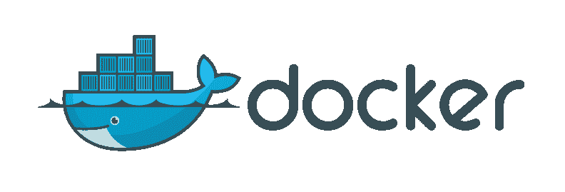
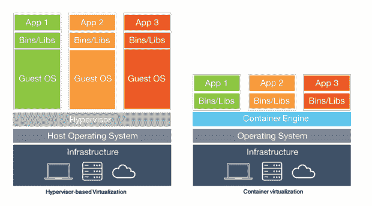
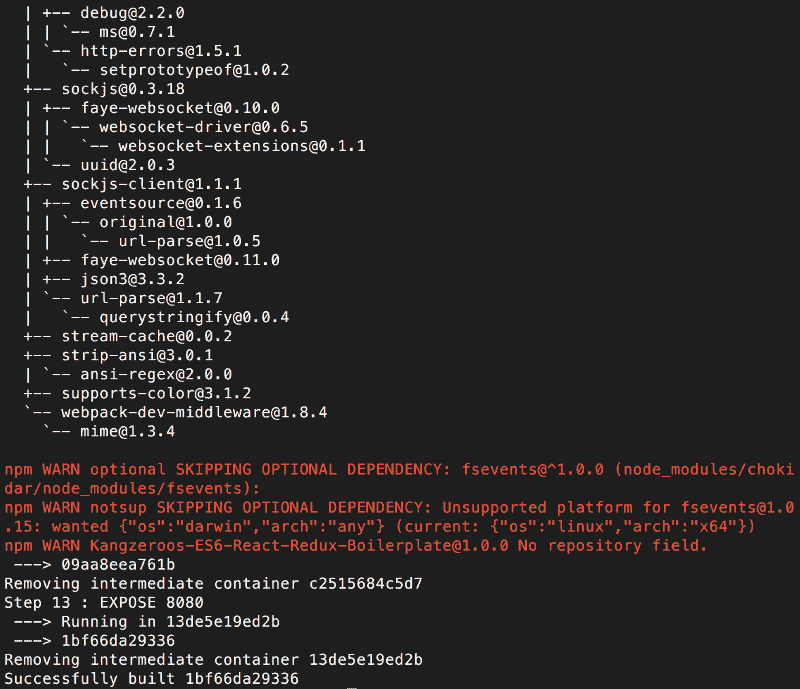
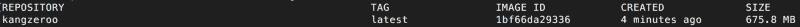
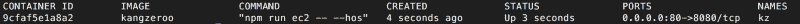
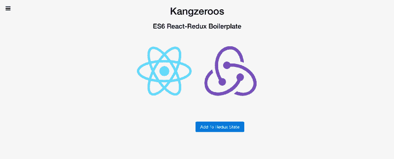

# Docker:像构建、运行、完成一样简单！

> 原文：<https://www.freecodecamp.org/news/docker-easy-as-build-run-done-e174cc452599/>

作者:黄

# Docker:像构建、运行、完成一样简单！



Docker 最近受到了很多关注，这是有原因的。容器化服务使部署微服务变得简单而稳定，因为每个服务都可以在自己的虚拟环境中运行操作系统。这意味着完全兼容…再也不用担心操作系统版本、依赖性以及开发和生产机器之间的差异！最重要的是，它是轻量级的，所以您可以在同一台机器上运行多个 Docker 容器(EC2 实例)。今天我们将学习如何通过三个简单的步骤在 Amazon EC2 上设置和部署 Docker！

在我们开始之前，看一下这个高层图表(由[infoworld.com](http://www.infoworld.com/article/3072929/linux/containers-101-linux-containers-and-docker-explained.html)提供)。



左侧是使用虚拟机管理程序的传统虚拟机设置。虚拟机管理程序就是负责为每个虚拟操作系统分配硬件资源的虚拟机管理器。如果每个客户操作系统需要 1GB 内存，而主机使用 1GB 内存，则左侧的设置总共需要 4GB 内存。

右边是一个容器设置，它将运行一个容器引擎，比如 Docker。最显著的区别是，容器引擎更加轻量级，因为它可以与其主机操作系统共享某些硬件资源，而不像传统虚拟机那样需要单独分配资源。该设置需要 1GB 用于主机操作系统，每个容器可能需要 600MB(因为假设 300MB 与主机操作系统共享)，总共需要 2.8GB。看到这些好处了吗？酷，现在我们可以开始了！

### 入门指南

进入您的 EC2 实例，从 Github 克隆[Kangzeroos-ES6-React-Redux-Boilerplate](https://github.com/kangzeroo/Kangzeroos-ES6-React-Redux-Boilerplate)。您看到的代码将用于设置此 web 应用程序，但步骤对于任何项目都是相同的。下载完成后，进入文件夹，找到下面的文件。这些是我们将与 Docker 一起使用的文件。

```
Dockerfile
build.sh
run.sh
```

在我们使用 Docker 之前，我们必须先安装它。下面是安装 Docker 的快速而简单的方法，但是如果你想要完整的配置，请查阅[官方文档](https://docs.docker.com/engine/installation/linux/ubuntulinux/)。

```
$ sudo apt-get update
$ sudo apt-get install docker-engine
$ sudo service docker start
$ sudo docker run hello-world
```

最后一个命令检查 Docker 是否成功运行，然后退出。如果所有这些工作，你准备好开始 Dockerizing！

### 步骤 1:构建 Dockerfile 文件

第一步是配置 Docker 为自己构建映像所需的文件。Docker 映像只是您想要创建的环境的蓝图，而容器是您的应用程序将在其中执行的实际运行和功能环境。在我们 app 目录的根目录下，有一个文件夹叫做`App`。web 应用程序本身位于这个`App`文件夹中，而所有与 Docker 相关的东西都在外面。这是必要的，因为码头工人将在`App`内装箱。因此，让我们制作第一个 Docker 文件，名为`Dockerfile`(没有文件扩展名`Dockerfile.sh`，只有`Dockerfile`)，并逐行浏览。

```
FROM ubuntu 

# ubuntu setup
RUN apt-get update -y
RUN apt-get upgrade -y 
RUN apt-get install nodejs -y && apt-get install npm -y 

# install curl for n
RUN apt-get install curl -y
RUN apt-get install vim -y 

# obtain latest stable version of node
RUN npm cache clean -f
RUN npm install -g n
RUN n stable 

# setup working directory
# ADD /App /App
WORKDIR /App
RUN npm install 

# expose port
EXPOSE 8080
```

第一行是`FROM ubuntu`。`Dockerfile`的目的是设置 OS 和 OS 内部的程序，所以第一行指定使用哪个 OS 版本是有意义的。`ubuntu`这里指的是托管在 [Docker Hub](https://hub.docker.com/_/ubuntu/) 上的特定镜像，具体来说就是官方的 Ubuntu OS 镜像。

```
# ubuntu setup
RUN apt-get update -y
RUN apt-get upgrade -y 
RUN apt-get install curl -y
RUN apt-get install vim -y
```

下一行是在 Ubuntu 中设置的。我们想用`RUN apt-get update -y`检查 Ubuntu 的更新，用`RUN apt-get upgrade -y`检查升级……这是设置你的环境的很标准的东西。还要安装 curl `RUN apt-get install curl -y`和 vim `RUN apt-get install vim -y`，两者都是通用的。

```
# obtain latest stable version of node
RUN apt-get install nodejs -y && apt-get install npm -y
RUN npm cache clean -f
RUN npm install -g n
RUN n stable
```

下一组行是针对 NodeJS 设置的。由于我们想要使用 ES6 特性，我们需要通过节点模块`n`获得 NodeJS 的最新版本。用`RUN apt-get install nodejs -y && apt-get install npm -y`安装 NodeJS 和 NPM。然后清理 npm 为使用`RUN npm cache clean -f`的`n`让路。用`RUN npm install -g n`安装`n`。最后，我们可以用`RUN n stable`运行`n`(NodeJS 的最新版本)。

NodeJS 是针对 Javascript 的，但是如果你使用的是 Python 等其他语言，你可以安装任何你需要的程序来运行你的 Python 应用。

```
# setup working directory
ADD /App /App
WORKDIR /App
RUN npm install

# expose port
EXPOSE 8080
```

`Dockerfile`最后一部分是设置 app 本身的工作目录。`ADD /App /App`从我们的机器中取出`App`文件夹，并将其复制到 Docker 容器中。接下来，`WORKDIR /App`将 Docker 工作目录设置为`/App`，这样您在 Docker 中运行的任何命令都会在`/App`中执行。这是将`npm install`安装在正确位置(即 Docker 容器的`/App`)所必需的。

最后，我们`RUN npm install`在我们的机器上安装我们的 NodeJS 依赖项。最后，我们将使用`EXPOSE 8080`显式公开 Docker 映像的 8080 端口，以便外界可以访问我们的应用程序。外部世界包括互联网以及运行在同一台机器上的其他 Docker 容器。

### 步骤 2:构建脚本

```
docker build -t kangzeroo .
```

在应用程序的根目录下创建一个名为`build.sh`的新文件。这是一个用于构建 Docker 容器的 shell 文件。这个`build.sh`文件实际上并不必要，因为我们可以在终端中直接运行这个命令。然而，这对于简化过程来说确实很好。

下面是这一行的分解:`docker build`是告诉 Docker 构建映像的命令。`-t kangzeroo`将 Docker 图像的标签名设置为`kangzeroo`，我们稍后可以引用。请注意，为了有一个有效的标记名，它必须是小写的，并且没有空格(使用蛇形命名)。最后，`.`告诉 Docker 在哪里寻找构建所需的`Dockerfile`(`.`表示这里)。

如果您在 EC2 实例中，我们可以从项目的根目录运行`bash build.sh`。这将启动 Docker 构建过程，它将通过我们创建的`Dockerfile`中的步骤。这可能需要一段时间…最后应该是这样的:(不要担心非关键错误，比如下面截图中跳过的可选依赖项)。



现在让我们检查我们的图像是否已经创建。键入`docker images`查看我们机器中当前运行的图像。您应该会看到这样的结果:



如果我们想删除这张图片，只需输入`docker rmi kangzeroo`。如果删除后再次输入`docker images`，会看到图片已经不在了。现在，让我们留下图像，因为我们将使用它来构建 Docker 容器，以便我们的应用程序在其中运行。

### 步骤 3:运行脚本

现在我们的图像已经创建好了，让我们制作`run.sh`。回想一下，Docker 映像只是您想要创建的环境的蓝图。容器是您的应用程序将在其中执行的实际运行和功能环境。所以`run.sh`会把我们的图像变成容器。这里是`run.sh`的样子:

```
docker run -d -it -p 80:8080 --name=kz kangzeroo npm run ec2 -- --host=0.0.0.0
```

让我们演练一下这个简短的脚本。`docker run`是从映像运行容器的命令。`-d -it`是用于`daemon`(在后台运行任务)和`interactive terminal`(给我们一种与容器交互的方式)的命令。如果你省略了`-d`，那么 docker 容器将不会在后台运行，你将会看到应用程序的日志输出。`-p 80:8080`将我们机器的端口 80 映射到容器的端口 8080。回想一下，之前我们在`Dockerfile`中指定了`EXPOSE 8080`。因此，现在我们在机器的端口 80(端口 80 是 http 的默认端口)上接收传入的连接，并将它们重定向到容器的端口 8080。如果您的应用程序不是网页，那么您可以排除此端口映射。`--name=kz`将我们的容器命名为`kz`。最后，`kangzeroo npm run ec2`指的是我们称为`kangzeroo`的图像，而`npm run ec2`是这个样板应用程序特有的命令(用于启动应用程序)。最后一部分`— — host=0.0.0.0`将样板文件设置为在 0.0.0.0 上运行，而不是在 localhost 上运行(这也是样板文件特有的)。如果您运行的是 Python 后端应用程序，它看起来会像`docker run -d -it --name=kz kangzeroo python app.py`。

太好了！保存该文件并使用`bash run.sh`运行。然后通过键入`docker ps -a`检查容器是否正在运行。它应该是这样的:



您的应用程序现在已经上线，并在 Docker 容器中运行！检查它是否工作…对于这个样板文件，你可以从网络浏览器中检查。



而且成功了！很好，现在让我们关闭 Docker 容器。键入`docker ps -a`再次查看所有容器。键入`docker stop kz`它停止容器。如果您键入`docker ps`，您将不会再看到该容器，但是如果您键入`docker ps -a`，您将会看到它(`-a`表示所有，包括运行和未运行的容器。如果您只想查看运行中的容器，请省略`-a`。要移除容器，请键入`docker rm kz`。如果你输入`docker ps -a`，你将不会再看到这个容器。

### 结论

那是多克！总的来说，Docker 比设置基于虚拟机管理程序的虚拟机要容易得多，并且您可以看到当您采用容器时，微服务架构变得更加易于管理。通过在 EC2 中创建的`Dockerfile`、`build.sh`和`run.sh`文件，我们可以总结出从应用根目录运行 Docker 的 3 个步骤:

```
$ bash build.sh
$ bash run.sh
$ exit
```

就是这样！Docker:像构建、运行、完成一样简单！

### 奖金备忘单

由于本教程采用了一步一步的方法来教授 Docker，所以我认为让您了解一下通用的 Docker 命令是合适的。

```
$ docker images                     // To view install images
$ docker rmi <IMAGE_NAME>           // To remove an installed image

$ docker ps -a                      // To view all docker containers
$ docker stop <CONTAINER_NAME>      // To stop a docker container
$ docker rm <CONTAINER_NAME>        // To remove a docker container

$ docker exec -it <CONTAINER_NAME> bash    // Execute into container and run bash

* If you want to see the log output from a docker container, omit the -d from run.sh
```

> 这些方法在 [renthero.ca](http://renthero.ca) 的部署中被部分使用