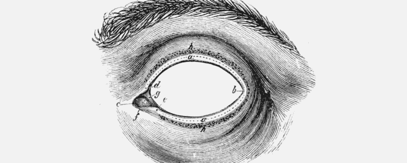

# 你最好的作品将会隐形

> 原文：<https://www.freecodecamp.org/news/your-best-work-will-be-invisible-a7896c28d3eb/>

坦纳·克里斯滕森

# 你最好的作品将会隐形

作为一名设计师，你最好的作品永远是隐形的。它将是看不见的，因为你所做的最好的部分将是发生在幕后的一切，没有人会看到它。

了解这一点很重要，因为这有助于释放你的全部潜力，帮助你专注于产品设计中最重要的事情。

当第一次进入产品设计角色时，新手倾向于将产品设计的工作与更传统的设计角色混为一谈。他们希望在他们所建造的东西的表面上得到认可，所以他们专注于使它有吸引力或华而不实。或者他们想做一些漂亮的东西，却没有花很多时间去建立共鸣，或者深入理解问题，或者开发或识别一个清晰的设计系统。

当然，漂亮的设计和精心制作的体验在产品设计中非常重要。但是一个设计背后的实际像素只和它们背后的推理一样好。

想想今天几乎任何人都可以下载工具来设计和创造产品。它只需要一台笔记本电脑和一个互联网连接。一旦你有了工具，你就可以使用在线教程来重现你在野外发现的灵感。

拥有复杂的工具不再是业余爱好者和专业人士之间的分界线。正规教育不再是从事高质量设计工作的必要条件。现在重要的不是你能不能很好地使用设计工具，或者知道这个行业的行话，或者甚至有一个华而不实的投资组合。最重要的是发生在幕后的一切。

你的研究方法和获取资源的途径。迭代、测试和获得视角。边缘案例的探索，以及围绕每个案例的决策。能够[深刻理解正在解决的问题](https://medium.freecodecamp.com/the-big-problem-with-design-inspiration-cf98dd2886ce#.tvjx24owp)以及必须做出的权衡，以构建一个可用的、设计精美的最终结果。

换句话说:[带有意向性的设计](https://medium.com/facebook-design/peek-inside-a-facebook-design-critique-c4833efda26e#.kuq6h4o9k)。

没有人会看到围绕权衡做出的研究或深思熟虑的决定。没有人会看到你设计的整个系统，裸露在你的电脑或笔记本上。没有人会看到你对人物角色的想法，或者你所做的研究的结果，或者你在迭代设计的单一属性上所投入的时间。没有人会回顾你过去与同事、同事和潜在用户关于你的设计的谈话。但是这些东西绝对会反映在你所创造的任何东西上。

如果我们看看历史上一些最著名的画作，我们可以看到我在这里描述的非常真实的解释。使用 X 射线技术，我们可以看到隐藏在毕加索的[蓝色房间](http://www.bbc.com/news/entertainment-arts-27884323)，梵高的[草地](https://www.theguardian.com/artanddesign/2008/jul/31/2)，甚至(备受争议的)达芬奇的[蒙娜丽莎](http://www.bbc.com/news/entertainment-arts-35031997)等名作之下的一层层旧颜料。

在每件艺术品的下面都有另一件作品，通常是更粗糙或不完整的艺术品，这是艺术家在涂抹更多颜料以获得正确的细节之前辛辛苦苦完成的作品。我们经常可以看到不止一幅，而是好几幅画被埋在最终作品的下面。

我们也可以在现代设计指南中看到这种意向性。像苹果的[人机界面指南](https://developer.apple.com/ios/human-interface-guidelines/)或者谷歌的[材质设计](https://material.google.com/)。每个设计系统都包含一个庞大的设计原则和建议库，其中一些是如此的细致入微，以至于任何非设计师都会感到头晕。只要看看[材料设计的彩色页面](https://material.google.com/style/color.html#color-color-palette)，就可以找到一个单独考虑色彩的例子；这一页内容丰富，细节丰富。

换句话说，在我们做的任何事情中，我们给予他人的礼物是将自己有限的时间投入到工作中。

试图找到获得最终设计的捷径，或者只专注于工作的一个属性，或者只是为了得到某样东西而搁置研究或迭代——这些事情对你要做的工作的最终结果没有帮助。他们只会阻碍它。

通常能让产品体验如此有影响力的是创作者投入的工作。以一种深思熟虑的方式建造一些东西，让任何人都忘记事实。

引用佩恩和泰勒的著名艺人泰勒的话:

> 有时候魔法只是某人在某件事情上花费了比其他人合理预期的更多的时间

*——————————*
*[**坦纳·克里斯滕森**](http://tannerc.com) 是脸书的一名自学成才的产品设计师，著有《创意挑战****、* [**的创始人**](http://creativesomething.net/) *、一些顶级创意应用 [**的开发者**](https://itunes.apple.com/us/developer/tanner-christensen/id421646590) *，博主****