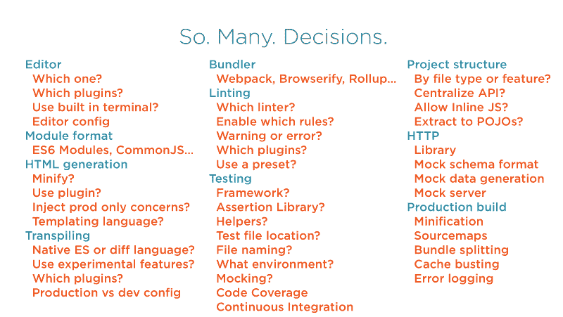

# 您需要一个 JavaScript 初学者工具包

> 原文：<https://www.freecodecamp.org/news/you-need-a-javascript-starter-kit-ff12d90ed8c5/>

#### 为什么…的 40 个理由

这是 JavaScript 疲劳的时代。JavaScript 创新和碎片化已经变得如此持久，以至于当开始一个新项目时，很难知道从哪里开始。但不一定要这样。

如果您的团队有一个丰富、快速的反馈开发环境会怎么样？如果每次你开始一个新的 JavaScript 项目，你都免费得到捆绑、传输、自动化测试、缩小、缓存破坏、持续集成和更多的*会怎样？*

> *从零开始不再实用。有太多的最佳实践可供个人追踪。初学者工具包的时代已经到来。*

*我花了一年的时间详细探索这个话题。我的调查最终以一门全面的新课程告终，这门课程深入探究了你的团队如何[从零开始创建一个丰富的 JavaScript 开发环境](https://app.pluralsight.com/library/courses/javascript-development-environment/table-of-contents)。*

#### *你需要一个初学者工具包*

*为什么这如此重要？因为如今 JavaScript 开发人员必须考虑的决策数量多得令人难以招架:*

*

Why should your team have to make all these decisions on each new project?* 

*超过 40 个决定。我不能把它们都放在一张幻灯片上。这个列表太长了，以至于大多数团队忽略了几十个重要的关注点。我咨询了世界各地的前端开发人员，看到了一个共同的主题:自动化测试极其罕见。缩小，缓存破坏，捆绑分裂，林挺等等。*

*原因如下:*

> *JavaScript 开发人员如此不知所措，以至于他们忽略了提高质量、增强性能和自动化消除痛苦的巨大机会。*

*开发人员经常选择阻力最小的方法。这意味着上面的大多数问题都被忽略了。*

*这是一个经典的问题:**短期内抄近路会让我们在长期内慢下来。***

#### *解决方案*

*解决方案的第一步很简单:安排一个简单议程的团队会议:*

1.  *我们的 JS 痛点是什么？*
2.  *我们会从 JS 初学者工具包中受益吗？*
3.  *我们会从演示应用中受益吗？*

**

*回答这些问题，你就有了创建自己的 JavaScript 初学者工具包的明确方向。当然，网上有无数的样板文件、生成器和初学者工具包。这是一个很好的开始。*

*但是**在现实中，每个团队都有独特的需求和观点，**所以大多数团队都从创建自己的初学者工具包中受益匪浅。无论如何，探索一些你所选择的库或框架的流行样板。但是我建议从零开始，用你最喜欢的作为灵感。这保证你理解它是如何工作的。*

*在 Pluralsight 上的“[构建 JavaScript 开发环境](https://app.pluralsight.com/library/courses/javascript-development-environment/table-of-contents)”中，我浏览了一长串选项，并从头构建了一个健壮的 JavaScript 开发。本课程是一个剧本，包含您在构建自己的环境时需要考虑的 40 多个决策。*

*灵感？我很想看看你做的东西！*

*Cory House 是 Pluralsight 上许多关于 JavaScript、干净编码、架构等课程的作者。科里是 reactjsconsulting.com[公司的首席顾问，是微软 MVP 公司 VinSolutions 的软件架构师，在国际上培训软件开发人员，如前端开发和干净编码。](http://reactjsconsulting.com)*