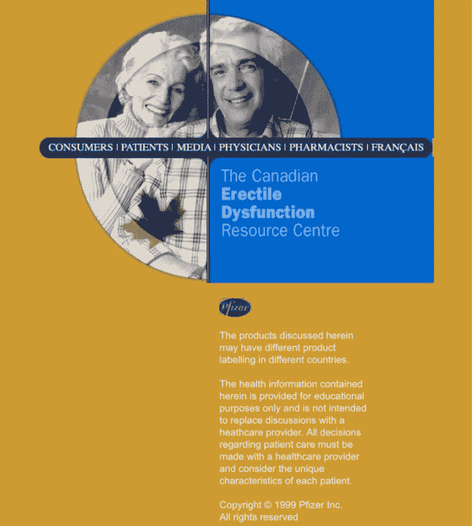

# 我仍然感到羞耻的代码

> 原文：<https://www.freecodecamp.org/news/the-code-im-still-ashamed-of-e4c021dff55e/>

如果你以写代码为生，那么在你职业生涯的某个阶段，有人可能会要求你写一些有点欺骗性的代码——如果不是完全不道德的话。

这发生在 2000 年的我身上。这是我永远无法忘记的事情。

我在 6 岁的时候写了第一行代码。虽然我不是神童。那时我从我父亲那里得到了很多帮助。但是我被迷住了。我喜欢它。

到我 15 岁的时候，我已经在我爸爸的咨询公司兼职了。我在周末和夏天建立网站，为商业应用程序编写小组件。

我的工资少得可怜。但正如我爸爸仍然喜欢指出的那样，我得到了免费的食宿，以及一些非常宝贵的工作经验。

后来，我通过几份自由编码工作，设法资助了一部分教育费用。我为当地的一些小企业建立了几个早期的电子商务网站。

21 岁时，我设法在加拿大多伦多的一家互动营销公司找到了一份全职编码工作。

这家公司是由一名医生创立的，它的许多客户都是大型制药公司。

在加拿大，制药公司直接向消费者宣传处方药有严格的限制。

因此，这些公司会创建网站，提供关于他们的药物旨在解决的任何症状的一般信息。然后，如果访问者可以证明他们有处方，他们就可以访问患者门户网站，获得更多关于该药物的具体信息。

The [home page](https://web.archive.org/web/20010424080952/http://www.edfactscanada.com/) of edfactscanada.com circa 2001, via The Internet Archive

我参与的一个项目涉及一种针对女性的药物。该网站的图形和总体风格清楚地表明，客户希望专门针对十几岁的女孩。

这个网站的特色之一是一个问答游戏，向女孩们提出一系列问题，并根据她们的回答推荐一种药物。

请记住，这个网站是作为一个通用信息网站。这显然不是任何特定药物的广告。

当我收到要求时，它们包含了测验的问题，以及每个问题的多项选择答案。

要求中缺少的是在测验结束时我应该如何处理答案的任何指示。那么是什么规则决定了测验会推荐什么样的治疗方法呢？

我和客户经理谈过了。她给客户发了邮件，告诉我需求。有了这些，我开始编写测试代码。

在将网站提交给客户之前，我的项目经理决定进行一次快速测试。她试了一下测验，然后来到我的桌子前:

> “这个测验没用，”她说。

> “哦。什么破了？”我问。

> “嗯，似乎无论我做什么，测验都推荐客户的药物是最好的治疗方法。唯一的例外是我说我过敏。或者如果我说我已经服用了。”

> “是的。需求就是这么说做的。一切都指向当事人的毒品。”

> “哦。好吧。酷。”

她走了。

我希望我能告诉你，当我第一次看到那些需求时，它们困扰着我。我希望我能告诉你，编写一些基本上是用来欺骗年轻女孩的代码是不对的。但事实是，当时我并没有多想。我有工作要做，而且我做了。

我们所做的一切都是合法的。作为团队中最年轻的开发人员，我在我的年龄里挣了很多钱。最后，我明白了这个网站的真正目的是推销一种特殊的药物。所以，我把这个策略归结为“营销”

客户对这个网站非常满意。以至于他们的代表邀请我和整个团队去吃一顿高级牛排晚餐。

晚宴那天，在离开办公室前不久，一位同事给我发了一封电子邮件，里面有一篇网上新闻报道的链接。是关于一个年轻女孩服用了我为她建的网站上的药物。

她自杀了。

事实证明，这种药物的主要副作用包括严重的抑郁和自杀念头。

给我发邮件的同事没有来吃饭。

我还是去了。这是困难和尴尬的。我从没提过新闻报道。我只是静静地吃着牛排，尽可能地挤出一丝笑容。

第二天，我给姐姐打了电话。她当时 19 岁。我们在做这个项目的时候发现，她实际上被开了我正在为之建立网站的药物。

当我们第一次谈论它的时候，我们认为整件事是一个纯粹的巧合。现在，我们谈话的语气非常不同。我建议她尽快停药。谢天谢地，她听进去了。

我有无数种方法来为自己在后来的自杀和严重抑郁中的角色找借口。即使在今天，仍有与以前病人的诉讼在进行。

辩称我与此事毫无关系是很容易的。尽管如此，我还是觉得写这些代码不太好。

那次晚宴后不久，我辞职了。

作为开发人员，我们通常是抵御潜在危险和不道德行为的最后一道防线。

我们正在接近一个时代，软件将驱动车辆，运送你的家人去足球练习。已经有人工智能程序帮助医生诊断疾病。不难想象他们很快也会推荐处方药。

软件越是继续占据我们生活的方方面面，我们就越有必要表明立场，确保我们的道德规范始终存在于我们的代码中。

从那天起，在我写代码之前，我总是试着再三考虑代码的效果。我希望你也一样。

这些天，我花了一部分时间写和发送定期的时事通讯，旨在帮助开发人员掌握他们的技术并促进他们的职业发展。请在下面报名领取。

> ***更新 2018:*** *我现在是计算机械协会的会员，遵守他们的 [**2018 年道德与职业行为准则**](https://ethics.acm.org) 。我希望你和你工作的组织也会考虑这样做。*

如果这篇文章以任何方式感动了你，请使用掌声图标来帮助传播这个词。