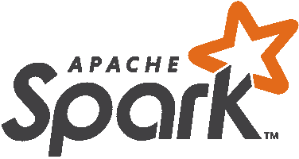
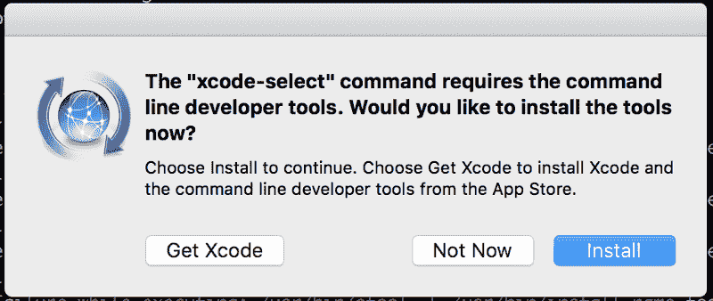

# 如何在 MacOS 上安装 Scala 和 Apache Spark

> 原文：<https://www.freecodecamp.org/news/installing-scala-and-apache-spark-on-mac-os-837ae57d283f/>

何塞·马西亚尔·波尔蒂利亚



# 如何在 MacOS 上安装 Scala 和 Apache Spark

这里是在 MacOS 上安装 Scala 和 Apache Spark 的一步一步的指南。

#### 第一步:自制

在 Mac OS 上安装应用程序和语言时，Homebrew 让您的生活变得更加轻松。你可以按照它的网站上的说明进行自制。

它基本上只是告诉你打开你的终端，输入:

```
/usr/bin/ruby -e "$(curl -fsSL https://raw.githubusercontent.com/Homebrew/install/master/install)"
```

在项目的 [GitHub 页面上有更详细的安装说明。](https://github.com/Homebrew/brew/blob/master/docs/Installation.md#installation)通过 Homebrew 安装所有东西应该会自动将所有适当的路径设置添加到您的个人资料中。

#### 步骤 2:安装 xcode-select

为了通过命令行安装 Java、Scala 和 Spark，我们可能需要安装 xcode-select 和命令行开发工具。转到您的终端并键入:

```
xcode-select --install
```

您将看到类似如下的提示:



继续并选择安装。

#### 第三步:用自制软件安装 Java

Scala 依赖于 Java，你可能需要也可能不需要安装它。最简单的安装方法是使用自制软件:

在您的终端中键入:

```
brew cask install java
```

您可能需要在某个时候输入密码来完成 java 安装。在运行这个自制软件之后，Java 的安装应该已经完成了。现在我们可以继续讨论 Scala 了。

#### 第四步:用自制软件安装 Scala

现在，安装了家酿软件后，请在您的终端上键入:

```
brew install scala
```

#### 步骤 5:使用自制软件安装 Apache Spark

现在安装好 Scala，在你的终端上输入:

```
brew install apache-spark
```

家酿现在将下载并安装 Apache Spark，这可能需要一些时间，取决于您的互联网连接。

#### 第五步:启动火花外壳

现在试试这个命令:

```
spark-shell
```

您应该会看到大量的文本和警告，但最终会看到类似这样的内容:

```
Welcome to      ____              __     / __/__  ___ _____/ /__    _\ \/ _ \/ _ `/ __/  '_/   /___/ .__/\_,_/_/ /_/\_\   version 2.0.1      /_/
```

```
Using Scala version 2.11.8 (Java HotSpot(TM) 64-Bit Server VM, Java 1.8.0_102)Type in expressions to have them evaluated.Type :help for more information.
```

```
scala>
```

您可以通过键入 scala 代码来确认它正在工作:

```
val s = "hello world"
```

恭喜你！你都准备好了！

*常见问题:在 bash 中设置路径。*

家酿啤酒本应照顾到所有这些，但如果你需要添加火花到你的道路上，你会想使用:

```
export SPARK_HOME=/usr/local/Cellar/apache-spark/2.0.1/libexecexport PYTHONPATH=/usr/local/Cellar/apache-spark/2.0.1/libexec/python/:$PYTHONP$
```

直接输入你的终端。

我是何塞·波尔蒂利亚，我在 Udemy 上教 20 多万学生编程、数据科学和机器学习。你可以在这里查看我所有的课程。

如果你对学习用于数据科学和机器学习的 Python 感兴趣，[在这里查看我的课程](https://www.udemy.com/python-for-data-science-and-machine-learning-bootcamp/?couponCode=2017PYTHONDSML15)。(我还和 Django 一起教[全栈 Web 开发！](https://www.udemy.com/python-and-django-full-stack-web-developer-bootcamp/?couponCode=2017DJANGO15))