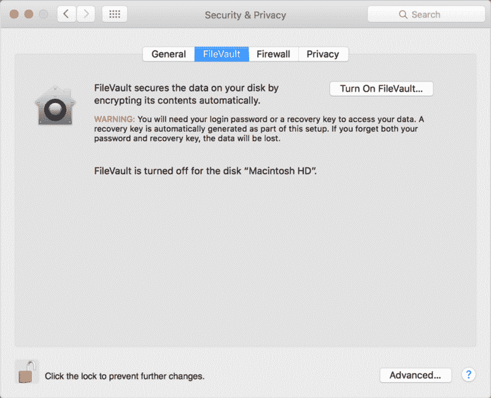
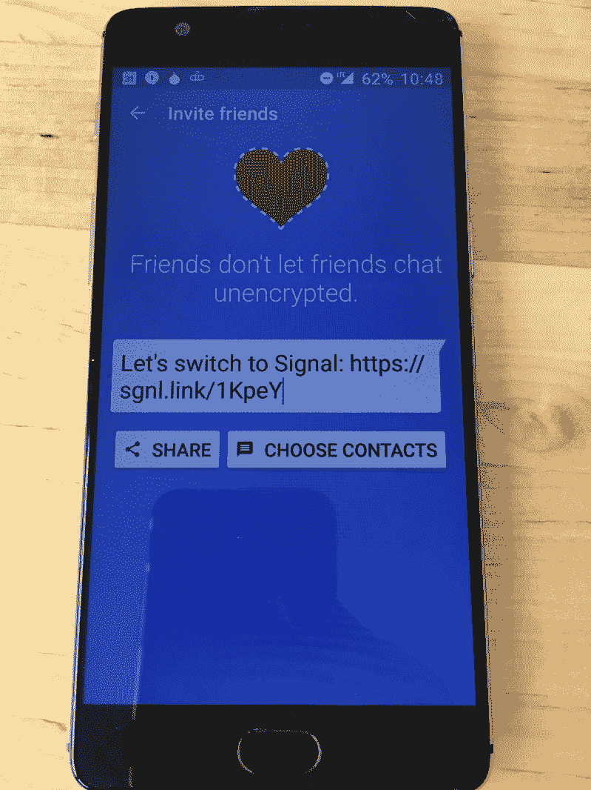
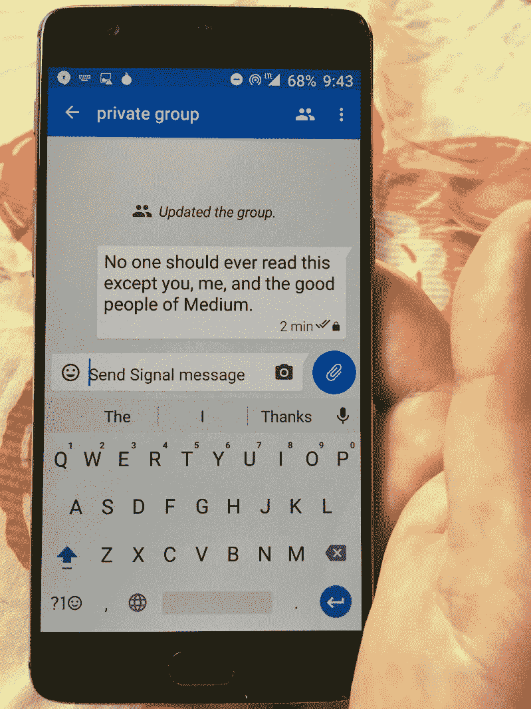
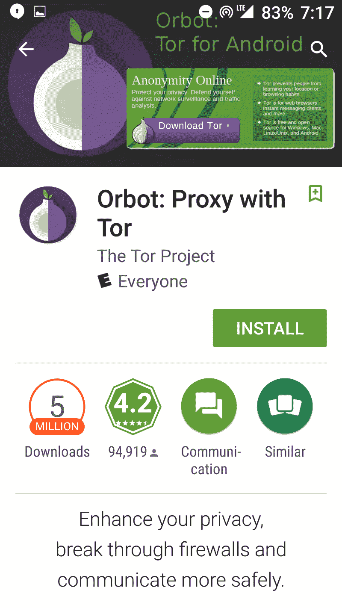
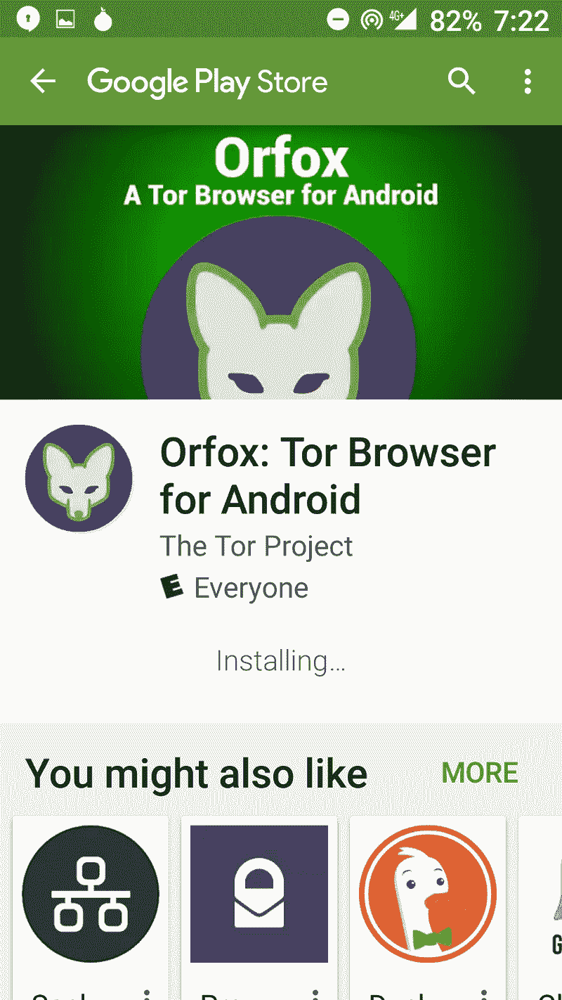
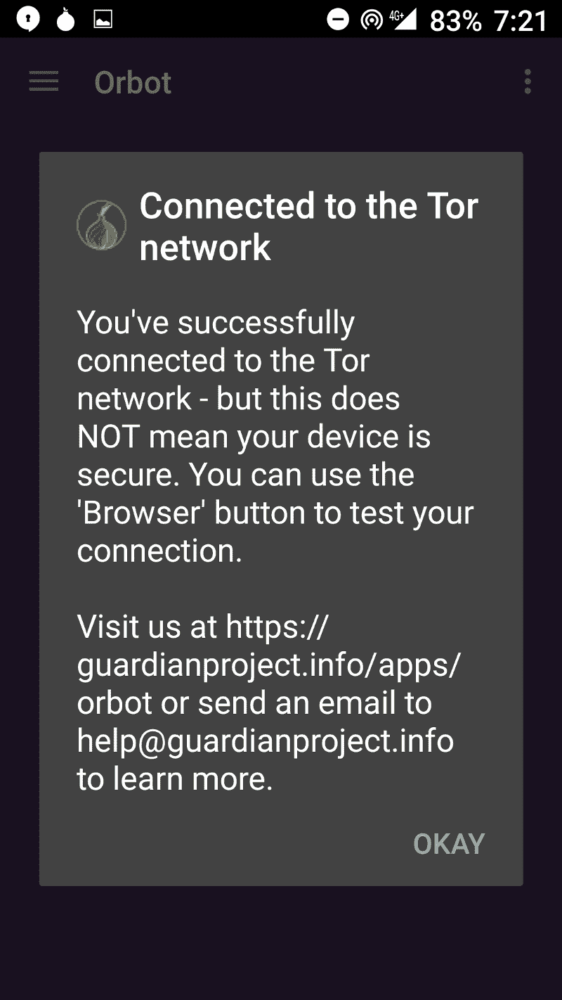
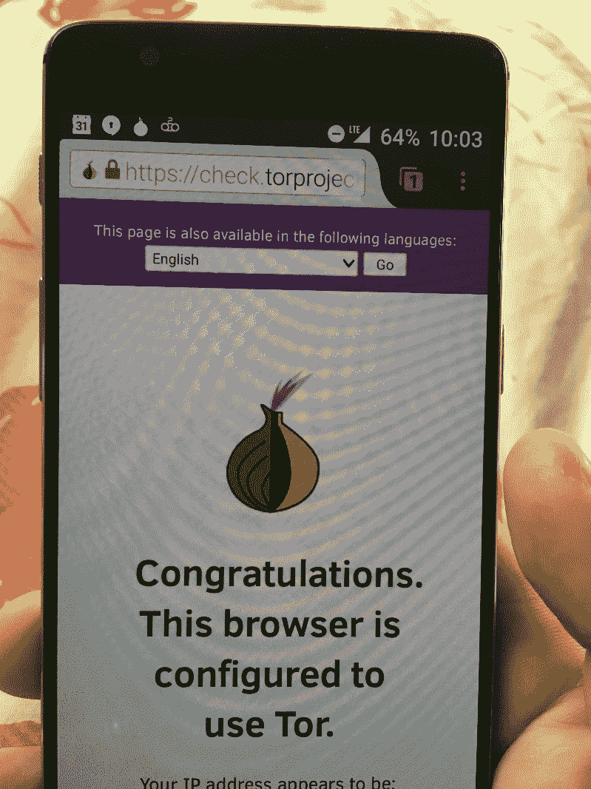
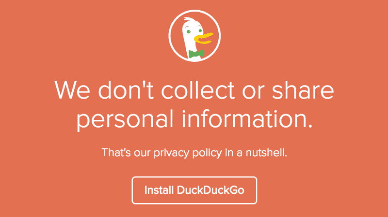
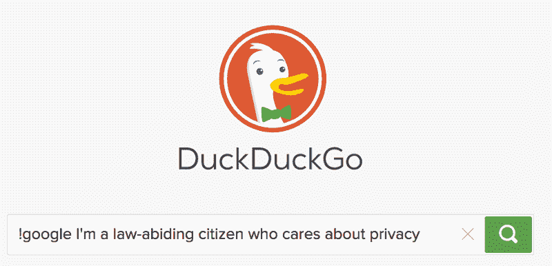

# 如何在不到一小时的时间内加密你的整个人生

> 原文：<https://www.freecodecamp.org/news/tor-signal-and-beyond-a-law-abiding-citizens-guide-to-privacy-1a593f2104c3/>

> “只有偏执狂才能生存。”—安迪·格罗夫

艺术家鸣谢:费德里科·乌里韦的《与过去相连》。2012.帆布上的电缆。

安迪·格罗夫是一名匈牙利难民，他逃离了共产主义，学习了工程学，并最终作为英特尔的首席执行官领导了个人电脑革命。在与帕金森病长期斗争后，他于今年早些时候在硅谷去世。

当世界上最强大的人之一鼓励我们变得偏执时，也许我们应该倾听。

格罗夫并不是唯一一个强烈呼吁谨慎的人。甚至联邦调查局局长——最近付给黑客 100 万美元以解锁一名枪手的 iPhone 的官员——也鼓励每个人盖上他们的网络摄像头。

但是你遵守法律。你有什么好担心的？正如英国监控项目的座右铭提醒我们的那样，“如果你没什么好隐瞒的，你就没什么好害怕的。”

遵纪守法的公民确实有理由害怕。他们确实有理由保护自己的设备、文件以及与亲人的通信。

> “如果有人给我六行最诚实的人写的字，我会找到一些东西把他吊死。”—红衣主教黎塞留，1641 年

在本文中，我将向您展示如何利用最先进的加密技术来保护自己。只需坐一会儿，你就能在保护隐私方面取得巨大进步。

### 每个人的常识安全

明确一点，我这里推荐的都是 100%免费，100%合法的。如果你晚上懒得锁门，你应该尝试加密。

> “做好准备”——童子军的座右铭

让我们做好准备。

首先，几个定义。当我使用术语“攻击者”时，我指的是任何试图访问你的数据，但你没有给予明确许可的人——无论是黑客、企业，甚至是政府。

当我使用术语“私人”或“安全”时，我的意思是合理的。现实是，只要有人类参与，就没有系统是 100%私密或 100%安全的。

只要你的手机、电脑和账户受到足够的保护，它们的内容就会保持“加密的状态”,任何人——不管他们有多强大——对此都无能为力。

### 技巧 1:在你的收件箱中使用双重认证

你的收件箱是你生活的万能钥匙。如果攻击者破坏了它，他们不仅可以阅读你的电子邮件，还可以用它来重置你的密码。这包括社交媒体账户，甚至银行账户。

要显著提高个人安全性，最简单的方法就是在收件箱中启用双因素身份验证。

基本上，双因素身份验证是登录时的第二层安全措施。它通常涉及到每当你登录你的帐户时收到一条带有特殊代码的短信。

双重认证大大降低了您的收件箱被黑客攻击的可能性。

如果你使用 Gmail，你应该[在这里](https://myaccount.google.com/security#signin)激活双因素认证。

现在。

说真的。

你回来的时候我还会在这里。

### 技巧 2:加密你的硬盘



Windows 和 T2 的 MacOS 都内置了全磁盘加密。你只需要打开它。

### 提示 3:打开手机的密码保护

指纹识别总比没有好，但这通常是不够的。

第五修正案(反对自证其罪)允许你对你的密码保密。但是法院可以强迫你用拇指指纹解锁手机。

此外，在攻击者得到你的拇指指纹后，你不能准确地改变它。

攻击者通常会尝试 10 次，然后你的手机会完全锁定他们。所以如果你的 4 位数密码是这些常见的密码之一，那就换一个。

```
1234  99991111  33330000  55551212  66667777  11221004  13132000  88884444  43212222  20016969  1010
```

**专业提示**:如果你为了方便而坚持启用指纹识别，一旦被逮捕，立即关机。当当局重新打开你的手机时，如果没有你的密码，他们将无法解锁。

### 提示 4:为每个服务使用不同的密码。

密码[本来就不安全](https://medium.freecodecamp.com/360-million-reasons-to-destroy-all-passwords-9a100b2b5001)。

马克·扎克伯格在他的 LinkedIn 账户上使用了密码“达达达”。今年早些时候，黑客发布了 1.17 亿个电子邮件密码组合，他就是其中之一。黑客随后能够使用他的电子邮件和密码进入他的 Twitter 和 Pinterest 账户。

所以不要在多个地方使用同一个密码。

当然，记住大量的密码是一件麻烦的事情，所以使用一个[密码管理器](https://en.wikipedia.org/wiki/Password_manager)。

### 技巧 5:用信号发送私人短信

Signal 是一个流行的信息服务，得到了电子前沿基金会的满分。你可以通过短信做所有你通常会做的事情，比如群发消息和发送照片和视频。除了所有东西都被加密了。

Signal 是免费的，开源的，在 iOS 和 Android 应用商店都有。我能够在不到 5 分钟的时间内设置好它，并开始与朋友和家人安全地发送消息。

#### 步骤#1:安装信号


#### 第二步:邀请朋友安装它



#### 第三步:发送信息



恭喜你——你现在可以和你的朋友和家人谈论任何你想谈论的话题，任何人都不可能窥探你的谈话。

您也可以使用信号进行安全通话。

### 提示 6:你的浏览器的匿名模式不够隐私

即使你使用 Chrome 的“匿名模式”或 Firefox 的“隐私浏览”，以下各方仍能窥探你的网络活动:

*   互联网服务提供商
*   在学校、工作场所或任何可以上网的地方负责网络的系统管理员
*   谷歌，或者任何制作你的浏览器的人

Internet Explorer、Safari、Opera 和其他浏览器不再是私有的。

如果你想要合理的隐私浏览(没有系统是 100%安全的)，你应该使用 Tor。

### 技巧 7:用 Tor 私下浏览

Tor 代表“洋葱路由器”，指的是它使用许多洋葱状的层来掩盖网络活动。它是免费的、开源的，而且相当容易使用。

#### 步骤 1:下载 Orbot



#### 第二步:下载 Orfox 浏览器



#### 第三步:打开 Orbot



#### 步骤 4:打开 Orfox



#### 第五步:验证它是否有效

访问 check.torproject.org 以验证一切正常。恭喜您，您现在可以安心使用互联网，任何人都很难跟踪您。

### 技巧 8:私下搜索

如果 Tor 对你来说不够方便，你至少可以使用不跟踪你的搜索引擎 [DuckDuckGo](https://duckduckgo.com/privacy) 进行私人搜索。



DuckDuckGo 并没有像 Google 那样花费数千年的工程师时间来开发搜索引擎，但是当你需要的时候，它有一个快捷方式来获得加密的 Google 搜索。你只需要在你的搜索前面加上！谷歌



我鼓励你读一读计算机安全专家 Bruce Schneier 的书《数据和歌利亚:收集你的数据和控制你的世界的隐藏战斗》我从中学到了很多，现在正在听第二遍。

[**数据和歌利亚:夺取你的数据和控制你的世界的隐藏战斗**](http://amzn.to/2mjheuO)
[*编辑描述* amzn.to](http://amzn.to/2mjheuO)

我只写编程和技术。如果你在推特上关注我，我不会浪费你的时间。？