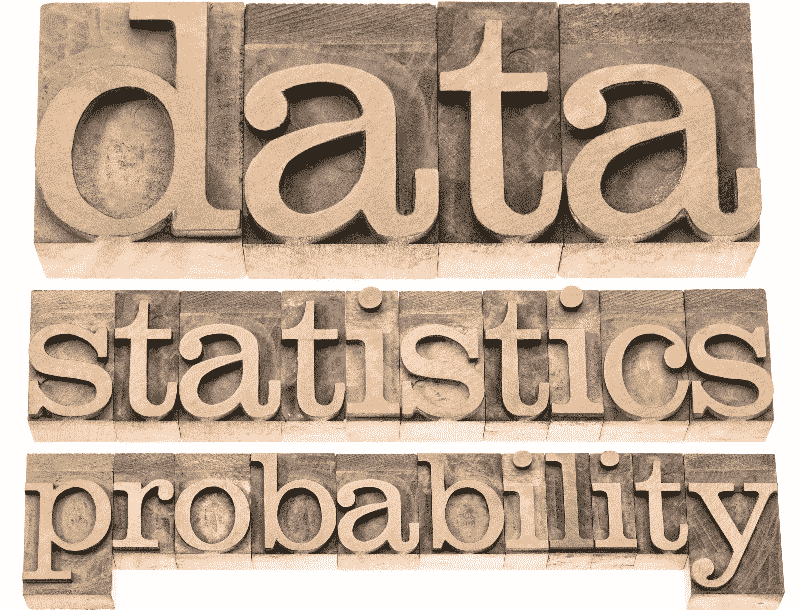
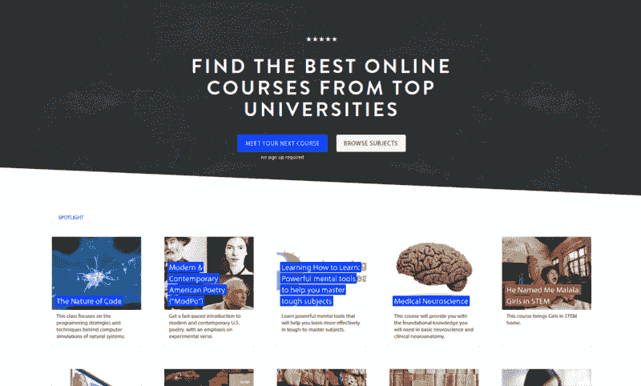
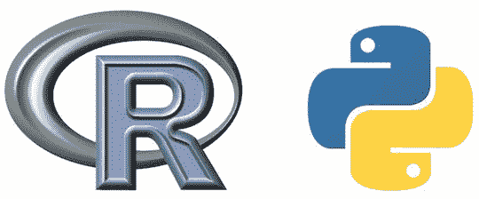
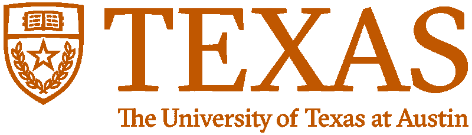
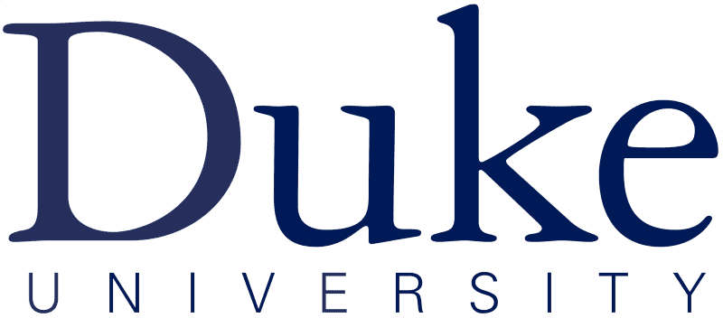
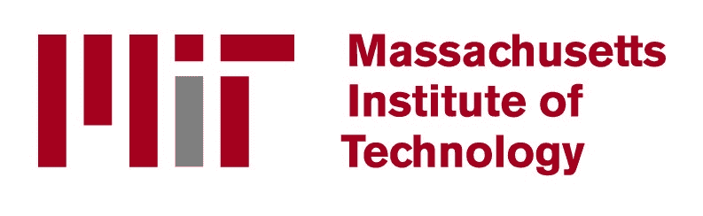
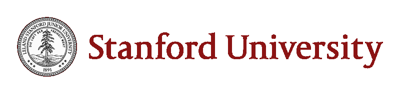

# 如果你想学习数据科学，参加一些统计学课程

> 原文：<https://www.freecodecamp.org/news/if-you-want-to-learn-data-science-take-a-few-of-these-statistics-classes-9bbabab098b9/>

大卫·文丘里

# 如果你想学习数据科学，参加一些统计学课程

[Image credit](http://www.123rf.com/profile_pixelsaway)

一年前，我还是一个没有任何编码背景的数字极客。在尝试了一门在线编程课程后，我深受启发，报名参加了加拿大最好的计算机科学课程之一。

两周后，我意识到我可以通过 edX、Coursera 和 Udacity 来学习我需要的一切。所以我退学了。

这个决定并不困难。我可以更快、更有效地学习我想学的内容，而且只需要很少的费用。

我已经有了大学学位，也许更重要的是，我已经有了大学经历。支付 3 万多美元重返校园似乎是不负责任的。

在意识到数据科学比计算机科学更适合我之后，我很快开始利用在线课程创建自己的数据科学硕士学位。我搜索了编程环境的介绍。对于本系列的[第一篇文章](https://medium.freecodecamp.com/if-you-want-to-learn-data-science-start-with-one-of-these-programming-classes-fb694ffe780c#.fhrn45v3c)，我为初学数据科学家推荐了几个编码类。

[**如果你想学习数据科学，从这些编程课程中的一个开始**](https://medium.freecodecamp.com/if-you-want-to-learn-data-science-start-with-one-of-these-programming-classes-fb694ffe780c)
[*编程课程在线入门的综合指南。*medium.freecodecamp.com](https://medium.freecodecamp.com/if-you-want-to-learn-data-science-start-with-one-of-these-programming-classes-fb694ffe780c)

### 现在谈谈统计和概率。

我学了一些课程，旁听了许多课程的一部分。我知道有哪些选择，以及准备成为数据分析师或数据科学家的学员需要哪些技能。

为了这个指南，我花了 15 个多小时试图找出截至 2016 年 11 月提供的每一个在线统计和概率介绍课程，从它们的教学大纲和评论中提取关键信息，并汇编它们的评级。为了完成这个任务，我求助于开源课程中央社区及其数千个课程评级和评论的数据库。

Class Central’s [homepage](https://www.class-central.com/).

自 2011 年以来， [Class Central](https://www.class-central.com/) 创始人[达瓦尔·沙阿](https://www.class-central.com/@dhawal)比世界上任何人都更关注在线课程。Dhawal 亲自帮我整理了这个资源列表。

### 我们如何选择要考虑的课程

每门课程必须符合四个标准:

1.  这必须是一门入门课程，几乎不需要统计学或概率方面的经验。
2.  必须按需提供或每隔几个月提供一次。
3.  **它必须有足够的长度**:预计完成至少需要 10 个小时。
4.  **它必须是一个互动的在线课程，所以没有书籍或只读教程**。虽然这些都是学习统计和概率的可行方法，但本指南侧重于课程。

我们相信我们涵盖了所有符合上述标准的著名球场。由于 Udemy 上似乎有数百门课程，我们选择只考虑评论最多和评分最高的课程。不过，总有可能我们漏掉了什么。所以，如果我们漏掉了一门好的课程，请在评论区告诉我们。

### 我们如何评估课程

我们收集了班级中心和其他评论网站的平均评分和评论数量。我们计算了每门课程的加权平均评分。如果一个系列有多门课程(如德克萨斯大学奥斯汀分校的两部分“数据分析基础”系列)，我们计算所有课程的加权平均评分。我们阅读文本评论，并使用这些反馈来补充数字评级。

我们根据三个因素做出主观的教学大纲判断:

1.  每门课程通过编写例子来教授统计学的程度——最好是用 R 或 Python。
2.  **概率统计基础的覆盖面。**涵盖描述统计、推断统计、概率论比较理想。
3.  **教学大纲中有多少与数据科学相关？**教学大纲是否像几门生物统计学课程一样，有类似基因组学的专门内容？教学大纲是否涵盖了数据科学中不常使用的高级概念？

R and Python are the two most popular programming languages for data science.

### 为什么要目标编码？

Quora 的数据科学家 William Chen 拥有哈佛大学的应用数学硕士学位，他在这个广受欢迎的 Quora 问题答案中写道:“我如何学习数据科学的统计学？”

> 对于任何有抱负的数据科学家，我强烈建议学习统计学，重点放在编写示例上，最好是用 Python 或 r。

由于数据科学家的大量统计工作都是通过代码完成的，所以熟悉最流行的工具是有益的。

### 统计和概率

概率不是统计，反之亦然。我最喜欢的关于他们差异的解释来自石溪大学:

> 概率涉及预测未来事件发生的可能性，而统计学涉及对过去事件发生频率的分析。

他们解释说，“概率主要是数学的一个理论分支，它研究数学定义的结果，”而“统计学主要是数学的一个应用分支，它试图解释现实世界中的观察结果。”

统计学通常被认为是数据科学的[支柱之一。概率——尽管它引起的关注较少——也是数据科学课程的重要部分。](https://www.quora.com/How-do-data-scientists-use-statistics)

哈佛统计系教授 Joe Blitzstein 在这个广受欢迎的 Quora 回答中表示，有抱负的数据科学家也应该有良好的概率论基础。

拥有沃顿商学院统计学博士学位的数据科学家贾斯汀·瑞星(Justin Rising)澄清说，这种“良好的基础”意味着对本科水平的概率感到舒适。

### 我们为数据科学家挑选的最佳统计和概率课程是…

*   [数据分析基础—第 1 部分](https://www.class-central.com/mooc/2244/edx-ut-7-01x-foundations-of-data-analysis):德克萨斯大学奥斯汀分校(edX)使用 R 的统计学
*   数据分析的基础—第 2 部分:推理统计学

“数据分析基础”包括两个最受欢迎的统计学课程，在 20 次评论中，加权平均评分为 4.48 分(5 颗星)。该系列是仅有的几门评级较高的课程之一，旨在教授统计学，重点是编写示例。虽然没有在任何课程名称中提及，但教学大纲包含了足够的概率内容来满足我们的测试标准。这些课程为初学数据的科学家提供了很好的基础知识和范围。

Michael J. Mahometa，德克萨斯大学奥斯汀分校讲师兼高级统计顾问，是“数据分析基础”系列讲师。该系列的两门课程都是免费的。每门课程预计时间为 6 周，每周 3-6 小时。一位著名的评论家[说](http://www.awin1.com/awclick.php?gid=295463&mid=6798&awinaffid=301045&linkid=599979&clickref=fcc-medium-data-science-career-guide-stats-prob&p=https%3A%2F%2Fwww.edx.org%2Fcourse%2Ffoundations-data-analysis-part-1-utaustinx-ut-7-11x):

> 很棒的课程！我参加了第一部分，非常喜欢，所以很容易决定继续第二部分。Mahometa 博士和他的团队是非常好的老师，他们的材料质量非常高。练习很有趣，材料(视频、实验和问题)也很合适，选择得很好。我向任何对统计分析感兴趣的人推荐这门课程(作为机器学习、大数据、数据科学等的入门。).从 1 到 10，我给 50 分！

请注意，每个课程的描述和教学大纲都可以通过上面提供的链接获得。

The University of Texas at Austin’s [edX page](https://www.edx.org/school/utaustinx).

### 一流的专业

*更新(2016 年 12 月 5 日):我们最初的第二个推荐，加州大学伯克利分校的“Stat2x:统计学导论”系列，在这篇文章发布几周后就停止了招生。我们相应地在“竞争”部分推广了我们的顶级推荐。*

*   杜克大学在 Coursera 上发布的 R 专业统计数据

…包含以下五门课程:

*   [概率与数据简介](http://click.linksynergy.com/fs-bin/click?id=SAyYsTvLiGQ&subid=&offerid=451430.1&type=10&tmpid=18061&RD_PARM1=https%3A%2F%2Fwww.coursera.org%2Flearn%2Fprobability-intro&u1=cc-data-science-career-guide-stats-prob)
*   [推理统计](http://click.linksynergy.com/fs-bin/click?id=SAyYsTvLiGQ&subid=&offerid=451430.1&type=10&tmpid=18061&RD_PARM1=https%3A%2F%2Fwww.coursera.org%2Flearn%2Finferential-statistics-intro)
*   [线性回归和建模](http://click.linksynergy.com/fs-bin/click?id=SAyYsTvLiGQ&subid=&offerid=451430.1&type=10&tmpid=18061&RD_PARM1=https%3A%2F%2Fwww.coursera.org%2Flearn%2Flinear-regression-model&u1=cc-data-science-career-guide-stats-prob)
*   [贝叶斯统计](http://click.linksynergy.com/fs-bin/click?id=SAyYsTvLiGQ&subid=&offerid=451430.1&type=10&tmpid=18061&RD_PARM1=https%3A%2F%2Fwww.coursera.org%2Flearn%2Fbayesian&u1=cc-data-science-career-guide-stats-prob)
*   [带 R 顶点的统计](https://www.coursera.org/learn/statistics-project)

这五门课程的专业化是基于杜克大学优秀的[数据分析和统计推断](https://www.class-central.com/mooc/1349/coursera-data-analysis-and-statistical-inference)课程，该课程在 55 篇评论中获得了 4.82 星的加权平均评级。专业课由同一个教授讲授，外加几个额外的教员。由于样本量较小，对新个别课程的早期评论(在 5 次评论中的加权平均评分为 3.6 星)应持保留态度。该教学大纲是全面的，并有完整的部分致力于概率。

Mine etin Kaya-run del 博士是该专业的主要讲师。个人课程可以免费旁听，尽管你无权评分。评论表明这种专业化是物有所值的。“每门课程预计持续 4-5 周，每周 5-7 小时。一位著名的评论家[对这个专业所基于的最初课程说了](https://www.class-central.com/mooc/1349/coursera-data-analysis-and-statistical-inference#review-5242):

> 迄今为止我上过的最棒的课程之一。[Mine etin Kaya-run del 博士]是一位伟大的老师，非常积极地与学生交流。多种多样的教学方法和工具。通过短测试、R 编程实验室和深入项目进行大量实践。一个非常活跃的论坛，有很多帮助来应对困难。这门课并不太难，但是所提出的材料种类繁多，需要学生充分参与。一本非常好的免费书籍，有大量的练习。

Duke University’s [Coursera page](https://www.coursera.org/duke).

### 想要更多的概率？

*   麻省理工学院(MIT)的《概率介绍——不确定性科学》

如果你想更深入地探究概率的世界，可以考虑上面的麻省理工课程。它是一部杰作，在 34 篇评论中，加权平均评分为 4.91，满分为 5 星。请注意:这是一个挑战，比大多数 MOOCs 都要长得多。对于数据科学初学者来说，课程涵盖概率的水平也不是必需的。

麻省理工学院电子工程和计算机科学系的教授约翰·齐茨克里斯和帕特里克·贾利特教授这门课程。这门课程的内容基本上与麻省理工学院的相应课程(*概率系统分析和应用概率*)相同——这门课程已经开设了 50 多年，并不断完善。预计时间表为 16 周，每周 12 小时。一位著名的评论家[说](https://www.class-central.com/mooc/1496/edx-6-041x-introduction-to-probability-the-science-of-uncertainty#review-6432):

> 许多在线课程在某种程度上被淡化了，但这一门课程感觉像是一门严格的以锻炼为导向的课程，类似于你在麻省理工学院这样的顶级学校亲自学习的课程。教授们在讲座中介绍概念，这些概念显然是通过多年的教学经验磨练出来的——在演示中没有一秒钟的浪费，他们以正确的速度和细节让你理解这些概念。这些练习会让你为你的知识而工作，并且对于真正内化概念是至关重要的。这是我上过的所有学科中最好的在线课程。

我鼓励你访问 [Class Central 关于本课程的页面](https://www.class-central.com/mooc/1496/edx-6-041x-introduction-to-probability-the-science-of-uncertainty)，阅读其余的评论。

MIT’s [edX page](https://www.edx.org/school/mitx).

### 竞争

在 20 多条评论中，我们的第一选择的加权平均评分为 4.48，为 5 颗星。让我们看看其他的选择。

*   医学统计:医学统计(T1)(斯坦福大学/斯坦福开放教育):很棒的教学大纲，其中的例子有医学焦点。最后介绍了一点 R 编程，虽然没有 UT Austin 的系列那么多。对任何人来说都是一个有价值的选择，即使那些不是针对医学的人。它在 32 篇评论中的加权平均评分为 4.58 星。
*   [SOC 120 x:I“Heart”Stats:学会爱上统计学](https://www.class-central.com/mooc/3048/edx-soc120x-i-heart-stats-learning-to-love-statistics)(圣母大学/edX):面向非技术受众，尽管可能对任何人都有好处。没有编码。良好的生产价值。课程和老师看起来真的很有趣。在 12 次评论中，它的加权平均评级为 4.54 星。

*   QM101x:商业统计(印度班加罗尔管理学院/edX):4 门课程系列的一部分。商业焦点。使用编码的好教学大纲。该系列的最后两个课程截至 2016 年 11 月尚未发布，因此还无法做出判断。它在 27 条评论中的加权平均评分为 4.43 星。
*   概率与统计工作坊(Udemy):由加州大学洛杉矶分校安德森管理学院执行 MBA 项目的副院长乔治·英格索尔博士授课。要花钱。使用 Excel。它在 452 条评论中的加权平均评分为 4.4 星。
*   描述统计学简介(圣何塞州立大学/乌达城):两门课程系列的一部分。小视频。没有编码。它在 8 次评论中的加权平均评分为 3.88 星。
*   推论统计学简介(圣何塞州立大学/乌达城):两门课程系列的一部分。我选修了这两门课程，作为我本科统计学课程的刷新者，并获得了更深的理解。真的很喜欢 Katie Kormanik 的教学风格(见下面的视频)。小视频。没有编码。它在 5 次评论中的加权平均评分为 4.4 星。

*   [6.008.1x:计算概率和推理](https://www.class-central.com/mooc/6830/edx-6-008-1x-computational-probability-and-inference)(麻省理工学院/edX):教授统计学的两门课程/系列之一，重点是用 Python 编写示例。评论表明，以前的统计经验是必要的，该课程有点杂乱无章。它在 12 篇评论中的加权平均评分为 4 星。
*   [基础统计学](http://click.linksynergy.com/fs-bin/click?id=SAyYsTvLiGQ&subid=&offerid=467035.1&type=10&tmpid=18061&RD_PARM1=https%3A%2F%2Fwww.coursera.org%2Flearn%2Fbasic-statistics&u1=fcc-medium-data-science-career-guide-stats-prob)(阿姆斯特丹大学/Coursera):阿姆斯特丹大学[社会科学专业](http://click.linksynergy.com/fs-bin/click?id=SAyYsTvLiGQ&subid=&offerid=467035.1&type=10&tmpid=18061&RD_PARM1=https%3A%2F%2Fwww.coursera.org%2Fspecializations%2Fsocial-science&u1=fcc-medium-data-science-career-guide-stats-prob)方法与统计学两门统计学课程之一。一个非常积极的系列评论和它的导师。没有编码。它在 8 次评论中的加权平均评分为 4.06 星。
*   [推断统计学](http://click.linksynergy.com/fs-bin/click?id=SAyYsTvLiGQ&subid=&offerid=467035.1&type=10&tmpid=18061&RD_PARM1=https%3A%2F%2Fwww.coursera.org%2Flearn%2Finferential-statistics&u1=fcc-medium-data-science-career-guide-stats-prob)(阿姆斯特丹大学/Coursera):阿姆斯特丹大学[社会科学专业](http://click.linksynergy.com/fs-bin/click?id=SAyYsTvLiGQ&subid=&offerid=467035.1&type=10&tmpid=18061&RD_PARM1=https%3A%2F%2Fwww.coursera.org%2Fspecializations%2Fsocial-science&u1=fcc-medium-data-science-career-guide-stats-prob)方法与统计学两门统计学课程之一。一个非常积极的系列评论和它的导师。没有编码。在 3 次评论中，它的加权平均评分为 4 星。

The University of Amsterdam’s [Methods and Statistics in Social Sciences Specialization](http://click.linksynergy.com/fs-bin/click?id=SAyYsTvLiGQ&subid=&offerid=467035.1&type=10&tmpid=18061&RD_PARM1=https%3A%2F%2Fwww.coursera.org%2Fspecializations%2Fsocial-science&u1=fcc-medium-data-science-career-guide-stats-prob) contains [Basic Statistics](http://click.linksynergy.com/fs-bin/click?id=SAyYsTvLiGQ&subid=&offerid=467035.1&type=10&tmpid=18061&RD_PARM1=https%3A%2F%2Fwww.coursera.org%2Flearn%2Fbasic-statistics&u1=fcc-medium-data-science-career-guide-stats-prob) and [Inferential Statistics](http://click.linksynergy.com/fs-bin/click?id=SAyYsTvLiGQ&subid=&offerid=467035.1&type=10&tmpid=18061&RD_PARM1=https%3A%2F%2Fwww.coursera.org%2Flearn%2Finferential-statistics&u1=fcc-medium-data-science-career-guide-stats-prob).

*   PH525.1x:统计学和 R (哈佛大学/edX):edX 7 门课程系列的一部分。生命科学焦点。使用 R 编程，但评论建议 ut 奥斯汀的系列更好。它在 26 条评论中的加权平均评分为 3.96 星。
*   [PH525.3x:高通量实验的统计推断和建模](https://www.class-central.com/mooc/2967/edx-ph525-3x-statistical-inference-and-modeling-for-high-throughput-experiments)(哈佛大学/edX):edX 7 门课程系列的一部分。生命科学焦点。使用 R 编程，但评论建议 ut 奥斯汀的系列更好。在 4 次评论中，它的加权平均评分为 4.63 星。
*   统计学简介 (Udacity):这是 Udacity 最早的课程之一，正如一位大学教育工作者在这篇[难忘的评论](http://www.madmath.com/2012/09/udacity-statistics-101.html)中所描述的，它有其缺点。没有编码。它在 41 篇评论中的加权平均评分为 3.93 星。
*   数学生物统计学训练营 1 (约翰霍普金斯大学/Coursera):两门课程系列的一部分。生物统计学重点。它在 23 篇评论中的加权平均评分为 3.13 星。
*   数学生物统计学训练营 2 (约翰霍普金斯大学/Coursera):两门课程系列的一部分。生物统计学重点。它在 3 次评论中的加权平均评分为 3.83 星。
*   [KIexploRx:与 R](https://www.class-central.com/mooc/1836/edx-kiexplorx-explore-statistics-with-r) 一起探索统计学(Karolinska Institutet/edX):与其说是统计学课程，不如说是数据探索课程。使用编码。在 22 条评论中，它的加权平均评分为 3.77 星。
*   [统计推断](http://click.linksynergy.com/fs-bin/click?id=SAyYsTvLiGQ&subid=&offerid=467035.1&type=10&tmpid=18061&RD_PARM1=https%3A%2F%2Fwww.coursera.org%2Flearn%2Fstatistical-inference&u1=fcc-medium-data-science-career-guide-stats-prob)(约翰霍普金斯大学/Coursera):JHU 数据科学专业的两门统计学课程之一。差评。在 29 条评论中，它的加权平均评分为 2.9 星。
*   回归模型(Johns Hopkins University/Coursera):JHU 数据科学专业的两门统计学课程之一。差评。它在 30 篇评论中的加权平均评分为 2.73 星。
*   [DS101X:数据科学和分析的统计思维](https://www.class-central.com/mooc/4913/edx-ds101x-statistical-thinking-for-data-science-and-analytics)(哥伦比亚大学/edX):微软数据科学专业计划证书的一部分。简短的教学大纲。差评。在 24 条评论中，它的加权平均评分为 2.77 星。
*   [了解临床研究:统计学背后](http://click.linksynergy.com/fs-bin/click?id=SAyYsTvLiGQ&subid=&offerid=467035.1&type=10&tmpid=18061&RD_PARM1=https%3A%2F%2Fwww.coursera.org%2Flearn%2Fclinical-research&u1=fcc-medium-data-science-career-guide-stats-prob)(开普敦大学/Coursera):“这不是一门全面的统计学课程，但它为医学研究领域和常用的统计分析提供了一个实用的方向。”医疗保健重点。在 15 篇评论中，它的加权平均评分为 5 星。
*   [MED101x:应用生物统计学导论:医学研究统计学](https://www.class-central.com/mooc/5158/edx-med101x-introduction-to-applied-biostatistics-statistics-for-medical-research)(大阪大学/edX):生物统计学聚焦。使用编码。它在 3 次评论中的加权平均评分为 4.5 星。
*   [概率统计](https://lagunita.stanford.edu/courses/OLI/ProbStat/Open/about)(斯坦福大学/斯坦福 OpenEdx):课程设置看起来很棒。唯一的评价是非常积极的。没有编码。它在 1 篇评论中的加权平均评分为 4.5 星。

Stanford’s [Probability and Statistics](https://lagunita.stanford.edu/courses/OLI/ProbStat/Open/about) course looks great, but lacks reviews.

*   [商业推断和预测统计](http://click.linksynergy.com/fs-bin/click?id=SAyYsTvLiGQ&subid=&offerid=467035.1&type=10&tmpid=18061&RD_PARM1=https%3A%2F%2Fwww.coursera.org%2Flearn%2Fbusiness-statistics&u1=fcc-medium-data-science-career-guide-stats-prob)(伊利诺伊大学厄巴纳-香槟分校/Coursera):7 门课程管理经济学和商业分析专业的一部分。使用 Excel。它的加权平均评分为 5 星，超过 1 条评论。
*   [为商业决策探索和产生数据](http://click.linksynergy.com/fs-bin/click?id=SAyYsTvLiGQ&subid=&offerid=467035.1&type=10&tmpid=18061&RD_PARM1=https%3A%2F%2Fwww.coursera.org%2Flearn%2Fbusiness-data&u1=fcc-medium-data-science-career-guide-stats-prob)(伊利诺伊大学厄巴纳-香槟分校/Coursera):7 门课程管理经济学和商业分析专业的一部分。使用 Excel。它的加权平均评分为 5 星，超过 1 条评论。
*   [概率、统计和随机过程介绍](http://www.probabilitycourse.com/)(马萨诸塞大学阿姆赫斯特分校/独立报):整个课程没有视频。它在 2 篇评论中的加权平均评分为 2.5 星。
*   [005x:基因作图统计方法介绍](https://www.class-central.com/mooc/5425/edx-005x-introduction-to-statistical-methods-for-gene-mapping)(京都大学/edX):遗传学聚焦。需要先验统计和 R 知识。它在 1 篇评论中的加权平均评分为 2.5 星。
*   [基因组数据科学统计](http://click.linksynergy.com/fs-bin/click?id=SAyYsTvLiGQ&subid=&offerid=467035.1&type=10&tmpid=18061&RD_PARM1=https%3A%2F%2Fwww.coursera.org%2Flearn%2Fstatistical-genomics&u1=fcc-medium-data-science-career-guide-stats-prob)(约翰霍普金斯大学/Coursera):基因组聚焦。不是一个好的入门课程:“一个对这个领域感兴趣并且碰巧有 R 编程背景的人的公平课程。”在 2 次评论中，它的加权平均评分为 2 星。

截至 2016 年 11 月，以下课程没有复习。

*   [Python 中的统计思维(第一部分)](https://www.datacamp.com/courses/statistical-thinking-in-python-part-1?tap_a=5644-dce66f&tap_s=93618-a68c98)和[Python 中的统计思维(第二部分)](https://www.datacamp.com/courses/statistical-thinking-in-python-part-2?tap_a=5644-dce66f&tap_s=93618-a68c98) (DataCamp):专门使用编码和 Python，使其成为少数使用该语言的有价值的课程或系列之一。七个小时的视频和 120+的练习。数据营是一个受欢迎的选择。
*   与 R (DataCamp)一起动手介绍统计学:使用编码。26 小时视频，150+练习。同样，数据营是一个受欢迎的选择。
*   [带 R 的统计计算——温和介绍](https://extendstore.ucl.ac.uk/product?catalog=UCLXR)(伦敦大学学院/独立):使用编码。
*   概率&统计(卡耐基梅隆):使用 r .主要基于文本的教学。设计为相当于大学统计学课程的一个学期。
*   [概率统计导论](https://ocw.mit.edu/courses/mathematics/18-05-introduction-to-probability-and-statistics-spring-2014/)(麻省理工学院/麻省理工开放式课程):传统授课形式(录像)。
*   [工程统计分析基础](https://www.class-central.com/mooc/3559/janux-fundamentals-of-engineering-statistical-analysis)(俄克拉荷马大学/Janux):工程重点。
*   [初级商业统计](https://www.class-central.com/mooc/3668/janux-elementary-business-statistics)(俄克拉荷马大学/Janux):商业聚焦。
*   [STAT101x:大数据应用的生物统计学](https://www.class-central.com/mooc/6843/edx-stat101x-biostatistics-for-big-data-applications)(德克萨斯大学医学分院/edX):生物统计学聚焦。
*   416.1x:概率:基本概念&离散随机变量(普渡大学/edX):两门课程系列的一部分。
*   416.2x:概率:分布模型&连续随机变量(普渡大学/edX):两门课程系列的一部分。
*   [商业统计与分析专业](http://click.linksynergy.com/fs-bin/click?id=SAyYsTvLiGQ&subid=&offerid=467035.1&type=10&tmpid=18061&RD_PARM1=https%3A%2F%2Fwww.coursera.org%2Fspecializations%2Fbusiness-statistics-analysis&u1=fcc-medium-data-science-career-guide-stats-prob)(莱斯大学/Coursera):使用 Excel。
*   [统计学 110:概率](http://projects.iq.harvard.edu/stat110/)(哈佛大学):传统讲座形式(录像)。经常在 Quora 上推荐。
*   [统计](https://www.dataquest.io/subject/statistics)(data quest):12 小时左右内容的多课程系列。需要订阅。讲授统计学的两门课程/系列之一，重点是用 Python 编写示例。Dataquest 的一则说明:“统计学课程目前正在完全重写，预计将于 11 月底左右发布。”

### 包装它

这是六个系列中的第二个，涵盖了让你进入数据科学领域的最佳 MOOCs。我们在[的第一篇文章](https://medium.freecodecamp.com/if-you-want-to-learn-data-science-start-with-one-of-these-programming-classes-fb694ffe780c#.fhrn45v3c)中介绍了编程，该系列的其余部分将介绍其他几个数据科学核心能力:[数据科学过程](https://medium.freecodecamp.com/i-ranked-all-the-best-data-science-intro-courses-based-on-thousands-of-data-points-db5dc7e3eb8e#.3gu0ybb8o)，数据可视化和机器学习。

最后一部分将是这些课程的总结，以及其他关键主题的最佳 MOOCs，如数据争论、数据库，甚至软件工程。

[**如果你想学习数据科学，从这些编程课程中的一个开始**](https://medium.freecodecamp.com/if-you-want-to-learn-data-science-start-with-one-of-these-programming-classes-fb694ffe780c)
[*编程课程在线入门的综合指南。*medium.freecodecamp.com](https://medium.freecodecamp.com/if-you-want-to-learn-data-science-start-with-one-of-these-programming-classes-fb694ffe780c)[**我对互联网上的每一个数据科学导论课程进行了排名，基于数千个数据点**](https://medium.freecodecamp.com/i-ranked-all-the-best-data-science-intro-courses-based-on-thousands-of-data-points-db5dc7e3eb8e)
[*数据科学导论课程在线综合指南。*medium.freecodecamp.com](https://medium.freecodecamp.com/i-ranked-all-the-best-data-science-intro-courses-based-on-thousands-of-data-points-db5dc7e3eb8e)

如果你正在寻找数据科学 MOOCs 的完整列表，你可以在 Class Central 的[数据科学和大数据](https://www.class-central.com/subject/data-science)主题页面上找到它们。

如果你喜欢读这篇文章，可以看看 [Class Central](https://www.class-central.com/) 的其他作品:

这里有 250 门常春藤盟校的课程，你现在就可以在网上免费选修
[*布朗大学、哥伦比亚大学、康奈尔大学、达特茅斯大学、哈佛大学、宾夕法尼亚大学、普林斯顿大学和耶鲁大学的 250 门 MOOCs 课程。*medium.freecodecamp.com](https://medium.freecodecamp.com/ivy-league-free-online-courses-a0d7ae675869)

如果你对我错过的课程有什么建议，请在回复中告诉我！

如果您觉得这很有帮助，请单击？所以更多的人会在媒体上看到它。

这是发表在中央课堂上的[原文的浓缩版，其中包括课程描述、教学大纲和多篇评论。](https://www.class-central.com/report/best-statistics-probability-courses-data-science/)