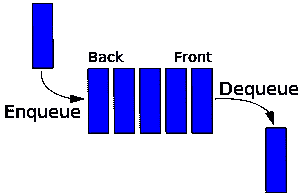

# 数据结构简介:队列如何工作

> 原文：<https://www.freecodecamp.org/news/a-gentle-introduction-to-data-structures-how-queues-work-f8b871938e64/>

迈克尔·奥洛伦尼索拉

# 数据结构简介:队列如何工作


source: marketwatch.com

黑色星期五就要到了，新的微软 Surface Studio 已经上市了(我是 windows 的忠实粉丝？).那么就来说说大家最喜欢的购物打发时间:排队。以及古老数据结构队列。

请随意与你的朋友分享这篇文章，他们将会得到最新最好的信息。但是要注意——众所周知，人们会忘记黑色星期五是如何排队的。

### 行列

一个队列就是一条线(是的，从幼儿园就开始了…不要再插队了！)

加法(**入队**)总是添加到行的后面

移除(**出列**)总是从队列的前面移除

队列遵循 **F** 第一项 **I** n 为 **F** 第一项 **O** ut (FIFO)的模式。



#### **示例用例**

*   解决来自多个用户的并发服务器请求，比如 3 个人几乎同时购买了最后一张机票
*   在[广度优先搜索](https://en.wikipedia.org/wiki/Breadth-first_search)期间将数据排队。

让我们通过帮助微软创建一个队列数据结构来管理他们对新的 Surface Studio 的所有请求，来解决第一个用例。我太忙了，没有时间去写这些文章，所以如果你是一个微软的代表，请随意给我发一篇。？

在我们开始之前，先简单介绍一下 JavaScript 数组。类似于[栈](https://medium.freecodecamp.com/data-structures-stacks-on-stacks-c25f2633c529#.cj82kpcg8)，JavaScript 数组自然具有内置队列的功能。

### 如何使用 JavaScript 数组表示队列

**入队**添加到数组的后面:

```
Array.push(someVal)
```

**出列**移除并返回数组中的第一项:

```
Array.shift() 
```

如果出于某种原因你感到叛逆(哪个程序员不会呢？)您可以添加到阵列的前面，然后从后面移除。

**入队**将项目添加到数组的前面:

```
Array.unshift(someVal) 
```

**出列**从数组后面删除项目:

```
Array.pop()
```

也就是说，为了彻底起见，您将使用 JavaScript 对象来重新构建它。

因此，你需要为微软做的第一件事是创建一个真正的队列，在那里你将持有点击他们网站上购买按钮的个人会员。

```
class Queue{  constructor(){    this._storage = {};    this._start = -1; //replicating 0 index used for arrays    this._end = -1; //replicating 0 index used for arrays  }    size(){   return this._end - this._start;  }}
```

```
let appleQueue = new Queue();
```

快速提醒一下，_ 只是意味着这是一个私有变量，不应该被直接访问。

不像[堆栈数据结构](https://medium.freecodecamp.com/data-structures-stacks-on-stacks-c25f2633c529#.cj82kpcg8)，添加和删除发生在同一边，队列的性质要求我们跟踪两端。因此，创建 start 变量总是跟踪队列的前端，创建 end 变量跟踪队列的末端。

最后，跟踪队列大小的最简单方法(不创建不必要的计数器变量)是跟踪起点和终点之间的差异。

首先，您应该创建一种方法，将点击 buy 的人添加到队列中。您可以通过 enqueue 方法实现这一点:

```
class Queue{  constructor(){    this._storage = {};    this._start = -1; //replicating 0 index used for arrays    this._end = -1; //replicating 0 index used for arrays  }    enqueue(val){    this._storage[++this._end] = val;          //++this._end just means increment the end variable first    //It's equivalent to    //this._end++   //->    //this._storage[this._end] = val;  }    size(){   return this._end - this._start;  }}
```

```
let microsoftQueue = new Queue();
```

```
microsoftQueue.enqueue("{user: ILoveWindows@gmail.com}")microsoftQueue.enqueue("{user: cortanaIsMyBestFriend@hotmail.com}")microsoftQueue.enqueue("{user: InternetExplorer8Fan@outlook.com}")microsoftQueue.enqueue("{user: IThrowApplesOutMyWindow@yahoo.com}")
```

太好了！现在，您的 microsoftQueue 存储看起来有点像这样:

```
{
```

```
 0: "{email: ILoveWindows@gmail.com}"
```

```
 1: "{email: cortanaIsMyBestFriend@hotmail.com}"
```

```
 2: "{email: InternetExplorer8Fan@outlook.com}"
```

```
 3: "{email: IThrowApplesOutMyWindow@yahoo.com}"
```

```
}
```

因此，上面有一个关于用户表示方式的快速注释({user: …})。

当用户点击客户端的 buy 按钮时，他们将所有相关信息发送到服务器，服务器将处理请求。当数据经常在系统之间交换时，比如客户端和服务器端，它最常见的是作为[JSON](https://developer.mozilla.org/en-US/docs/Web/JavaScript/Reference/Global_Objects/JSON)(**J**ava**S**script**O**object**N**rotation)，通过 [Ajax](http://www.w3schools.com/xml/ajax_intro.asp) 发送。

这类似于 JavaScript 对象，因为它只是键值对的字符串化版本。对于那些不熟悉 JavaScript 的人来说，它类似于字典或哈希表(我们将在本系列的后面讨论)。关于这个的更多信息，在 StackOverflow 上有一个很棒的帖子[这里](http://stackoverflow.com/questions/383692/what-is-json-and-why-would-i-use-it)是 Andreas Grech 写的。

现在回到你的队列。

由于你创建的队列，微软现在有一个有效的方法来跟踪所有购买了 Surface Studio 的人，并按照他们购买的时间顺序。为了确保这些人按照正确的顺序得到服务，您需要创建一个准确的出列方法来跟踪购买者的顺序，并在他们得到服务后将他们从队列中删除。

```
class Queue{  constructor(){    this._storage = {};    this._start = -1; //replicating 0 index used for arrays    this._end = -1; //replicating 0 index used for arrays  }    enqueue(val){    this._storage[++this._end] = val;   }
```

```
 dequeue(){    if(this._end > this._start){ //check if there are values      let nextUp = this._storage[++this._start];      delete this._storage[this._start];      return nextUp;    }  }      size(){   return this._end - this._start;  }}
```

```
let microsoftQueue = new Queue();
```

```
microsoftQueue.enqueue("{user: ILoveWindows@gmail.com}")microsoftQueue.enqueue("{user: cortanaIsMyBestFriend@hotmail.com}")microsoftQueue.enqueue("{user: InternetExplorer8Fan@outlook.com}")microsoftQueue.enqueue("{user: IThrowApplesOutMyWindow@yahoo.com}")
```

```
//Function to send everyone their Surface Studio!let sendSurface = recepient => {   sendTo(recepient);}
```

```
//When your server is ready to handle this queue, execute this:
```

```
while(microsoftQueue.size() > 0){  sendSurface(microsoftQueue.dequeue());}
```

这就是了，伙计们！多亏了你，每个在微软排队等候的人现在都可以得到他们新的 Surface Studio 了。

更彻底地说，肯定有一些快速优化可以让代码工作得更有逻辑。

1.  一旦队列中的每个人都得到了服务，您可以将开始和结束值重置为 0。您的队列不太可能达到[“max”JavaScript 编号](https://developer.mozilla.org/en-US/docs/Web/JavaScript/Reference/Global_Objects/Number/MAX_SAFE_INTEGER)，但是安全总比后悔好。
2.  您可以用 size 方法切换出“end > start check ”,因为 0 由于 JavaScript 类型强制而被评估为“false”。在这里阅读所有关于它的内容。

```
dequeue(){    if(this.size()){ //0 is a falsey value...coerced to return false      let nextUp = this._storage[++this._start];      delete this._storage[this._start];
```

```
 if(!this.size()){ //Recheck after incrementing (!0 == true)        this._start = -1;        this._end = -1;       }            return nextUp;    }}
```

就这样，您已经完成了基本队列的编写！

### 关于排队方法的时间复杂度分析

下面是代码:

```
class Queue{  constructor(){    this._storage = {};    this._start = -1; //replicating 0 index used for arrays    this._end = -1; //replicating 0 index used for arrays  }    enqueue(val){    this._storage[++this._end] = val;   }
```

```
 dequeue(){    if(this.size()){ /      let nextUp = this._storage[++this._start];      delete this._storage[this._start];
```

```
 if(!this.size()){         this._start = -1;        this._end = -1;       }            return nextUp;    }  }    size(){   return this._end - this._start;  }}
```

堆栈的相同逻辑也适用于此:

**入队**(加法)是 **O(1)** 。因为你总是知道队列的末端在哪里(多亏了你的 end 变量)，你不需要迭代来添加一个条目。

**出列**(移除)是 **O(1)** 。删除时不需要迭代，因为您始终拥有当前的起始位置。

**大小**是 **O(1)** 。由于开始和结束变量，大小总是已知的。

这里需要注意的一件非常重要的事情是，队列并不是无限的，尽管我们的 queue 类和 JavaScript 数组允许您继续添加条目，直到系统耗尽内存。

优化的一种方法是创建一个空间有限的数组来创建一个循环队列。达米安·戈登在 YouTube 上提供了一个非常好的视频演示。当我们在以后的文章中讨论散列表时，这也很方便！

### 是时候快速回顾一下了

队列:

1.  遵循先进先出(FIFO)模式
2.  有一个 start 和 end 属性来跟踪队列的前端和后端
3.  有一个入队(添加)和出列(删除)方法来管理队列的内容
4.  有一个 size 属性，允许您跟踪您的队列有多大

### **这里有一个快速挑战**

利用您现在对栈的了解和今天对队列的了解，尝试只使用栈来重新实现队列。

给你一个提示，你只需要两叠。

感谢 Jason Holtkamp 提出这个快速挑战！

### **延伸阅读**

[维基百科](https://en.wikipedia.org/wiki/Queue_(abstract_data_type))一如既往？

[这篇维基百科文章](https://en.wikipedia.org/wiki/Priority_queue)关于优先队列。我们将在以后的文章中回到这个问题。

Larry Serflaten 在 Khan Academy 上做了一个很好的演示,他用推和拉代替了入队和出列。

这里是快速挑战的[答案](http://stackoverflow.com/questions/69192/how-to-implement-a-queue-using-two-stacks)。只有在你自己尝试了一会儿之后，再来看看这个。你也可以查看 [Levent Divilioglu](http://stackoverflow.com/users/3128926/levent-divilioglu) 的答案，获得一个奇妙的图形表示。