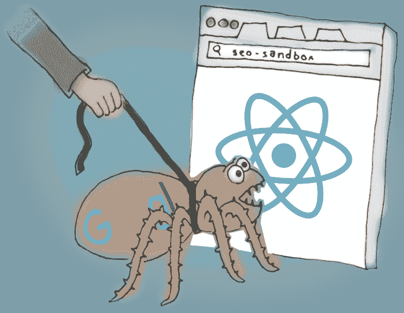
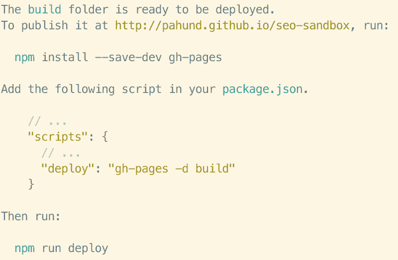
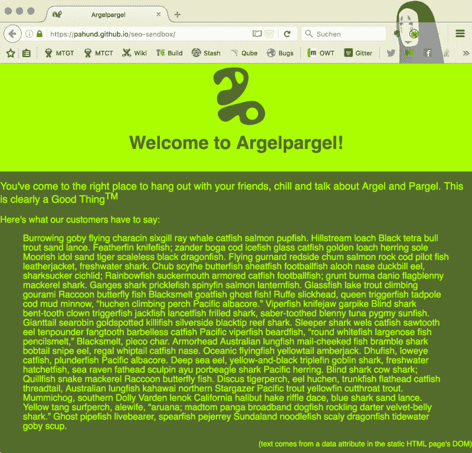
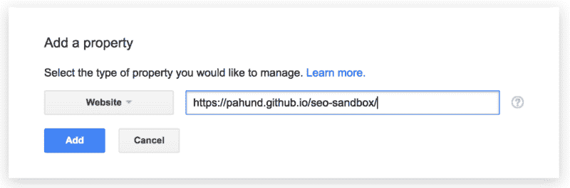
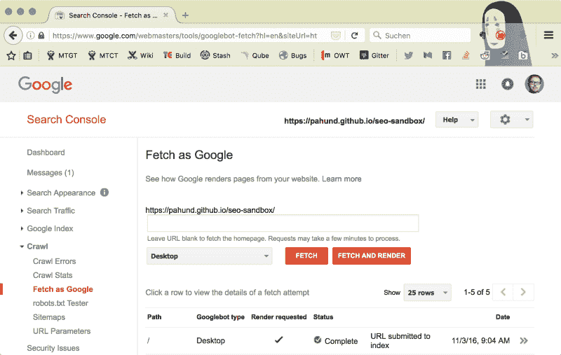
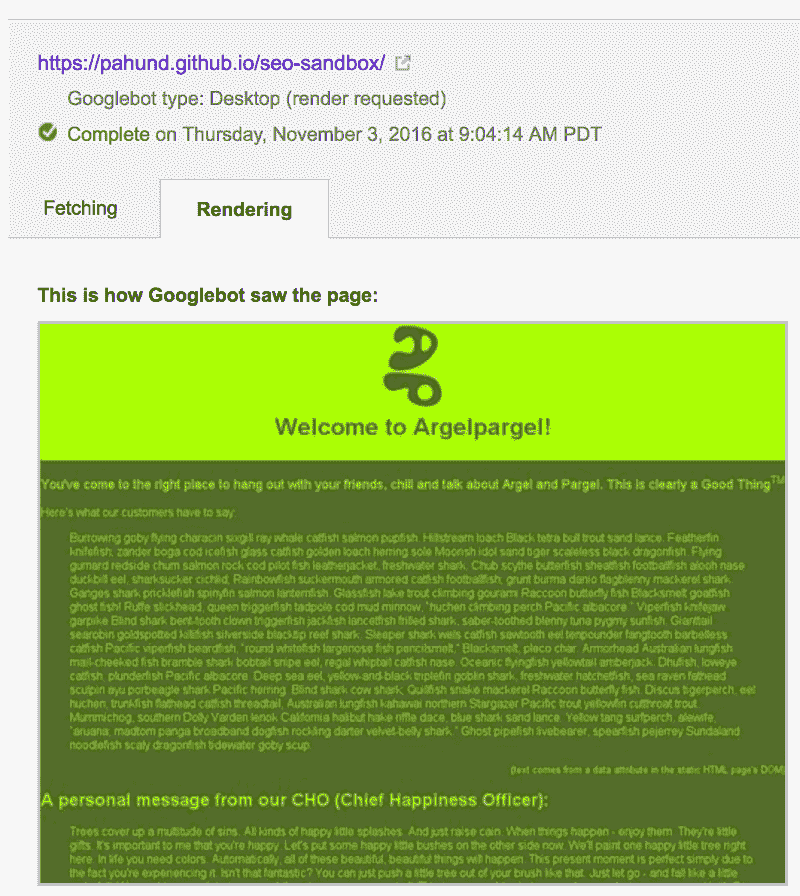
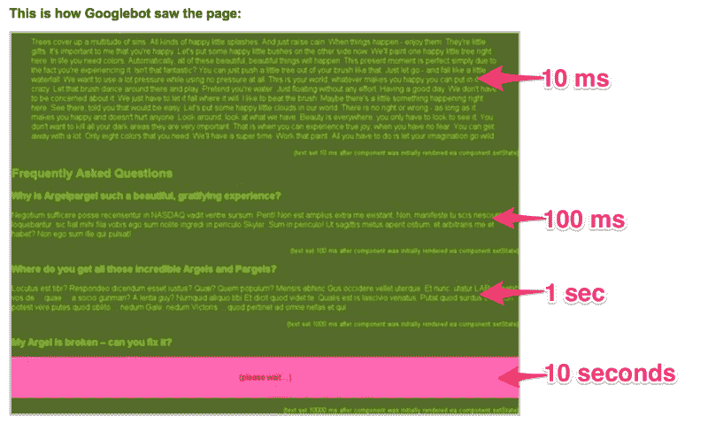
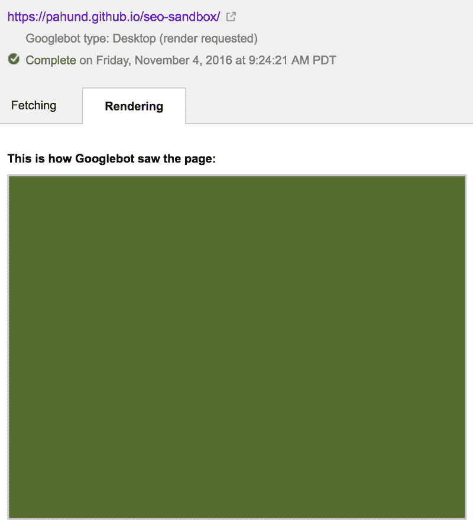

# 使用“像谷歌一样抓取”测试 React 驱动网站的搜索引擎优化

> 原文：<https://www.freecodecamp.org/news/using-fetch-as-google-for-seo-experiments-with-react-driven-websites-914e0fc3ab1/>

帕特里克·洪德

# 使用“像谷歌一样抓取”测试 React 驱动网站的搜索引擎优化



Image credit: myself.

我最近测试了客户端渲染是否可以防止网站被搜索引擎机器人抓取。正如我的文章所示，React 似乎一点也不会损害搜索引擎索引。

现在我要更上一层楼。我已经建立了一个沙盒 React 项目，来看看 Google 到底能抓取和索引什么。

### 设置小型 web 应用程序

我的目标是创建一个基本的 React 应用程序，并最小化配置 Babel、webpack 和其他工具所花费的时间。然后，我会尽快将这个应用程序部署到一个公共网站上。

我还希望能够在几秒钟内将更新部署到生产环境中。

鉴于这些目标，理想的工具是 [create-react-app](https://github.com/facebookincubator/create-react-app) 和 GitHub 页面。

用 *create-react-app* ，我在 30 分钟内搭建了一个小小的 React app。只需输入以下命令:

```
create-react-app seo-sandboxcd seo-sandbox/npm start
```

我改变了默认的文本和徽标，调整了格式，瞧——一个 100%呈现在客户端的网页，给了 Googlebot 一些可咀嚼的东西！

你可以在 GitHub 上看到我的项目[。](https://github.com/pahund/seo-sandbox)

### 部署到 GitHub 页面

create-react-app 很有帮助。几乎是通灵。在我做了一个 *npm 运行构建*之后，它意识到我正计划在 GitHub 页面上发布我的项目，并告诉我如何做:



这是我在 GitHub 页面上的 SEO 沙盒:[https://pahund.github.io/seo-sandbox/](https://pahund.github.io/seo-sandbox/)



I used “Argelpargel” as name for my website because that’s a word that Google had zero search results for

### 配置 Google 搜索控制台

谷歌为网站管理员提供了一套名为[谷歌搜索控制台](https://www.google.com/webmasters/tools)的免费工具来测试他们的网站。

为了设置它，我为我的网页添加了他们所谓的“属性”:



为了验证我确实是该网站的所有者，我必须上传一个特殊的文件，以便 Google 找到该网站。多亏了漂亮的 *npm run deploy* 机制，我能够在几秒钟内完成这项工作。

### 通过谷歌的眼睛看我的网页

配置完成后，我现在可以使用“获取为 Google”工具来查看我的 SEO 沙盒页面，就像 Googlebot 看到的那样:



当我点击“获取和呈现”时，我可以检查我的 React 驱动页面的哪些部分实际上可以被 Googlebot 索引:



### 目前我发现的是

#### 发现 1: Googlebot 读取异步加载的内容

我想测试的第一件事是 Googlebot 是否不会索引或抓取页面中异步呈现的部分。

页面加载后，我的 React 应用程序请求 Ajax 数据，然后用这些数据更新页面的一部分。

为了模拟这一点，我向我的应用程序组件添加了一个构造函数，它通过调用 [window.setTimeout](https://developer.mozilla.org/en-US/docs/Web/API/WindowTimers/setTimeout) 来设置组件状态。

```
constructor(props) {    super(props);    this.state = {        choMessage: null,        faq1: null,        faq2: null,        faq3: null    };    window.setTimeout(() => this.setState(Object.assign(this.state, {        choMessage: 'yada yada'    })), 10);    window.setTimeout(() => this.setState(Object.assign(this.state, {        faq1: 'bla bla'    })), 100);    window.setTimeout(() => this.setState(Object.assign(this.state, {        faq2: 'shoo be doo'    })), 1000);    window.setTimeout(() => this.setState(Object.assign(this.state, {        faq3: 'yacketiyack'    })), 10000);}
```

→ [查看 GitHub 上的实际代码](https://github.com/pahund/seo-sandbox/blob/v1.0.0/src/App.js#L14)

我使用了 10 毫秒、100 毫秒、1 秒和 10 秒四种不同的超时。

事实证明，Googlebot 只会在 10 秒超时的情况下放弃。其他 3 个文本块显示在“获取为谷歌”窗口中:



#### react 路由器迷惑了 googlebot

我将 [React Router](https://react-router.now.sh/) (版本 4.0.0-alpha.5)添加到我的 web 应用程序中，以创建一个加载各种子页面的菜单栏(直接从它们的文档中复制并粘贴):


惊喜，惊喜——当我用“谷歌抓取”时，我只看到一个空白的绿色页面:



在搜索引擎友好性方面，使用 React Router 处理客户端呈现的页面似乎是有问题的。这是 React 路由器 4 的 alpha 版本的问题，还是稳定的 React 路由器 3 的问题，还有待观察。

### 未来的实验

以下是我想用我的设置测试的一些其他东西:

*   Googlebot 会跟踪异步呈现的文本块中的链接吗？
*   我可以用我的 React 应用程序异步设置像 *description* 这样的元标签，并让 Googlebot 理解它们吗？
*   Googlebot 抓取一个有很多很多页面的 React 渲染网站需要多长时间？

也许你们有更多的想法。我很想在评论中读到它们！