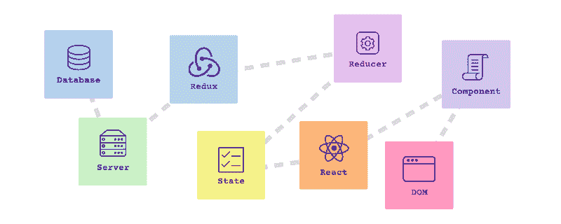
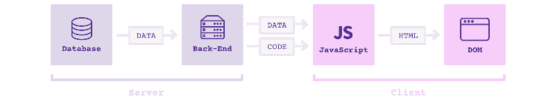
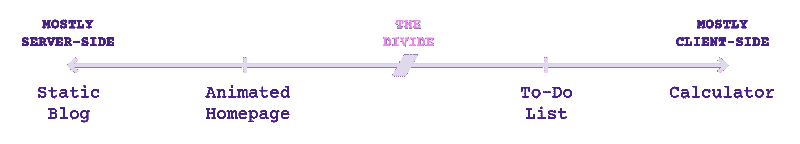
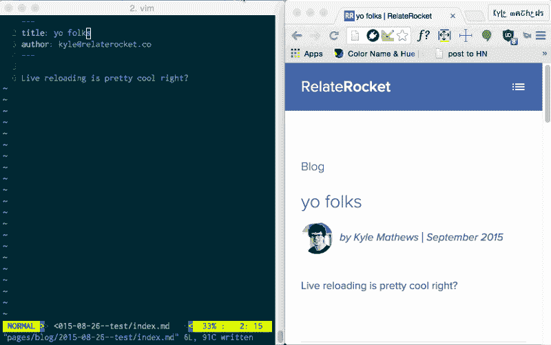
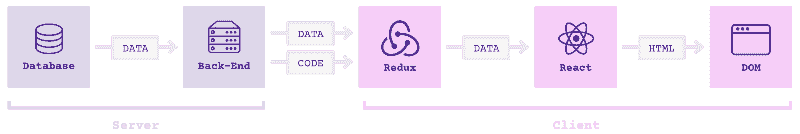
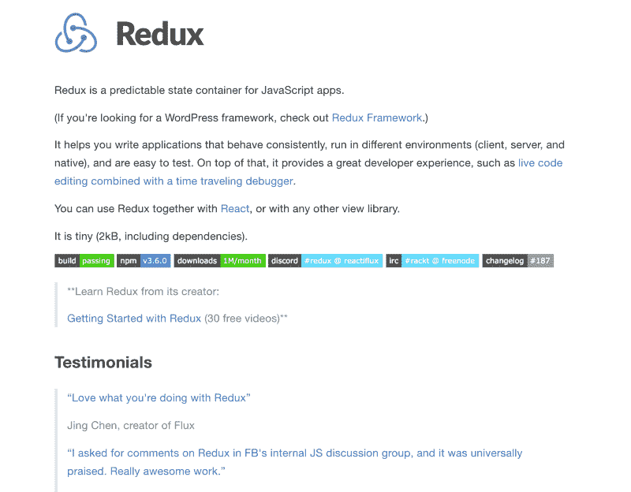
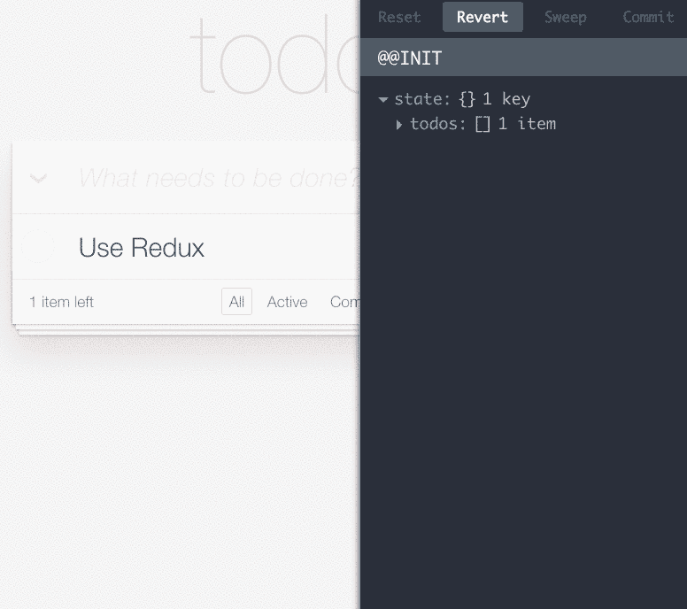
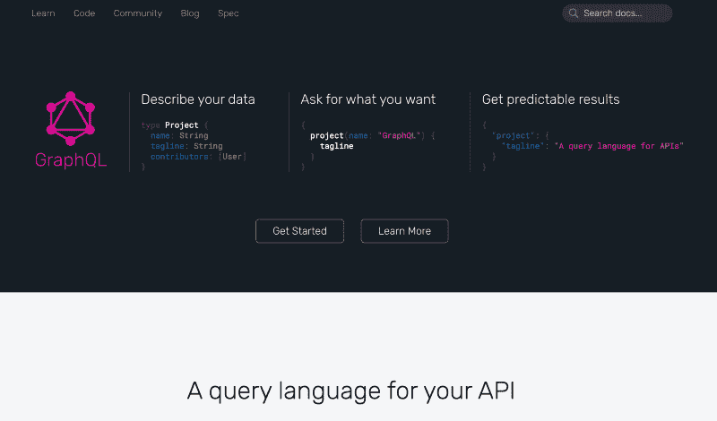
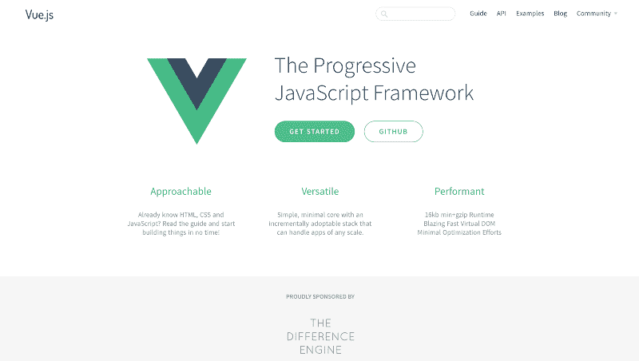

# 治愈 JavaScript 疲劳的研究计划

> 原文：<https://www.freecodecamp.org/news/a-study-plan-to-cure-javascript-fatigue-8ad3a54f2eb1/>

萨沙·格里菲

# 治愈 JavaScript 疲劳的研究计划

和其他人一样，我最近偶然看到了 Jose Aguinaga 的帖子“[2016 年学习 JavaScript 的感受](https://hackernoon.com/how-it-feels-to-learn-javascript-in-2016-d3a717dd577f#.5wjpn7svo)”。

很明显，这篇文章触到了痛处:我看到它登上了[黑客新闻](http://news.ycombinator.com)的榜首，不是一次，而是两次*。*这也是 [/r/javascript](http://reddit.com/r/javascript/) 上最受欢迎的帖子，目前在 Medium 上已经有超过 1 万个赞——这可能比我所有帖子加起来还多。但是谁在数呢？

不过这并不令人惊讶:我很早就知道 JavaScript 生态系统可能会令人困惑。事实上，我运行 JavaScript 调查的[状态的真正原因是为了找出哪些库实际上是受欢迎的，并最终从噪音中分类出信号。](http://stateofjs.com)

但是今天，我想更进一步。我不是简单地抱怨现状，而是给你一个具体的、一步一步的学习计划来征服 JavaScript 生态系统。

### 这是给谁的

此学习计划适合您，如果:

*   你已经熟悉了基本的编程概念，比如变量和函数。
*   您可能已经使用 PHP 和 Python 等语言完成了后端工作，也可能使用 jQuery 等前端库完成了一些简单的工作。
*   您现在想要进入更严肃的前端开发，但是在您开始之前就已经淹没在框架和库之中了。

### 我们将涉及的内容

*   现代 JavaScript web 应用程序是什么样子的
*   为什么不能直接使用 jQuery
*   为什么 React 是最安全的选择
*   为什么您可能不需要先“正确学习 JavaScript”
*   如何学习 ES6 语法
*   为什么以及如何学习 Redux
*   GraphQL 是什么，为什么它很重要
*   接下来去哪里

### 这里提到的资源

免责声明:这篇文章将包括一些由[韦斯·博斯](http://wesbos.com/)开设的课程的附属链接，但推荐这些材料是因为我真心认为它很好，而不仅仅是因为附属计划。

如果你更愿意寻找其他资源，Mark Erikson 维护了一个很棒的 [React、ES6 和 Redux](https://github.com/markerikson/react-redux-links) 链接列表。

### JavaScript vs JavaScript

在我们开始之前，我们需要确保我们谈论的是同一件事。如果你在谷歌上搜索“学习 JavaScript”或“JavaScript 学习计划”，你会找到大量教你如何学习 JavaScript 语言的资源。

但这实际上是最简单的部分。虽然你肯定可以深入挖掘并学习这门语言的复杂性，但事实是大多数 web 应用程序使用相对简单的代码。换句话说，编写 web 应用程序所需的 80%的内容通常都包含在典型的 JavaScript 书籍的前几章中。

不，困难的问题是掌握 JavaScript 生态系统，以及无数与之竞争的框架和库。好消息是，这正是这个学习计划的重点。

### JavaScript 应用程序的构建模块

为了理解为什么现代 JavaScript 应用看起来如此复杂，你首先必须理解它们是如何工作的。

首先，让我们看一个大约在 2008 年的“传统”网络应用:

1.  数据库向你的后端发送数据(比如你的 PHP 或者 Rails 应用)。
2.  后端读取数据并输出 HTML。
3.  HTML 被发送到浏览器，浏览器将其显示为 DOM(基本上是一个网页)

现在，很多这样的应用程序也在客户端添加了一些 JavaScript 代码来增加交互性，比如标签页和模态窗口。但从根本上说，浏览器仍然接收 HTML 并从那里出发。

现在将它与 2016 年的“现代”网络应用程序(也称为“单页应用程序”)进行比较:

注意到区别了吗？现在，服务器发送的不是 HTML，而是*数据*，并且“数据到 HTML”的转换步骤发生在客户端(这就是为什么您同时发送告诉客户端如何执行所述转换的代码)。

这有许多含义。第一，好的:

*   对于给定的内容，只发送数据比发送整个 HTML 页面要快。
*   客户端可以即时交换内容，而无需刷新浏览器窗口(因此有了“单页应用”这个术语)。

坏消息:

*   初始加载需要更长时间，因为“数据到 HTML”代码库可能会变得非常大。
*   您现在也需要一个在客户机上存储和管理数据的地方，以防您想要缓存或检查它。

丑陋的是:

*   恭喜您——您现在必须处理客户端堆栈，它可以变得和您的服务器端堆栈一样复杂。

### 客户机-服务器系列

如果有这么多不利因素，为什么还要经历这么多麻烦呢？为什么不坚持使用老的 PHP 应用程序呢？

好吧，想象你正在建造一个计算器。如果用户想知道 2 + 2 是什么，那么在浏览器完全有能力做的情况下，一路回到服务器来执行操作是没有意义的。

另一方面，如果你正在构建一个纯静态的站点，比如一个博客，在服务器上生成最终的 HTML 并完成它是非常好的。

事实是，大多数网络应用都处于中间位置。问题是知道在哪里。

但关键是*频谱不是连续的*:你不可能从一个纯服务器端 app 开始，慢慢走向一个纯客户端 app。在某个时候(分界线)，你将被迫停下来重构一切，否则最终会得到一堆难以维护的代码。

这就是为什么你不应该对任何事情都“只使用 jQuery”。你可以把 jQuery 想象成胶带。它对于房子周围的小修补非常方便，但是如果你继续添加越来越多的东西，它们会看起来很丑。

另一方面，现代 JavaScript 框架更像是 3D 打印的替代品:它需要更多的时间，但结果更干净、更坚固。

换句话说，掌握现代 JavaScript 堆栈是一个赌注，无论他们从哪里开始，大多数 web 应用程序迟早会*可能*站在正确的一边。所以，是的，这是更多的工作，但安全总比遗憾好。

### 第 0 周:JavaScript 基础知识

除非你是一个纯粹的后端开发人员，否则你可能知道一些 JavaScript。即使您不了解，如果您是 PHP 或 Java 开发人员，JavaScript 的类似 C 的语法看起来也会有些熟悉。

但是如果 JavaScript 对你来说完全是个谜，不要绝望。有很多免费资源可以让你快速上手。例如，一个好的起点是 Codecademy 的 JavaScript 课程。

### 第一周:从反应开始

现在你已经知道了基本的 JavaScript 语法，并且理解了为什么 JavaScript 应用程序看起来如此复杂，让我们来谈谈细节。你应该从哪里开始？

我相信答案是[反应](https://facebook.github.io/react/)。

React 是一个由脸书创建并开源的 UI 库。换句话说，它负责“数据到 HTML”的步骤(视图层)。

现在不要误解我的意思:我不是告诉你选择 React，因为它是最好的库(因为这是非常主观的)，而是因为它是非常好的库(T2 库)。

*   React 可能不是最受欢迎的图书馆，但它在 T2 很受欢迎。
*   React 可能不是最轻量级的库，但它是非常轻量级的库(T2)。
*   React 可能不是最容易学的，但是它非常容易学。
*   React 可能不是最*优雅的*图书馆，但它的*相当*优雅。

换句话说，React 可能不是所有情况下的最佳选择，但我相信它是最安全的 T2。相信我，“刚刚起步”并不是用你的技术选择去冒险的时候。

React 还将向您介绍一些有用的概念，如组件、应用程序状态和无状态函数，无论您在职业生涯中最终使用哪个框架或库，这些概念都将被证明是有用的。

最后，React 有一个由其他包和库组成的大型生态系统，可以很好地与之配合工作。它的流行意味着你可以在 Stack Overflow 这样的网站上找到很多帮助。

我个人推荐 Wes Bos 的 [React 初学者](https://reactforbeginners.com/friend/STATEOFJS)课程。这是我自己学习 React 的方式，并且它刚刚被最新的 React 最佳实践彻底检修过。

### 应该先“好好学学 JavaScript”吗？

如果你是一个非常有条理的学习者，你可能想在做任何事情之前很好地掌握 JavaScript 的基础知识。

但对其他人来说，这感觉就像通过学习人体解剖学和流体动力学来学习游泳。当然，他们都在游泳中发挥了巨大的作用，但只是在游泳池里跳更有趣！

这里没有正确或错误的答案，这完全取决于你的学习方式。事实是，无论如何，大多数基本的 React 教程可能只使用 JavaScript 的很小一部分，所以只关注你现在需要的东西，把其他的留到以后再做是完全没问题的。

这也适用于整个 JavaScript 生态系统。现在不要太担心理解 Webpack 或 Babel 之类的东西的来龙去脉。事实上，React 最近推出了自己的小型[命令行实用程序](https://github.com/facebookincubator/create-react-app),让你不用任何构建配置就能创建应用程序。

### 第二周:你的第一个 React 项目

假设您刚刚完成了一门 React 课程。如果你像我一样，有两件事可能是真的:

*   你已经忘记了你刚刚学过的一半。
*   你迫不及待地将你*做*记的一半付诸实践。

我相信学习一个框架或一门语言的最好方法就是使用它。个人项目是尝试新技术的绝佳机会。

个人项目可以是任何东西，从单个页面到复杂的 web 应用程序，但我觉得重新设计你自己的个人网站可能是一个很好的折中方案。另外，我知道你可能已经拖了好几年了！

我之前确实说过，使用单页面应用程序获取静态内容往往有些过火，但 React 实际上有一个秘密武器: [Gatsby](https://github.com/gatsbyjs/gatsby) ，一个 React 静态站点生成器，它让你“作弊”并获得 React 的所有好处，而没有任何缺点。

这就是为什么 Gatsby 是开始使用 React 的好方法:

*   预配置的 Webpack，意味着您可以获得所有好处，而不会有任何麻烦。
*   基于目录结构的自动路由。
*   所有的 HTML 内容都是在服务器端生成的，所以你可以两全其美。
*   静态内容意味着没有服务器，超级容易在 GitHub 页面上托管。

我将 Gatsby 用于 JavaScript 站点的[状态，不必担心路由、构建工具配置或服务器端呈现，这为我节省了大量时间。](http://stateofjs.com)

### 第 3 周:掌握 ES6

在我自己学习 React 的过程中，我很快就达到了可以通过复制粘贴代码样本来学习 React 的程度，但是仍然有很多我不理解的地方。

具体来说，我不熟悉 [ES6](http://es6-features.org/#Constants) 引入的所有新功能，例如:

*   箭头功能
*   对象析构
*   班级
*   扩展运算符

如果你在同一条船上，可能是时候花几天时间好好学习 ES6 了。如果你喜欢 React for 初学者课程，你可能想看看 Wes 的优秀的 [ES6 for Everybody](https://es6.io/friend/stateofjs) 视频。

或者，如果你喜欢免费资源，看看尼古拉斯·贝瓦夸的书《实用 ES6 。

掌握 ES6 的一个很好的练习是浏览一个旧的代码库(比如您在第 2 周刚刚创建的那个！)并将您的代码转换成 ES6 更短、更简洁的语法。

### 第 4 周:承担国家管理

至此，您应该能够构建一个由静态内容支持的简单 React 前端。

但是真正的 web 应用程序不是静态的:它们需要从某个地方获取数据，通常是某种数据库。

现在，您可以只将数据发送到您的单个组件，但这很快就会变得混乱。例如，如果两个组件需要显示相同的数据怎么办？还是需要互相倾诉？

这就是**状态管理**的用武之地。您没有将您的状态(换句话说，您的数据)一点一点地存储在每个组件中，而是将它存储在一个单独的**全局存储**中，然后该全局存储将它分发到您的 React 组件:

在 React 世界中，最流行的状态管理库是 Redux。Redux 不仅有助于集中您的数据，而且还强制执行一些严格的协议来操作这些数据。

你可以把 Redux 想象成一家银行:你不能去你当地的分行手动修改你的账户总数(“这里，让我多加几个零！”).取而代之的是，你填写一张存款单，然后把它交给被授权执行该操作的银行出纳员。

同样，Redux 也不会让你直接修改你的全局状态。取而代之的是，你将*动作*传递给*还原器*，它们是执行操作并返回新的更新状态的特殊函数。

所有这些额外工作的结果是整个应用中高度标准化和可维护的数据流，以及对工具的访问，如 [Redux Devtools](https://github.com/gaearon/redux-devtools) 来帮助您可视化它:

你可以再一次和我们的朋友 Wes 呆在一起，通过他的 Redux 课程学习 Redux，这实际上是完全免费的！

或者，你可以在 egghead.io 上查看 Redux 创作者 Dan Abramov 的[视频系列，这也是免费的。](https://egghead.io/courses/getting-started-with-redux)

### 奖励周 5:用 GraphQL 构建 API

到目前为止，我们几乎只谈论了客户，这只是等式的一半。即使不进入整个节点生态系统，解决任何 web 应用程序的一个关键方面也很重要:数据如何从服务器到达客户端。

毫不奇怪，这也在迅速改变，GraphQL(脸书的另一个开源项目)正成为传统 REST APIs 的重要替代品。

而 REST API 公开了多个 REST 路由，每个路由都允许您访问预定义的数据集(比如，/api/posts，/api/comments 等)。)，GraphQL 公开了一个端点，让客户机*查询它需要的数据*。

把它想象成多次去肉店、面包店和杂货店，而不是给某人一张购物清单，然后让他们去这三个地方。

当您需要查询多个数据源时，这种新策略变得尤为重要。就像我们的购物清单示例一样，您现在可以通过一个请求从所有这些来源获取数据。

GraphQL 在过去一年左右的时间里一直在加速发展，许多项目(比如我们在第 2 周使用的 [Gatsby](https://github.com/gatsbyjs/gatsby/) )都计划采用它。

GraphQL 本身只是一个协议，但它目前最好的实现可能是与 Redux 配合良好的 [Apollo](http://apollostack.com) 库。仍然缺乏关于 GraphQL 和 Apollo 的指导材料，但是希望 [Apollo 文档](http://dev.apollodata.com/)可以帮助你开始。

### 超越反应公司

我建议您从 React 生态系统开始，因为这是一个安全的选择，但它绝不是唯一有效的前端堆栈。如果你想继续探索，这里有两个建议:

#### 某视频剪辑软件

Vue 是一个相对较新的图书馆，但它正以创纪录的速度增长，并已被大公司采用，尤其是在中国，它正被百度和阿里巴巴(想想中国的谷歌和亚马逊)等公司使用。它也是 PHP 框架 [Laravel](https://laravel.com/) 的官方前端层。

与 React 相比，它的一些关键卖点是:

*   官方维护的路由和状态管理库。
*   注重性能。
*   由于使用基于 HTML 的模板，学习曲线更低。
*   减少样板代码。

就目前的情况而言，React 相对于 Vue 的两个主要优势是 React 生态系统的规模，以及 [React Native](https://facebook.github.io/react-native/) (稍后将详细介绍)。但是看到 Vue 很快赶上来我也不会感到惊讶！

#### 榆树

如果说 Vue 是更平易近人的选择， [Elm](http://elm-lang.org/) 是更前沿的。Elm 不仅仅是一个框架，而是一种编译成 JavaScript 的全新语言。

这带来了多重优势，比如改进的性能、强制的语义版本控制以及没有运行时异常。

我没有亲自尝试过 Elm，但它得到了朋友们的热情推荐，Elm 用户似乎普遍对它非常满意(正如 JavaScript State 调查中其 84%的满意度所示)。

### 后续步骤

到目前为止，您应该已经很好地掌握了整个 React 前端堆栈，并有望在使用它时取得合理的成果。

但这并不意味着你已经完成了！这只是你在 JavaScript 生态系统中旅程的开始。您最终会遇到的一些其他主题包括:

*   服务器上的 JavaScript(Node， [Express](https://expressjs.com/) …)
*   JavaScript 测试( [Jest](https://facebook.github.io/jest/) ，[Enzyme](https://github.com/airbnb/enzyme)……)
*   构建工具( [Webpack](https://webpack.github.io/) …)
*   类型系统([类型脚本](https://www.typescriptlang.org/)，[流程](https://flowtype.org/)……)
*   在你的 JavaScript 应用中处理 CSS([CSS 模块](https://github.com/css-modules/css-modules)，[风格组件](https://github.com/styled-components/styled-components)……)
*   面向移动应用的 JavaScript([React Native](https://facebook.github.io/react-native/)…)
*   桌面应用的 JavaScript([电子](http://electron.atom.io/)……)

我不能在这里涵盖所有这些，但不要绝望！第一步总是最难的，你猜怎么着:通过阅读这个学习计划，你已经迈出了第一步。

既然你已经理解了生态系统的各个部分是如何结合在一起的，那么接下来你只需要把你想学的东西排列起来，每个月学习一项新技术。

### 保持联络

你觉得这个学习计划有帮助吗？你希望我接下来写 JavaScript 的哪个领域？留下评论或[推文](http://twitter.com/sachagreif)让我知道！

如果你想知道我下一次发布的帖子，你也可以[注册 JavaScript 邮件列表的状态](http://eepurl.com/ccyxCn)。