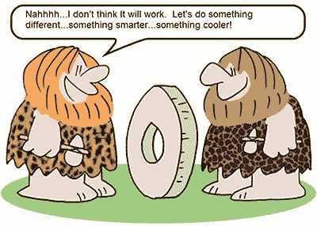
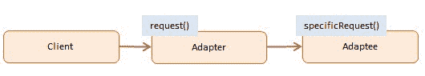
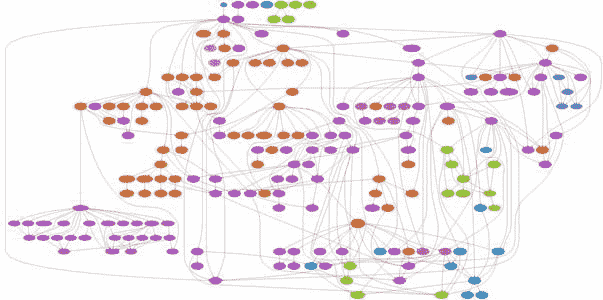

# 代码依赖是魔鬼。

> 原文：<https://www.freecodecamp.org/news/code-dependencies-are-the-devil-35ed28b556d/>

> “变化是唯一不变的……”赫拉克利特(哲学家)

我们今天用来构建 web 应用程序的工具、库和框架与我们几年前使用的完全不同。

从现在起的短短几年内，这些技术中的大多数将再次发生巨大的变化。然而，我们中的许多人将这些作为我们应用程序的核心，不可分割的一部分。

我们从流行的框架中导入、使用和继承，就好像它们将永远存在并且不会改变。嗯……他们不是。这是个问题。

经过 20 多年的开发、设计和架构 web 应用程序，我已经认识到两个重要的事实:

1.  外部依赖性对任何应用程序的长期稳定性和生存能力构成了巨大的威胁。
2.  如果不利用外部依赖，构建任何类型的重要应用程序都变得越来越困难，甚至不可能。

这篇文章是关于调和这两个事实，以便我们的应用程序有最大的机会长期生存。

### 兔子洞确实很深。

如果我们开始考虑我们的 web 应用程序所依赖的所有东西，在我们找到代码之前，很容易想到一打或更多:

*   力量
*   连通性
*   防火墙
*   域名服务器(Domain Name Server)
*   服务器硬件(CPU、磁盘、内存等)
*   冷却
*   虚拟化平台
*   集装箱平台
*   操作系统
*   网络服务器平台
*   应用服务器平台
*   网络浏览器

作为开发人员，意识到这些事情是很好的，但是我们通常对此无能为力。所以，让我们暂时忽略它们，只讨论代码。

在代码中，有三种依赖关系:

#### 1.我们控制的依赖性

这是由我们或我们的组织编写和拥有的代码。

#### 2.我们无法控制的依赖

这是由第三方供应商或开源软件社区编写的代码。

#### 3.依赖关系一旦删除

这些是我们的第三方代码依赖所依赖的代码依赖。(说那三遍快！)

我们将主要讨论我们无法控制的依赖关系。

我们控制的依赖关系和**依赖关系一旦被移除**仍然会引起麻烦，但是在依赖关系由我们控制的情况下，我们应该能够直接干预和减轻任何问题。

在依赖关系一旦被移除的情况下，我们通常可以依靠第三方来替我们处理，因为他们也依赖于这些。

### 为什么第三方代码依赖是好的

web 应用程序的很大一部分是用来解决常见问题的:身份验证、授权、数据访问、错误处理、导航、日志记录、加密、显示项目列表、验证表单输入等等...

无论您使用哪种技术堆栈，都很有可能存在这些问题的通用解决方案，并且这些解决方案是作为库提供的，您可以很容易地获得并插入到您的代码库中。完全从零开始写这些东西通常是浪费时间。

您希望专注于解决不常见问题或以不常见方式解决常见问题的代码。这就是你的应用程序的价值所在:实现你的应用程序独有的业务规则的代码——这是“秘方”

谷歌的搜索和页面排名算法，脸书的时间轴过滤，网飞的“推荐给你”部分和数据压缩算法——所有这些功能背后的代码都是“秘方”

第三方代码(以库的形式)允许您快速实现应用程序的商品化功能，因此您可以专注于您的“秘方”

### 为什么第三方代码依赖不好

看一看在过去几年中构建的任何非平凡的网络应用程序，你绝对会对实际上来自第三方库的代码数量感到震惊。如果其中一个或多个第三方库[发生剧烈变化](https://daveceddia.com/angular-2-should-you-upgrade/)，或者[消失](http://blog.parse.com/announcements/moving-on/)，或者[崩溃](http://www.theregister.co.uk/2016/03/23/npm_left_pad_chaos/)怎么办？

如果它是开源的，也许你可以自己修复它。但是，您对不属于您的库中的所有代码了解多少呢？首先，您使用库的一个重要原因是获得代码的好处，而不必担心所有的细节。但现在你被困住了。你已经完全把你的财富和这些你不拥有也不控制的依赖物捆绑在一起了。

Don’t worry, by the end of this article, you’ll find a new hope.

也许你认为我在夸大其词，或者从纯学术的角度来说。我向你保证——我有几十个客户因为将第三方代码过于紧密地嵌入到他们的应用程序中而完全欺骗了自己的例子。这只是最近的一个例子…

我的一个前客户使用脸书旗下的后端即服务提供商构建了他们的应用，名为 [Parse](http://Parse.com) 。他们使用 Parse 提供的 JavaScript 客户端库来消费 Parse 服务。在这个过程中，他们将所有代码(包括“秘方”代码)紧密耦合到这个库中。

在我的客户首次推出产品三个月后——就在他们开始吸引真正的付费客户时——Parse 宣布关闭。

现在，我的客户不再专注于迭代他们的产品和扩大他们的客户群，而是不得不考虑如何迁移到一个自托管的开源版本的 Parse，或者完全取代 Parse。

这对一个年轻的、羽翼未丰的应用程序造成的干扰是如此之大，以至于我的客户最终完全放弃了这个应用程序。

### 平衡好与坏

几年前，我在保留第三方库优点的同时克服风险的首选解决方案是使用[适配器模式](http://www.dofactory.com/javascript/adapter-design-pattern)包装它们。

本质上，您将第三方代码包装在自己编写的适配器类或模块中。这样就能以你控制的方式公开第三方库的功能。

使用这种模式，如果第三方库或框架发生变化或消失，您只需修改一点适配器代码。你的应用程序的其余部分保持不变。

Adapter pattern diagram from [Dofactory.com](http://www.dofactory.com/javascript/adapter-design-pattern)

这在理论上听起来不错。当您拥有只提供少量功能的自包含依赖项时，这将会达到目的。但是事情可能会变得很糟糕。

你能想象在使用任何一个 React 库之前必须包装整个 React 库(包括 JSX)吗？用 Java 包装 jQuery，或者 Angular，或者 Spring 框架怎么样？这很快变成了一场噩梦。

最近，我推荐一种更微妙的方法…

对于要添加到代码库中的每个依赖项，通过乘以两个因素来评估它将引入的风险级别:

1.  依赖性发生实质性变化的可能性。
2.  对依赖项的实质性更改会对您的应用程序造成多大的损害。

当满足以下部分或全部条件时，第三方库或框架不太可能发生变化:

*   它已经存在好几年了，并且已经发布了几个主要版本。
*   它被许多商业应用程序广泛使用。
*   它得到了大型组织的积极支持，最好是家喻户晓的公司或机构。

当满足以下部分或全部条件时，第三方库或框架会对您的应用程序造成更少的损害:

*   它只被应用程序的一小部分使用，而不是被整个应用程序使用。
*   依赖于它的代码不是我前面谈到的“秘方”的一部分。
*   移除它只需要对您的代码库进行最小的更改。
*   您的整个应用程序非常小，可以快速重写。(小心这一条——它很少会持续很长时间。)

风险越大，你就越有可能包装它或者完全避免它。

当涉及到对您的应用程序的价值主张真正至关重要的代码，即您的“秘方”时，您需要非常小心地保护它。尽可能使代码独立。如果你绝对需要使用一个依赖项，考虑注入它而不是直接引用它。即使那样，也要小心。

有时这意味着对你认为很酷的第三方库说“不”，或者因为这样或那样的原因你真的想使用它。要坚强。相信我，会有回报的。只要问问那些在 Angular 的第一个版本中投入大量资金的人，或者我以前到处使用 Parse 的客户就知道了。一点都不好玩。相信我。

说到有趣，看看这个…

Dependency graph for [TinyTag explorer](http://www.tarind.com/depgraph.html)

上图是一个名为 TinyTag Explorer 的应用程序的依赖图。

为现有应用程序生成依赖关系图是了解依赖关系所带来的风险水平的一个好方法。我整理了一个免费工具列表，这些工具可以用各种语言生成类似上面的图形，包括 JavaScript、C#、Java、PHP 和 Python。在这里可以得到[。](https://devmastery.leadpages.co/dependency-tools)

### 帮助我帮助别人

我想通过与他们分享我的知识和经验来帮助尽可能多的开发人员。请点击下面的❤推荐按钮(绿色心脏)来帮助我。

最后，不要忘记在这里获取您的免费依赖图生成器列表[。](https://devmastery.leadpages.co/dependency-tools)