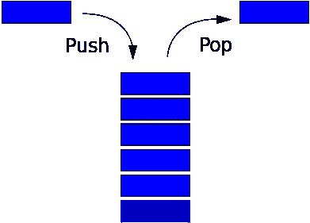

# 数据结构简介:堆栈如何工作

> 原文：<https://www.freecodecamp.org/news/data-structures-stacks-on-stacks-c25f2633c529/>

迈克尔·奥洛伦尼索拉

# 数据结构简介:堆栈如何工作


任何申请大型科技公司开发人员职位的人——花几天时间练习常见的算法面试问题——可能都会得出这样的结论:

> “哇。我真的很想了解数据结构。”

什么是数据结构？为什么它们如此重要？维基百科提供了一个简洁而准确的答案:

> 数据结构是在计算机中组织数据的一种特殊方式，以便它能被有效地使用。

这里的关键词是*高效，*这个词你在分析不同的数据结构时会经常听到。

这些结构为数据存储提供了框架，允许快速、动态地进行搜索、插入、删除和更新。

尽管计算机功能强大，但它们仍然只是需要指导才能完成任何有用任务的机器(至少在通用人工智能出现之前是如此)。在那之前，你必须尽可能给他们最清晰、最有效的命令。

就像你可以用 50 种不同的方式建造一个家一样，你也可以用 50 种不同的方式构建数据。幸运的是，许多真正聪明的人已经建造了伟大的脚手架，经受住了时间的考验。你所要做的就是了解它们是什么，它们是如何工作的，以及如何最好地使用它们。

下面是一些最常见的数据结构的列表。我将在以后的文章中逐一讨论这些问题——这一篇 100%集中在堆栈上。虽然经常会有重叠，但每种结构都有细微差别，使它们最适合某些情况:

*   大量
*   行列
*   链接列表
*   设置
*   树
*   图形
*   散列表

您还会遇到这些数据结构的变体，比如双向链表、b 树和优先级队列。但是一旦理解了这些核心实现，理解这些变化应该会容易得多。

因此，让我们从栈的分析开始我们数据结构潜水的第一部分！

### **堆栈**

*   实际上是一堆数据(就像一堆煎饼)
*   添加(推送)—总是添加到堆栈的顶部
*   移除(pop) —始终从堆栈顶部移除
*   **模式类型:** **L** ast 项 **I** n 是**F**Out(LIFO)的第一项

****

*   ****用例示例**:使用浏览器中的后退和前进按钮**

**在许多编程语言中，数组具有内置的堆栈功能。但是为了彻底起见，您将在这里使用一个 JavaScript 对象重新构建它。**

**你需要做的第一件事是创建一个栈来存储你访问的每个站点，并在栈上创建一个方法来跟踪你当前的位置:**

```
`class Stack {  constructor(){    this._storage = {};      this._position = -1; // 0 indexed when we add items!  }  top(){    return this._position;  }}`
```

```
`let browserHistory = new Stack();`
```

**请注意，变量名前的下划线对其他开发人员来说意味着这些变量是私有的，不应该在外部操作——只能由类上的方法操作。例如，我不应该执行这样的代码:**

```
`browserHistory._position = 2.`
```

**这就是为什么我创建了 **top()** 方法来返回堆栈的当前位置。**

**在本例中，您访问的每个站点都将存储在 browserHistory 堆栈中。为了帮助您跟踪它在堆栈中的位置，您可以将该位置用作每个网站的关键字，然后在每次添加新内容时递增它。我将通过推送方法来实现这一点:**

```
`class Stack {`
```

```
 `constructor(){    this._storage = {};     this._position = -1;  }`
```

```
 `push(value){    this._position++;     this._storage[this._position] = value   }`
```

```
 `top(){    return this._position;  }`
```

```
`}`
```

```
`let browserHistory = new Stack();`
```

```
`browserHistory.push("google.com"); //navigating to MediumbrowserHistory.push("medium.com"); // navigating to Free Code CampbrowserHistory.push("freecodecamp.com"); // navigating to NetflixbrowserHistory.push("netflix.com"); // current site`
```

**执行上述代码后，您的存储对象将看起来像这样:**

```
`{`
```

```
 `0: “google.com”`
```

```
 `1: “medium.com”`
```

```
 `2: “freecodecamp.com”`
```

```
 `3: “netflix.com”`
```

```
`}`
```

**想象一下，你现在在网飞，但是因为没有完成自由代码营的那个困难的递归问题而感到内疚。你决定按后退键去击倒它。**

**这个动作在你的堆栈中是如何表示的？使用 pop:**

```
`class Stack {   constructor(){    this._storage = {};    this._position = -1;  }   push(value){    this._position++;     this._storage[this._position] = value;   }   pop(){    if(this._position > -1){      let val = this._storage[this._position];       delete this._storage[this._position];       this._position--;      return val;    }  }`
```

```
 `top(){    return this._position;  }}`
```

```
`let browserHistory = new Stack();`
```

```
`browserHistory.push("google.com"); //navigating to MediumbrowserHistory.push("medium.com"); // navigating to Free Code CampbrowserHistory.push("freecodecamp.com"); // navigating to NetflixbrowserHistory.push("netflix.com"); //current site`
```

```
`browserHistory.pop(); //Returns netflix.com`
```

```
`//Free Code Camp is now our current site`
```

**点击后退按钮，你可以删除最近添加到浏览器历史记录中的站点，并查看堆栈顶部的站点。您还可以减少位置变量，以便准确表示您在历史中的位置。当然，只有当你的筹码中真的有东西时，这一切才会发生。**

**到目前为止看起来不错，但是缺少的最后一块是什么？**

**当你解决完这个问题，你决定奖励自己回到网飞，点击前进按钮。但是网飞在你的堆栈中的什么位置呢？从技术上来说，你删除它是为了节省空间，所以你不能再在你的 browserHistory 中访问它。**

**幸运的是，pop 函数确实返回了它，所以也许您可以将它存储在某个地方，供以后需要时使用。换一叠怎么样！**

**你可以创建一个“forward”栈来存储从你的 browserHistory 弹出的每个站点。所以当你想返回它们的时候，你只需要把它们弹出前向栈，然后把它们推回到你的 browserHistory 栈:**

```
`class Stack {   constructor(){    this._storage = {};    this._position = -1;  }   push(value){    this._position++;     this._storage[this._position] = value;   }   pop(){    if(this._position > -1){      let val = this._storage[this._position];       delete this._storage[this._position];       this._position--;      return val;    }  }`
```

```
`top(){    return this._position;  }}`
```

```
`let browserHistory = new Stack();let forward = new Stack() //Our new forward stack!`
```

```
`browserHistory.push("google.com");browserHistory.push("medium.com");browserHistory.push("freecodecamp.com");browserHistory.push("netflix.com");`
```

```
`//hit the back button`
```

```
`forward.push(browserHistory.pop()); // forward stack holds Netflix`
```

```
`// ...We crush the Free Code Camp problem here, then hit forward!`
```

```
 `browserHistory.push(forward.pop());`
```

```
`//Netflix is now our current site`
```

**这就对了。您已经使用数据结构重新实现了基本的浏览器后退和前进导航！**

**现在为了更彻底，让我们假设你去了一个来自自由代码营的全新网站，比如 LeetCode 来获得更多的实践。从技术上讲，你的前锋阵容中仍然有网飞，这真的没有意义。**

**幸运的是，您可以实现一个简单的 while 循环来快速删除网飞和其他任何站点:**

```
`//When I manually navigate to a new site, make forward stack empty`
```

```
`while(forward.top() > -1){  forward.pop();}`
```

**太好了！现在你的导航系统应该正常工作了。**

**是时候快速回顾一下了。堆栈:**

1.  **遵循后进先出的模式**
2.  **有一个管理堆栈内容的 push(添加)和 pop(删除)方法**
3.  **有一个 top 属性，允许我们跟踪您的堆栈有多大以及当前的 top 位置。**

**在本系列每篇文章的最后，我将对每个数据结构的方法做一个简短的时间复杂度分析，以获得一些额外的练习。**

**下面是代码:**

```
`push(value){    this._position++;     this._storage[this._position] = value;   }   pop(){    if(this._position > -1){      let val = this._storage[this._position];       delete this._storage[this._position];       this._position--;      return val;    }  }    top(){    return this._position;  }`
```

****推**(加法)是 **O(1)** 。因为你总是知道当前的位置(由于你的位置变量)，你不需要迭代来添加一个条目。**

****Pop** (移除)是 **O(1)** 。没有迭代是必要的，因为你总是有当前的顶部位置。**

****顶**是 **O(1)** 。当前位置总是已知的。**

**栈上没有本地搜索方法，但是如果你要添加一个，你认为它的时间复杂度是多少？**

****找到**(搜索)就会得到 **O(n)** 。从技术上讲，您必须迭代存储，直到找到您想要的值。这实质上是数组的 indexOf 方法。**

### **进一步阅读**

**[维基百科](https://en.wikipedia.org/wiki/List_of_data_structures)有一个深入的抽象数据类型列表。**

**我没有机会深入讨论堆栈溢出的话题，但是如果你读过我关于[递归](https://medium.freecodecamp.com/recursion-recursion-recursion-4db8890a674d#.pxck4rh8k)的帖子，你可能会对它们为什么会发生有一个很好的想法。为了加强这方面的知识，在 [StackOverflow](http://stackoverflow.com/questions/26158/how-does-a-stack-overflow-occur-and-how-do-you-prevent-it) ( *看到我在那里做了什么吗？*)**

**在我的下一篇文章中，我将直接进入队列。**