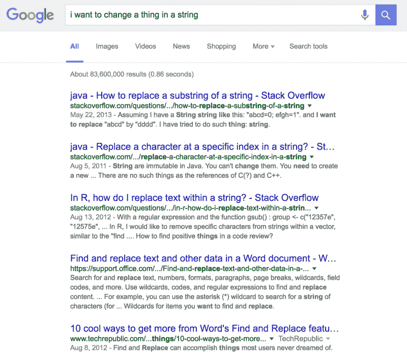
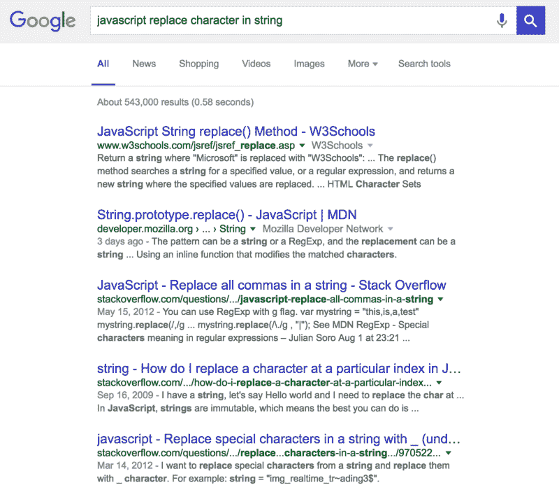

# 阅读，搜索，(不要害怕)问

> 原文：<https://www.freecodecamp.org/news/read-search-dont-be-afraid-to-ask-743a23c411b4/>

贝丝·强

# 阅读，搜索，(不要害怕)问

> “作为工程师和开发人员，我们被支付挫折……同时，我们总是在学校。我们一直在学习。”

> ——卡洛斯·拉佐斯，[code newbie 播客第一集](http://www.codenewbie.org/podcast/ep-1-bootcamps-water-coolers-and-hiring-devs)

编码是一次走向模糊的旅程。

无论你是在设计一个 RESTful API，将一个应用程序扩展到成千上万的用户，或者只是试图用 CSS 正确定位一些东西，总会有你不知道的东西。

下次当你陷入困境，不知道如何前进时，试试自由代码营的“阅读-搜索-提问”方法。顾名思义，您:

1.  **阅读**文档或错误
2.  **搜索**谷歌
3.  **向**寻求帮助——不要害怕请求！

让我们更深入地了解每一个问题。

### 阅读

如果您知道您需要使用某种方法，但是不知道如何实现它，文档是一个很好的起点。如果您不确定您需要什么方法，您通常可以通过在文档中单击来找到解决方案。

如果您遇到错误，请阅读错误！试着弄清楚它想说什么。如果您没有收到错误，但是不知道发生了什么，您可以尝试通过 console.log()方法进行调试。

当我构建我的自由代码营应用程序而没有得到我期望的结果时，我会在控制台记录几乎所有的结果:if 语句、函数返回语句、点击方法和计时方法。

一个有用的工具是你的浏览器控制台。如果您正在使用 CodePen，它还包含一个控制台。

如果你关注任何特定的博客(CSS Tricks 是我经常咨询的一个关于 CSS 的博客)，去看看它是否有文章可以帮助你理解一些概念。

如果你仍然停滞不前，也许是时候求助于谷歌了。

### 搜索

谷歌将很快成为你最好的朋友，如果它还不是的话。但是谷歌有时会变成一个烦人的朋友，你不得不戳戳戳才能得到有用的答案。为了从这份友谊中获得最大的收获，有几件事要记住。

其中之一是，很多时候——尤其是一旦你开始构建应用程序——你不会得到你所需要的答案来神奇地解决你所有的问题。你通常需要将你所学到的东西运用到你目前的情况中。

#### 要具体，要简洁

另一件要记住的事情是如何组织你的搜索，以便你能够有效地找到你的具体问题的解决方案。

例如，试图替换字符串中特定位置的单个字符是许多新程序员都会遇到的问题。为了解决这个问题，你可以谷歌很多东西。

“我想改变字符串中的一个值”会产生无数的结果。

从 substrings 到 R，再到“从 Word 的查找和替换中获取更多信息的 10 种很酷的方法”(作为这次搜索的结果，我最终做了书签，以便以后阅读)。不过，这不是我们要找的。

当谷歌搜索时——尤其是涉及到编程问题时——许多程序员倾向于遵循的惯例是:

> [编程语言][动词][关键词]

让我们在我们的问题上试试。如果我们输入“javascript 替换字符串中的字符”，我们得到如下结果。

这似乎更接近我们要找的东西了！

此时，我将点击前几个条目，看看它们是否有帮助。如果没有，我将尝试解析它们，寻找可能有帮助的额外关键字。

所以，在我们的例子中，我们只想替换一个特定位置的字符，我们不一定需要正则表达式。

第四个搜索结果是“如何在 JavaScript 中替换特定索引处的字符”，所以我点击它，然后发现字符串是不可变的，你不能只改变一个字符！

如果之后我还有问题，我可能会在我的搜索中添加“在某个索引”，并尝试做另一个搜索。

#### 堆栈溢出

栈溢出结果可能会占据你的谷歌搜索的很大一部分。这是一个非常棒的资源，包含了大量编程问题的答案。通常，提问者已经选择了最适合他们的答案，然后这个答案会显示在结果的顶部，并带有一个绿色的复选标记。

不过，我几乎总是会浏览所有已经发布的回答，包括评论。这些有时会有一些有趣的讨论，而其他时候会有人直截了当地说，“这是错误的”或“这是一种糟糕的做法。”

一旦我知道了我的选择和每个选择的利弊，我会努力去实现它们。

### (不要害怕)问

当你在圈子里搜索了一段时间，没有找到任何有用的东西时，可能是时候问一个真正的人了。

真正的人可以以各种形式出现:

*   你的朋友(如果你有编码的朋友)
*   meetup 群组(如果您去 meetup)
*   自由代码营 Gitter 频道和论坛上的营友们
*   你可能加入的任何 Slack 或脸书团体等等

不过，在你问之前，你应该尝试组织你的问题，以优化你和你寻求帮助的人的时间。

“我的 app 坏了，怎么办？”或者“我无法使用这项功能，我该怎么办？”对任何人都没什么帮助。

理解你正在经历的问题。解释你期望你的代码做什么，然后和它实际做的做比较。解释你到目前为止所做的尝试，如果你认为有帮助的话，加入代码片段。(大多数时候，他们会。)

当我刚开始学习这门课程时，我害怕在论坛或聊天室里问问题，原因有二:

一个归结为骄傲:我觉得我应该能够弄清楚为什么我的代码会这样做。(“我是一个聪明能干的人。我要把这件事搞清楚！”)

第二个原因是不安全感。我很紧张，人们不会回应，或者没有人愿意帮助我，或者他们的解释会让我难以理解，或者我不想要求澄清并占用他们一天中更多的时间，或者…[在此插入所有借口]。

我很高兴地说，我能想到的每一个借口都是绝对错误的。自由代码营的社区是由非常友好、有知识和耐心的人组成的。

有一次，当我试图同时理解一个概念和找出一个错误时，有人花了几个小时陪我。他自始至终都很耐心。

从来没有人用高人一等的口气跟我说话，或者认为我愚蠢或无能。我从来没有遇到过有人不回答我的问题，不管它看起来有多简单。

有可能，如果有人在论坛或聊天室回答问题，他们这样做是因为他们想帮助别人！

额外的好处是，有时清楚地阐明你的问题是什么可以让你看到哪里出了问题。有很多次，我问了一个问题，只是为了立即意识到我接下来需要做什么。(然后我感谢那个人，他们回应道，“嗯，我实际上没有做任何事情…”)

### 概括起来

阅读、搜索、提问的方法就是优化你自己的时间和那些能帮助你的人的时间。它鼓励你在咨询他人之前学习并自己找到解决问题的方法。如果你尝试自己做这件事，但是毫无进展，不要害怕寻求帮助！

### 有用的链接:

[陷入困境时如何开始](http://forum.freecodecamp.com/t/how-to-start-when-you-are-stuck/19427/4)

[Mozilla 的 JavaScript 文档](https://developer.mozilla.org/en-US/docs/Web/JavaScript)

[jQuery 的文档](http://api.jquery.com/)

[调试 JavaScript 简介](http://www.w3schools.com/js/js_debugging.asp)

主免费代码营 Gitter 聊天室(还有其他有更具体目的的聊天室，比如获得前端项目的帮助，或者找人配对程序)

[自由代码营的论坛](http://forum.freecodecamp.com/)

除了在线渠道，自由代码营在大多数主要城市都有 [meetups 和脸书团体](http://forum.freecodecamp.com/t/free-code-camp-city-based-local-groups/19574/34)。我和我所在城市的一对夫妇有关系。通过他们，我可以结识新朋友，与他们一起编写代码，并找到可以一起参加其他聚会的人！