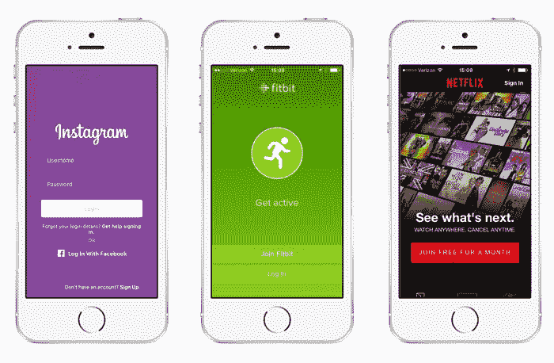
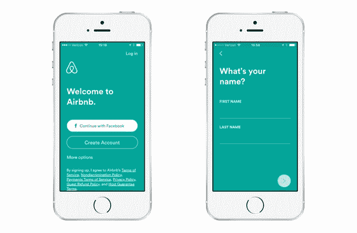
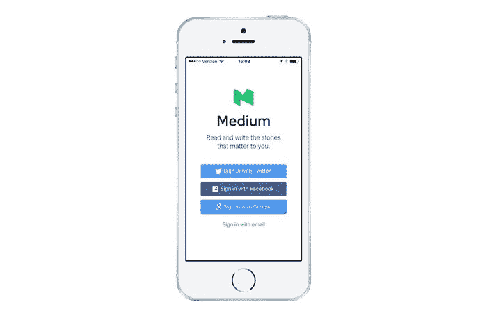
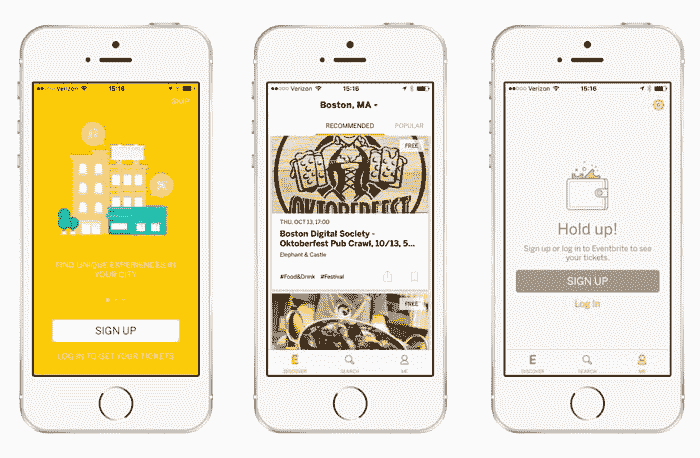
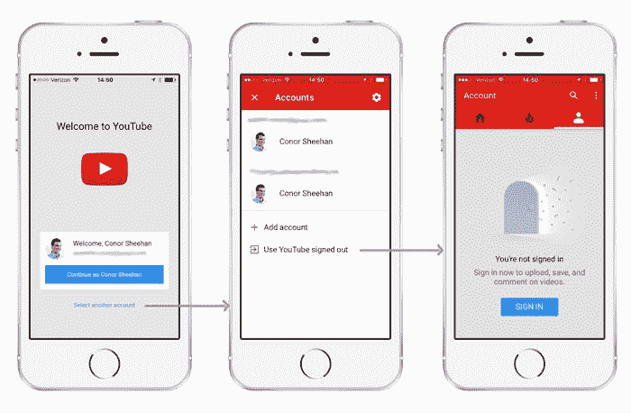

# 别逼我报名了！

> 原文：<https://www.freecodecamp.org/news/stop-making-me-sign-up-9dc9e1ffac4e/>

康纳·希恩

# 别逼我报名了！

安装一个新的应用程序可能会令人兴奋。当你找到一个可能正是你所需要的，打开它就像打开一个新玩具。那么，为什么那么多应用程序坚持让你在那一刻停下来，要求你提供一个账户呢？

通过找到并安装一个应用程序，用户已经表明了对该产品的某种承诺。它在他们的主屏幕上赢得了一席之地。当一个应用程序要求用户注册或登录时，他们在至关重要的第一印象期间增加了一层摩擦。与其迎接用户的是一个账户大门，不如向用户介绍这些功能，并向他们展示诀窍，直到他们的身份有必要建立起来。

谷歌产品总监卢克·乌鲁布莱夫斯基已经讨论过逐步参与的好处。出于好奇，让我们通过 App Store 走一趟，看看 2016 年团队是如何在这里迎接新用户的。它们往往属于以下三类之一:

1.  对匿名用户来说毫无意义的应用
2.  没有明显理由就需要帐户的应用程序
3.  让你在探索后注册的应用程序

### 某些应用依赖于一个帐户

社交媒体应用是围绕你的身份建立的。连接的设备需要一种方法来验证您对数据和设备的访问。订阅服务要求你证明你已经付费了。

### 许多应用程序使用经典的帐户门

虽然注册有时感觉很自然，但大多数应用不需要围绕一个账户。

#### Meetup

如果我想找一个今晚的聚会，我需要创建一个帐户，并设置一系列的首选项，然后才能看到发生了什么。

#### 爱彼迎（美国短租平台）

我首先要做的不是用他们令人敬畏的列表和令人印象深刻的照片来欢迎我，而是创建一个账户或者记住我的密码。

#### 中等

真的吗？你需要我登录才能阅读文章？同样的文章，我可以通过网络阅读没有问题？

### 更好的方法:不需要注册

此外，还有逐渐吸引受众的应用程序。他们中的一些人允许你跳过签字直到以后。有些会让你直接进入应用程序，直到你需要一个帐户。

#### 今晚酒店

我可以看到附近所有最新的酒店优惠信息。我甚至不需要登记就可以预订房间！

#### EventBrite

我所要做的就是确定一个位置，来找出我的领域里将要发生的事情。只有当我想注册一个活动时，它才会询问我的电子邮件地址。

#### 油管（国外视频网站）

YouTube 一开始是骗我的。它们让你看起来需要登录，尤其是如果你已经在 iPhone 上登录了谷歌。但一旦你选择了另一个账户，它会给你一个匿名观看 YouTube 视频的选项。

### 这是一种交换

在设计你的应用时，要记住你的新用户。[五分之一的手机应用只打开一次](https://www.statista.com/statistics/271628/percentage-of-apps-used-once-in-the-us/)。最初的入职体验会给用户留下宝贵的第一印象。当你可以炫耀你产品的价值时，不要浪费时间让它们工作。