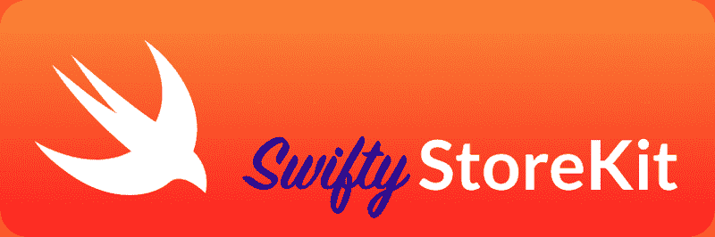
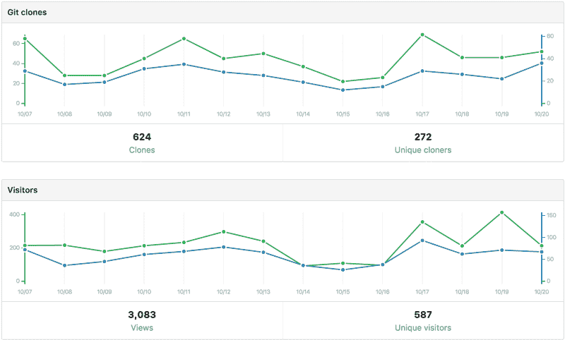
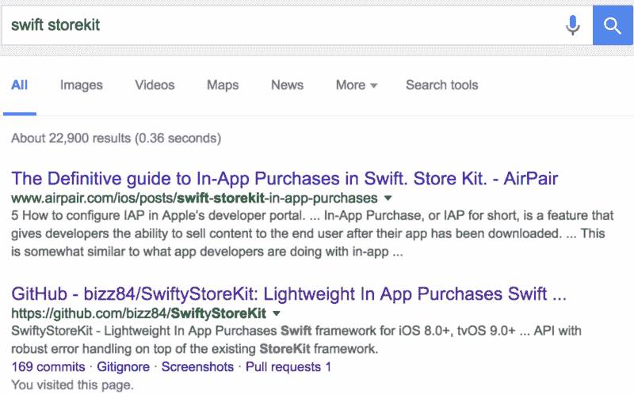

# 我是如何在 GitHub 项目中获得 1000 颗星的，以及在这个过程中我学到了什么

> 原文：<https://www.freecodecamp.org/news/how-i-got-1000-on-my-github-project-654d3d394ca6/>

安德里亚·比佐托

# 我是如何在 GitHub 项目中获得 1000 颗星的，以及在这个过程中我学到了什么

我从 2012 年开始做 iOS 开发者。我开始写开源代码，为了**不再重复发明轮子**和**把我最好的代码**带到项目中。

虽然我早期的一些项目吸引了社区的一些兴趣，但没有一个像 [**SwiftyStoreKit**](https://github.com/bizz84/SwiftyStoreKit) 那样成功。

在我分享使这成为可能的秘方之前，让我说一件事:

> 我希望我的代码对世界产生影响。

> 我希望我的代码能够增强开发者的能力，这样他们就可以专注于创建优秀的应用程序。

> 如果我成功了，所有的错误修复，回答的问题和我付出的时间都是值得的。

开源软件**有杠杆**。我的代码通过多个应用程序到达最终用户，并使开发人员更有效率。

**多少杠杆？**

根据 [Cocoapods Metrics API](http://blog.cocoapods.org/metrics-api/) ， **SwiftyStoreKit** ，[截至 2016 年 10 月 20 日已下载](http://metrics.cocoapods.org/api/v1/pods/SwiftyStoreKit.json) **42302 次**，安装到 **1194 个 app**。

GitHub Traffic page for SwiftyStoreKit (October 20th, 2016)

*作为背景资料，[af networking](https://github.com/AFNetworking/AFNetworking)(iOS 顶级项目之一)[已被下载](http://metrics.cocoapods.org/api/v1/pods/AFNetworking.json)21659973 次，安装到 413742 个应用中。*

不过，吹牛吹够了。？

我的观点是**你**也可以这样做。

*   [**掌控你的游戏**](https://medium.com/@ajithrnayak/stayin-on-top-of-your-game-ios-newsletters-blogs-developers-companies-to-follow-527b859b3bb5#.mml1nu6jc) 。
*   编写自己的代码并开源，或者将[贡献给现有的项目](https://github.com/vsouza/awesome-ios)。
*   作为一名开发人员，你将会成长，你可以真正帮助和造福他人。
*   这样做对你的简历很有帮助。这会让你脱颖而出，让 T2 找到更好的工作和客户。

那么，我是怎么得到所有⭐️⭐️⭐️⭐️⭐️的呢？

### 我的食谱

1.  选择正确的项目
2.  使其易于使用
3.  **尽你所能写最好的自述文件**
4.  在正确的位置分享
5.  ****GitHub 趋势****
6.  ****谷歌搜索****
7.  **保持增长**

**让我们详细看看这几点。**

### **1.选择正确的项目**

**你如何选择？一个好的开始方式是**解决你有**的一个问题。在我的例子中，我需要一个应用内购买(IAP)框架，用于我的一个应用[。](https://itunes.apple.com/app/id930804327)**

**IAP 是一种非常流行的在 App Store 中赚钱的方式。**

**不幸的是，苹果的 [StoreKit](https://developer.apple.com/documentation/storekit) 框架并不是最容易使用的:**

*   **很多原生 API 要学，大多是 Objective-C 时代设计的。**
*   **各种类型的应用内购买。**
*   **安全考虑非常重要。**
*   **测试你的购买流程是否正确是很困难的。**

**迫切需要一个轻量级的 IAP 框架来使事情变得更简单，所以 **SwiftyStoreKit** 是一个合适的项目。**

### **2.使其易于使用**

**虽然我以前尝试过一些其他第三方 IAP 库，但没有一个像我希望的那样简单。**

**当苹果发布 Swift 2 时，我开始构建 SwiftyStoreKit。我确实利用了语言的**闭包**、**枚举**和新的**错误处理特性**来编写一个简洁易用的 API。**

**有了 **SwiftyStoreKit** ，你不再需要**显式**注册一个观察者到支付操作队列。您只需为您的 IAP 调用一个异步方法，并在完成时更新您的应用程序状态和 UI。**

**我借鉴了其他流行的开源项目的思想和代码模式。我对结果很满意。**

### **3.尽你所能写最好的自述**

**您的自述文件是您项目的**登录页面**。你应该在这上面花很多时间。**

**看起来应该**不错！如果你正在构建一个 UI 控件，包含一个动画 gif，截图，甚至是一个原型的链接。 [Swift Messages](https://github.com/SwiftKickMobile/SwiftMessages) 在这方面做得很好。****

**它应该包括徽章，这样你可以快速浏览项目的状态。很多项目都用 [shields.io](http://shields.io/) 。你也应该如此。**

**自述文件应强调:**

*   **什么是**特性集**以及如何通过清晰的**文档化 API** 来使用项目。**
*   ****如何安装** it。注意:尽可能多地支持依赖管理工具，*而不仅仅是 [Cocoapods](https://cocoapods.org/) 。***
*   ****支持的平台**。你猜对了，能猜多少就猜多少。**
*   ****支持的语言**，链接到不同语言版本的适当分支或标签。**
*   **已知问题列表(可选)。这可以作为项目中当前问题的总结。**

**此外，您可以添加一个 FAQ 部分、相关项目和资源的参考、一个学分列表以及 [**许可**](http://choosealicense.com/licenses/) 。**

****非常重要**:如果你的用户提出许多问题要求澄清，你的自述文件不够好。回答问题并相应改进。**

**包含一个示例演示。这有助于其他人使用你的项目。它作为一个参考实现，展示了如何将您的代码集成到一个真实的应用程序中。**

### **4.在正确的地方分享**

**一些 GitHub 用户按照平台或语言维护流行的开源项目列表。我已经提交了**拉请求**以在[牛逼 iOS](https://github.com/vsouza/awesome-ios) 和[牛逼 Swift](https://github.com/matteocrippa/awesome-swift) 上包含**Swift store kit**。**

**不要把自己局限于 GitHub:**

*   **找到聚集开源项目的网站，并将你的提交给他们。**
*   **让您的项目出现在针对您的语言或平台的流行简讯中。**
*   **在社交媒体上与相关开发者和客户分享。一些好的出口是**产品搜索**、**黑客新闻**、**推特**、 **Reddit** 。**

### **5.GitHub 趋势=大量⭐️⭐️⭐️⭐️⭐️**

**如果你进入了 GitHub 趋势列表，你的项目将会大放异彩！**

**对我来说，这是一个惊喜。一位同事告诉我 **SwiftyStoreKit** 在 GitHub 上的 Swift [每周趋势列表](https://github.com/trending/swift?since=weekly)中。从那以后，我开始每天收到多达 50 颗星星！**

**如何进入 **GitHub 趋势**榜单？[看这个](https://blog.cwrichardkim.com/how-to-get-hundreds-of-stars-on-your-github-project-345b065e20a2#.ndsxn9v7g))。**

****注**:合适的项目+很大的知名度=很大的兴趣。**做好跟上时代的准备。****

### **6.谷歌搜索**

**谷歌搜索一直是有机流量的一大来源:**

**

Main referring sites for SwiftyStoreKit** 

**事实上，搜索“Swift StoreKit”和“应用购买中的 Swift”分别显示 **SwiftyStoreKit** 为**第二**和**第四**结果:**

**

Google Search for Swift StoreKit** 

**我没有做任何关键字研究，以提高我的项目的 SEO 排名。一旦流行起来，它就成了热门。**

**尽管如此，如果你计划一个好的搜索引擎优化策略，结果会非常好！**

### **7.保持增长**

**一旦你的项目受欢迎，人们会问很多问题，并打开拉请求。**

**在某个时候，一个单独的贡献者将 **SwiftyStoreKit** 移植到 macOS 上，并添加了收据验证支持。我在这两个领域都没有经验，有人帮助我把项目做得更好，这种感觉太棒了！**

**其他有价值的贡献紧随其后，我发现自己戴着两顶帽子:**主开发者**和**维护者**。**

**成为一名优秀的维护者需要**良好的判断力**:**

*   **仔细评估功能请求。旨在保持 API 的整洁，避免代码膨胀。对于 **SwiftyStoreKit** 来说尤其如此，因为它是一个*轻量级*框架。**
*   **对于任何添加有用功能的 pull 请求，不要害怕请求更改以保持代码的整洁和一致。**
*   **您可以拒绝超出范围的请求，或者现有代码已经包含了这些请求。**
*   **对贡献者要有礼貌。如果你拒绝他们的改变，礼貌地解释原因。不要像莱纳斯·托沃兹那样。？**

### **我学到的东西**

**SwiftyStoreKit 是一个伟大的项目，第一次将我推向了维护者的角色。**

**这迫使我增加了关于应用内购买的知识，尤其是当其他人做出贡献的时候。**

**这段关于管理的引语在这里很合适:**

> **事实上，对于一个开源项目的企业来说，最大的挑战是管理的义务。这种责任主要是与人合作的问题，需要正确管理——特别是如果一个项目获得了足够的知名度。大多数项目没有大到足以让他们的管理成为负担。— [艺术博客](https://www.objc.io/issues/22-scale/artsy/)**

**我并非总能准时回答问题。我希望将来做得更好，并以各种方式改进我的流程:**

*   **像流行的开源项目一样，添加一个贡献文件，概述打开问题和请求的推荐方式。**
*   **添加一个行为准则。**
*   **添加[代码林挺](https://github.com/realm/SwiftLint)。**
*   **添加**单元测试**覆盖，因为我需要**信心**来做出改变。真的，*我早就应该这么做了*。**

**我现在的处境是 **SwiftyStoreKit** 还没有大到难以管理的地步。我希望这个项目蓬勃发展，并欢迎社区的贡献。**

### **信用**

**披露:不久前，我在 Medium 上发现了理查德·金(Richard Kim)的这个精彩故事:**

> **[如何在你的 Github 项目上获得数百颗星星](https://blog.cwrichardkim.com/how-to-get-hundreds-of-stars-on-your-github-project-345b065e20a2#.g8e2vl8hi)**

**这让我了解了是什么让一个开源项目脱颖而出。从那以后，我一直听从他的建议。这真的得到了回报，我要感谢他的洞察力。**

### **结论**

**开源可能是一种非常有益的体验，让你和你的项目一起成长。**

**我已经在不同的公司帮助团队超过 10 年，在此过程中使用了大量的开源软件。**

**编写开源代码是回报我们伟大社区的一个很好的方式，我非常享受这个过程。**

#### **让世界变得更美好，一次一行代码！**

#### **更新 2017–02–25:阅读我对这篇关于[维护不断增长的开源项目](https://medium.com/@biz84/maintaining-a-growing-open-source-project-1d385ca84c5#.legbfq8jl)的文章的跟进。**

**关于我:我是一名自由的 iOS 开发者，在合同工作、开源、兼职项目和博客之间周旋。**

**我是推特上的 [@biz84](https://twitter.com/biz84) 。你也可以看到我的 [GitHub](https://github.com/bizz84) 页面。反馈，推文，搞笑 gif，都欢迎！我的最爱？很多吗？？？。哦，还有香蕉面包。**