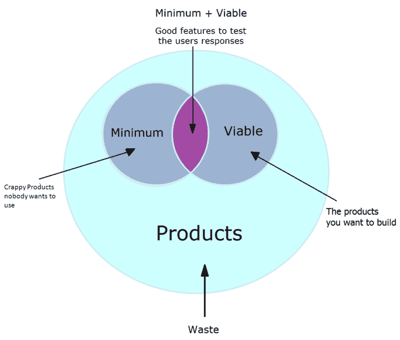
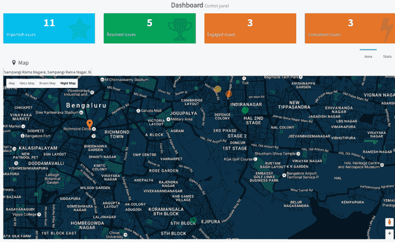

# 如何构建自己的优步 X 应用程序

> 原文：<https://www.freecodecamp.org/news/how-to-build-your-own-uber-for-x-app-33237955e253/>

入选 2016 年 10 月 [Mybridge](https://medium.mybridge.co/) 的[十大节点文章](https://medium.mybridge.co/node-js-top-ten-articles-from-october-fbde1ebe7785#.fnr9w51pr)和[年度十大节点文章(v.2017)](https://medium.mybridge.co/node-js-top-10-articles-of-the-year-v-2017-79df8269d0f3#.f82p1dork)

* * *

> **更新:在我的[科技博客](https://ashwinhariharan.tech/blog/how-to-build-your-own-uber-for-x-app/)上查看最新版本！**
> 这篇文章已经有几年的历史了——由于 JavaScript 快速变化的生态系统，这篇文章已经有点过时了。点击上面的链接获取这篇文章和这个项目的更新版本。

* * *

优步(如果你没听说过的话)是一个方便的应用程序，让你不用四处寻找就能叫到出租车。最重要的是，它解决了出租车司机和出租车寻找者之间存在的需求和供应问题。

如今，有各种各样的创业公司专注于 ***【优步换 X】***应用。人们的想法是，优步为出租车所做的事情，肯定也能解决其他供需问题。

所以在一次黑客马拉松中，我和我的朋友决定开发一个公民警察应用程序。我们认为做一些能在你的朋友有困难的时候帮助他们的东西会很酷！

经过一番思考，我们达成了以下共识:

1.  平民只需按一个按钮，就可以向附近最近的警察求助。它会发出“求救信号”并提醒附近的警察。
2.  附近的任何警察都会立即收到用户的位置，并可以选择接受请求和解决问题。
3.  评级系统
4.  从地点、已解决的犯罪案件等收集的数据。可以在地图上可视化，或者用一些其他很酷的用户界面小部件绘制


在本教程中，我将带你一步一步地了解我们是如何构建它的，这样你就能够构建自己的 ***优步-X*** 应用程序。



开始之前，记住以下几点会有所帮助—

*   本教程将不会关注如何构建应用程序的规模。还是为了表现。它的设计基本上是为了让你在建造它的时候有乐趣，以及你如何能创造出模仿优步的东西。把这想象成建立一个最小可行的产品来展示你的想法或创业，为了一个概念的证明。
*   由于我没有在 Android 或 iPhone 应用上做过太多工作，所以我将构建一个可以在浏览器中工作的程序。

现在，你构建的每个应用都有几个重要的部分:

*   面向客户端的应用程序(您可以在浏览器或手机屏幕上看到)
*   在后端，web 服务器处理来自客户端的请求并路由信息
*   和查询信息的数据库。

在后端，您将使用 MongoDB 作为您的数据库。它更容易学习，并提供了许多处理地理空间信息的查询技术，您的应用程序将需要这些信息。

您将使用 NodeJS 作为后端逻辑。因为前端和后端使用的是同一种语言，所以您不必担心学习新的语言或语法。

在前端，您将使用 HTML5、CSS3、JavaScript 以及 Google Maps 和 Places APIs。

我假设您已经掌握了 JavaScript 的工作知识，并且至少对 NodeJS 和 MongoDB 的工作原理有了理论上的理解。

以下是本教程的内容:

第一部分(你现在正在阅读的内容):

*   MongoDB 模式设计
*   使用 Mongo Shell 查询信息
*   连接数据库和 Node-Express 服务器并编写 RESTful APIs

**第二部分**:

*   使用插座。IO 使 cop 和民用设备能够相互通话
*   使用谷歌地图 API 在地图上显示平民和警察

### 我们开始吧！

开发人员使用 MongoDB 构建应用程序已经有一段时间了。它的学习曲线很浅，其多功能性允许开发人员轻松快速地构建应用程序。

我个人喜欢 MongoDB，因为它允许我快速地为一个想法构建原型，以证明概念。

在开始之前，一定要确保安装了 MongoDB 和 NodeJS。在撰写本文时，MongoDB 的当前版本是 **3.2** 。

### **设计模式**

因为您使用的是 MongoDB，所以您保存在其中的所有内容都是文档的集合。

让我们创建一个名为 *citizensData* 的集合来存储公民信息，另一个名为 *policeData* 的集合来存储警察信息。因此，请打开您的终端，键入 *mongo* 来启动 mongo shell。一旦它打开，您可以通过键入以下命令显示 MongoDB 中的现有数据库:

```
show dbs
```

你需要一个新的数据库来存储你的应用数据。姑且称之为 *myUberApp。*要创建新的数据库，您可以键入:

```
use myUberApp
```

如果数据库不存在， *use* 命令可以创建一个新的数据库。如果是，它会告诉 Mongo 将下面所有的命令应用到这个数据库。

Mongo 将文档存储在*集合*中。收藏就像桌子。要查看现有收藏，请键入:

```
show collections
```


对于警察来说，用户名也可以是徽章 id。您可以添加一个电子邮件地址字段和一个密码字段(不会透露)用于验证目的。

转到此[链接](https://raw.githubusercontent.com/booleanhunter/code-samples/master/blog-posts/how-to-build-your-own-uber-for-x-app/cops.json)，保存与 cop 相关的 JSON 数据集信息。

要从这个 JSON 文件导入数据，请在终端中键入以下内容:

```
mongoimport --db myUberApp --collection policeData --drop --file ./path/to/jsonfile.json
```

现在，在开始查询数据库之前，您需要了解一点 MongoDB(或任何数据库)中的*索引*是如何工作的。

索引是数据或数据结构的一种特殊排列，它允许您非常高效地查询信息。这样，您可以快速检索结果，而不必扫描整个数据库。

例如，假设您在一本书中按照学生姓名的升序存储了学生相关信息，这意味着您在姓名字段上有一个索引。这样，如果你必须获取一个名叫*提利昂*的人的信息，你可以快速找到他的信息，而不必先通过其他学生。

但是如果你按照身高的升序来保存相同的信息，那么用一个人的名字来查询他的信息就会变得很困难。这可能要花很多时间，因为现在学生不是按他们的名字顺序保存的，所以你可能需要扫描和搜索多行。

但是其他种类查询也成为可能。例如，获取身高在 4 到 5 英尺之间的学生的信息。在这种情况下*提利昂的*信息可以被快速检索，因为:


不同的数据库支持不同类型的索引。您可以在这里阅读支持 MongoDB [的索引的完整列表。](https://docs.mongodb.com/v3.2/indexes/)

所以，现在如果你输入这个命令:

```
 db.policeData.find().pretty()
```

这将返回所有存在于 *policeData* 集合中的文档——这是警察的完整列表。(*漂亮的*功能使输出更容易阅读)。

如果你想获取某个警察的信息，他的用户 Id 是 *01* ，你可以输入`db.policeData.find({userId: “01”}).pretty()`

```
{
    "_id" : ObjectId("57e75af5eb1b8edc94406943"),
    "userId" : "01",
    "displayName" : "Cop 1",
    "phone" : "01",
    "email" : "cop01@gmail.com",
    "earnedRatings" : 21,
    "totalRatings" : 25,
    "location" : {
        "type" : "Point",
        "address" : "Kalyan Nagar, Bengaluru, Karnataka 560043, India",
        "coordinates" : [
            77.63997110000003,
            13.0280047
        ]
    }
}
```

#### **使用 MongoDB 地理空间索引**

地理空间索引允许您在文档中存储 [GeoJSON](http://geojson.org/) 对象。

GeoJSON 对象可以是不同的[类型](https://docs.mongodb.com/manual/reference/geojson/#overview)，如*点、线串*和*多边形。*

如果你观察你的*的输出。find()* 命令，您会注意到每个*位置*都是一个对象，其中有*类型*字段和*坐标*字段。这一点很重要，因为如果您将 GeoJSON 对象存储为*点*类型，您可以使用 [$near](https://docs.mongodb.com/manual/reference/operator/query/near/) 命令来查询给定经度和纬度的特定邻近范围内的点。

要使用它，您需要在*位置*字段上创建一个[*2d 球面*](https://docs.mongodb.com/v3.2/core/2dsphere/) 索引(这是一个地理空间索引)，并在其中包含一个*类型*字段。2d sphere*索引支持在类地球球体上计算几何图形的查询。这包括 MongoDB 地理空间查询:包含、相交和邻近查询。*

因此，在您的 mongo shell 中键入以下内容:

```
db.policeData.createIndex({"location": "2dsphere"})
```

现在，要从离给定的一对坐标最近到最远的地方获取文档，您需要发出以下语法的命令:

```
db.<collectionName>.find({
    <fieldName>: {
        $near: {
            $geometry: {
                type: "Point",
                coordinates: [<longitude>, <latitude>]
            },
            $minDistance: <distance in metres>,
            $maxDistance: <distance in metres>
        }
    }
}).pretty()
```

$minDistance 和$maxDistance 是可选字段。现在，要获取位于从纬度 12.9718915 和经度 77.6415449999997*到*2 公里范围内的所有警察，请运行以下命令:**

```
*`db.policeData.find({
    location: {
        $near: {
            $geometry: {
                type: "Point",
                coordinates: [77.64115449999997, 12.9718915]
            },
            $maxDistance: 2000
        }
    }
}).pretty()`*
```

*就这样—您将在输出中找到返回的文档列表！*

*完美！现在让我们试着用 web 服务器做同样的事情。下载这个 [package.json](https://github.com/booleanhunter/code-samples/blob/master/blog-posts/how-to-build-your-own-uber-for-x-app/package.json) 文件并保存在你的项目文件夹的根目录下(确保你将其命名为 *package.json* ，然后在你的终端中， *cd* 到包含该文件的目录下并运行*

```
*`sudo npm install`*
```

*关于您将要使用的一些软件包的简要说明:*

*   *[Express](https://expressjs.com/) 是 NodeJS 的 web 框架。它的生态系统中有许多 API、实用程序和中间件来帮助你构建应用程序。*
*   *[body-parser](https://github.com/expressjs/body-parser) 在您的处理程序之前解析中间件中的传入请求体，可在 *req.body* 属性下获得。您需要它来处理 POST 请求。*
*   *[下划线](http://underscorejs.org/)让编写 JavaScript 变得更简单。如果您愿意，可以随意使用另一个库。*
*   *[socket.io](http://socket.io) 允许您在节点应用程序中使用 web 套接字。*
*   *[mongodb](https://www.npmjs.com/package/mongodb) 是 mongodb 的官方 NodeJS 驱动。它帮助您的节点应用程序与您的数据库对话。*

*package.json 文件还包含其他模块。在构建一个完整的应用程序时，您将需要它们，但是我将重点介绍如何在您的 express 应用程序中使用 *mongodb* 驱动程序来执行查询。以下是其他一些模块的功能:*

*   *[async](https://www.npmjs.com/package/async) 是一个在 NodeJS 中处理异步代码的实用程序。这有助于你避免回调地狱。*
*   *[debug](https://www.npmjs.com/package/debug) 是一个调试库。这个方便的工具有助于调试你的程序，而不需要使用难看的 *console.log* 语句输出。*
*   *[redis](https://www.npmjs.com/package/redis) 类似于 *mongodb* 驱动。它让 NodeJS 应用程序与 Redis 数据库对话。*
*   *[connect-redis](https://www.npmjs.com/package/connect-redis) 是一个使用 redis 管理会话的会话存储。当你决定拥有用户帐户时，你将需要它。*

*在你写代码之前，先组织一下会有所帮助。现在，您可以使用两个文件:*

*   *用于编写 API 端点的文件*
*   *使用数据库驱动程序进行数据库相关操作的文件。路由处理器将决定从数据库文件中调用哪个函数。一旦执行了查询，在回调函数的帮助下，结果将返回给路由处理器。*

*让我们看看当您编写代码时是什么样子的:*

```
*`var http = require("http");
var express = require("express");
var consolidate = require("consolidate");//1
var _ = require("underscore");
var bodyParser = require('body-parser');

var routes = require('./routes'); //File that contains our endpoints
var mongoClient = require("mongodb").MongoClient;

var app = express();
app.use(bodyParser.urlencoded({
   extended: true,
}));

app.use(bodyParser.json({limit: '5mb'}));

app.set('views', 'views'); //Set the folder-name from where you serve the html page. 
app.use(express.static('./public')); //setting the folder name (public) where all the static files like css, js, images etc are made available

app.set('view engine','html');
app.engine('html',consolidate.underscore);
var portNumber = 8000; //for locahost:8000

http.createServer(app).listen(portNumber, function(){ //creating the server which is listening to the port number:8000, and calls a function within in which calls the initialize(app) function in the router module
	console.log('Server listening at port '+ portNumber);

	var url = 'mongodb://localhost:27017/myUberApp';
	mongoClient.connect(url, function(err, db) { //a connection with the mongodb is established here.
		console.log("Connected to Database");
		routes.initialize(app, db); //function defined in routes.js which is exported to be accessed by other modules
	});
});

/* 1\. Not all the template engines work uniformly with express, hence this library in js, (consolidate), is used to make the template engines work uniformly. Altough it doesn't have any 
modules of its own and any template engine to be used should be seprately installed!*/`* 
```

*在这个例子中，您从 *mongodb* 模块中创建了一个 *MongoClient* 对象的新实例。一旦 web 服务器启动，您就可以使用由您的 *MongoClient* 实例公开的 *connect* 函数连接到您的 MongoDB 数据库。在初始化连接之后，它在回调中返回一个 *Db* 实例。*

*现在您可以将 *app* 和 *db* 实例传递给您的 *routes.js* 文件的 *initialize* 函数。*

*接下来，您需要创建一个名为 *routes.js* 的新文件，并添加以下代码:*

```
*`function initialize(app, db) { 
    //A GET request to /cops should return back the nearest cops in the vicinity.
    app.get('/cops', function(req, res){
    /*extract the latitude and longitude info from the request. Then, fetch the nearest cops using MongoDB's geospatial queries and return it back to the client.
    */
    });
}
exports.initialize = initialize;`*
```

*为此，您必须在请求中将坐标作为查询字符串传递。您还将在另一个文件中编写数据库操作。因此，继续创建一个新文件 *db-operations.js，*并编写如下内容:*

```
*`function fetchNearestCops(db, coordinates, callback) {
    db.collection('policeData').createIndex({
        "location": "2dsphere"
    }, function() {
        db.collection("policeData").find({
            location: {
                $near: {
                    $geometry: {
                        type: "Point",
                        coordinates: coordinates
                    },
                    $maxDistance: 2000
                }
            }
        }).toArray(function(err, results) {
            if(err) {
                console.log(err)
            }else {
                callback(results);
            }
        });
    });
}
exports.fetchNearestCops = fetchNearestCops;`*
```

*这个函数接受三个参数:一个 *db* 的实例，一个包含坐标的数组，顺序为[ <经度>，<纬度> ]，以及一个回调函数，它将查询结果返回给这个回调函数。*

**createIndex* 确保在指定字段上创建一个索引(如果它不存在的话),所以如果您在查询之前已经创建了一个索引，那么您可能希望跳过这一步。*

*现在，剩下要做的就是在处理程序中调用这个函数。因此，将您的 *routes.js* 代码修改为:*

```
*`var dbOperations = require('./db-operations');
function initialize(app, db) {
    // '/cops?lat=12.9718915&&lng=77.64115449999997'
    app.get('/cops', function(req, res){
        //Convert the query strings into Numbers
        var latitude = Number(req.query.lat);
        var longitude = Number(req.query.lng);
        dbOperations.fetchNearestCops(db, [longitude,latitude], function(results){
        //return the results back to the client in the form of JSON
            res.json({
                cops: results
            });
        });  
    });
}
exports.initialize = initialize;`*
```

*就是这样！奔跑*

```
*`node app.js`* 
```

*然后打开浏览器，点击 [http://localhost:8000/cops？lat = 12.9718915&LNG = 77.64115449999997](http://localhost:8000/cops?lat=12.9718915&&lng=77.64115449999997)*

*根据您传递的查询字符串，您应该得到一个包含空数组的 JSON 响应或者一个包含 cop 数据的数组！*

*这是第 1 部分的结尾。在第二部中，你将更上一层楼，尝试向附近的警察发出求救信号。然后，您将了解警察如何使用 socket.io 对信号做出回应。您还将了解如何在地图上显示市民的位置。*

*同时，一定要看看 GitHub 上的[源代码](https://github.com/booleanhunter/how-to-build-your-own-uber-for-x-app)！*

**

*如果你喜欢这篇文章，请考虑在 Patreon 上支持我。*

 *[成为赞助人！](https://www.patreon.com/bePatron?u=20804433)*