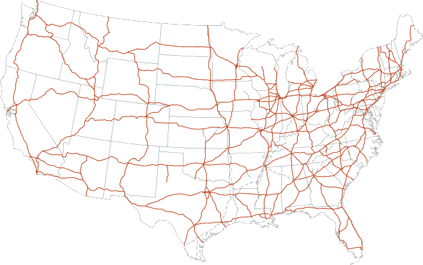
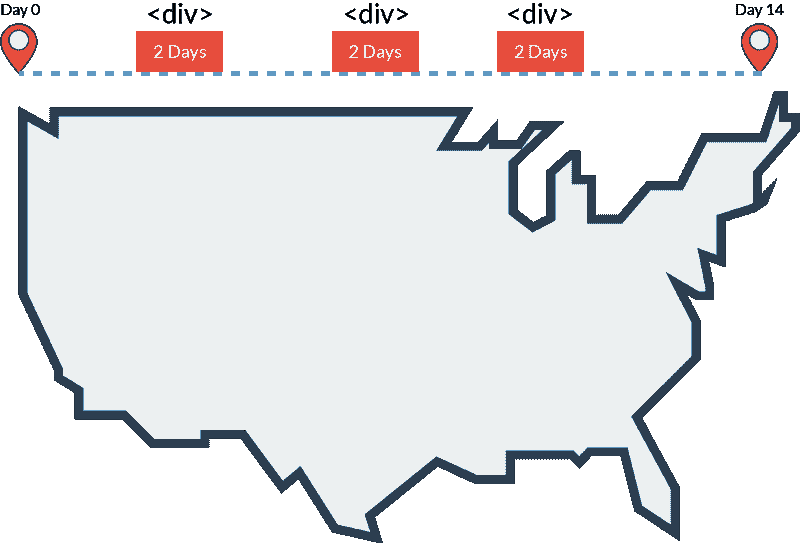
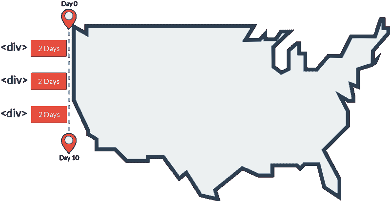
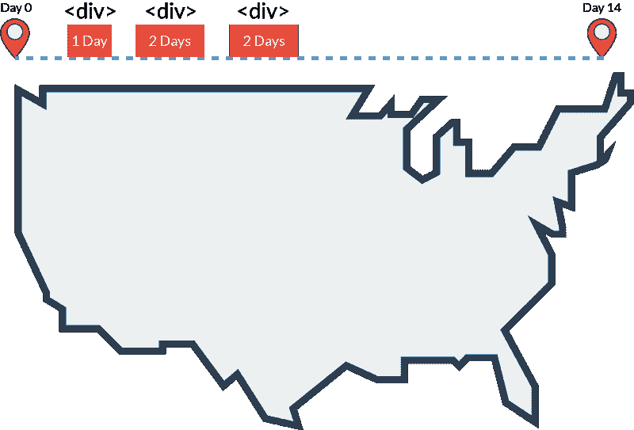
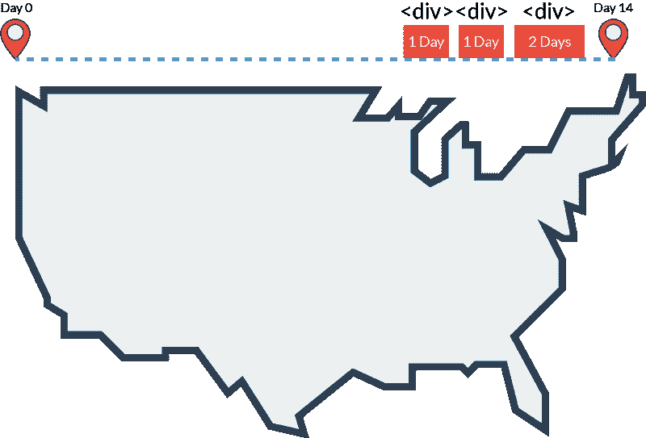
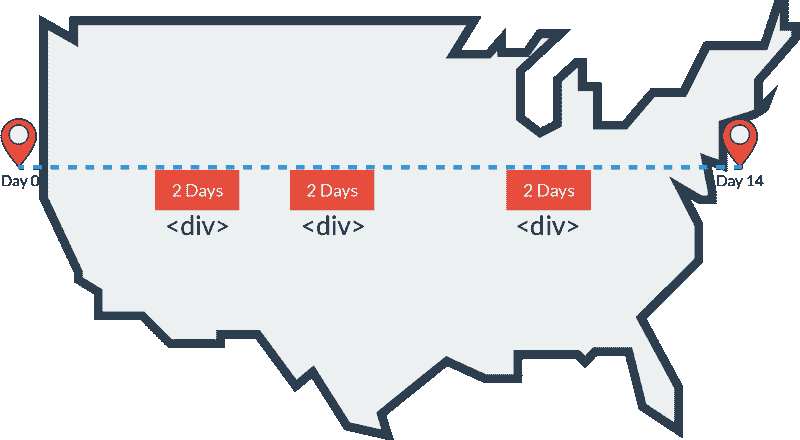
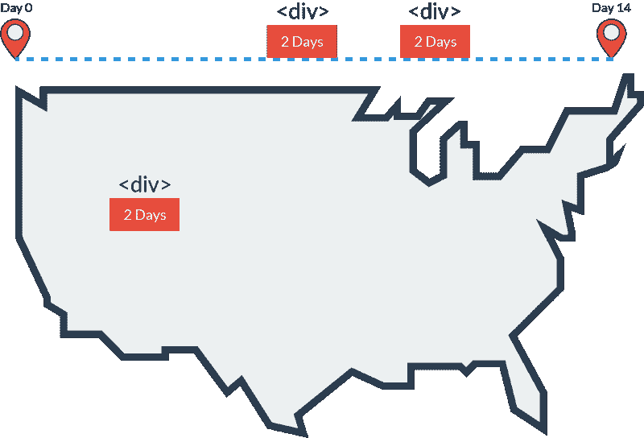

# CSS Flexbox 由全国公路旅行解释

> 原文：<https://www.freecodecamp.org/news/css-flexbox-explained-by-road-tripping-across-the-country-1217b69c390e/>

凯文·科诺年科

# CSS Flexbox 由全国公路旅行解释

#### 如果你曾经长途旅行过，那么你可以理解 CSS Flexbox！

流行的 Flexbox 模型试图取代被称为 CSS " [floats](https://medium.freecodecamp.com/css-floats-explained-by-riding-an-escalator-57fa55232333) "的巨大痛苦。不幸的是，它也给 CSS 引入了另一个全新的系统。你以为已经够多了！

实际上，Flexbox 面向网格的特性比不断地改变“浮点”和“块/内联块”值更有意义。

已经有一些好的资源了，比如 [Flexbox Tower Defense](http://www.flexboxdefense.com/) 和这个[更多技术指南](https://css-tricks.com/snippets/css/a-guide-to-flexbox/)。

在本文中，我将通过我最喜欢的度假方式之一来解释 Flexbox 系统…公路旅行！

没错——在这个类比中，我们将使用整个美国。

美国实际上有一个横跨东西南北的面向网格的州际公路系统。

虽然这张地图在地理上很准确，但很难理解。让我们再试一次。

[https://betterexplained.com/articles/highway-math/](https://betterexplained.com/articles/highway-math/)

在这个场景中，**你必须主要沿着一条单向路径**行进。

例如，您可以选择从西雅图到波士顿的路线，该路线只包含从西向东的路线。或者，你可以选择从西雅图到圣地亚哥的路线，这条路线只包括从北到南。

由于默认位置是左上角，我们将从西雅图开始。你将有机会在你的公路旅行的最后增加一次旅行！这很重要，因为它模仿了容器中的

的流程。

让我们上路吧！

### 灵活方向:你旅行的方向

Flex-direction 用" display:flex；确定容器

中元素的方向。默认值为“row”，表示从左到右。没什么好惊讶的。

假设你从西雅图出发，去波士顿旅行。那次旅行在 HTML 中可能是这样的:

这是假设你会在黄石公园、拉什莫尔山和芝加哥停留。这里是一个时间表视图，假设你在每个地点停留 2 天。

如果您使用“flex-direction:column；”？这意味着你的

将从上到下对齐。现在，你要从西雅图去圣地亚哥。沿途可能会停靠波特兰、旧金山和洛杉矶。

### justify-content:你如何在旅途中安排你的停留

好的，让我们回到西雅图到波士顿的旅程。有了 Flexbox，我们可以决定我们的孩子如何沿着容器的宽度展开。所以，如果你是在公路旅行，你可能不一定要均匀地分布你的站点。你可能会更频繁地在开始或结束时停下来。

justify-content 的默认值是" *flex-start* "，这意味着您的< div >从最左侧展开。这类似于一开始就选择在公路旅行中做所有的停留。这将包括冰川国家公园、黄石公园和拉什莫尔山。

在地图上:

好吧，这确实有点不现实。你可能不想从南达科他州开车 20 个小时直奔波士顿。当所有的<分区>都紧靠在集装箱的右侧时，也可以说“*挠性端*”也是如此。这将包括在克里夫兰市、尼亚加拉瀑布和 MLB 名人堂等地方的停留。

在地图上:

另一个例子是“*居中*”，其中的<分区>与容器<分区>的中间对齐。那就意味着要去参观拉什莫尔山，明尼苏达州和芝加哥的美国购物中心。

### align-items:你想走哪条高速公路穿越这个国家？

好的，到目前为止，我们主要讨论了穿越全国的北线。用 HTML 术语来说，这意味着我们只是沿着

的顶部前进。但是，Flexbox 的一个神奇特性是，我们可以轻松地移动到的中间或底部，而无需任何 CSS 欺骗。

align-items 属性默认为“flex-start”，但是如果我们将其更改为“ *center* ”，我们的< div >将垂直对齐容器的中心。这有点像从旧金山开始你的公路旅行，前往拉斯维加斯，然后丹佛，然后圣路易斯，最后在华盛顿特区结束

这是地图:

并且，在 HTML 中:

如果您想将 align-items 的值设置为" *flex-end* "，那么您的< div >将与容器的底部对齐。你将选择穿越美国的南方路线，并在塞多纳、奥斯汀和新奥尔良等地停留，最后到达杰克逊维尔。

### 自我调整:在不同的公路路线上有一个停靠点

无论 align-items 属性如何，您都可以将“align-self”应用到单个子

以使它们在容器内垂直移动。所以如果你要从西雅图去波士顿，你可以在美国中部的拉斯维加斯停留一下。然后你可以继续到拉什莫尔山或其他任何正常水平流动的地方。

### 顺序:按照特定的顺序停车

到目前为止，每一站都与 HTML 中元素的顺序相对应。换句话说，如果拉什莫尔山站在 HTML 中被指定为第三站，这意味着它将是旅途中的第三站。

“order”属性是一个数值，它允许我们改变 HTML 元素的顺序。如果没有 Flexbox，我们将需要使用一系列令人困惑的 floats，或者仅仅改变 HTML。

有了“秩序”，我们可以在公路旅行中掉头，去一个不在通往终点途中的地方。在现实生活中你会这样做吗？除非你在车里多享受 15 个小时！

假设我们去北方旅行，从西雅图到波士顿。这又是那个 HTML。

但是，从西雅图出发后，我们想先去南达科他州参加世界上最大的广场舞节。我们将使用“order”属性来确保对拉什莫尔山的访问紧接在西雅图之后。

Order 默认为 0，因此我们可能希望给 seattleVisit 赋值-2，给 mountRushmoreVisit 赋值-1，以确保它排在第二位。那么其余的元素将遵循正常的流程。

注意——这是一个严格的时间轴视图，不像其他地图那样使用地理顺序。

### 结论

该做个小测验了！以下是一些 HTML 格式的示例目的地。

但是，如果下面是你计划的路线 CSS 需要看起来像什么？

*   从旧金山开始
*   第二站:拉斯维加斯
*   第三站:拉什莫尔山
*   第四站:原路返回丹佛
*   最后一路开到华盛顿特区

答案是:

这背后的原因是:

*   5 个项目中有 4 个沿着我们的中心路线，因此我们将项目“对齐”到*中心。*
*   从东西方的角度来看，这三站一般都在美国中部，所以我们也“调整-内容*”*到*中心*。
*   拉什莫尔山在北线，所以我们在那条线上使用*align-self*
。
*   CSS 属性 *order* 是我们必须返回丹佛的原因，也是为什么我们的实际旅行没有遵循 HTML 中的 children < div >的顺序。顺序允许我们改变< div > s 的顺序。在这种情况下，我们将丹佛移动到倒数第二站，所以我们必须*给*一个大于 0，但小于最后一个< div >的顺序，这样我们仍然在华盛顿结束

如果你喜欢这篇文章，你可能也会喜欢我对挑战 CSS 和 JavaScript 主题的其他解释，比如定位、模型-视图-控制器和回调。

如果你认为这可能会帮助和你处境相同的人，那就给它一颗“心”吧！