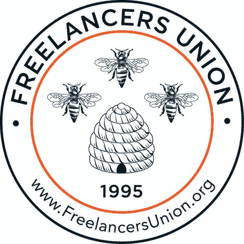
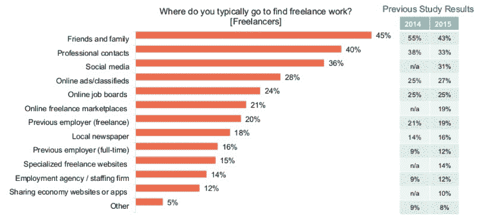
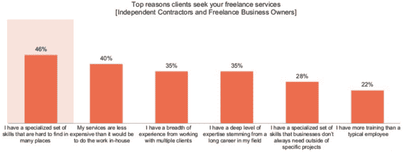

# 6000 名自由职业者谈论金钱、幸福和他们对未来的希望

> 原文：<https://www.freecodecamp.org/news/6-000-freelancers-talk-about-money-happiness-and-their-hopes-for-the-future-ec36cfc81bb9/>

超过 6000 名美国自由职业者参与了一项新的深入调查。我从数据中挖掘出最有趣的见解，描绘了一幅乐观的专业人士掌控自己命运的画面。

这可能部分是因为赞助这项研究的组织——自由职业者联盟和自由职业者市场 up work——在让自由职业看起来不错方面有既得利益。所以对这些数字要有所保留。

Giant bees flying in formation near their tiny house.

### 自由职业者现在占美国劳动力的三分之一。

你没看错。我跟美国劳工统计局复核了这个数字，确实是准确的。

让我们把过去 12 个月里从事自由职业的 5500 万人按照他们从事的工作类型进行分类:

*   35%是独立承包商。他们可能为一家公司工作——比如优步——但他们是以合同身份工作的，从技术上讲，他们不是雇员。
*   28%是多元化工作者，他们既做全职工作，也做兼职来赚取额外的钱，比如拍摄婚礼。
*   25%是**兼职**。他们全职工作，也在工作之外承担使用相同技能的额外项目。想想一个全职在产品公司工作的设计师，然后在周末为朋友做客户工作。
*   7%是临时工，他们通常通过职业介绍所从事短期工作。
*   7%的人是自由职业者。根据他们的专业水平、声誉和销售技巧，他们可能比全职员工挣得更多。

自由职业者往往比其他劳动力略年轻，但在人口统计学上却是相似的。他们拥有相同的教育背景——40%的人至少拥有学士学位——并且男女比例相同。

### 自由职业者每年创造 1 万亿美元的经济活动。

一半的自由职业者甚至说，“没有多少钱可以让他们接受传统的工作，不再做自由职业者。”

全职自由职业者平均每周工作 36 小时。这比普通美国工人每周 47 小时的工作时间要少得多。

79%的人认为自由职业比传统工作更好。其中 63%的人是自由职业者，因为他们想要——比两年前的 53%有所上升。

一半以上离开全职工作的自由职业者现在比以前赚得更多。不到三分之一的人在开始从事自由职业时接受了降薪。

大多数自由职业者通过自己的人际网络找到工作。

The top methods of finding clients are through friends and family, professional contacts, and their existing social media presence.

几乎一半的自由职业者在过去的一年里看到了需求的增加，只有 9%的人看到了需求的减少。因此，去年有一半的自由职业者提高了工资，他们中的大多数人计划在来年再次提高工资。

以下是他们自己报告的收费如此之高的原因:

自由职业者对未来持乐观态度。他们中的大多数人认为，自由职业者作为一种职业的观念正在改善。绝大多数人觉得他们最好的机会就在眼前。

### 自由职业本身就是一整套技能

我做过自由网络开发者。实际上做工作是容易的部分。

真正的挑战在于找到合理的客户，说服他们你是一个合理的选择，然后说服他们与你签订合理的合同。

如果你想成为一名成功的自由职业者，仅仅擅长自己的工作是不够的。你还需要成为一名优秀的自由职业者。

每个人——尤其是自由职业者——都应该学会的一项技能是如何更好地说服别人。

我读过很多关于发展销售技巧的书，其中大部分都是激励性的，而不是实用性的。

到目前为止，我读过的关于这个主题的研究得最好、最具可操作性的书是丹尼尔·平克的《出售是人》:

[**推销是人之常情:感动他人的惊人真相**](http://amzn.to/2dP31PB)
[*全新看待销售的艺术和科学。* amzn.to](http://amzn.to/2dP31PB)

你可能还会喜欢自由职业者秀，这是一个由自由开发者主持的长期播客。他们讨论了广泛的话题，比如这一集，他们讨论了当项目的某些方面超出你的控制范围时，如何避免同意最后期限。

如果你有时间并且好奇，2016 年自由职业者调查的完整结果在[这里](https://www.upwork.com/i/freelancing-in-america/2016/)。

我只写编程和技术。如果你在推特上关注我，我不会浪费你的时间。？