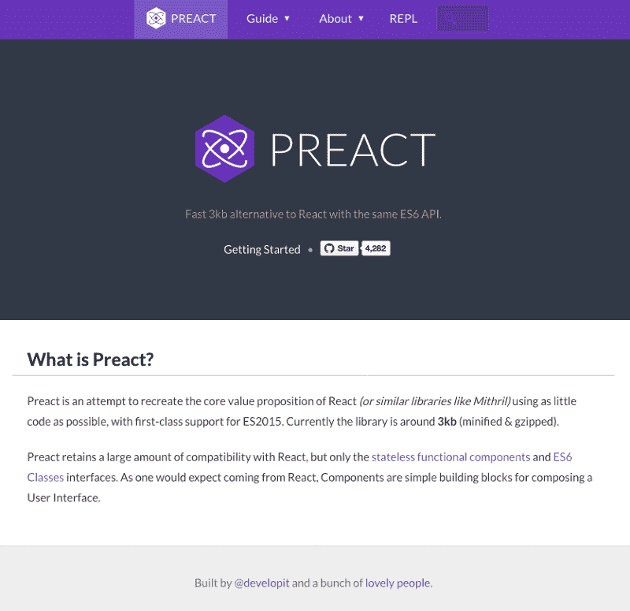
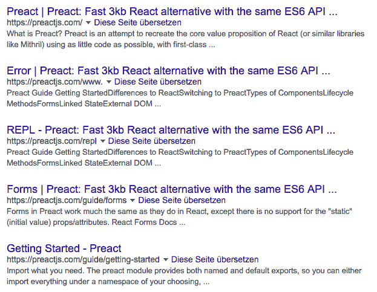
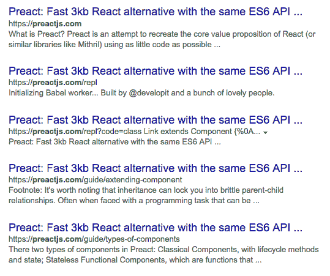
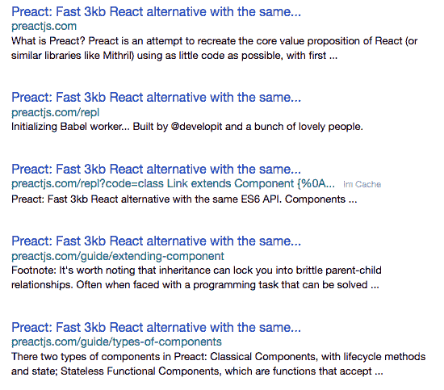
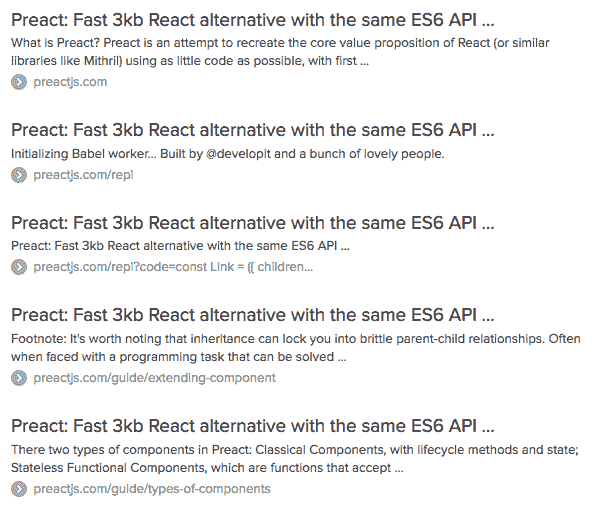
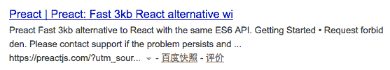

# SEO vs. React:网络爬虫比你想象的要聪明

> 原文：<https://www.freecodecamp.org/news/seo-vs-react-is-it-neccessary-to-render-react-pages-in-the-backend-74ce5015c0c9/>

帕特里克·洪德

# SEO vs. React:网络爬虫比你想象的要聪明


许多人仍然担心，如果你使用 React、Angular 或 Ember 等工具建立网站，会损害你在搜索引擎中的排名。

这种想法大概是这样的:搜索引擎使用的网络爬虫无法正确抓取页面，除非它完全呈现在用户的浏览器中。相反，他们只会看到从后端提交的 HTML 代码。

如果 HTML 代码只包含几个 meta 标签和 script 标签，搜索引擎会认为你的页面基本上是空白的，排名很低。

我经常看到搜索引擎优化(SEO)顾问建议您在后端呈现您的页面，这样网络爬虫就可以看到许多漂亮的 HTML 代码，然后它们可以索引。

对我来说，这个建议似乎不合理也不现实。现在是 2016 年。用户希望页面是动态的，并为他们提供一个漂亮的用户体验。他们不想每次点击时都要等待新的 HTML 页面加载。

那么“客户端渲染伤害你的页面排名”这句话还成立吗？

### 做研究


首先，声明:我绝不是 SEO 专家。但是我确实对这个话题做了一些研究，以下是我的发现。

这是 2015 年 10 月谷歌在其网站管理员博客上发布的[公告](https://webmasters.googleblog.com/2015/10/deprecating-our-ajax-crawling-scheme.html):

> 今天，只要你不阻止 Googlebot 抓取你的 JavaScript 或 CSS 文件，我们通常能够像现代浏览器一样呈现和理解你的网页。为了反映这一改进，我们最近[更新了我们的技术网站管理员指南](http://googlewebmastercentral.blogspot.com/2014/10/updating-our-technical-webmaster.html)，建议禁止 Googlebot 抓取你网站的 CSS 或 JS 文件。

这是 2015 年 5 月的一篇搜索引擎文章:

> 我们进行了一系列测试，验证了 Google 能够通过多种实现来执行和索引 JavaScript。我们还确认 Google 能够呈现整个页面并读取 DOM，从而索引动态生成的内容。

> DOM 中的 SEO 信号(页面标题、元描述、规范标签、元机器人标签等。)都受到尊重。动态插入 DOM 的内容也是可抓取和可索引的。此外，在某些情况下，DOM 信号甚至可能优先于 HTML 源代码中的矛盾语句。这将需要更多的工作，但这是我们的几个测试的情况。

这两个来源表明，使用客户端呈现的布局确实是安全的。

### Preactjs.com 测试

我最近在推特上抱怨搜索引擎优化顾问对我心爱的 React 吹毛求疵。准确地说，我正在迁移到 [Preact](http://www.preactjs.com/) 的过程中，这是脸书 react 的轻量级替代方案。我从 Preact 的开发者之一[杰森·米勒](https://twitter.com/_developit)那里得到了这样的回复:

除了我上面引用的来自搜索引擎之地的博客文章，Jason 在推特上发布了一个链接，链接到 Google 对 [Preact 主页](http://www.preactjs.com)的搜索，如下所示:



这个页面完全是使用 Preact 在客户端呈现的，看看它的源代码就知道了:

```
<!DOCTYPE html><html><head>
```

```
<meta charset="utf-8">
```

```
<title>Preact: Fast 3kb React alternative with the same ES6 API. Components & Virtual DOM.</title>
```

```
<meta name="viewport" content="width=device-width,initial-scale=1,maximum-scale=1,minimal-ui">
```

```
<meta name="mobile-web-app-capable" content="yes">
```

```
<meta name="apple-mobile-web-app-capable" content="yes">
```

```
<meta name="format-detection" content="telephone=no">
```

```
<meta name="theme-color" content="#673AB8">
```

```
<link rel="manifest" href="/manifest.json">
```

```
<link rel="icon" type="image/png" href="/assets/app-icon-192.png" sizes="192x192">
```

```
<script>(function(url){window['_boostrap_'+url]=fetch(url);})('/content'+location.pathname.replace(/^\/(repl)?\/?$/, '/index')+'.md');</script>
```

```
<link rel="shortcut icon" href="/favicon.ico">
```

```
<link href="/style.6bae35e4ff9d687cb418.css" rel="stylesheet">
```

```
</head><body>
```

```
<script>(function(i,s,o,g,r,a,m){i['GoogleAnalyticsObject']=r;i[r]=i[r]||function(){(i[r].q=i[r].q||[]).push(arguments)},i[r].l=1*new Date();a=s.createElement(o),m=s.getElementsByTagName(o)[0];a.async=1;a.src=g;m.parentNode.insertBefore(a,m)})(window,document,'script','//www.google-analytics.com/analytics.js','ga');ga('create', 'UA-6031694-20', 'auto');ga('send', 'pageview');</script>
```

```
<script type="text/javascript" src="/bundle.a0afd09fd48712ed0f26.js"></script>
```

```
</body></html>
```

如果 Googlebot 无法读取 Preact 呈现的 HTML 代码，它不会显示比 meta 标签更多的内容。

然而，当搜索 *site:preactjs.com* 时，谷歌搜索结果是这样的:



2016 年 3 月[安德鲁·法默](https://twitter.com/ahfarmer)的另一篇[文章](http://andrewhfarmer.com/react-seo/)警告说，除了谷歌之外，其他搜索引擎缺乏对 JavaScript 的支持:

> 在我的研究中，我找不到任何证据表明雅虎、必应或百度在其爬虫中支持 JavaScript。如果这些搜索引擎上的 SEO 对您很重要，您将需要使用服务器端呈现，我将在以后的文章中讨论这一点。

所以我决定用其他搜索引擎来试试 Jason 的测试:

### ✅ Bing

安德鲁关于冰的警告似乎是无足轻重的。以下是搜索 *site:preactjs.com* 时的 [Bing 结果](http://www.bing.com/search?q=site%3Apreactjs.com):



### ✅ Yahoo

以及搜索*网站时的[雅虎结果](https://de.search.yahoo.com/search?p=site%3Apreactjs.com&fr=yfp-t-911):preact js . com*:



### Duck Duck 走

以及搜索*时的[鸭鸭围棋结果](https://duckduckgo.com/?q=site%3Apreactjs.com&t=h_&ia=web)网址:preactjs.com* :



### ⚠️百度

中国搜索引擎百度确实与 preactjs.com 有矛盾。以下是[搜索*的结果*](http://www.baidu.com/s?ie=utf-8&f=8&rsv_bp=0&rsv_idx=1&tn=baidu&wd=site%3Apreactjs.com&rsv_pq=95cb9d6800010ec6&rsv_t=6911YYLRspihOnU5UaDpw8Yo%2FPGDwlfONvdplHywgiMlqY198%2BLvxU6yzwI&rqlang=cn&rsv_enter=1&rsv_sug3=17&rsv_sug2=0&inputT=37643&rsv_sug4=37643)网址:preactjs.com :



因此，除非在本质上只针对中国的搜索引擎中排名靠前是你的首要任务，否则只要你遵循一些基本规则(引自 Andrew Farmer 的博客文章)，使用 JavaScript 在客户端呈现你的网页没有任何问题:

*   在做任何异步的事情之前呈现你的组件。
*   测试你的每一个页面，用谷歌的抓取工具来确保谷歌机器人能找到你的内容

感谢阅读！

### 2016 年 10 月 25 日更新

安德鲁·英格拉姆做了和我一样的测试，却得出了不同的结论。

引用安德鲁的话:

> 以下是各种搜索引擎使用查询“site:preactjs.com”索引了多少页面

> 谷歌:17 必应:6 雅虎:6 百度:1

> 谷歌的结果之一是一个错误页面，但它可能无法自动去索引，因为还没有一种方法可以在 SPAs 中声明 404 等价。

> 我还读到过(我不记得在哪里)谷歌在索引温泉时比服务器提供的应用程序有几天的延迟。这对你来说可能不是问题，但是值得了解一下。

他的工作假设是，除了谷歌之外的搜索引擎机器人能够**索引**客户端呈现的页面，但不能**抓取**它们，即跟随链接并索引网站的其他页面。

→ [关注黑客新闻讨论](https://t.co/IzQFvr11fL)

### 承认

感谢亚当·奥黛特([搜索引擎之地](http://searchengineland.com/))和[安德鲁·法默](http://andrewhfarmer.com/)的精彩博客文章，感谢[杰森·米勒](https://twitter.com/_developit)的投入和启发，感谢我来自[易贝分类广告组](http://www.ebayclassifiedsgroup.com/)的同事们的支持，感谢[自由代码营](https://medium.freecodecamp.com/)的昆西·拉森发表这篇文章！