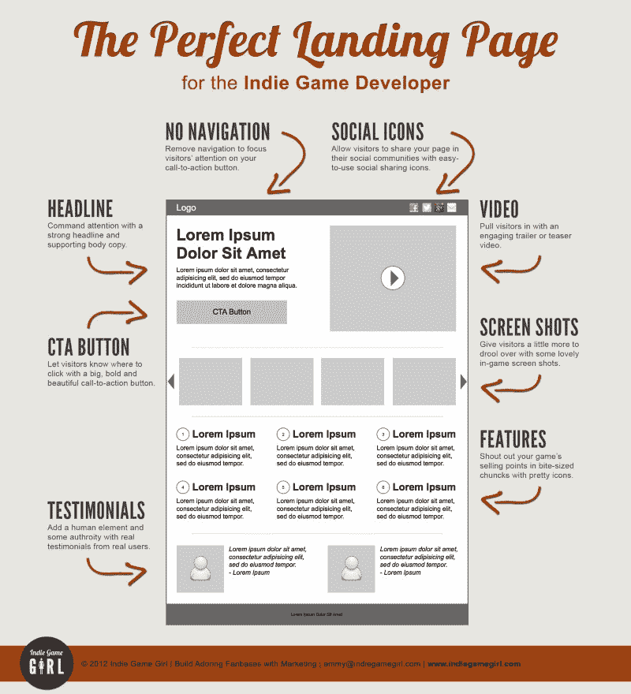
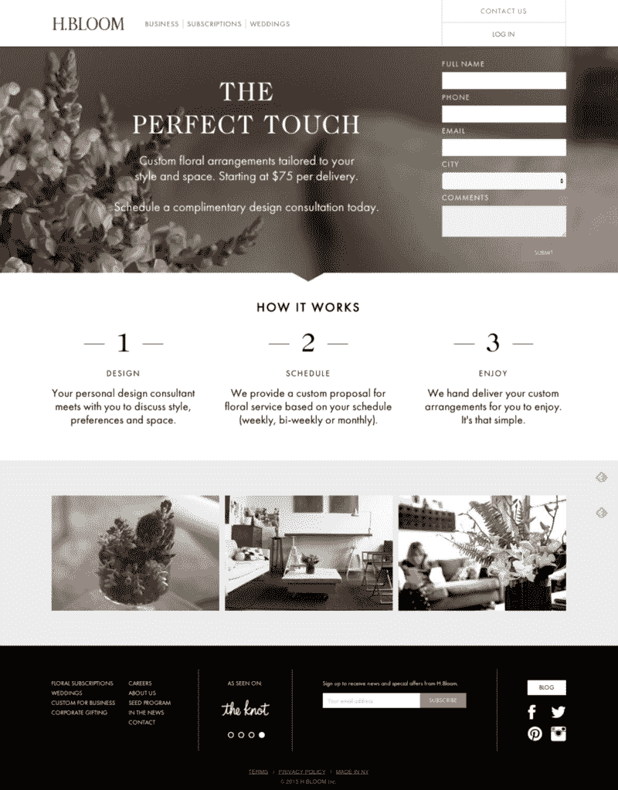

# 如何为您的项目创建一个有效的登录页面

> 原文：<https://www.freecodecamp.org/news/how-to-launch-an-effective-landing-page-for-your-project-f15bf3433d16/>

克里斯蒂安·彼得·汉姆巴赫

# 如何为您的项目创建一个有效的登录页面

Photo by SpaceX — [Cape Canaveral Air Force Station, United States](https://unsplash.com/@spacex?photo=TV2gg2kZD1o)

十年前，我开始了我的职业生涯，为视频游戏做在线营销和广告。从那以后，我在这个行业的各个方面都工作过:代理、开发和出版。

营销行业一年比一年更具技术性。这意味着雄心勃勃的营销人员需要开始学习如何编码——如果他们还没有的话。

2015 年 11 月，我开始了自由代码营的旅程。从那以后，我把我的营销和编码技能结合起来，在伦敦创建了一家公司。

在本文中，我将向您展示如何构建一个集中的在线营销资产——您项目的登录页面。

**登陆页面**试图说服用户**转化**。**转化**意味着无论你试图说服他们做什么，他们都会去做:

*   注册你的邮件列表
*   创建一个帐户
*   预购你的产品(如 Kickstarter)

### 先营销，后建设

过去，人们会在**秘密模式**下开发产品或服务。这需要大量的时间，并且通常需要前期投资。只有在产品完成后，他们才能评估它是否会在目标受众中获得成功([产品与市场的契合度](http://web.stanford.edu/class/ee204/ProductMarketFit.html))。

现在越来越普遍的做法是，在你开发产品之前，通过营销来测试你的产品，从而节省时间和金钱。这是 [Eric Ries 的精益创业](https://en.wikipedia.org/wiki/Lean_startup)方法的基础。

通过构建产品登录页面，您可以提前测试用户的反应。这可以让你发现什么是最重要的:注册你的产品或服务的用户的转化率。有了这些数据，你就可以决定是否要进行风险和成本高的部分:开发你想法的最小可行产品。

这种方法也可以教会你很多关于你自己的假设，以及不同营销方法的有效性。请注意，这是一个*过程*，而不是一个“一旦完成，继续前进”的项目。

我建议你保持开放、好奇的心态。你将了解所有*不*有效的方法，就像你确认有效的假设一样。

如果你是发现商业创意的新手，你需要熟悉一些术语，比如价值主张、目标市场和成本/收入流。如果你需要帮助，可以参考 Alexander Osterwalder 的[商业模式画布](http://diytoolkit.org/tools/business-model-canvas/)方法。

在你深入更详细的话题之前，我想强调用户研究的重要性。你想为那些你希望成为未来顾客的人优化你的网页。

这意味着你需要从什么样的用户访问你的页面开始:

*   他们是谁？
*   他们的需求是什么？
*   是什么让他们的生活变得艰难？
*   您如何确保他们明白您提议的解决方案可以帮助他们？

了解你的目标受众的一个常见方法是建立**人物角色**。角色是一种想象的代表。这有助于你和你的团队想象你的假想客户。

如果你还没有这样做，读一读一般的人物角色。你也可以使用这个[模板来构建人物角色](http://diytoolkit.org/tools/personas-2/)。三到四个人物角色应该足以知道谁会使用你的产品。

一旦你心中有了人物角色，你就可以研究他们如何在互联网上寻找解决问题的方法。他们用什么搜索词？你预计每个月不同的普通搜索会有多少次访问？

探索这个的一个好方法是使用谷歌的关键字规划器。

这样你就有了一个强有力的起点:我们未来客户的照片，以及他们可能如何寻找你的解决方案。

现在让我们来谈谈登录页面的常见元素，以及如何将您的策略应用于它们。

### 公共元素

以下是一个成功的登录页面的基本组成部分，自 2012 年创建该图表以来，这些组成部分没有太大变化:

Graphic by Indie Game Girl —Common Elements by Example of a game landing page

现在来看看我自己的登录页面，这是我的营销规划工具，还在原型阶段。如果你好奇的话，我还把源代码放到了 GitHub 的[上。](https://github.com/actioncy/io-landing)

当每个人点击你的登陆页面时，他们脑海中的主要问题是“这是什么？”

你可以用几句简短的话来回答这个问题。例如，我是这样介绍我的产品的:“一种更聪明的方式来计划你的活动，跟踪需求，并输出你的交付物。”

关于这句话应该包含什么，已经写了很多。应该应该是严肃的还是搞笑的？感性还是理性？

由于我的角色假设，我选择了理性的商业语言。只有方差测试才能给我一个可靠的答案，告诉我它是有效还是过于“保守”

品牌标志通常嵌入到名为**报头**的报头部分。它在折页上方构建了一个介绍部分[，通常由照片或视频背景支持。我决定在《T4》中保持低调。干净、专注、整洁是我的网络应用的基石。我还嵌入了我的原型截图，向访问者展示这是一个 web 应用程序。](https://en.wikipedia.org/wiki/Above_the_fold)

在你建立了这个介绍之后，你必须理解产生转化的战略重要性。首先，通过展示行动号召(CTA)来做到这一点。一些常见的 CTA 有“注册”、“订阅”、“立即购买”和“获取邀请”。这些试图诱使用户采取行动。

每个人对这个按钮应该说什么都有自己的看法，而且(你猜对了)我们要测试一下。例如，在用户准备好做出决定之前，将“注册”放在页面的很高位置可能过于大胆。我在自己的页面上只选择了一个 CTA，但是也可以使用两个。

“为什么”在提高观众参与度方面发挥着重要作用。他们可以提高自己报名的意愿。至关重要的是，你提供的内容涵盖了你的用户搜索的关键词。总是问自己，如果你自己是在搜索之后到达的，你是否会发现你的页面是有帮助的。

对我来说,“为什么”是如此重要，以至于我在登陆页面上重复了两次。首先，事实上，只是简单描述。然后第二次，用更大的图片和更多的故事。

我遵循我在大学学到的一个标准:告诉人们你将告诉他们什么，告诉他们，然后解释你告诉他们什么。不同“为什么”星座的措辞和顺序是经典的内容实验。这些开始只是猜测。在你确定它们有效之前，你需要实验和确认。

当你让你的用户相信你提出了一个可行的解决方案，他们就进入了最后一个环节:转换漏斗。这个短语描述了用户从 CTA 点击到注册或支付的过程。

如果你的目标是让用户注册你的邮件列表，这个漏斗可能是由你的邮件列表提供商控制的。我用邮件黑猩猩在我的情况下。您可以创建自己的漏斗，也可以使用供应商提供的漏斗。

请记住，这些嵌入的脚本会使您的页面加载速度变慢。使用 API 可能比使用嵌入式元素更好。

网上营销有不同的观点。有些人认为漏斗哲学是多余的，因为用户的旅程不是线性的。用户可能会在多种设备上访问您的页面。许多访问者可能会通过不同的渠道多次返回。

现在，你应该集中精力让你的漏斗尽可能的用户友好，这样你就可以最大化转化率。失去那些想要分享数据，但由于缓慢或混乱的界面而失败的用户的想法是每个在线营销人员晚上经常想到的事情。

Landing page concept as applied by [H.Bloom](http://www.hbloom.com/ResidentialSubscriptions/)

### **搜索引擎优化和搜索控制台**

流量的一个关键来源是搜索。对于大多数网页来说，它是最大的新流量来源，只有社交媒体可以与之匹敌。

网络上有无穷无尽的资源告诉你如何改善你的搜索外观和排名。我推荐阅读[谷歌自己的指南](https://static.googleusercontent.com/media/www.google.com/en//webmasters/docs/search-engine-optimization-starter-guide.pdf)作为起点，它有一个方便的[清单](https://developers.google.com/search/docs/guides/developer-checklist)。

因为您正在构建一个没有附加页面的“平面”登录页面，所以可以忽略关于嵌套子目录和内部链接的建议。

相反，你可以专注于一些核心原则:

#### 为用户建立页面，而不是为谷歌。

很多 SEO 信息都集中在技术方面。远离一切都是关于谷歌机器人的页面。不要因为这些“规则”一直在变而分心。它们的存在是为了让机器理解真正的用户是如何感知质量的。

如果你的网站首先是为用户优化的，那么你比为机器优化的网站更安全。因为机器是否会青睐你的站点，取决于一直在变化的隐藏算法。

#### 通过充分利用 HTML 标签的语义来组织内容

你应该用最重要的**这是什么？**句子只有一次，并标记它< H1 >。你应该把 **d 的标签理由**为什么和关键特征写成< H2 >，其他较长的标题写成< H3 >。

一个好的结构可以让你的设计反映出内容的重要性，帮助你突出最重要的信息。

我遵循的哲学是，人们应该尽快领会你向他们提出的建议的实质。这使得他们更有可能参与并在你的网站上花更多的时间。这反过来对 SEO 来说是一个强烈的信号。

#### 页面速度和响应能力

没有什么比等待页面加载时间太长更损害网站可用性的了。

或者像 2010 年一样在手机上捏来捏去。

尝试在谷歌自己的页面速度洞察工具上获得高分，该工具检查这两个方面。

#### 丰富的片段和结构化数据策略

这些不仅有助于搜索优化，也给用户和机器更多的上下文。这样，你会在搜索结果中更突出地出现，如这个[图库](https://developers.google.com/search/docs/guides/search-gallery)所示。

例如，我使用丰富的片段将 [actioncy.io](http://actioncy.io/) 归类为用于营销的网络应用。我还定义了它的描述，以及当我的网站的 URL 在社交媒体上被共享时显示哪个图像。

开发者帮助 SEO 过程的一个便利工具是[谷歌搜索控制台](https://support.google.com/webmasters/answer/4559176?hl=en)。它帮助你更好地理解谷歌爬虫如何访问和索引你的页面。它显示是否有问题，以及结构化数据是否被正确解析。

接下来，确保您的页面正常工作。搜索控制台提供了许多有用的报告:

*   与您的内容相关联的关键字
*   哪些搜索查询给我们带来了多少流量
*   谁链接到你的网站

关键词报告有助于确保你的搜索关键词排名靠前。如果不是这样，你可以通过改写和修改信息结构来调整内容。更多细节请访问 Moz 的[搜索控制台指南](https://moz.com/blog/a-beginners-guide-to-the-google-search-console)，以及[谷歌的网站管理员帮助中心](https://support.google.com/webmasters/?hl=en#topic=3309469)。

### 获取数据:分析

现在你正接近最后阶段。在构建了登录页面并设计了其内容和转换机制之后，您需要对其进行测试。为了做到这一点，你需要收集尽可能多的数据。这将允许你收集不同的变化是如何导致特定结果的证据。

我选择的工具是谷歌分析，至少一开始是这样。它非常适合初创企业的预算，而且功能丰富。它允许你将数据传递给谷歌的其他营销工具。要了解如何开始使用谷歌分析，请看一下它的[入门指南](https://support.google.com/analytics/answer/1008015?hl=en&ref_topic=3544906)。

在谷歌分析中配置目标很重要。你建立一个登录页面来实现转化，然后使用目标来帮助跟踪这些。当你对你的站点进行修改时，你可以立即看到对转化率的影响。这也有助于你理解来自不同渠道的访问是如何以不同的速度转化的。

当你使用自定义网址时，你可以完成更多，谷歌分析可以帮助你跟踪。例如，通过添加一个 Google Analytics 脚本将获取的参数，您可以看到有多少用户注册了一篇博客文章。

谷歌分析允许你将行为和转化归因于特定的来源。它将帮助您确定最佳的用户获取活动以及需要改进的地方。关于这方面的进一步阅读，请查看[Google URL 构建指南](https://support.google.com/analytics/answer/1033867?hl=en-GB)。

### 在不断变化的环境中保持领先

在线营销和软件开发都处于不断变化的状态。如果你想和其他人竞争注意力，你需要不断学习。

同时，你必须避免把所有的时间都花在学习上。开始*做*营销很重要:学习，重复，变得更好。这就是营销中的“ing”。

如果你想对你的营销工作有任何反馈，请随时联系我。

请记住，自由代码营关于获得编码帮助的建议和获得营销帮助的建议是一样的:阅读、搜索、询问！

谢谢大家，祝营销愉快！