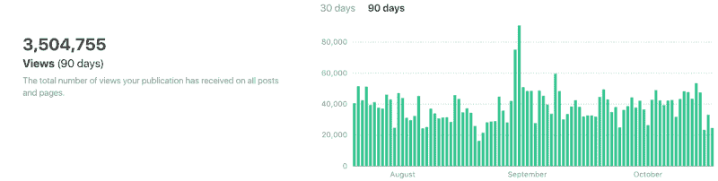
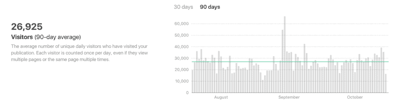
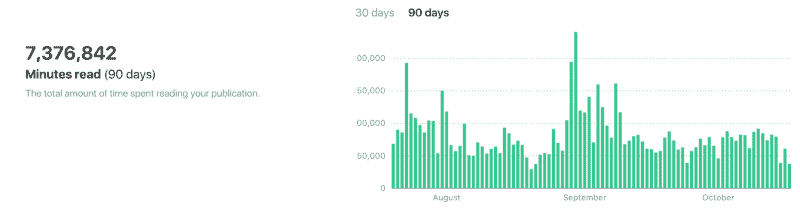

# 我们社区第一年在媒体上的数据

> 原文：<https://www.freecodecamp.org/news/our-communitys-first-year-on-medium-dde6d90b9628/>

大约一年前，我们关闭了开源社区的博客，把所有人都转移到了 Medium。

从那以后，在这个媒体出版物上，

*   **214 贡献者**
*   已发表 **460 篇故事**
*   这些视频的平均浏览量为 17000 次。

Our community’s publication now gets more than a million views per month.

我们发布的所有故事中，有一半已经被浏览了至少 5000 次。

An average of nearly 27,000 people visit our community’s Medium publication every day.

在过去的 12 个月里，我们的社区出版物——专注于开发、设计和数据科学——已经成为第[12 大媒体出版物](https://toppub.xyz/),也是最大的技术出版物。

Readers spent more than 7 million minutes reading our publication over the past 3 months.

我们社区的出版物是如何快速增长的？

### 原因 1:善于写作的深度思考者

数百名开发人员、设计人员和数据科学家——他们分享了我们对开源教育的愿景——在这里发表了故事。

[Adrian](https://www.freecodecamp.org/news/our-communitys-first-year-on-medium-dde6d90b9628/undefined) 分享了 40 岁以上的开发人员的感受:

[**40 后做开发者**](https://medium.freecodecamp.com/being-a-developer-after-40-3c5dd112210c)
[*这是我 2016 年 4 月 25 日在 App Builders Switzerland 做的演讲。*medium.freecodecamp.com](https://medium.freecodecamp.com/being-a-developer-after-40-3c5dd112210c)

[Haseeb](https://www.freecodecamp.org/news/our-communitys-first-year-on-medium-dde6d90b9628/undefined) 分享的工作机会谈判建议帮助他获得了 25 万美元的起薪:

 **[*当我如何在 Airbnb 找到一份工作的故事在网上疯传时，我惊讶地发现人们对我的……*medium.freecodecamp.com](https://medium.freecodecamp.com/ten-rules-for-negotiating-a-job-offer-ee17cccbdab6)**

**Preethi 写了现在关于 JavaScript 模块的标准初级读本:**

**[**JavaScript 模块:初学者指南**](https://medium.freecodecamp.com/javascript-modules-a-beginner-s-guide-783f7d7a5fcc)
[*如果你是 JavaScript 新手，可以使用“模块打包器与模块加载器”、“Webpack 与 Browserify”和“AMD…*medium.freecodecamp.com](https://medium.freecodecamp.com/javascript-modules-a-beginner-s-guide-783f7d7a5fcc)这样的术语**

**[Robby](https://www.freecodecamp.org/news/our-communitys-first-year-on-medium-dde6d90b9628/undefined) 讲述了他是如何创办 [OhMyZSH](http://ohmyz.sh/) 的，这是最广泛使用的开源开发工具之一:**

**[**d ' oh My Zsh**](https://medium.freecodecamp.com/d-oh-my-zsh-af99ca54212c)
[*我如何出人意料地构建了一个开源项目的怪物的故事*medium.freecodecamp.com](https://medium.freecodecamp.com/d-oh-my-zsh-af99ca54212c)**

**[Jonathan](https://www.freecodecamp.org/news/our-communitys-first-year-on-medium-dde6d90b9628/undefined) 探索了韩国流行音乐视频的美学并将其与设计联系起来:**

**[**k-pop 能教给我们关于设计的什么**](https://medium.freecodecamp.com/what-k-pop-can-teach-us-about-design-6253a85f469c)
[*通过 k-pop 教给我们的好设计的五个特征*medium.freecodecamp.com](https://medium.freecodecamp.com/what-k-pop-can-teach-us-about-design-6253a85f469c)**

**[Bill](https://www.freecodecamp.org/news/our-communitys-first-year-on-medium-dde6d90b9628/undefined) 将他几十年的开发经验融入本指南，以保护您的时间和理智:**

**[**寻找时间成为更好的开发者**](https://medium.freecodecamp.com/finding-time-to-become-a-better-developer-eebc154881b2)
[*没有时间做任何事情。至少感觉是这样的，不是吗？*medium.freecodecamp.com](https://medium.freecodecamp.com/finding-time-to-become-a-better-developer-eebc154881b2)**

**[Parisa](https://www.freecodecamp.org/news/our-communitys-first-year-on-medium-dde6d90b9628/undefined) 分享了她关于信息安全是否是一个适合你的领域以及如何进入该领域的坦率建议:**

**[**所以，你想从事保安工作？**](https://medium.freecodecamp.com/so-you-want-to-work-in-security-bc6c10157d23)
[*每隔一段时间，我都会收到一封来自一个热切的陌生人的电子邮件，向我咨询如何在安保行业发展……*medium.freecodecamp.com](https://medium.freecodecamp.com/so-you-want-to-work-in-security-bc6c10157d23)**

**[Petr](https://www.freecodecamp.org/news/our-communitys-first-year-on-medium-dde6d90b9628/undefined) 用简单的英语定义了一个最容易混淆的技术术语:**

**[**什么是 API？请用英语。**](https://medium.freecodecamp.com/what-is-an-api-in-english-please-b880a3214a82)
[*在我学软件开发之前，API 听起来就像一种啤酒。*medium.freecodecamp.com](https://medium.freecodecamp.com/what-is-an-api-in-english-please-b880a3214a82)**

**[Swagat](https://www.freecodecamp.org/news/our-communitys-first-year-on-medium-dde6d90b9628/undefined) 探究了你正在使用的工具——浏览器的秘密:**

**[**你可能不知道你可以用 Chrome 的开发者控制台做的事情**](https://medium.freecodecamp.com/10-tips-to-maximize-your-javascript-debugging-experience-b69a75859329)
[*Chrome 自带开发者工具。这带来了各种各样的功能，如元素、网络和……*medium.freecodecamp.com](https://medium.freecodecamp.com/10-tips-to-maximize-your-javascript-debugging-experience-b69a75859329)**

**Kevin 通过这样的日常类比来解释发展概念:**

**[**CSS 定位通过打造一个冰淇淋圣代来解释**](https://medium.freecodecamp.com/css-positioning-explained-by-building-an-ice-cream-sundae-831cb884bfa9)
[*如果你之前做过冰淇淋圣代，那么你就能理解 CSS 定位了。*medium.freecodecamp.com](https://medium.freecodecamp.com/css-positioning-explained-by-building-an-ice-cream-sundae-831cb884bfa9)**

**Michael 写了露营者如何无偿运送价值超过一百万美元的代码:**

**[**【我如何赚到我的第一个一百万美元(无偿服务代码)**](https://medium.freecodecamp.com/how-i-made-my-first-million-dollars-in-pro-bono-code-86f911040484)
[*我从一个玻璃墙的会议室里凝视着波托马克河。*medium.freecodecamp.com](https://medium.freecodecamp.com/how-i-made-my-first-million-dollars-in-pro-bono-code-86f911040484)**

**我们也发表了很多成功的故事，比如安德鲁的:**

**[**从木匠到前端开发者不到 5 个月**](https://medium.freecodecamp.com/this-is-my-story-about-how-i-went-from-being-a-carpenter-with-zero-experience-in-the-tech-world-to-4252e93cb73)
[*我从一个零技术经验的木匠到一家全球广告公司的前端开发者。*medium.freecodecamp.com](https://medium.freecodecamp.com/this-is-my-story-about-how-i-went-from-being-a-carpenter-with-zero-experience-in-the-tech-world-to-4252e93cb73)**

**我们甚至在这里公布了对新开发者的调查结果，并发布了其公共数据集:**

**[**我们询问了 15，000 人他们是谁，他们是如何学习编码的**](https://medium.freecodecamp.com/we-asked-15-000-people-who-they-are-and-how-theyre-learning-to-code-4104e29b2781)
[*超过 15，000 人参与了 2016 年新程序员调查，让研究人员前所未有地一窥……*medium.freecodecamp.com](https://medium.freecodecamp.com/we-asked-15-000-people-who-they-are-and-how-theyre-learning-to-code-4104e29b2781)**

### **原因 2:读者喜欢你**

**你现在可以做无数的事情。您选择通过阅读我们的出版物来投入时间学习技术。**

**你是我们这么做的原因。**

**在接下来的一年里，我们将继续发布值得您花费时间的故事。**

**感谢您的阅读！**

***如果您喜欢，请点击？所以其他人会在媒体上看到这个。***

****