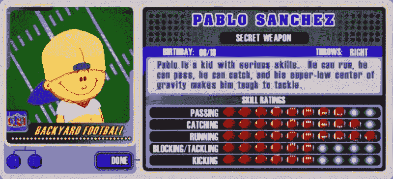
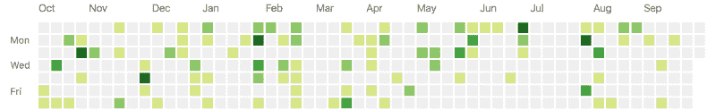

# 在疯狂的 3 天里，我在 Reddit 上查看了 50 个投资组合，从中我学到了什么。

> 原文：<https://www.freecodecamp.org/news/i-reviewed-fifty-portfolios-on-reddit-and-this-is-what-i-learned-e5d2b43150bc/>

我一直喜欢在我工作的设计工作室评论申请人的作品集。我也经常在 Reddit 的 webdev subreddit 上寻求对我自己设计的反馈。

所以有一天，我觉得非正式地审查任何要求评论的人的投资组合会很有趣。我不知道自己会陷入什么样的境地。

我开始向阅读 subreddit 的 12 万人免费提供服务。

事情开始时很平静。我会打一轮火箭联赛，然后会有一两个投资组合需要审查。然后我就睡了。

当我醒来时，我有二十个请求。这种情况持续了三天。

最后，我能够识别出一些普遍的模式和高点/低点。让我们突出这些。

请注意，这篇文章专门讨论那些想加入设计工作室的前端开发人员。如果你的工作有不同的目标或受众，这篇文章可能不适用。

### 我见过的最糟糕的事情是什么？

说实话， [r/webdev](https://www.reddit.com/r/webdev) 社区比我工作室的所有申请人都要好。我认为这说明了社区成员对他们的手艺有多投入。

然而，这并不意味着每个人的投资组合都是完美的。有一些绝对不能犯的常见错误。

#### 永远记住键盘和对比度的可访问性。

可访问性是整个审查过程中犯的最大错误。我对投资组合做的第一件事就是试着不用鼠标来浏览它。如果这是不可能的，我知道申请人没有无障碍的想法。

文本的颜色对比也是一个重要因素。我过去喜欢在黄色背景上放白色文字。我以为我很时髦！

但我很快在业内了解到，视力低下的用户很难阅读颜色选择不佳的文本。如果你的眼睛还没有被训练来观察低对比度，请参考残疾人中心的[颜色对比度检查器](http://webaim.org/resources/contrastchecker/)。

> 提示# 1:你的目标受众中有些人会有残疾。在编写任何样式之前，确保你的 HTML 是可访问的。

#### 不要试图评价你自己的技能。

多年来困扰投资组合网站的一个趋势是技能进度条。你说你 85%精通 Angular？那是什么意思？这与你在 Node 的 80%技能相比如何？大多数评论者只能理解三个技能水平:

*   你一点都不知道技巧
*   你还在学习技巧
*   你对技能有信心

不用担心第一个。请快速告诉我你正在学习什么，你对什么有信心。无论如何，所有这些都会在你的项目中得到证明。

#### 要么移动，要么回家。

想知道很多评论家最喜欢对你的作品集做什么吗？我们喜欢打开你的网站，然后立即来回调整浏览器窗口的宽度。这告诉我们你是否考虑了你的站点可能被浏览的过多的设备。

想要超越最低门槛吗？然后让你的 CSS 写好[移动优先](https://www.sitepoint.com/introduction-mobile-first-media-queries/)。编写移动优先的样式告诉我们，您喜欢编写最少的代码。当你仅仅停留在使用`max-width`属性进行媒体查询时，它告诉我们移动设备在你的设计中是事后才想到的。

### 人们需要证明什么？

实际项目是投资组合网站的真正内容。他们向我证明你有相关的工作经验。

简历或以前工作的清单是一个很好的时间表。但是作为一个制造者，你的创作是最终的验证。

以下是 peoples ' project 的部分内容，它们让我的审核工作变得更加轻松。

#### 给我看代码和现场。

你有一个项目描述，过程记录，并谈论使用的技术。太好了，但是代码在哪里？

行业雇员陷入私人工作项目是很常见的。但是没有任何机会来检查你的代码，你让审查者的工作变得更加困难。我们很难知道是否值得花时间让你进入招聘流程的下一步。

如果代码是专有的，现场在哪里？如果我能看到你的代码，为什么你没有一个运行的版本？

> 提示 2:做一些与你工作中使用的技术相关的业余和个人项目。它不仅帮助你为你当前的角色进行培训，它也让投资组合评审者知道你的技能在哪里。

#### 告诉我你实际上对什么有贡献。

团队项目可以很好地展示你们合作的程度。大多数项目都需要团队合作技能。

但是对于作品集，你需要清楚你自己贡献了什么。Github repos 可以提供一个清晰的历史，让我回顾你的工作，了解这个群体动态。

在你的项目报告中诚实总是被欣赏的。不要夸大你在项目中的角色，因为审查你的投资组合的人会深入项目的 Git 历史来仔细检查我们自己。

#### 证明你不需要 Bootstrap 或者 jQuery。

如果你是用 Bootstrap 开始学 CSS，或者用 jQuery 开始学 JavaScript，这是可以理解的。当**你的所有**项目都包含 Bootstrap 和 jQuery 时，问题就来了。

即使 Bootstrap 很方便，我也需要知道你对 CSS 有清晰的理解。我还需要知道你是否有扎实的纯 JavaScript 基础。这确保了我能够让你参与到一个已经在使用的前端工具的任何组合的项目中。

事实上，在我们的面试过程中，我们根本不允许使用 Bootstrap 或 jQuery。因此，如果你掌握了适当的 CSS 和 JavaScript 技能，你将为未来的面试和挑战做好更充分的准备。

### 最突出的是什么？

我们已经讨论了你的投资组合需要的东西以及投资组合可能出错的方式。有什么东西能让评审员对申请人感到兴奋？

下面的建议可能看起来没有我之前的建议那么具体，但是请记住。

#### 远离常规。

几乎每个人的网站都有标准的介绍>技能>项目>联系流程。几乎每个人都有相同的导航菜单。

你想引起评论者的注意吗？进行实验，做一些不损害设计的小改变。

其中一个最细微的差异是把他们的导航放在了右边而不是左边。我知道是时候集中更多的注意力了，因为导航不在千篇一律的左边或者布局的顶部。简单，但是有效。

#### 向你梦想的工作说吧。

你看到你绝对想要的那个职位了吗？围绕该工作的要求和职责建立你的投资组合。

我很难理解，当你的作品集里都是 WordPress 的主题时，你为什么想要在我们的工作室工作。如果你的主要关注点似乎是一个完全不同的行业，也很难认为你是这个职位的合适人选。

我们喜欢多面手，但是显示你的专长也是这个职位所要求的，这是一个很大的加分。

> 提示 3:很多作品集既用于工作申请，也用于自由职业客户。不要这样。对于专业人士来说，最佳做法是为这些受众分别设计不同的投资组合。

#### 每个小细节都很重要。

对很多人来说，这是最难的一点:你无法控制你的评审者在你的投资组合上看到什么。

我们不断地浏览网站，而不是从头到尾阅读。所以要确保你的布局风格完美，每一句话都经过校对，没有断链。

很难说评论者会花时间去看你网站的哪一部分。

### 你能行的。

我为我能够提供反馈的所有优秀作品以及随后的讨论感到自豪。

最鼓舞人心的部分是当前端开发人员还不能胜任我们的角色时，我能够给他们反馈。这些有抱负的专业人士严肃而积极地对待这些批评。

这正是我在面试过程中寻找的态度。

我希望这些人会有所改进，将来我还有机会再次回顾他们的工作。

附注:我仍在*回复迟交的投资组合评审请求。此外，在我的开场图片中的所有作品集都公开征求了评论，并且得分很高！*

*如需更多信息:欢迎通过评论、[电子邮件](mailto:james@seejamescode.com)或 [@seejamescode](https://twitter.com/seejamescode) 联系我。我在 ATX 的 IBM Design 工作，总是喜欢和网页设计社区交流。也一定要在评论里分享自己的或者喜欢的作品集！*